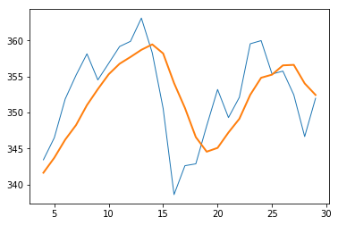
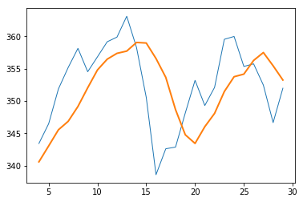
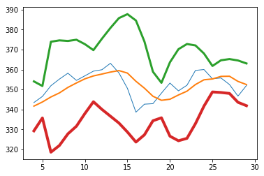
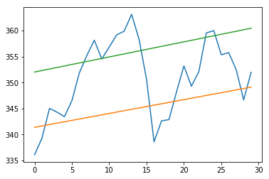

# numpy


```python
import numpy as np
from numpy.random import randn

#通用函数
arr = np.arange(10)
np.sqrt(arr)
```


    array([ 0.        ,  1.        ,  1.41421356,  1.73205081,  2.        ,
            2.23606798,  2.44948974,  2.64575131,  2.82842712,  3.        ])


```python
np.exp(arr)
```


    array([  1.00000000e+00,   2.71828183e+00,   7.38905610e+00,
             2.00855369e+01,   5.45981500e+01,   1.48413159e+02,
             4.03428793e+02,   1.09663316e+03,   2.98095799e+03,
             8.10308393e+03])


## np.maximum 元素级最大值


```python
x = randn(8)
y = randn(8)
print(x)
print(y)
# 元素级最大值
np.maximum(x, y)
```

    [-1.03760196 -1.0035245  -0.19109603  2.27398057 -0.51605815 -1.25481649
     -1.95118717 -0.09423245]
    [-1.26195712 -0.70857631 -0.18729477  2.58847014  2.46277713 -1.04523397
      1.13501218  1.3499591 ]
    


    array([-1.03760196, -0.70857631, -0.18729477,  2.58847014,  2.46277713,
           -1.04523397,  1.13501218,  1.3499591 ])


## np.modf 按元素返回数组的小数部分和整数部分


```python
arr = randn(7) * 5
print(arr)
# 按元素返回数组的小数部分和整数部分
np.modf(arr)
```

    [ 8.01175821  3.46248512 -4.11785287  1.34226648  0.40194097  5.81213218
     -0.40446832]
    


    (array([ 0.01175821,  0.46248512, -0.11785287,  0.34226648,  0.40194097,
             0.81213218, -0.40446832]), array([ 8.,  3., -4.,  1.,  0.,  5., -0.]))


## np.meshgrid 从坐标向量返回坐标矩阵


```python
###利用数组进行数据处理
# 向量化
points = np.arange(-5, 5, 0.01)  # 1000 equally spaced points
# 从坐标向量返回坐标矩阵
xs, ys = np.meshgrid(points, points)
print(ys)

```

    [[-5.   -5.   -5.   ..., -5.   -5.   -5.  ]
     [-4.99 -4.99 -4.99 ..., -4.99 -4.99 -4.99]
     [-4.98 -4.98 -4.98 ..., -4.98 -4.98 -4.98]
     ..., 
     [ 4.97  4.97  4.97 ...,  4.97  4.97  4.97]
     [ 4.98  4.98  4.98 ...,  4.98  4.98  4.98]
     [ 4.99  4.99  4.99 ...,  4.99  4.99  4.99]]
    


```python
import matplotlib.pyplot as plt

z = np.sqrt(xs ** 2 + ys ** 2)
print(z)
plt.imshow(z, cmap=plt.cm.gray)
plt.colorbar()
plt.title("Image plot of $\sqrt{x^2 + y^2}$ for a grid of values")

plt.draw()
```

    [[ 7.07106781  7.06400028  7.05693985 ...,  7.04988652  7.05693985
       7.06400028]
     [ 7.06400028  7.05692568  7.04985815 ...,  7.04279774  7.04985815
       7.05692568]
     [ 7.05693985  7.04985815  7.04278354 ...,  7.03571603  7.04278354
       7.04985815]
     ..., 
     [ 7.04988652  7.04279774  7.03571603 ...,  7.0286414   7.03571603
       7.04279774]
     [ 7.05693985  7.04985815  7.04278354 ...,  7.03571603  7.04278354
       7.04985815]
     [ 7.06400028  7.05692568  7.04985815 ...,  7.04279774  7.04985815
       7.05692568]]
    

## np.where


```python
# 将条件逻辑表达为数组运算
xarr = np.array([1.1, 1.2, 1.3, 1.4, 1.5])
yarr = np.array([2.1, 2.2, 2.3, 2.4, 2.5])
cond = np.array([True, False, True, True, False])

result = [(x if c else y)
          for x, y, c in zip(xarr, yarr, cond)]
print(result)
```

    [1.1000000000000001, 2.2000000000000002, 1.3, 1.3999999999999999, 2.5]
    


```python
result = np.where(cond, xarr, yarr)
print(result)
```

    [ 1.1  2.2  1.3  1.4  2.5]
    


```python
arr = randn(4, 4)
print(arr)
print(np.where(arr > 0, 2, -2))
print(np.where(arr > 0, 2, arr))  # set only positive values to 2
```

    [[-0.09677059 -0.78473401 -0.00841639  1.39892368]
     [-1.14999224  0.33586593 -0.1844864   0.47664971]
     [-0.67508722  0.56130304 -0.8018509   0.07338623]
     [ 0.10375292  1.44174994  0.42788598 -0.66850794]]
    [[-2 -2 -2  2]
     [-2  2 -2  2]
     [-2  2 -2  2]
     [ 2  2  2 -2]]
    [[-0.09677059 -0.78473401 -0.00841639  2.        ]
     [-1.14999224  2.         -0.1844864   2.        ]
     [-0.67508722  2.         -0.8018509   2.        ]
     [ 2.          2.          2.         -0.66850794]]
    


```python
"""
# 多条件一般表示方法
# Not to be executed
result = []
for i in range(n):
    if cond1[i] and cond2[i]:
        result.append(0)
    elif cond1[i]:
        result.append(1)
    elif cond2[i]:
        result.append(2)
    else:
        result.append(3)

# 多条件where表示方法
# Not to be executed
np.where(cond1 & cond2, 0,
         np.where(cond1, 1,
                  np.where(cond2, 2, 3)))

# Not to be executed
result = 1 * cond1 + 2 * cond2 + 3 * -(cond1 | cond2)
"""
```


    '\n# 多条件一般表示方法\n# Not to be executed\nresult = []\nfor i in range(n):\n    if cond1[i] and cond2[i]:\n        result.append(0)\n    elif cond1[i]:\n        result.append(1)\n    elif cond2[i]:\n        result.append(2)\n    else:\n        result.append(3)\n\n# 多条件where表示方法\n# Not to be executed\nnp.where(cond1 & cond2, 0,\n         np.where(cond1, 1,\n                  np.where(cond2, 2, 3)))\n\n# Not to be executed\nresult = 1 * cond1 + 2 * cond2 + 3 * -(cond1 | cond2)\n'


# 数学与统计方法

## randn 标准正态分布数据


```python
# 数学与统计方法

arr = np.random.randn(5, 4)  # 标准正态分布数据
print(arr.mean())
print(np.mean(arr))
print(arr.sum())

print(arr.mean(axis=1))
print(arr.sum(0))

arr = np.array([[0, 1, 2], [3, 4, 5], [6, 7, 8]])
print(arr.cumsum(0))
print(arr.cumprod(1))
```

    0.299738473867
    0.299738473867
    5.99476947734
    [ 0.33172725 -0.49981575  0.35973217  0.39621625  0.91083245]
    [ 4.58629248  2.22968175 -1.88744743  1.06624268]
    [[ 0  1  2]
     [ 3  5  7]
     [ 9 12 15]]
    [[  0   0   0]
     [  3  12  60]
     [  6  42 336]]
    

## 用于布尔型数组的方法


```python
# 用于布尔型数组的方法
arr = randn(100)
(arr > 0).sum()  # 正值的数量

bools = np.array([False, False, True, False])
print(bools.any())
print(bools.all())
```

    True
    False
    

## 排序


```python
# 排序
arr = randn(8)
print(arr)
arr.sort()
print(arr)

arr = randn(5, 3)
print(arr)
arr.sort(1)
print(arr)

```

    [-0.17018254  1.29292169  1.87999871 -0.25529225  1.1058983  -0.27456269
     -1.17911236  0.30155365]
    [-1.17911236 -0.27456269 -0.25529225 -0.17018254  0.30155365  1.1058983
      1.29292169  1.87999871]
    [[-0.31552106  0.95227657  0.08006334]
     [ 0.86493167  0.66028869  0.56929258]
     [-1.30046025 -1.03020373 -0.80371581]
     [-0.74412785  0.2413104  -0.81418268]
     [-1.16001837 -0.70517682 -0.5816708 ]]
    [[-0.31552106  0.08006334  0.95227657]
     [ 0.56929258  0.66028869  0.86493167]
     [-1.30046025 -1.03020373 -0.80371581]
     [-0.81418268 -0.74412785  0.2413104 ]
     [-1.16001837 -0.70517682 -0.5816708 ]]
    

## 5%分位数


```python
large_arr = randn(1000)
large_arr.sort()
large_arr[int(0.05 * len(large_arr))]  # 5%分位数
```


    -1.7061490455426676


## np.unique 唯一化 以及其他的集合逻辑


```python
# 唯一化以及其他的集合逻辑
names = np.array(['Bob', 'Joe', 'Will', 'Bob', 'Will', 'Joe', 'Joe'])
np.unique(names)
```


    array(['Bob', 'Joe', 'Will'], 
          dtype='<U4')


```python
ints = np.array([3, 3, 3, 2, 2, 1, 1, 4, 4])
np.unique(ints)
```


    array([1, 2, 3, 4])


```python
sorted(set(names))
```


    ['Bob', 'Joe', 'Will']


```python
values = np.array([6, 0, 0, 3, 2, 5, 6])
np.in1d(values, [2, 3, 6])
```


    array([ True, False, False,  True,  True, False,  True], dtype=bool)


# 线性代数


```python
#线性代数
x = np.array([[1., 2., 3.], [4., 5., 6.]])
y = np.array([[6., 23.], [-1, 7], [8, 9]])
print(x)
print(y)
print(x.dot(y))  # 等价于np.dot(x, y)

print(np.dot(x, np.ones(3)))

np.random.seed(12345)

from numpy.linalg import inv, qr

X = randn(5, 5)
mat = X.T.dot(X)
# 计算矩阵的逆矩阵
inv(mat)
mat.dot(inv(mat))
# 计算矩阵的QR因子分解
q, r = qr(mat)
print(r)

```

    [[ 1.  2.  3.]
     [ 4.  5.  6.]]
    [[  6.  23.]
     [ -1.   7.]
     [  8.   9.]]
    [[  28.   64.]
     [  67.  181.]]
    [  6.  15.]
    [[ -6.92714002   7.38899524   6.12272905  -7.11625341  -4.92150833]
     [  0.          -3.97347612  -0.86707993   2.97472904  -5.74024113]
     [  0.           0.         -10.26810228   1.89090298   1.60790112]
     [  0.           0.           0.          -1.29964934   3.35772244]
     [  0.           0.           0.           0.           0.55705805]]
    

## 随机数生成


```python
#随机数生成
samples = np.random.normal(size=(4, 4))
print(samples)
```

    [[  1.24121276e-01   3.02613562e-01   5.23772068e-01   9.40277775e-04]
     [  1.34380979e+00  -7.13543985e-01  -8.31153539e-01  -2.37023165e+00]
     [ -1.86076079e+00  -8.60757398e-01   5.60145293e-01  -1.26593449e+00]
     [  1.19827125e-01  -1.06351245e+00   3.32882716e-01  -2.35941881e+00]]
    

# 范例：随机漫步


```python
# 范例：随机漫步
import random

position = 0
walk = [position]
steps = 1000
for i in range(steps):
    step = 1 if random.randint(0, 1) else -1
    position += step
    walk.append(position)
    
print(walk)
```

    [0, 1, 0, -1, 0, -1, 0, -1, -2, -1, 0, -1, 0, 1, 2, 1, 0, -1, -2, -1, -2, -3, -4, -5, -4, -3, -2, -3, -4, -5, -6, -5, -4, -3, -4, -3, -4, -5, -4, -5, -6, -7, -6, -5, -4, -5, -6, -7, -6, -7, -6, -7, -6, -5, -4, -3, -4, -3, -4, -3, -2, -3, -4, -3, -2, -3, -4, -5, -6, -7, -8, -9, -8, -9, -8, -9, -8, -7, -6, -5, -6, -5, -6, -7, -8, -9, -8, -7, -8, -9, -10, -11, -12, -13, -12, -11, -12, -11, -12, -11, -12, -11, -12, -11, -10, -11, -12, -11, -12, -13, -12, -11, -12, -11, -10, -11, -12, -13, -12, -11, -10, -9, -10, -9, -10, -11, -10, -11, -10, -9, -8, -9, -10, -11, -12, -13, -12, -13, -14, -15, -14, -13, -12, -13, -12, -11, -10, -9, -8, -9, -8, -9, -8, -9, -8, -9, -8, -9, -10, -9, -8, -7, -8, -9, -10, -11, -12, -11, -12, -11, -12, -13, -12, -13, -12, -11, -12, -11, -10, -9, -8, -7, -6, -7, -6, -7, -6, -5, -6, -5, -4, -5, -6, -7, -8, -7, -8, -7, -6, -7, -6, -7, -6, -5, -4, -3, -2, -1, 0, 1, 2, 1, 0, 1, 0, 1, 2, 1, 2, 1, 0, -1, 0, 1, 0, 1, 0, 1, 2, 1, 0, -1, -2, -3, -2, -3, -2, -3, -4, -3, -2, -1, -2, -3, -4, -3, -2, -3, -4, -3, -4, -5, -6, -7, -8, -9, -10, -9, -8, -7, -8, -7, -8, -7, -6, -7, -6, -7, -6, -7, -6, -5, -6, -5, -6, -5, -4, -5, -6, -5, -6, -7, -6, -7, -8, -7, -6, -7, -6, -5, -4, -3, -4, -5, -4, -5, -6, -5, -6, -5, -4, -3, -4, -3, -4, -5, -6, -5, -6, -5, -6, -5, -4, -3, -2, -1, -2, -1, -2, -1, -2, -3, -4, -3, -4, -3, -4, -3, -2, -1, -2, -1, 0, 1, 2, 1, 0, 1, 2, 1, 2, 1, 2, 3, 2, 3, 2, 3, 2, 1, 0, -1, 0, -1, 0, -1, 0, -1, 0, -1, -2, -1, 0, 1, 2, 3, 4, 5, 4, 5, 4, 3, 2, 3, 4, 5, 6, 5, 6, 7, 6, 5, 6, 5, 4, 5, 4, 5, 6, 7, 6, 5, 4, 5, 4, 3, 4, 5, 4, 5, 4, 3, 4, 5, 4, 5, 6, 7, 6, 7, 6, 7, 8, 9, 10, 9, 10, 9, 10, 9, 10, 9, 8, 9, 8, 7, 8, 9, 10, 11, 12, 13, 12, 11, 10, 11, 12, 13, 14, 15, 14, 15, 16, 15, 16, 15, 14, 13, 14, 13, 14, 13, 12, 11, 10, 9, 10, 11, 10, 11, 12, 11, 12, 11, 10, 9, 10, 9, 8, 9, 10, 9, 8, 7, 8, 7, 6, 5, 6, 7, 6, 7, 8, 9, 10, 11, 12, 13, 12, 13, 14, 13, 12, 13, 12, 13, 12, 11, 12, 11, 10, 11, 12, 13, 12, 11, 10, 9, 10, 11, 12, 13, 12, 13, 12, 13, 12, 13, 14, 15, 14, 13, 12, 13, 14, 15, 14, 15, 14, 15, 14, 15, 16, 17, 16, 17, 18, 17, 16, 17, 18, 19, 18, 19, 20, 21, 22, 21, 22, 21, 20, 19, 18, 17, 16, 15, 16, 15, 16, 17, 18, 19, 20, 19, 18, 19, 20, 19, 18, 19, 18, 19, 18, 17, 18, 19, 18, 17, 16, 15, 14, 13, 12, 13, 14, 15, 14, 13, 14, 13, 12, 13, 12, 13, 12, 11, 10, 11, 12, 13, 14, 15, 14, 13, 14, 13, 12, 13, 14, 15, 14, 13, 14, 15, 16, 17, 18, 19, 18, 19, 20, 19, 20, 19, 18, 19, 20, 21, 20, 21, 20, 19, 18, 19, 20, 19, 18, 17, 18, 19, 18, 17, 16, 15, 14, 15, 14, 13, 12, 11, 12, 11, 10, 11, 12, 11, 10, 9, 8, 9, 10, 9, 10, 9, 10, 11, 10, 11, 12, 13, 12, 13, 12, 13, 12, 13, 14, 13, 12, 13, 12, 13, 14, 13, 12, 13, 12, 13, 12, 13, 12, 13, 12, 11, 10, 11, 10, 11, 10, 9, 8, 7, 6, 5, 4, 3, 2, 3, 4, 3, 4, 5, 4, 5, 4, 5, 4, 5, 6, 7, 6, 7, 6, 5, 6, 7, 8, 9, 8, 9, 10, 9, 8, 9, 10, 11, 10, 11, 12, 13, 12, 11, 12, 13, 14, 15, 14, 15, 16, 17, 16, 15, 14, 15, 16, 15, 14, 13, 14, 15, 16, 15, 16, 17, 18, 17, 16, 15, 16, 17, 18, 17, 18, 19, 20, 19, 20, 19, 20, 19, 18, 19, 18, 17, 16, 15, 14, 13, 14, 15, 16, 15, 16, 17, 18, 19, 20, 21, 20, 19, 18, 17, 16, 15, 16, 17, 16, 15, 16, 15, 14, 13, 12, 11, 10, 11, 12, 11, 12, 11, 12, 11, 10, 9, 10, 9, 8, 7, 8, 7, 8, 7, 8, 7, 6, 7, 6, 5, 6, 5, 4, 3, 2, 1, 2, 1, 0, 1, 0, 1, 0, 1, 2, 3, 4, 3, 4, 5, 6, 5, 4, 5, 4, 3, 4, 3, 2, 3, 2, 3, 4, 3, 2, 3, 2, 3, 4, 3, 2, 1, 2, 1, 0, 1, 2, 3, 2, 3, 2, 1, 2, 3, 4, 3, 4, 3, 2, 3, 2, 3, 4, 5, 4, 3, 4, 3, 4, 5, 4, 5, 6, 5, 4, 5, 6, 7, 8, 9, 8, 9, 8, 7, 6, 7, 8, 7, 6, 7, 8, 9, 10, 9, 10, 11, 12, 13, 14, 13, 12, 11, 12, 11, 12, 13, 12, 11, 10, 11, 12, 11, 10, 11, 10, 9, 8, 7, 6, 5, 6, 5, 6, 7, 6, 5, 6, 5, 4, 3, 2, 1, 0, 1, 2, 3, 2, 1, 0, 1, 0, -1, 0, 1, 2, 1, 0, -1, -2, -3, -4, -5, -4, -3, -4, -3, -4, -3, -4, -5, -4, -5, -4]
    


```python
np.random.seed(12345)

nsteps = 1000
draws = np.random.randint(0, 2, size=nsteps)
steps = np.where(draws > 0, 1, -1)
walk = steps.cumsum()
print(walk)
print(walk.min())
print(walk.max())

print((np.abs(walk) >= 10).argmax())
```

    [-1  0  1  2  1  2  1  0  1  0  1  2  1  2  3  2  3  4  5  4  3  2  3  4  5
      4  5  4  3  4  5  6  7  8  7  8  9 10 11 12 13 12 11 12 13 12 11 12 13 14
     15 14 15 16 17 18 17 18 19 18 19 18 17 18 19 20 19 18 19 18 19 18 17 16 17
     18 17 16 15 14 13 12 13 12 11 10 11 10  9 10 11 12 13 14 15 14 13 12 13 12
     11 12 11 12 11 12 11 10  9 10 11 10  9 10  9 10  9  8  9 10  9 10 11 10  9
     10  9  8  9 10 11 12 11 10  9 10  9 10  9  8  9 10  9 10  9 10  9 10 11 12
     11 12 11 10  9 10 11 10  9  8  7  6  5  6  7  8  7  6  7  6  7  6  7  6  5
      6  7  6  7  8  7  8  9  8  7  8  7  6  7  8  9 10  9 10 11 10 11 12 13 12
     11 10  9  8  9 10 11 10  9 10  9 10  9 10  9  8  7  6  7  6  5  6  7  8  7
      6  5  6  7  6  7  8  7  8  7  6  5  4  3  4  3  2  3  4  5  6  7  6  5  4
      5  4  3  2  3  4  5  6  5  6  5  6  7  6  7  8  7  6  7  6  7  8  9  8  9
      8  9  8  7  6  5  4  3  2  1  0  1  0 -1 -2 -1 -2 -3 -2 -1  0  1  2  3  4
      5  6  7  6  5  6  5  4  3  2  1  2  3  4  3  4  5  4  5  4  5  4  3  2  1
      2  3  4  5  6  5  4  5  6  5  6  7  6  5  6  5  4  5  4  3  4  5  6  5  4
      5  6  7  6  7  8  7  6  5  4  5  6  7  6  5  6  7  6  7  8  9 10 11 10 11
     10 11 10  9 10 11 12 11 10 11 10 11 10 11 12 13 14 13 12 11 12 11 10  9  8
      9  8  7  8  7  6  7  8  9  8  9  8  9 10 11 12 13 14 15 14 13 12 13 14 15
     14 15 16 17 16 15 16 15 16 17 18 19 18 19 18 17 16 15 14 13 12 13 12 13 14
     13 14 13 14 15 14 13 12 11 10 11 10 11 12 11 12 11 10 11 12 11 12 13 12 13
     14 13 14 13 14 15 14 15 14 13 12 11 10  9  8  7  8  7  6  5  4  5  4  3  4
      3  2  3  4  5  6  5  4  3  2  1  2  1  2  3  4  3  4  3  4  5  4  3  4  3
      4  5  4  5  4  3  2  3  2  1  2  3  2  1  2  1  2  1  0  1  2  1  2  1  2
      3  2  1  2  3  4  5  4  3  2  3  2  1  2  1  2  3  2  1  2  3  4  3  2  3
      4  5  6  7  6  5  4  3  2  1  2  3  2  1  2  3  4  5  6  7  6  7  8  7  8
      7  8  9  8  9  8  7  6  5  6  5  4  3  4  3  4  5  6  5  6  7  8  9  8  9
      8  9 10  9 10 11 12 13 14 13 12 11 12 11 12 13 12 13 14 13 14 13 12 13 12
     13 14 15 14 13 12 11 10  9 10  9  8  7  6  7  8  7  8  9  8  9 10  9 10 11
     10 11 10 11 10 11 10  9 10 11 12 13 12 13 12 13 14 15 14 13 12 13 12 11 10
     11 10  9  8  7  6  7  6  5  4  5  4  5  6  5  4  5  4  5  4  3  4  3  4  3
      4  5  6  7  8  9  8  7  8  9 10 11 10  9  8  7  6  7  8  7  8  7  8  7  6
      5  6  5  6  7  8  7  8  9 10  9  8  9  8  9 10  9 10  9  8  9  8  7  8  9
      8  9  8  9  8  9  8  9 10 11 10 11 12 11 12 13 14 15 14 13 14 15 16 15 14
     15 16 17 16 15 14 13 14 13 14 13 14 13 14 13 14 15 16 17 16 17 18 17 16 17
     18 17 18 17 18 19 20 19 18 19 20 19 18 17 18 17 18 19 20 19 18 17 16 15 16
     17 18 19 20 21 22 21 20 21 22 21 22 21 22 21 20 21 22 23 22 23 22 23 22 21
     22 23 24 23 24 23 24 25 24 25 26 27 28 29 28 29 28 27 26 25 26 27 26 27 28
     27 26 27 26 27 28 27 28 29 30 31 30 31 30 29 30 29 28 29 28 29 30 29 28 27
     26 25 24 23 22 23 22 23 22 21 20 19 18 17 18 17 18 19 18 19 18 17 16 17 16
     17 18 17 18 17 16 15 14 13 14 15 16 17 16 17 18 17 16 15 14 13 14 13 14 13
     14 15 14 13 14 13 14 15 16 15 16 15 16 15 14 15 14 13 14 13 12 13 12 13 14]
    -3
    31
    37
    


```python
# 一次模拟多个随机漫步
nwalks = 5000
nsteps = 1000
draws = np.random.randint(0, 2, size=(nwalks, nsteps))  # 0 or 1
steps = np.where(draws > 0, 1, -1)
walks = steps.cumsum(1)
print(walks)

print(walks.max())
print(walks.min())

hits30 = (np.abs(walks) >= 30).any(1)
print(hits30)
print(hits30.sum())  # 到达30或-30的数量

crossing_times = (np.abs(walks[hits30]) >= 30).argmax(1)
print(crossing_times.mean())
```

    [[  1   0   1 ...,   8   7   8]
     [  1   0  -1 ...,  34  33  32]
     [  1   0  -1 ...,   4   5   4]
     ..., 
     [  1   2   1 ...,  24  25  26]
     [  1   2   3 ...,  14  13  14]
     [ -1  -2  -3 ..., -24 -23 -22]]
    138
    -133
    [False  True False ..., False  True False]
    3410
    498.88973607
    


```python
steps = np.random.normal(loc=0, scale=0.25, size=(nwalks, nsteps))
print(steps)
```

    [[-0.02565707  0.36310961  0.41720151 ...,  0.15726638 -0.16256773
       0.05423703]
     [-0.10456259  0.07877516  0.19110411 ...,  0.07678875 -0.18545695
       0.0333151 ]
     [-0.16728617  0.12034941 -0.30427248 ..., -0.30982359 -0.17291787
       0.02772071]
     ..., 
     [ 0.27987403  0.05477886 -0.02167382 ...,  0.02795479  0.25268149
       0.06510672]
     [ 0.31853634 -0.15109745 -0.1121375  ...,  0.14705719  0.18206871
      -0.02473096]
     [-0.13101904 -0.24008233 -0.03925202 ..., -0.18320903 -0.20967376
       0.20705573]]
    

# 利用NumPy进行历史股价分析


```python
#利用NumPy进行历史股价分析
import sys

# 读入文件
fname = 'data\AAPL.csv'
# c:价格，v:成交量
c, v = np.loadtxt(fname, delimiter=',', usecols=(6, 7), unpack=True)

# 计算成交量加权平均价格
vwap = np.average(c, weights=v)
print("vwap =", vwap)

# 算术平均值函数
print("mean =", np.mean(c))

# 时间加权平均价格
t = np.arange(len(c))
print("twap =", np.average(c, weights=t))

# 寻找最大值和最小值
h, l = np.loadtxt(fname, delimiter=',', usecols=(4, 5), unpack=True)
print("highest =", np.max(h))
print("lowest =", np.min(l))
print((np.max(h) + np.min(l)) / 2)

print("Spread high price", np.ptp(h))
print("Spread low price", np.ptp(l))
```

    VWAP = 350.589549353
    mean = 351.037666667
    twap = 352.428321839
    highest = 364.9
    lowest = 333.53
    349.215
    Spread high price 24.86
    Spread low price 26.97
    

## 统计分析


```python
# 统计分析

c = np.loadtxt(fname, delimiter=',', usecols=(6,), unpack=True)
print("median =", np.median(c))
msorted = np.msort(c)
print("sorted =", msorted)

N = len(c)
print("middle =", msorted[int((N - 1) / 2)])
print("average middle =", (msorted[int(N / 2)] + msorted[int((N - 1) / 2)]) / 2)

print("variance =", np.var(c))
print("variance from definition =", np.mean((c - c.mean()) ** 2))

```

    median = 352.055
    sorted = [ 336.1   338.61  339.32  342.62  342.88  343.44  344.32  345.03  346.5
      346.67  348.16  349.31  350.56  351.88  351.99  352.12  352.47  353.21
      354.54  355.2   355.36  355.76  356.85  358.16  358.3   359.18  359.56
      359.9   360.    363.13]
    middle = 351.99
    average middle = 352.055
    variance = 50.1265178889
    variance from definition = 50.1265178889
    

## 股票收益率


```python
# 股票收益率
c = np.loadtxt(fname, delimiter=',', usecols=(6,), unpack=True)

returns = np.diff(c) / c[: -1]
print("Standard deviation =", np.std(returns))

logreturns = np.diff(np.log(c))

posretindices = np.where(returns > 0)
print("Indices with positive returns", posretindices)

daily_volatility = np.std(logreturns) / np.mean(logreturns)
annual_volatility = daily_volatility * np.sqrt(252.)
print('Annual volatility', annual_volatility)
print('Monthly volatility', annual_volatility / np.sqrt(12))
```

    Standard deviation = 0.0129221344368
    Indices with positive returns (array([ 0,  1,  4,  5,  6,  7,  9, 10, 11, 12, 16, 17, 18, 19, 21, 22, 23,
           25, 28], dtype=int64),)
    Annual volatility 129.274789911
    Monthly volatility 37.3184173773
    

## 日期分析


```python
# 日期分析
from datetime import datetime


# Monday 0
# Tuesday 1
# Wednesday 2
# Thursday 3
# Friday 4
# Saturday 5
# Sunday 6
def datestr2num(s):
    s = str(s, 'utf-8')
    return datetime.strptime(s, "%d-%m-%Y").date().weekday()


dates, close = np.loadtxt(fname, delimiter=',', usecols=(1, 6),
                          converters={1: datestr2num},
                          unpack=True)
print("Dates =", dates)

averages = np.zeros(5)

for i in range(5):
    indices = np.where(dates == i)
    prices = np.take(close, indices)
    avg = np.mean(prices)
    print("Day", i, "prices", prices, "Average", avg)
    averages[i] = avg

top = np.max(averages)
print("Highest average", top)
print("Top day of the week", np.argmax(averages))

bottom = np.min(averages)
print("Lowest average", bottom)
print("Bottom day of the week", np.argmin(averages))

```

    Dates = [ 4.  0.  1.  2.  3.  4.  0.  1.  2.  3.  4.  0.  1.  2.  3.  4.  1.  2.
      3.  4.  0.  1.  2.  3.  4.  0.  1.  2.  3.  4.]
    Day 0 prices [[ 339.32  351.88  359.18  353.21  355.36]] Average 351.79
    Day 1 prices [[ 345.03  355.2   359.9   338.61  349.31  355.76]] Average 350.635
    Day 2 prices [[ 344.32  358.16  363.13  342.62  352.12  352.47]] Average 352.136666667
    Day 3 prices [[ 343.44  354.54  358.3   342.88  359.56  346.67]] Average 350.898333333
    Day 4 prices [[ 336.1   346.5   356.85  350.56  348.16  360.    351.99]] Average 350.022857143
    Highest average 352.136666667
    Top day of the week 2
    Lowest average 350.022857143
    Bottom day of the week 4
    

## 周汇总


```python
# 周汇总
def datestr2num(s):
    s = str(s, 'utf-8')
    return datetime.strptime(s, "%d-%m-%Y").date().weekday()


dates, open, high, low, close = np.loadtxt(fname, delimiter=',',
                                           usecols=(1, 3, 4, 5, 6), converters={1: datestr2num}, unpack=True)
close = close[:16]
dates = dates[:16]

# get first Monday
first_monday = np.ravel(np.where(dates == 0))[0]
print("The first Monday index is", first_monday)

# get last Friday
last_friday = np.ravel(np.where(dates == 4))[-1]
print("The last Friday index is", last_friday)

weeks_indices = np.arange(first_monday, last_friday + 1)
print("Weeks indices initial", weeks_indices)

weeks_indices = np.split(weeks_indices, 3)
print("Weeks indices after split", weeks_indices)


def summarize(a, o, h, l, c):
    monday_open = o[a[0]]
    week_high = np.max(np.take(h, a))
    week_low = np.min(np.take(l, a))
    friday_close = c[a[-1]]

    return ("APPL", monday_open, week_high, week_low, friday_close)


weeksummary = np.apply_along_axis(summarize, 1, weeks_indices, open, high, low, close)
print("Week summary", weeksummary)

np.savetxt("data/weeksummary.csv", weeksummary, delimiter=",", fmt="%s")

```

    The first Monday index is 1
    The last Friday index is 15
    Weeks indices initial [ 1  2  3  4  5  6  7  8  9 10 11 12 13 14 15]
    Weeks indices after split [array([1, 2, 3, 4, 5], dtype=int64), array([ 6,  7,  8,  9, 10], dtype=int64), array([11, 12, 13, 14, 15], dtype=int64)]
    Week summary [['APPL' '335.8' '346.7' '334.3' '346.5']
     ['APPL' '347.8' '360.0' '347.6' '356.8']
     ['APPL' '356.7' '364.9' '349.5' '350.5']]
    

## 真实波动幅度均值


```python
# 真实波动幅度均值

h, l, c = np.loadtxt(fname, delimiter=',', usecols=(4, 5, 6), unpack=True)

N = 20
h = h[-N:]
l = l[-N:]

print("len(h)", len(h), "len(l)", len(l))
print("Close", c)
previousclose = c[-N - 1: -1]

print("len(previousclose)", len(previousclose))
print("Previous close", previousclose)
truerange = np.maximum(h - l, h - previousclose, previousclose - l)

print("True range", truerange)

atr = np.zeros(N)

atr[0] = np.mean(truerange)

for i in range(1, N):
    atr[i] = (N - 1) * atr[i - 1] + truerange[i]
    atr[i] /= N

print("ATR", atr)
```

    len(h) 20 len(l) 20
    Close [ 336.1   339.32  345.03  344.32  343.44  346.5   351.88  355.2   358.16
      354.54  356.85  359.18  359.9   363.13  358.3   350.56  338.61  342.62
      342.88  348.16  353.21  349.31  352.12  359.56  360.    355.36  355.76
      352.47  346.67  351.99]
    len(previousclose) 20
    Previous close [ 354.54  356.85  359.18  359.9   363.13  358.3   350.56  338.61  342.62
      342.88  348.16  353.21  349.31  352.12  359.56  360.    355.36  355.76
      352.47  346.67]
    True range [  4.26   2.77   2.42   5.     3.75   9.98   7.68   6.03   6.78   5.55
       6.89   8.04   5.95   7.67   2.54  10.36   5.15   4.16   4.87   7.32]
    ATR [ 5.8585      5.704075    5.53987125  5.51287769  5.4247338   5.65249711
      5.75387226  5.76767864  5.81829471  5.80487998  5.85913598  5.96817918
      5.96727022  6.05240671  5.87678637  6.10094705  6.0533997   5.95872972
      5.90429323  5.97507857]
    

## 简单移动平均线


```python
# 简单移动平均线
from matplotlib.pyplot import plot
from matplotlib.pyplot import show

N = 5

weights = np.ones(N) / N
print("Weights", weights)

c = np.loadtxt(fname, delimiter=',', usecols=(6,), unpack=True)
sma = np.convolve(weights, c)[N - 1:-N + 1]
t = np.arange(N - 1, len(c))
plot(t, c[N - 1:], lw=1.0)
plot(t, sma, lw=2.0)
show()
```

    Weights [ 0.2  0.2  0.2  0.2  0.2]
    





## 指数移动平均线


```python
# 指数移动平均线
x = np.arange(5)
print("Exp", np.exp(x))
print("Linspace", np.linspace(-1, 0, 5))

N = 5

weights = np.exp(np.linspace(-1., 0., N))
weights /= weights.sum()
print("Weights", weights)

c = np.loadtxt(fname, delimiter=',', usecols=(6,), unpack=True)
ema = np.convolve(weights, c)[N - 1:-N + 1]
t = np.arange(N - 1, len(c))
plot(t, c[N - 1:], lw=1.0)
plot(t, ema, lw=2.0)
show()
```

    Exp [  1.           2.71828183   7.3890561   20.08553692  54.59815003]
    Linspace [-1.   -0.75 -0.5  -0.25  0.  ]
    Weights [ 0.11405072  0.14644403  0.18803785  0.24144538  0.31002201]
    





## 布林带


```python
# 布林带
N = 5

weights = np.ones(N) / N
print("Weights", weights)

c = np.loadtxt(fname, delimiter=',', usecols=(6,), unpack=True)
sma = np.convolve(weights, c)[N - 1:-N + 1]
deviation = []
C = len(c)

for i in range(N - 1, C):
    if i + N < C:
        dev = c[i: i + N]
    else:
        dev = c[-N:]

    averages = np.zeros(N)
    averages.fill(sma[i - N - 1])
    dev = dev - averages
    dev = dev ** 2
    dev = np.sqrt(np.mean(dev))
    deviation.append(dev)

deviation = 2 * np.array(deviation)
print(len(deviation), len(sma))
upperBB = sma + deviation
lowerBB = sma - deviation

c_slice = c[N - 1:]
between_bands = np.where((c_slice < upperBB) & (c_slice > lowerBB))

print(lowerBB[between_bands])
print(c[between_bands])
print(upperBB[between_bands])
between_bands = len(np.ravel(between_bands))
print("Ratio between bands", float(between_bands) / len(c_slice))

t = np.arange(N - 1, C)
plot(t, c_slice, lw=1.0)
plot(t, sma, lw=2.0)
plot(t, upperBB, lw=3.0)
plot(t, lowerBB, lw=4.0)
show()
```

    Weights [ 0.2  0.2  0.2  0.2  0.2]
    26 26
    [ 329.23044409  335.70890572  318.53386282  321.90858271  327.74175968
      331.5628136   337.94259734  343.84172744  339.99900409  336.58687297
      333.15550418  328.64879207  323.61483771  327.25667796  334.30323599
      335.79295948  326.55905786  324.27329493  325.47601386  332.85867025
      341.63882551  348.75558399  348.48014357  348.01342992  343.56371701
      341.85163786]
    [ 336.1   339.32  345.03  344.32  343.44  346.5   351.88  355.2   358.16
      354.54  356.85  359.18  359.9   363.13  358.3   350.56  338.61  342.62
      342.88  348.16  353.21  349.31  352.12  359.56  360.    355.36]
    [ 354.05355591  351.73509428  373.93413718  374.62741729  374.33024032
      374.9491864   372.70940266  369.73027256  375.45299591  380.85312703
      385.78849582  387.77920793  384.58516229  374.03132204  358.88476401
      353.33904052  363.63294214  370.19870507  372.79598614  372.08532975
      368.04117449  361.78441601  364.63985643  365.24657008  364.54028299
      363.04836214]
    Ratio between bands 1.0
    





## 线性模型


```python
# 线性模型
# N = int(sys.argv[1])
N = 5

c = np.loadtxt(fname, delimiter=',', usecols=(6,), unpack=True)

b = c[-N:]
b = b[::-1]
print("b", b)

A = np.zeros((N, N), float)
print("Zeros N by N", A)

for i in range(N):
    A[i,] = c[-N - 1 - i: - 1 - i]

print("A", A)

(x, residuals, rank, s) = np.linalg.lstsq(A, b)

print(x, residuals, rank, s)

print(np.dot(b, x))
```

    b [ 351.99  346.67  352.47  355.76  355.36]
    Zeros N by N [[ 0.  0.  0.  0.  0.]
     [ 0.  0.  0.  0.  0.]
     [ 0.  0.  0.  0.  0.]
     [ 0.  0.  0.  0.  0.]
     [ 0.  0.  0.  0.  0.]]
    A [[ 360.    355.36  355.76  352.47  346.67]
     [ 359.56  360.    355.36  355.76  352.47]
     [ 352.12  359.56  360.    355.36  355.76]
     [ 349.31  352.12  359.56  360.    355.36]
     [ 353.21  349.31  352.12  359.56  360.  ]]
    [ 0.78111069 -1.44411737  1.63563225 -0.89905126  0.92009049] [] 5 [  1.77736601e+03   1.49622969e+01   8.75528492e+00   5.15099261e+00
       1.75199608e+00]
    357.939161015
    

## 趋势线


```python
# 趋势线
def fit_line(t, y):
    A = np.vstack([t, np.ones_like(t)]).T

    return np.linalg.lstsq(A, y)[0]


h, l, c = np.loadtxt(fname, delimiter=',', usecols=(4, 5, 6), unpack=True)

pivots = (h + l + c) / 3
print("Pivots", pivots)

t = np.arange(len(c))
sa, sb = fit_line(t, pivots - (h - l))
ra, rb = fit_line(t, pivots + (h - l))

support = sa * t + sb
resistance = ra * t + rb
condition = (c > support) & (c < resistance)
print("Condition", condition)
between_bands = np.where(condition)
print(support[between_bands])
print(c[between_bands])
print(resistance[between_bands])
between_bands = len(np.ravel(between_bands))
print("Number points between bands", between_bands)
print("Ratio between bands", float(between_bands) / len(c))

print("Tomorrows support", sa * (t[-1] + 1) + sb)
print("Tomorrows resistance", ra * (t[-1] + 1) + rb)

a1 = c[c > support]
a2 = c[c < resistance]
print("Number of points between bands 2nd approach", len(np.intersect1d(a1, a2)))

plot(t, c)
plot(t, support)
plot(t, resistance)
show()
```

    Pivots [ 338.01        337.88666667  343.88666667  344.37333333  342.07666667
      345.57        350.92333333  354.29        357.34333333  354.18
      356.06333333  358.45666667  359.14        362.84333333  358.36333333
      353.19333333  340.57666667  341.95666667  342.13333333  347.13
      353.12666667  350.90333333  351.62333333  358.42333333  359.34666667
      356.11333333  355.13666667  352.61        347.11333333  349.77      ]
    Condition [False False  True  True  True  True  True False False  True False False
     False False False  True False False False  True  True  True  True False
     False  True  True  True False  True]
    [ 341.92421382  342.19081893  342.45742405  342.72402917  342.99063429
      343.79044964  345.39008034  346.4565008   346.72310592  346.98971104
      347.25631615  348.0561315   348.32273662  348.58934174  349.12255197]
    [ 345.03  344.32  343.44  346.5   351.88  354.54  350.56  348.16  353.21
      349.31  352.12  355.36  355.76  352.47  351.99]
    [ 352.61688271  352.90732765  353.19777259  353.48821753  353.77866246
      354.64999728  356.39266691  357.55444667  357.84489161  358.13533655
      358.42578149  359.2971163   359.58756124  359.87800618  360.45889606]
    Number points between bands 15
    Ratio between bands 0.5
    Tomorrows support 349.389157088
    Tomorrows resistance 360.749340996
    Number of points between bands 2nd approach 15
    





参考资料：炼数成金Python数据分析课程
