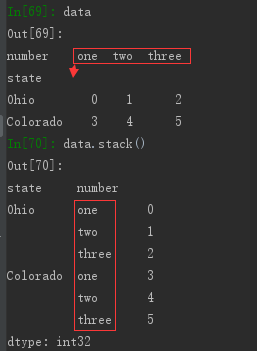
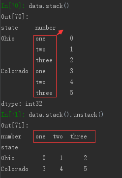
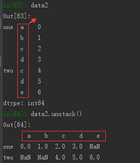
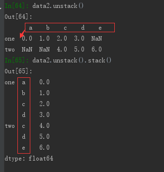

# 缺失值处理——拉格朗日插值法


```python
import matplotlib.pyplot as plt
import numpy as np
import pandas as pd
from pandas import Series, DataFrame
from scipy.interpolate import lagrange  # 导入拉格朗日插值函数

np.random.seed(12345)
plt.rc('figure', figsize=(10, 6))

inputfile = 'data/catering_sale.xls'  # 销量数据路径
outputfile = 'data/sales.xls'  # 输出数据路径

data = pd.read_excel(inputfile)  # 读入数据

# 过滤异常值，将其变为空值
"""
data[u'销量'][(data[u'销量'] < 400) | (data[u'销量'] > 5000)] = None  
上面这样写会有警告：
SettingWithCopyWarning: 
A value is trying to be set on a copy of a slice from a DataFrame

如果要更改原始数据，请使用单一赋值操作（loc）：
data.loc[(data[u'销量'] < 400) | (data[u'销量'] > 5000), u'销量'] = None

如果想要一个副本，请确保强制让 Pandas 创建副本：
error_data = data.copy() 
error_data.loc[(error_data[u'销量'] < 400) | (error_data[u'销量'] > 5000), u'销量'] = None

参考：https://www.jianshu.com/p/72274ccb647a
"""
data.loc[(data[u'销量'] < 400) | (data[u'销量'] > 5000), u'销量'] = None


# 自定义列向量插值函数
# s为列向量，n为被插值的位置，k为取前后的数据个数，默认为5
def ployinterp_column(s, n, k=5):
    y = s[list(range(n - k, n)) + list(range(n + 1, n + 1 + k))]  # 取数
    y = y[y.notnull()]  # 剔除空值
    return lagrange(y.index, list(y))(n)  # 插值并返回插值结果


# 逐个元素判断是否需要插值
for i in data.columns:
    for j in range(len(data)):
        if (data[i].isnull())[j]:  # 如果为空即插值。
            """
            data[i][j] = ployinterp_column(data[i], j)  
            这样写会有警告：
            SettingWithCopyWarning: 
            A value is trying to be set on a copy of a slice from a DataFrame
            """
            data.loc[j, i] = ployinterp_column(data[i], j)

data.to_excel(outputfile)  # 输出结果，写入文件
```

# dataframe合并


```python
#dataframe合并
# 1
df1 = DataFrame({'key': ['b', 'b', 'a', 'c', 'a', 'a', 'b'],
                 'data1': range(7)})
df2 = DataFrame({'key': ['a', 'b', 'd'],
                 'data2': range(3)})
print(df1)
print(df2)
```

       data1 key
    0      0   b
    1      1   b
    2      2   a
    3      3   c
    4      4   a
    5      5   a
    6      6   b
       data2 key
    0      0   a
    1      1   b
    2      2   d
    


```python
pd.merge(df1, df2)
```


<div>
<style>
    .dataframe thead tr:only-child th {
        text-align: right;
    }

    .dataframe thead th {
        text-align: left;
    }

    .dataframe tbody tr th {
        vertical-align: top;
    }
</style>
<table border="1" class="dataframe">
  <thead>
    <tr style="text-align: right;">
      <th></th>
      <th>data1</th>
      <th>key</th>
      <th>data2</th>
    </tr>
  </thead>
  <tbody>
    <tr>
      <th>0</th>
      <td>0</td>
      <td>b</td>
      <td>1</td>
    </tr>
    <tr>
      <th>1</th>
      <td>1</td>
      <td>b</td>
      <td>1</td>
    </tr>
    <tr>
      <th>2</th>
      <td>6</td>
      <td>b</td>
      <td>1</td>
    </tr>
    <tr>
      <th>3</th>
      <td>2</td>
      <td>a</td>
      <td>0</td>
    </tr>
    <tr>
      <th>4</th>
      <td>4</td>
      <td>a</td>
      <td>0</td>
    </tr>
    <tr>
      <th>5</th>
      <td>5</td>
      <td>a</td>
      <td>0</td>
    </tr>
  </tbody>
</table>
</div>


```python
pd.merge(df1, df2, on='key')
```


<div>
<style>
    .dataframe thead tr:only-child th {
        text-align: right;
    }

    .dataframe thead th {
        text-align: left;
    }

    .dataframe tbody tr th {
        vertical-align: top;
    }
</style>
<table border="1" class="dataframe">
  <thead>
    <tr style="text-align: right;">
      <th></th>
      <th>data1</th>
      <th>key</th>
      <th>data2</th>
    </tr>
  </thead>
  <tbody>
    <tr>
      <th>0</th>
      <td>0</td>
      <td>b</td>
      <td>1</td>
    </tr>
    <tr>
      <th>1</th>
      <td>1</td>
      <td>b</td>
      <td>1</td>
    </tr>
    <tr>
      <th>2</th>
      <td>6</td>
      <td>b</td>
      <td>1</td>
    </tr>
    <tr>
      <th>3</th>
      <td>2</td>
      <td>a</td>
      <td>0</td>
    </tr>
    <tr>
      <th>4</th>
      <td>4</td>
      <td>a</td>
      <td>0</td>
    </tr>
    <tr>
      <th>5</th>
      <td>5</td>
      <td>a</td>
      <td>0</td>
    </tr>
  </tbody>
</table>
</div>


```python
# 2
df3 = DataFrame({'lkey': ['b', 'b', 'a', 'c', 'a', 'a', 'b'],
                 'data1': range(7)})
df4 = DataFrame({'rkey': ['a', 'b', 'd'],
                 'data2': range(3)})
```


```python
pd.merge(df3, df4, left_on='lkey', right_on='rkey')
```


<div>
<style>
    .dataframe thead tr:only-child th {
        text-align: right;
    }

    .dataframe thead th {
        text-align: left;
    }

    .dataframe tbody tr th {
        vertical-align: top;
    }
</style>
<table border="1" class="dataframe">
  <thead>
    <tr style="text-align: right;">
      <th></th>
      <th>data1</th>
      <th>lkey</th>
      <th>data2</th>
      <th>rkey</th>
    </tr>
  </thead>
  <tbody>
    <tr>
      <th>0</th>
      <td>0</td>
      <td>b</td>
      <td>1</td>
      <td>b</td>
    </tr>
    <tr>
      <th>1</th>
      <td>1</td>
      <td>b</td>
      <td>1</td>
      <td>b</td>
    </tr>
    <tr>
      <th>2</th>
      <td>6</td>
      <td>b</td>
      <td>1</td>
      <td>b</td>
    </tr>
    <tr>
      <th>3</th>
      <td>2</td>
      <td>a</td>
      <td>0</td>
      <td>a</td>
    </tr>
    <tr>
      <th>4</th>
      <td>4</td>
      <td>a</td>
      <td>0</td>
      <td>a</td>
    </tr>
    <tr>
      <th>5</th>
      <td>5</td>
      <td>a</td>
      <td>0</td>
      <td>a</td>
    </tr>
  </tbody>
</table>
</div>


```python
pd.merge(df1, df2, how='outer')
```


<div>
<style>
    .dataframe thead tr:only-child th {
        text-align: right;
    }

    .dataframe thead th {
        text-align: left;
    }

    .dataframe tbody tr th {
        vertical-align: top;
    }
</style>
<table border="1" class="dataframe">
  <thead>
    <tr style="text-align: right;">
      <th></th>
      <th>data1</th>
      <th>key</th>
      <th>data2</th>
    </tr>
  </thead>
  <tbody>
    <tr>
      <th>0</th>
      <td>0.0</td>
      <td>b</td>
      <td>1.0</td>
    </tr>
    <tr>
      <th>1</th>
      <td>1.0</td>
      <td>b</td>
      <td>1.0</td>
    </tr>
    <tr>
      <th>2</th>
      <td>6.0</td>
      <td>b</td>
      <td>1.0</td>
    </tr>
    <tr>
      <th>3</th>
      <td>2.0</td>
      <td>a</td>
      <td>0.0</td>
    </tr>
    <tr>
      <th>4</th>
      <td>4.0</td>
      <td>a</td>
      <td>0.0</td>
    </tr>
    <tr>
      <th>5</th>
      <td>5.0</td>
      <td>a</td>
      <td>0.0</td>
    </tr>
    <tr>
      <th>6</th>
      <td>3.0</td>
      <td>c</td>
      <td>NaN</td>
    </tr>
    <tr>
      <th>7</th>
      <td>NaN</td>
      <td>d</td>
      <td>2.0</td>
    </tr>
  </tbody>
</table>
</div>


```python
# 3
df1 = DataFrame({'key': ['b', 'b', 'a', 'c', 'a', 'b'],
                 'data1': range(6)})
df2 = DataFrame({'key': ['a', 'b', 'a', 'b', 'd'],
                 'data2': range(5)})
print(df1)
print(df2)
```

       data1 key
    0      0   b
    1      1   b
    2      2   a
    3      3   c
    4      4   a
    5      5   b
       data2 key
    0      0   a
    1      1   b
    2      2   a
    3      3   b
    4      4   d
    


```python
pd.merge(df1, df2, on='key', how='left')
```


<div>
<style>
    .dataframe thead tr:only-child th {
        text-align: right;
    }

    .dataframe thead th {
        text-align: left;
    }

    .dataframe tbody tr th {
        vertical-align: top;
    }
</style>
<table border="1" class="dataframe">
  <thead>
    <tr style="text-align: right;">
      <th></th>
      <th>data1</th>
      <th>key</th>
      <th>data2</th>
    </tr>
  </thead>
  <tbody>
    <tr>
      <th>0</th>
      <td>0</td>
      <td>b</td>
      <td>1.0</td>
    </tr>
    <tr>
      <th>1</th>
      <td>0</td>
      <td>b</td>
      <td>3.0</td>
    </tr>
    <tr>
      <th>2</th>
      <td>1</td>
      <td>b</td>
      <td>1.0</td>
    </tr>
    <tr>
      <th>3</th>
      <td>1</td>
      <td>b</td>
      <td>3.0</td>
    </tr>
    <tr>
      <th>4</th>
      <td>2</td>
      <td>a</td>
      <td>0.0</td>
    </tr>
    <tr>
      <th>5</th>
      <td>2</td>
      <td>a</td>
      <td>2.0</td>
    </tr>
    <tr>
      <th>6</th>
      <td>3</td>
      <td>c</td>
      <td>NaN</td>
    </tr>
    <tr>
      <th>7</th>
      <td>4</td>
      <td>a</td>
      <td>0.0</td>
    </tr>
    <tr>
      <th>8</th>
      <td>4</td>
      <td>a</td>
      <td>2.0</td>
    </tr>
    <tr>
      <th>9</th>
      <td>5</td>
      <td>b</td>
      <td>1.0</td>
    </tr>
    <tr>
      <th>10</th>
      <td>5</td>
      <td>b</td>
      <td>3.0</td>
    </tr>
  </tbody>
</table>
</div>


```python
pd.merge(df1, df2, how='inner')
```


<div>
<style>
    .dataframe thead tr:only-child th {
        text-align: right;
    }

    .dataframe thead th {
        text-align: left;
    }

    .dataframe tbody tr th {
        vertical-align: top;
    }
</style>
<table border="1" class="dataframe">
  <thead>
    <tr style="text-align: right;">
      <th></th>
      <th>data1</th>
      <th>key</th>
      <th>data2</th>
    </tr>
  </thead>
  <tbody>
    <tr>
      <th>0</th>
      <td>0</td>
      <td>b</td>
      <td>1</td>
    </tr>
    <tr>
      <th>1</th>
      <td>0</td>
      <td>b</td>
      <td>3</td>
    </tr>
    <tr>
      <th>2</th>
      <td>1</td>
      <td>b</td>
      <td>1</td>
    </tr>
    <tr>
      <th>3</th>
      <td>1</td>
      <td>b</td>
      <td>3</td>
    </tr>
    <tr>
      <th>4</th>
      <td>5</td>
      <td>b</td>
      <td>1</td>
    </tr>
    <tr>
      <th>5</th>
      <td>5</td>
      <td>b</td>
      <td>3</td>
    </tr>
    <tr>
      <th>6</th>
      <td>2</td>
      <td>a</td>
      <td>0</td>
    </tr>
    <tr>
      <th>7</th>
      <td>2</td>
      <td>a</td>
      <td>2</td>
    </tr>
    <tr>
      <th>8</th>
      <td>4</td>
      <td>a</td>
      <td>0</td>
    </tr>
    <tr>
      <th>9</th>
      <td>4</td>
      <td>a</td>
      <td>2</td>
    </tr>
  </tbody>
</table>
</div>


```python
# 4
left = DataFrame({'key1': ['foo', 'foo', 'bar'],
                  'key2': ['one', 'two', 'one'],
                  'lval': [1, 2, 3]})
right = DataFrame({'key1': ['foo', 'foo', 'bar', 'bar'],
                   'key2': ['one', 'one', 'one', 'two'],
                   'rval': [4, 5, 6, 7]})
pd.merge(left, right, on=['key1', 'key2'], how='outer')
```


<div>
<style>
    .dataframe thead tr:only-child th {
        text-align: right;
    }

    .dataframe thead th {
        text-align: left;
    }

    .dataframe tbody tr th {
        vertical-align: top;
    }
</style>
<table border="1" class="dataframe">
  <thead>
    <tr style="text-align: right;">
      <th></th>
      <th>key1</th>
      <th>key2</th>
      <th>lval</th>
      <th>rval</th>
    </tr>
  </thead>
  <tbody>
    <tr>
      <th>0</th>
      <td>foo</td>
      <td>one</td>
      <td>1.0</td>
      <td>4.0</td>
    </tr>
    <tr>
      <th>1</th>
      <td>foo</td>
      <td>one</td>
      <td>1.0</td>
      <td>5.0</td>
    </tr>
    <tr>
      <th>2</th>
      <td>foo</td>
      <td>two</td>
      <td>2.0</td>
      <td>NaN</td>
    </tr>
    <tr>
      <th>3</th>
      <td>bar</td>
      <td>one</td>
      <td>3.0</td>
      <td>6.0</td>
    </tr>
    <tr>
      <th>4</th>
      <td>bar</td>
      <td>two</td>
      <td>NaN</td>
      <td>7.0</td>
    </tr>
  </tbody>
</table>
</div>


```python
# 5
pd.merge(left, right, on='key1')
```


<div>
<style>
    .dataframe thead tr:only-child th {
        text-align: right;
    }

    .dataframe thead th {
        text-align: left;
    }

    .dataframe tbody tr th {
        vertical-align: top;
    }
</style>
<table border="1" class="dataframe">
  <thead>
    <tr style="text-align: right;">
      <th></th>
      <th>key1</th>
      <th>key2_x</th>
      <th>lval</th>
      <th>key2_y</th>
      <th>rval</th>
    </tr>
  </thead>
  <tbody>
    <tr>
      <th>0</th>
      <td>foo</td>
      <td>one</td>
      <td>1</td>
      <td>one</td>
      <td>4</td>
    </tr>
    <tr>
      <th>1</th>
      <td>foo</td>
      <td>one</td>
      <td>1</td>
      <td>one</td>
      <td>5</td>
    </tr>
    <tr>
      <th>2</th>
      <td>foo</td>
      <td>two</td>
      <td>2</td>
      <td>one</td>
      <td>4</td>
    </tr>
    <tr>
      <th>3</th>
      <td>foo</td>
      <td>two</td>
      <td>2</td>
      <td>one</td>
      <td>5</td>
    </tr>
    <tr>
      <th>4</th>
      <td>bar</td>
      <td>one</td>
      <td>3</td>
      <td>one</td>
      <td>6</td>
    </tr>
    <tr>
      <th>5</th>
      <td>bar</td>
      <td>one</td>
      <td>3</td>
      <td>two</td>
      <td>7</td>
    </tr>
  </tbody>
</table>
</div>


```python
pd.merge(left, right, on='key1', suffixes=('_left', '_right'))
```


<div>
<style>
    .dataframe thead tr:only-child th {
        text-align: right;
    }

    .dataframe thead th {
        text-align: left;
    }

    .dataframe tbody tr th {
        vertical-align: top;
    }
</style>
<table border="1" class="dataframe">
  <thead>
    <tr style="text-align: right;">
      <th></th>
      <th>key1</th>
      <th>key2_left</th>
      <th>lval</th>
      <th>key2_right</th>
      <th>rval</th>
    </tr>
  </thead>
  <tbody>
    <tr>
      <th>0</th>
      <td>foo</td>
      <td>one</td>
      <td>1</td>
      <td>one</td>
      <td>4</td>
    </tr>
    <tr>
      <th>1</th>
      <td>foo</td>
      <td>one</td>
      <td>1</td>
      <td>one</td>
      <td>5</td>
    </tr>
    <tr>
      <th>2</th>
      <td>foo</td>
      <td>two</td>
      <td>2</td>
      <td>one</td>
      <td>4</td>
    </tr>
    <tr>
      <th>3</th>
      <td>foo</td>
      <td>two</td>
      <td>2</td>
      <td>one</td>
      <td>5</td>
    </tr>
    <tr>
      <th>4</th>
      <td>bar</td>
      <td>one</td>
      <td>3</td>
      <td>one</td>
      <td>6</td>
    </tr>
    <tr>
      <th>5</th>
      <td>bar</td>
      <td>one</td>
      <td>3</td>
      <td>two</td>
      <td>7</td>
    </tr>
  </tbody>
</table>
</div>


# 索引上的合并


```python
# 1
left1 = DataFrame({'key': ['a', 'b', 'a', 'a', 'b', 'c'], 'value': range(6)})
right1 = DataFrame({'group_val': [3.5, 7]}, index=['a', 'b'])
print(left1)
print(right1)
```

      key  value
    0   a      0
    1   b      1
    2   a      2
    3   a      3
    4   b      4
    5   c      5
       group_val
    a        3.5
    b        7.0
    


```python
pd.merge(left1, right1, left_on='key', right_index=True)
```


<div>
<style>
    .dataframe thead tr:only-child th {
        text-align: right;
    }

    .dataframe thead th {
        text-align: left;
    }

    .dataframe tbody tr th {
        vertical-align: top;
    }
</style>
<table border="1" class="dataframe">
  <thead>
    <tr style="text-align: right;">
      <th></th>
      <th>key</th>
      <th>value</th>
      <th>group_val</th>
    </tr>
  </thead>
  <tbody>
    <tr>
      <th>0</th>
      <td>a</td>
      <td>0</td>
      <td>3.5</td>
    </tr>
    <tr>
      <th>2</th>
      <td>a</td>
      <td>2</td>
      <td>3.5</td>
    </tr>
    <tr>
      <th>3</th>
      <td>a</td>
      <td>3</td>
      <td>3.5</td>
    </tr>
    <tr>
      <th>1</th>
      <td>b</td>
      <td>1</td>
      <td>7.0</td>
    </tr>
    <tr>
      <th>4</th>
      <td>b</td>
      <td>4</td>
      <td>7.0</td>
    </tr>
  </tbody>
</table>
</div>


```python
pd.merge(left1, right1, left_on='key', right_index=True, how='outer')
```


<div>
<style>
    .dataframe thead tr:only-child th {
        text-align: right;
    }

    .dataframe thead th {
        text-align: left;
    }

    .dataframe tbody tr th {
        vertical-align: top;
    }
</style>
<table border="1" class="dataframe">
  <thead>
    <tr style="text-align: right;">
      <th></th>
      <th>key</th>
      <th>value</th>
      <th>group_val</th>
    </tr>
  </thead>
  <tbody>
    <tr>
      <th>0</th>
      <td>a</td>
      <td>0</td>
      <td>3.5</td>
    </tr>
    <tr>
      <th>2</th>
      <td>a</td>
      <td>2</td>
      <td>3.5</td>
    </tr>
    <tr>
      <th>3</th>
      <td>a</td>
      <td>3</td>
      <td>3.5</td>
    </tr>
    <tr>
      <th>1</th>
      <td>b</td>
      <td>1</td>
      <td>7.0</td>
    </tr>
    <tr>
      <th>4</th>
      <td>b</td>
      <td>4</td>
      <td>7.0</td>
    </tr>
    <tr>
      <th>5</th>
      <td>c</td>
      <td>5</td>
      <td>NaN</td>
    </tr>
  </tbody>
</table>
</div>


```python
# 2
lefth = DataFrame({'key1': ['Ohio', 'Ohio', 'Ohio', 'Nevada', 'Nevada'],
                   'key2': [2000, 2001, 2002, 2001, 2002],
                   'data': np.arange(5.)})
righth = DataFrame(np.arange(12).reshape((6, 2)),
                   index=[['Nevada', 'Nevada', 'Ohio', 'Ohio', 'Ohio', 'Ohio'],
                          [2001, 2000, 2000, 2000, 2001, 2002]],
                   columns=['event1', 'event2'])
print(lefth)
print(righth)
```

       data    key1  key2
    0   0.0    Ohio  2000
    1   1.0    Ohio  2001
    2   2.0    Ohio  2002
    3   3.0  Nevada  2001
    4   4.0  Nevada  2002
                 event1  event2
    Nevada 2001       0       1
           2000       2       3
    Ohio   2000       4       5
           2000       6       7
           2001       8       9
           2002      10      11
    


```python
pd.merge(lefth, righth, left_on=['key1', 'key2'], right_index=True)
```


<div>
<style>
    .dataframe thead tr:only-child th {
        text-align: right;
    }

    .dataframe thead th {
        text-align: left;
    }

    .dataframe tbody tr th {
        vertical-align: top;
    }
</style>
<table border="1" class="dataframe">
  <thead>
    <tr style="text-align: right;">
      <th></th>
      <th>data</th>
      <th>key1</th>
      <th>key2</th>
      <th>event1</th>
      <th>event2</th>
    </tr>
  </thead>
  <tbody>
    <tr>
      <th>0</th>
      <td>0.0</td>
      <td>Ohio</td>
      <td>2000</td>
      <td>4</td>
      <td>5</td>
    </tr>
    <tr>
      <th>0</th>
      <td>0.0</td>
      <td>Ohio</td>
      <td>2000</td>
      <td>6</td>
      <td>7</td>
    </tr>
    <tr>
      <th>1</th>
      <td>1.0</td>
      <td>Ohio</td>
      <td>2001</td>
      <td>8</td>
      <td>9</td>
    </tr>
    <tr>
      <th>2</th>
      <td>2.0</td>
      <td>Ohio</td>
      <td>2002</td>
      <td>10</td>
      <td>11</td>
    </tr>
    <tr>
      <th>3</th>
      <td>3.0</td>
      <td>Nevada</td>
      <td>2001</td>
      <td>0</td>
      <td>1</td>
    </tr>
  </tbody>
</table>
</div>


```python
pd.merge(lefth, righth, left_on=['key1', 'key2'],
         right_index=True, how='outer')
```


<div>
<style>
    .dataframe thead tr:only-child th {
        text-align: right;
    }

    .dataframe thead th {
        text-align: left;
    }

    .dataframe tbody tr th {
        vertical-align: top;
    }
</style>
<table border="1" class="dataframe">
  <thead>
    <tr style="text-align: right;">
      <th></th>
      <th>data</th>
      <th>key1</th>
      <th>key2</th>
      <th>event1</th>
      <th>event2</th>
    </tr>
  </thead>
  <tbody>
    <tr>
      <th>0</th>
      <td>0.0</td>
      <td>Ohio</td>
      <td>2000</td>
      <td>4.0</td>
      <td>5.0</td>
    </tr>
    <tr>
      <th>0</th>
      <td>0.0</td>
      <td>Ohio</td>
      <td>2000</td>
      <td>6.0</td>
      <td>7.0</td>
    </tr>
    <tr>
      <th>1</th>
      <td>1.0</td>
      <td>Ohio</td>
      <td>2001</td>
      <td>8.0</td>
      <td>9.0</td>
    </tr>
    <tr>
      <th>2</th>
      <td>2.0</td>
      <td>Ohio</td>
      <td>2002</td>
      <td>10.0</td>
      <td>11.0</td>
    </tr>
    <tr>
      <th>3</th>
      <td>3.0</td>
      <td>Nevada</td>
      <td>2001</td>
      <td>0.0</td>
      <td>1.0</td>
    </tr>
    <tr>
      <th>4</th>
      <td>4.0</td>
      <td>Nevada</td>
      <td>2002</td>
      <td>NaN</td>
      <td>NaN</td>
    </tr>
    <tr>
      <th>4</th>
      <td>NaN</td>
      <td>Nevada</td>
      <td>2000</td>
      <td>2.0</td>
      <td>3.0</td>
    </tr>
  </tbody>
</table>
</div>


```python
left2 = DataFrame([[1., 2.], [3., 4.], [5., 6.]], index=['a', 'c', 'e'],
                  columns=['Ohio', 'Nevada'])
right2 = DataFrame([[7., 8.], [9., 10.], [11., 12.], [13, 14]],
                   index=['b', 'c', 'd', 'e'], columns=['Missouri', 'Alabama'])
print(left2)
print(right2)
```

       Ohio  Nevada
    a   1.0     2.0
    c   3.0     4.0
    e   5.0     6.0
       Missouri  Alabama
    b       7.0      8.0
    c       9.0     10.0
    d      11.0     12.0
    e      13.0     14.0
    


```python
pd.merge(left2, right2, how='outer', left_index=True, right_index=True)
```


<div>
<style>
    .dataframe thead tr:only-child th {
        text-align: right;
    }

    .dataframe thead th {
        text-align: left;
    }

    .dataframe tbody tr th {
        vertical-align: top;
    }
</style>
<table border="1" class="dataframe">
  <thead>
    <tr style="text-align: right;">
      <th></th>
      <th>Ohio</th>
      <th>Nevada</th>
      <th>Missouri</th>
      <th>Alabama</th>
    </tr>
  </thead>
  <tbody>
    <tr>
      <th>a</th>
      <td>1.0</td>
      <td>2.0</td>
      <td>NaN</td>
      <td>NaN</td>
    </tr>
    <tr>
      <th>b</th>
      <td>NaN</td>
      <td>NaN</td>
      <td>7.0</td>
      <td>8.0</td>
    </tr>
    <tr>
      <th>c</th>
      <td>3.0</td>
      <td>4.0</td>
      <td>9.0</td>
      <td>10.0</td>
    </tr>
    <tr>
      <th>d</th>
      <td>NaN</td>
      <td>NaN</td>
      <td>11.0</td>
      <td>12.0</td>
    </tr>
    <tr>
      <th>e</th>
      <td>5.0</td>
      <td>6.0</td>
      <td>13.0</td>
      <td>14.0</td>
    </tr>
  </tbody>
</table>
</div>


```python
# 3
left2.join(right2, how='outer')
```


<div>
<style>
    .dataframe thead tr:only-child th {
        text-align: right;
    }

    .dataframe thead th {
        text-align: left;
    }

    .dataframe tbody tr th {
        vertical-align: top;
    }
</style>
<table border="1" class="dataframe">
  <thead>
    <tr style="text-align: right;">
      <th></th>
      <th>Ohio</th>
      <th>Nevada</th>
      <th>Missouri</th>
      <th>Alabama</th>
    </tr>
  </thead>
  <tbody>
    <tr>
      <th>a</th>
      <td>1.0</td>
      <td>2.0</td>
      <td>NaN</td>
      <td>NaN</td>
    </tr>
    <tr>
      <th>b</th>
      <td>NaN</td>
      <td>NaN</td>
      <td>7.0</td>
      <td>8.0</td>
    </tr>
    <tr>
      <th>c</th>
      <td>3.0</td>
      <td>4.0</td>
      <td>9.0</td>
      <td>10.0</td>
    </tr>
    <tr>
      <th>d</th>
      <td>NaN</td>
      <td>NaN</td>
      <td>11.0</td>
      <td>12.0</td>
    </tr>
    <tr>
      <th>e</th>
      <td>5.0</td>
      <td>6.0</td>
      <td>13.0</td>
      <td>14.0</td>
    </tr>
  </tbody>
</table>
</div>


```python
left1.join(right1, on='key')
```


<div>
<style>
    .dataframe thead tr:only-child th {
        text-align: right;
    }

    .dataframe thead th {
        text-align: left;
    }

    .dataframe tbody tr th {
        vertical-align: top;
    }
</style>
<table border="1" class="dataframe">
  <thead>
    <tr style="text-align: right;">
      <th></th>
      <th>key</th>
      <th>value</th>
      <th>group_val</th>
    </tr>
  </thead>
  <tbody>
    <tr>
      <th>0</th>
      <td>a</td>
      <td>0</td>
      <td>3.5</td>
    </tr>
    <tr>
      <th>1</th>
      <td>b</td>
      <td>1</td>
      <td>7.0</td>
    </tr>
    <tr>
      <th>2</th>
      <td>a</td>
      <td>2</td>
      <td>3.5</td>
    </tr>
    <tr>
      <th>3</th>
      <td>a</td>
      <td>3</td>
      <td>3.5</td>
    </tr>
    <tr>
      <th>4</th>
      <td>b</td>
      <td>4</td>
      <td>7.0</td>
    </tr>
    <tr>
      <th>5</th>
      <td>c</td>
      <td>5</td>
      <td>NaN</td>
    </tr>
  </tbody>
</table>
</div>


```python
# 4
another = DataFrame([[7., 8.], [9., 10.], [11., 12.], [16., 17.]],
                    index=['a', 'c', 'e', 'f'], columns=['New York', 'Oregon'])
left2.join([right2, another])
```


<div>
<style>
    .dataframe thead tr:only-child th {
        text-align: right;
    }

    .dataframe thead th {
        text-align: left;
    }

    .dataframe tbody tr th {
        vertical-align: top;
    }
</style>
<table border="1" class="dataframe">
  <thead>
    <tr style="text-align: right;">
      <th></th>
      <th>Ohio</th>
      <th>Nevada</th>
      <th>Missouri</th>
      <th>Alabama</th>
      <th>New York</th>
      <th>Oregon</th>
    </tr>
  </thead>
  <tbody>
    <tr>
      <th>a</th>
      <td>1.0</td>
      <td>2.0</td>
      <td>NaN</td>
      <td>NaN</td>
      <td>7.0</td>
      <td>8.0</td>
    </tr>
    <tr>
      <th>c</th>
      <td>3.0</td>
      <td>4.0</td>
      <td>9.0</td>
      <td>10.0</td>
      <td>9.0</td>
      <td>10.0</td>
    </tr>
    <tr>
      <th>e</th>
      <td>5.0</td>
      <td>6.0</td>
      <td>13.0</td>
      <td>14.0</td>
      <td>11.0</td>
      <td>12.0</td>
    </tr>
  </tbody>
</table>
</div>


```python
left2.join([right2, another], how='outer')
```


<div>
<style>
    .dataframe thead tr:only-child th {
        text-align: right;
    }

    .dataframe thead th {
        text-align: left;
    }

    .dataframe tbody tr th {
        vertical-align: top;
    }
</style>
<table border="1" class="dataframe">
  <thead>
    <tr style="text-align: right;">
      <th></th>
      <th>Ohio</th>
      <th>Nevada</th>
      <th>Missouri</th>
      <th>Alabama</th>
      <th>New York</th>
      <th>Oregon</th>
    </tr>
  </thead>
  <tbody>
    <tr>
      <th>a</th>
      <td>1.0</td>
      <td>2.0</td>
      <td>NaN</td>
      <td>NaN</td>
      <td>7.0</td>
      <td>8.0</td>
    </tr>
    <tr>
      <th>b</th>
      <td>NaN</td>
      <td>NaN</td>
      <td>7.0</td>
      <td>8.0</td>
      <td>NaN</td>
      <td>NaN</td>
    </tr>
    <tr>
      <th>c</th>
      <td>3.0</td>
      <td>4.0</td>
      <td>9.0</td>
      <td>10.0</td>
      <td>9.0</td>
      <td>10.0</td>
    </tr>
    <tr>
      <th>d</th>
      <td>NaN</td>
      <td>NaN</td>
      <td>11.0</td>
      <td>12.0</td>
      <td>NaN</td>
      <td>NaN</td>
    </tr>
    <tr>
      <th>e</th>
      <td>5.0</td>
      <td>6.0</td>
      <td>13.0</td>
      <td>14.0</td>
      <td>11.0</td>
      <td>12.0</td>
    </tr>
    <tr>
      <th>f</th>
      <td>NaN</td>
      <td>NaN</td>
      <td>NaN</td>
      <td>NaN</td>
      <td>16.0</td>
      <td>17.0</td>
    </tr>
  </tbody>
</table>
</div>


# 轴向连接


```python
# 1
arr = np.arange(12).reshape((3, 4))
print(arr)

np.concatenate([arr, arr], axis=1)
```

    [[ 0  1  2  3]
     [ 4  5  6  7]
     [ 8  9 10 11]]
    


    array([[ 0,  1,  2,  3,  0,  1,  2,  3],
           [ 4,  5,  6,  7,  4,  5,  6,  7],
           [ 8,  9, 10, 11,  8,  9, 10, 11]])


```python
# 2
s1 = Series([0, 1], index=['a', 'b'])
s2 = Series([2, 3, 4], index=['c', 'd', 'e'])
s3 = Series([5, 6], index=['f', 'g'])

pd.concat([s1, s2, s3])
```


    a    0
    b    1
    c    2
    d    3
    e    4
    f    5
    g    6
    dtype: int64


```python
pd.concat([s1, s2, s3], axis=0)
```


    a    0
    b    1
    c    2
    d    3
    e    4
    f    5
    g    6
    dtype: int64


```python
pd.concat([s1, s2, s3], axis=1)
```


<div>
<style>
    .dataframe thead tr:only-child th {
        text-align: right;
    }

    .dataframe thead th {
        text-align: left;
    }

    .dataframe tbody tr th {
        vertical-align: top;
    }
</style>
<table border="1" class="dataframe">
  <thead>
    <tr style="text-align: right;">
      <th></th>
      <th>0</th>
      <th>1</th>
      <th>2</th>
    </tr>
  </thead>
  <tbody>
    <tr>
      <th>a</th>
      <td>0.0</td>
      <td>NaN</td>
      <td>NaN</td>
    </tr>
    <tr>
      <th>b</th>
      <td>1.0</td>
      <td>NaN</td>
      <td>NaN</td>
    </tr>
    <tr>
      <th>c</th>
      <td>NaN</td>
      <td>2.0</td>
      <td>NaN</td>
    </tr>
    <tr>
      <th>d</th>
      <td>NaN</td>
      <td>3.0</td>
      <td>NaN</td>
    </tr>
    <tr>
      <th>e</th>
      <td>NaN</td>
      <td>4.0</td>
      <td>NaN</td>
    </tr>
    <tr>
      <th>f</th>
      <td>NaN</td>
      <td>NaN</td>
      <td>5.0</td>
    </tr>
    <tr>
      <th>g</th>
      <td>NaN</td>
      <td>NaN</td>
      <td>6.0</td>
    </tr>
  </tbody>
</table>
</div>


```python
s4 = pd.concat([s1 * 5, s3])
print(s4)
```

    a    0
    b    5
    f    5
    g    6
    dtype: int64
    


```python
pd.concat([s1, s4], axis=1)
```


<div>
<style>
    .dataframe thead tr:only-child th {
        text-align: right;
    }

    .dataframe thead th {
        text-align: left;
    }

    .dataframe tbody tr th {
        vertical-align: top;
    }
</style>
<table border="1" class="dataframe">
  <thead>
    <tr style="text-align: right;">
      <th></th>
      <th>0</th>
      <th>1</th>
    </tr>
  </thead>
  <tbody>
    <tr>
      <th>a</th>
      <td>0.0</td>
      <td>0</td>
    </tr>
    <tr>
      <th>b</th>
      <td>1.0</td>
      <td>5</td>
    </tr>
    <tr>
      <th>f</th>
      <td>NaN</td>
      <td>5</td>
    </tr>
    <tr>
      <th>g</th>
      <td>NaN</td>
      <td>6</td>
    </tr>
  </tbody>
</table>
</div>


```python
pd.concat([s1, s4], axis=1, join='inner')
```


<div>
<style>
    .dataframe thead tr:only-child th {
        text-align: right;
    }

    .dataframe thead th {
        text-align: left;
    }

    .dataframe tbody tr th {
        vertical-align: top;
    }
</style>
<table border="1" class="dataframe">
  <thead>
    <tr style="text-align: right;">
      <th></th>
      <th>0</th>
      <th>1</th>
    </tr>
  </thead>
  <tbody>
    <tr>
      <th>a</th>
      <td>0</td>
      <td>0</td>
    </tr>
    <tr>
      <th>b</th>
      <td>1</td>
      <td>5</td>
    </tr>
  </tbody>
</table>
</div>


```python
pd.concat([s1, s4], axis=1, join_axes=[['a', 'c', 'b', 'e']])
```


<div>
<style>
    .dataframe thead tr:only-child th {
        text-align: right;
    }

    .dataframe thead th {
        text-align: left;
    }

    .dataframe tbody tr th {
        vertical-align: top;
    }
</style>
<table border="1" class="dataframe">
  <thead>
    <tr style="text-align: right;">
      <th></th>
      <th>0</th>
      <th>1</th>
    </tr>
  </thead>
  <tbody>
    <tr>
      <th>a</th>
      <td>0.0</td>
      <td>0.0</td>
    </tr>
    <tr>
      <th>c</th>
      <td>NaN</td>
      <td>NaN</td>
    </tr>
    <tr>
      <th>b</th>
      <td>1.0</td>
      <td>5.0</td>
    </tr>
    <tr>
      <th>e</th>
      <td>NaN</td>
      <td>NaN</td>
    </tr>
  </tbody>
</table>
</div>


```python
# 3
result = pd.concat([s1, s1, s3], keys=['one', 'two', 'three'])
print(result)
```

    one    a    0
           b    1
    two    a    0
           b    1
    three  f    5
           g    6
    dtype: int64
    


```python
result.unstack()
```


<div>
<style>
    .dataframe thead tr:only-child th {
        text-align: right;
    }

    .dataframe thead th {
        text-align: left;
    }

    .dataframe tbody tr th {
        vertical-align: top;
    }
</style>
<table border="1" class="dataframe">
  <thead>
    <tr style="text-align: right;">
      <th></th>
      <th>a</th>
      <th>b</th>
      <th>f</th>
      <th>g</th>
    </tr>
  </thead>
  <tbody>
    <tr>
      <th>one</th>
      <td>0.0</td>
      <td>1.0</td>
      <td>NaN</td>
      <td>NaN</td>
    </tr>
    <tr>
      <th>two</th>
      <td>0.0</td>
      <td>1.0</td>
      <td>NaN</td>
      <td>NaN</td>
    </tr>
    <tr>
      <th>three</th>
      <td>NaN</td>
      <td>NaN</td>
      <td>5.0</td>
      <td>6.0</td>
    </tr>
  </tbody>
</table>
</div>


```python
# 4
pd.concat([s1, s2, s3], axis=1, keys=['one', 'two', 'three'])
```


<div>
<style>
    .dataframe thead tr:only-child th {
        text-align: right;
    }

    .dataframe thead th {
        text-align: left;
    }

    .dataframe tbody tr th {
        vertical-align: top;
    }
</style>
<table border="1" class="dataframe">
  <thead>
    <tr style="text-align: right;">
      <th></th>
      <th>one</th>
      <th>two</th>
      <th>three</th>
    </tr>
  </thead>
  <tbody>
    <tr>
      <th>a</th>
      <td>0.0</td>
      <td>NaN</td>
      <td>NaN</td>
    </tr>
    <tr>
      <th>b</th>
      <td>1.0</td>
      <td>NaN</td>
      <td>NaN</td>
    </tr>
    <tr>
      <th>c</th>
      <td>NaN</td>
      <td>2.0</td>
      <td>NaN</td>
    </tr>
    <tr>
      <th>d</th>
      <td>NaN</td>
      <td>3.0</td>
      <td>NaN</td>
    </tr>
    <tr>
      <th>e</th>
      <td>NaN</td>
      <td>4.0</td>
      <td>NaN</td>
    </tr>
    <tr>
      <th>f</th>
      <td>NaN</td>
      <td>NaN</td>
      <td>5.0</td>
    </tr>
    <tr>
      <th>g</th>
      <td>NaN</td>
      <td>NaN</td>
      <td>6.0</td>
    </tr>
  </tbody>
</table>
</div>


```python
df1 = DataFrame(np.arange(6).reshape(3, 2), index=['a', 'b', 'c'],
                columns=['one', 'two'])
df2 = DataFrame(5 + np.arange(4).reshape(2, 2), index=['a', 'c'],
                columns=['three', 'four'])
```


```python
pd.concat([df1, df2], axis=1, keys=['level1', 'level2'])
```


<div>
<style>
    .dataframe thead tr:only-child th {
        text-align: right;
    }

    .dataframe thead th {
        text-align: left;
    }

    .dataframe tbody tr th {
        vertical-align: top;
    }
</style>
<table border="1" class="dataframe">
  <thead>
    <tr>
      <th></th>
      <th colspan="2" halign="left">level1</th>
      <th colspan="2" halign="left">level2</th>
    </tr>
    <tr>
      <th></th>
      <th>one</th>
      <th>two</th>
      <th>three</th>
      <th>four</th>
    </tr>
  </thead>
  <tbody>
    <tr>
      <th>a</th>
      <td>0</td>
      <td>1</td>
      <td>5.0</td>
      <td>6.0</td>
    </tr>
    <tr>
      <th>b</th>
      <td>2</td>
      <td>3</td>
      <td>NaN</td>
      <td>NaN</td>
    </tr>
    <tr>
      <th>c</th>
      <td>4</td>
      <td>5</td>
      <td>7.0</td>
      <td>8.0</td>
    </tr>
  </tbody>
</table>
</div>


```python
pd.concat({'level1': df1, 'level2': df2}, axis=1)
```


<div>
<style>
    .dataframe thead tr:only-child th {
        text-align: right;
    }

    .dataframe thead th {
        text-align: left;
    }

    .dataframe tbody tr th {
        vertical-align: top;
    }
</style>
<table border="1" class="dataframe">
  <thead>
    <tr>
      <th></th>
      <th colspan="2" halign="left">level1</th>
      <th colspan="2" halign="left">level2</th>
    </tr>
    <tr>
      <th></th>
      <th>one</th>
      <th>two</th>
      <th>three</th>
      <th>four</th>
    </tr>
  </thead>
  <tbody>
    <tr>
      <th>a</th>
      <td>0</td>
      <td>1</td>
      <td>5.0</td>
      <td>6.0</td>
    </tr>
    <tr>
      <th>b</th>
      <td>2</td>
      <td>3</td>
      <td>NaN</td>
      <td>NaN</td>
    </tr>
    <tr>
      <th>c</th>
      <td>4</td>
      <td>5</td>
      <td>7.0</td>
      <td>8.0</td>
    </tr>
  </tbody>
</table>
</div>


```python
pd.concat([df1, df2], axis=1, keys=['level1', 'level2'],
          names=['upper', 'lower'])
```


<div>
<style>
    .dataframe thead tr:only-child th {
        text-align: right;
    }

    .dataframe thead th {
        text-align: left;
    }

    .dataframe tbody tr th {
        vertical-align: top;
    }
</style>
<table border="1" class="dataframe">
  <thead>
    <tr>
      <th>upper</th>
      <th colspan="2" halign="left">level1</th>
      <th colspan="2" halign="left">level2</th>
    </tr>
    <tr>
      <th>lower</th>
      <th>one</th>
      <th>two</th>
      <th>three</th>
      <th>four</th>
    </tr>
  </thead>
  <tbody>
    <tr>
      <th>a</th>
      <td>0</td>
      <td>1</td>
      <td>5.0</td>
      <td>6.0</td>
    </tr>
    <tr>
      <th>b</th>
      <td>2</td>
      <td>3</td>
      <td>NaN</td>
      <td>NaN</td>
    </tr>
    <tr>
      <th>c</th>
      <td>4</td>
      <td>5</td>
      <td>7.0</td>
      <td>8.0</td>
    </tr>
  </tbody>
</table>
</div>


```python
# 5
df1 = DataFrame(np.random.randn(3, 4), columns=['a', 'b', 'c', 'd'])
df2 = DataFrame(np.random.randn(2, 3), columns=['b', 'd', 'a'])
print(df1)
print(df2)
```

              a         b         c         d
    0 -0.204708  0.478943 -0.519439 -0.555730
    1  1.965781  1.393406  0.092908  0.281746
    2  0.769023  1.246435  1.007189 -1.296221
              b         d         a
    0  0.274992  0.228913  1.352917
    1  0.886429 -2.001637 -0.371843
    


```python
pd.concat([df1, df2], ignore_index=True)
```


<div>
<style>
    .dataframe thead tr:only-child th {
        text-align: right;
    }

    .dataframe thead th {
        text-align: left;
    }

    .dataframe tbody tr th {
        vertical-align: top;
    }
</style>
<table border="1" class="dataframe">
  <thead>
    <tr style="text-align: right;">
      <th></th>
      <th>a</th>
      <th>b</th>
      <th>c</th>
      <th>d</th>
    </tr>
  </thead>
  <tbody>
    <tr>
      <th>0</th>
      <td>-0.204708</td>
      <td>0.478943</td>
      <td>-0.519439</td>
      <td>-0.555730</td>
    </tr>
    <tr>
      <th>1</th>
      <td>1.965781</td>
      <td>1.393406</td>
      <td>0.092908</td>
      <td>0.281746</td>
    </tr>
    <tr>
      <th>2</th>
      <td>0.769023</td>
      <td>1.246435</td>
      <td>1.007189</td>
      <td>-1.296221</td>
    </tr>
    <tr>
      <th>3</th>
      <td>1.352917</td>
      <td>0.274992</td>
      <td>NaN</td>
      <td>0.228913</td>
    </tr>
    <tr>
      <th>4</th>
      <td>-0.371843</td>
      <td>0.886429</td>
      <td>NaN</td>
      <td>-2.001637</td>
    </tr>
  </tbody>
</table>
</div>


# 合并重叠数据


```python
# 1
a = Series([np.nan, 2.5, np.nan, 3.5, 4.5, np.nan],
           index=['f', 'e', 'd', 'c', 'b', 'a'])
b = Series(np.arange(len(a), dtype=np.float64),
           index=['f', 'e', 'd', 'c', 'b', 'a'])
b[-1] = np.nan

print(a)
print(b)

np.where(pd.isnull(a), b, a)
```

    f    NaN
    e    2.5
    d    NaN
    c    3.5
    b    4.5
    a    NaN
    dtype: float64
    f    0.0
    e    1.0
    d    2.0
    c    3.0
    b    4.0
    a    NaN
    dtype: float64
    


    array([ 0. ,  2.5,  2. ,  3.5,  4.5,  nan])


```python
# 2
b[:-2].combine_first(a[2:])
```


    a    NaN
    b    4.5
    c    3.0
    d    2.0
    e    1.0
    f    0.0
    dtype: float64


```python
# 3
df1 = DataFrame({'a': [1., np.nan, 5., np.nan],
                 'b': [np.nan, 2., np.nan, 6.],
                 'c': range(2, 18, 4)})
df2 = DataFrame({'a': [5., 4., np.nan, 3., 7.],
                 'b': [np.nan, 3., 4., 6., 8.]})
df1.combine_first(df2)
```


<div>
<style>
    .dataframe thead tr:only-child th {
        text-align: right;
    }

    .dataframe thead th {
        text-align: left;
    }

    .dataframe tbody tr th {
        vertical-align: top;
    }
</style>
<table border="1" class="dataframe">
  <thead>
    <tr style="text-align: right;">
      <th></th>
      <th>a</th>
      <th>b</th>
      <th>c</th>
    </tr>
  </thead>
  <tbody>
    <tr>
      <th>0</th>
      <td>1.0</td>
      <td>NaN</td>
      <td>2.0</td>
    </tr>
    <tr>
      <th>1</th>
      <td>4.0</td>
      <td>2.0</td>
      <td>6.0</td>
    </tr>
    <tr>
      <th>2</th>
      <td>5.0</td>
      <td>4.0</td>
      <td>10.0</td>
    </tr>
    <tr>
      <th>3</th>
      <td>3.0</td>
      <td>6.0</td>
      <td>14.0</td>
    </tr>
    <tr>
      <th>4</th>
      <td>7.0</td>
      <td>8.0</td>
      <td>NaN</td>
    </tr>
  </tbody>
</table>
</div>


# 重塑层次化索引


```python
# 1
data = DataFrame(np.arange(6).reshape((2, 3)),
                 index=pd.Index(['Ohio', 'Colorado'], name='state'),
                 columns=pd.Index(['one', 'two', 'three'], name='number'))
print(data)
```

    number    one  two  three
    state                    
    Ohio        0    1      2
    Colorado    3    4      5
    


```python
# stack 把 column 转成 index
result = data.stack()
print(result)
```

    state     number
    Ohio      one       0
              two       1
              three     2
    Colorado  one       3
              two       4
              three     5
    dtype: int32
    




```python
# unstack 把 index 转成 column
result.unstack()
```


<div>
<style>
    .dataframe thead tr:only-child th {
        text-align: right;
    }

    .dataframe thead th {
        text-align: left;
    }

    .dataframe tbody tr th {
        vertical-align: top;
    }
</style>
<table border="1" class="dataframe">
  <thead>
    <tr style="text-align: right;">
      <th>number</th>
      <th>one</th>
      <th>two</th>
      <th>three</th>
    </tr>
    <tr>
      <th>state</th>
      <th></th>
      <th></th>
      <th></th>
    </tr>
  </thead>
  <tbody>
    <tr>
      <th>Ohio</th>
      <td>0</td>
      <td>1</td>
      <td>2</td>
    </tr>
    <tr>
      <th>Colorado</th>
      <td>3</td>
      <td>4</td>
      <td>5</td>
    </tr>
  </tbody>
</table>
</div>





```python
result.unstack(0)
```


<div>
<style>
    .dataframe thead tr:only-child th {
        text-align: right;
    }

    .dataframe thead th {
        text-align: left;
    }

    .dataframe tbody tr th {
        vertical-align: top;
    }
</style>
<table border="1" class="dataframe">
  <thead>
    <tr style="text-align: right;">
      <th>state</th>
      <th>Ohio</th>
      <th>Colorado</th>
    </tr>
    <tr>
      <th>number</th>
      <th></th>
      <th></th>
    </tr>
  </thead>
  <tbody>
    <tr>
      <th>one</th>
      <td>0</td>
      <td>3</td>
    </tr>
    <tr>
      <th>two</th>
      <td>1</td>
      <td>4</td>
    </tr>
    <tr>
      <th>three</th>
      <td>2</td>
      <td>5</td>
    </tr>
  </tbody>
</table>
</div>


```python
result.unstack('state')
```


<div>
<style>
    .dataframe thead tr:only-child th {
        text-align: right;
    }

    .dataframe thead th {
        text-align: left;
    }

    .dataframe tbody tr th {
        vertical-align: top;
    }
</style>
<table border="1" class="dataframe">
  <thead>
    <tr style="text-align: right;">
      <th>state</th>
      <th>Ohio</th>
      <th>Colorado</th>
    </tr>
    <tr>
      <th>number</th>
      <th></th>
      <th></th>
    </tr>
  </thead>
  <tbody>
    <tr>
      <th>one</th>
      <td>0</td>
      <td>3</td>
    </tr>
    <tr>
      <th>two</th>
      <td>1</td>
      <td>4</td>
    </tr>
    <tr>
      <th>three</th>
      <td>2</td>
      <td>5</td>
    </tr>
  </tbody>
</table>
</div>


```python
# 2
s1 = Series([0, 1, 2, 3], index=['a', 'b', 'c', 'd'])
s2 = Series([4, 5, 6], index=['c', 'd', 'e'])
data2 = pd.concat([s1, s2], keys=['one', 'two'])
print(data2)
```

    one  a    0
         b    1
         c    2
         d    3
    two  c    4
         d    5
         e    6
    dtype: int64
    


```python
# data2.stack() # 没有column 执行会报错
```


```python
data2.unstack()
```


<div>
<style>
    .dataframe thead tr:only-child th {
        text-align: right;
    }

    .dataframe thead th {
        text-align: left;
    }

    .dataframe tbody tr th {
        vertical-align: top;
    }
</style>
<table border="1" class="dataframe">
  <thead>
    <tr style="text-align: right;">
      <th></th>
      <th>a</th>
      <th>b</th>
      <th>c</th>
      <th>d</th>
      <th>e</th>
    </tr>
  </thead>
  <tbody>
    <tr>
      <th>one</th>
      <td>0.0</td>
      <td>1.0</td>
      <td>2.0</td>
      <td>3.0</td>
      <td>NaN</td>
    </tr>
    <tr>
      <th>two</th>
      <td>NaN</td>
      <td>NaN</td>
      <td>4.0</td>
      <td>5.0</td>
      <td>6.0</td>
    </tr>
  </tbody>
</table>
</div>





```python
data2.unstack().stack()
```


    one  a    0.0
         b    1.0
         c    2.0
         d    3.0
    two  c    4.0
         d    5.0
         e    6.0
    dtype: float64





```python
data2.unstack().stack(dropna=False)
```


    one  a    0.0
         b    1.0
         c    2.0
         d    3.0
         e    NaN
    two  a    NaN
         b    NaN
         c    4.0
         d    5.0
         e    6.0
    dtype: float64


```python
# 3
df = DataFrame({'left': result, 'right': result + 5},
               columns=pd.Index(['left', 'right'], name='side'))
print(df)
```

    side             left  right
    state    number             
    Ohio     one        0      5
             two        1      6
             three      2      7
    Colorado one        3      8
             two        4      9
             three      5     10
    


```python
df.unstack('state')
```


<div>
<style>
    .dataframe thead tr:only-child th {
        text-align: right;
    }

    .dataframe thead th {
        text-align: left;
    }

    .dataframe tbody tr th {
        vertical-align: top;
    }
</style>
<table border="1" class="dataframe">
  <thead>
    <tr>
      <th>side</th>
      <th colspan="2" halign="left">left</th>
      <th colspan="2" halign="left">right</th>
    </tr>
    <tr>
      <th>state</th>
      <th>Ohio</th>
      <th>Colorado</th>
      <th>Ohio</th>
      <th>Colorado</th>
    </tr>
    <tr>
      <th>number</th>
      <th></th>
      <th></th>
      <th></th>
      <th></th>
    </tr>
  </thead>
  <tbody>
    <tr>
      <th>one</th>
      <td>0</td>
      <td>3</td>
      <td>5</td>
      <td>8</td>
    </tr>
    <tr>
      <th>two</th>
      <td>1</td>
      <td>4</td>
      <td>6</td>
      <td>9</td>
    </tr>
    <tr>
      <th>three</th>
      <td>2</td>
      <td>5</td>
      <td>7</td>
      <td>10</td>
    </tr>
  </tbody>
</table>
</div>


```python
df.unstack('state').stack('side')
```


<div>
<style>
    .dataframe thead tr:only-child th {
        text-align: right;
    }

    .dataframe thead th {
        text-align: left;
    }

    .dataframe tbody tr th {
        vertical-align: top;
    }
</style>
<table border="1" class="dataframe">
  <thead>
    <tr style="text-align: right;">
      <th></th>
      <th>state</th>
      <th>Colorado</th>
      <th>Ohio</th>
    </tr>
    <tr>
      <th>number</th>
      <th>side</th>
      <th></th>
      <th></th>
    </tr>
  </thead>
  <tbody>
    <tr>
      <th rowspan="2" valign="top">one</th>
      <th>left</th>
      <td>3</td>
      <td>0</td>
    </tr>
    <tr>
      <th>right</th>
      <td>8</td>
      <td>5</td>
    </tr>
    <tr>
      <th rowspan="2" valign="top">two</th>
      <th>left</th>
      <td>4</td>
      <td>1</td>
    </tr>
    <tr>
      <th>right</th>
      <td>9</td>
      <td>6</td>
    </tr>
    <tr>
      <th rowspan="2" valign="top">three</th>
      <th>left</th>
      <td>5</td>
      <td>2</td>
    </tr>
    <tr>
      <th>right</th>
      <td>10</td>
      <td>7</td>
    </tr>
  </tbody>
</table>
</div>


# 长宽格式的转换


```python
data = pd.read_csv('data/macrodata.csv')
print(data)
```

           year  quarter    realgdp  realcons   realinv  realgovt  realdpi  \
    0    1959.0      1.0   2710.349    1707.4   286.898   470.045   1886.9   
    1    1959.0      2.0   2778.801    1733.7   310.859   481.301   1919.7   
    2    1959.0      3.0   2775.488    1751.8   289.226   491.260   1916.4   
    3    1959.0      4.0   2785.204    1753.7   299.356   484.052   1931.3   
    4    1960.0      1.0   2847.699    1770.5   331.722   462.199   1955.5   
    5    1960.0      2.0   2834.390    1792.9   298.152   460.400   1966.1   
    6    1960.0      3.0   2839.022    1785.8   296.375   474.676   1967.8   
    7    1960.0      4.0   2802.616    1788.2   259.764   476.434   1966.6   
    8    1961.0      1.0   2819.264    1787.7   266.405   475.854   1984.5   
    9    1961.0      2.0   2872.005    1814.3   286.246   480.328   2014.4   
    10   1961.0      3.0   2918.419    1823.1   310.227   493.828   2041.9   
    11   1961.0      4.0   2977.830    1859.6   315.463   502.521   2082.0   
    12   1962.0      1.0   3031.241    1879.4   334.271   520.960   2101.7   
    13   1962.0      2.0   3064.709    1902.5   331.039   523.066   2125.2   
    14   1962.0      3.0   3093.047    1917.9   336.962   538.838   2137.0   
    15   1962.0      4.0   3100.563    1945.1   325.650   535.912   2154.6   
    16   1963.0      1.0   3141.087    1958.2   343.721   522.917   2172.5   
    17   1963.0      2.0   3180.447    1976.9   348.730   518.108   2193.1   
    18   1963.0      3.0   3240.332    2003.8   360.102   546.893   2217.9   
    19   1963.0      4.0   3264.967    2020.6   364.534   532.383   2254.6   
    20   1964.0      1.0   3338.246    2060.5   379.523   529.686   2299.6   
    21   1964.0      2.0   3376.587    2096.7   377.778   526.175   2362.1   
    22   1964.0      3.0   3422.469    2135.2   386.754   522.008   2392.7   
    23   1964.0      4.0   3431.957    2141.2   389.910   514.603   2420.4   
    24   1965.0      1.0   3516.251    2188.8   429.145   508.006   2447.4   
    25   1965.0      2.0   3563.960    2213.0   429.119   508.931   2474.5   
    26   1965.0      3.0   3636.285    2251.0   444.444   529.446   2542.6   
    27   1965.0      4.0   3724.014    2314.3   446.493   544.121   2594.1   
    28   1966.0      1.0   3815.423    2348.5   484.244   556.593   2618.4   
    29   1966.0      2.0   3828.124    2354.5   475.408   571.371   2624.7   
    ..      ...      ...        ...       ...       ...       ...      ...   
    173  2002.0      2.0  11538.770    7997.8  1810.779   774.408   8658.9   
    174  2002.0      3.0  11596.430    8052.0  1814.531   786.673   8629.2   
    175  2002.0      4.0  11598.824    8080.6  1813.219   799.967   8649.6   
    176  2003.0      1.0  11645.819    8122.3  1813.141   800.196   8681.3   
    177  2003.0      2.0  11738.706    8197.8  1823.698   838.775   8812.5   
    178  2003.0      3.0  11935.461    8312.1  1889.883   839.598   8935.4   
    179  2003.0      4.0  12042.817    8358.0  1959.783   845.722   8986.4   
    180  2004.0      1.0  12127.623    8437.6  1970.015   856.570   9025.9   
    181  2004.0      2.0  12213.818    8483.2  2055.580   861.440   9115.0   
    182  2004.0      3.0  12303.533    8555.8  2082.231   876.385   9175.9   
    183  2004.0      4.0  12410.282    8654.2  2125.152   865.596   9303.4   
    184  2005.0      1.0  12534.113    8719.0  2170.299   869.204   9189.6   
    185  2005.0      2.0  12587.535    8802.9  2131.468   870.044   9253.0   
    186  2005.0      3.0  12683.153    8865.6  2154.949   890.394   9308.0   
    187  2005.0      4.0  12748.699    8888.5  2232.193   875.557   9358.7   
    188  2006.0      1.0  12915.938    8986.6  2264.721   900.511   9533.8   
    189  2006.0      2.0  12962.462    9035.0  2261.247   892.839   9617.3   
    190  2006.0      3.0  12965.916    9090.7  2229.636   892.002   9662.5   
    191  2006.0      4.0  13060.679    9181.6  2165.966   894.404   9788.8   
    192  2007.0      1.0  13099.901    9265.1  2132.609   882.766   9830.2   
    193  2007.0      2.0  13203.977    9291.5  2162.214   898.713   9842.7   
    194  2007.0      3.0  13321.109    9335.6  2166.491   918.983   9883.9   
    195  2007.0      4.0  13391.249    9363.6  2123.426   925.110   9886.2   
    196  2008.0      1.0  13366.865    9349.6  2082.886   943.372   9826.8   
    197  2008.0      2.0  13415.266    9351.0  2026.518   961.280  10059.0   
    198  2008.0      3.0  13324.600    9267.7  1990.693   991.551   9838.3   
    199  2008.0      4.0  13141.920    9195.3  1857.661  1007.273   9920.4   
    200  2009.0      1.0  12925.410    9209.2  1558.494   996.287   9926.4   
    201  2009.0      2.0  12901.504    9189.0  1456.678  1023.528  10077.5   
    202  2009.0      3.0  12990.341    9256.0  1486.398  1044.088  10040.6   
    
             cpi      m1  tbilrate  unemp      pop  infl  realint  
    0     28.980   139.7      2.82    5.8  177.146  0.00     0.00  
    1     29.150   141.7      3.08    5.1  177.830  2.34     0.74  
    2     29.350   140.5      3.82    5.3  178.657  2.74     1.09  
    3     29.370   140.0      4.33    5.6  179.386  0.27     4.06  
    4     29.540   139.6      3.50    5.2  180.007  2.31     1.19  
    5     29.550   140.2      2.68    5.2  180.671  0.14     2.55  
    6     29.750   140.9      2.36    5.6  181.528  2.70    -0.34  
    7     29.840   141.1      2.29    6.3  182.287  1.21     1.08  
    8     29.810   142.1      2.37    6.8  182.992 -0.40     2.77  
    9     29.920   142.9      2.29    7.0  183.691  1.47     0.81  
    10    29.980   144.1      2.32    6.8  184.524  0.80     1.52  
    11    30.040   145.2      2.60    6.2  185.242  0.80     1.80  
    12    30.210   146.4      2.73    5.6  185.874  2.26     0.47  
    13    30.220   146.5      2.78    5.5  186.538  0.13     2.65  
    14    30.380   146.7      2.78    5.6  187.323  2.11     0.67  
    15    30.440   148.3      2.87    5.5  188.013  0.79     2.08  
    16    30.480   149.7      2.90    5.8  188.580  0.53     2.38  
    17    30.690   151.3      3.03    5.7  189.242  2.75     0.29  
    18    30.750   152.6      3.38    5.5  190.028  0.78     2.60  
    19    30.940   153.7      3.52    5.6  190.668  2.46     1.06  
    20    30.950   154.8      3.51    5.5  191.245  0.13     3.38  
    21    31.020   156.8      3.47    5.2  191.889  0.90     2.57  
    22    31.120   159.2      3.53    5.0  192.631  1.29     2.25  
    23    31.280   160.7      3.76    5.0  193.223  2.05     1.71  
    24    31.380   162.0      3.93    4.9  193.709  1.28     2.65  
    25    31.580   163.1      3.84    4.7  194.303  2.54     1.30  
    26    31.650   166.0      3.93    4.4  194.997  0.89     3.04  
    27    31.880   169.1      4.35    4.1  195.539  2.90     1.46  
    28    32.280   171.8      4.62    3.9  195.999  4.99    -0.37  
    29    32.450   170.3      4.65    3.8  196.560  2.10     2.55  
    ..       ...     ...       ...    ...      ...   ...      ...  
    173  180.000  1199.5      1.70    5.8  288.028  1.56     0.14  
    174  181.200  1204.0      1.61    5.7  288.783  2.66    -1.05  
    175  182.600  1226.8      1.20    5.8  289.421  3.08    -1.88  
    176  183.200  1248.4      1.14    5.9  290.019  1.31    -0.17  
    177  183.700  1287.9      0.96    6.2  290.704  1.09    -0.13  
    178  184.900  1297.3      0.94    6.1  291.449  2.60    -1.67  
    179  186.300  1306.1      0.90    5.8  292.057  3.02    -2.11  
    180  187.400  1332.1      0.94    5.7  292.635  2.35    -1.42  
    181  189.100  1340.5      1.21    5.6  293.310  3.61    -2.41  
    182  190.800  1361.0      1.63    5.4  294.066  3.58    -1.95  
    183  191.800  1366.6      2.20    5.4  294.741  2.09     0.11  
    184  193.800  1357.8      2.69    5.3  295.308  4.15    -1.46  
    185  194.700  1366.6      3.01    5.1  295.994  1.85     1.16  
    186  199.200  1375.0      3.52    5.0  296.770  9.14    -5.62  
    187  199.400  1380.6      4.00    4.9  297.435  0.40     3.60  
    188  200.700  1380.5      4.51    4.7  298.061  2.60     1.91  
    189  202.700  1369.2      4.82    4.7  298.766  3.97     0.85  
    190  201.900  1369.4      4.90    4.7  299.593 -1.58     6.48  
    191  203.574  1373.6      4.92    4.4  300.320  3.30     1.62  
    192  205.920  1379.7      4.95    4.5  300.977  4.58     0.36  
    193  207.338  1370.0      4.72    4.5  301.714  2.75     1.97  
    194  209.133  1379.2      4.00    4.7  302.509  3.45     0.55  
    195  212.495  1377.4      3.01    4.8  303.204  6.38    -3.37  
    196  213.997  1384.0      1.56    4.9  303.803  2.82    -1.26  
    197  218.610  1409.3      1.74    5.4  304.483  8.53    -6.79  
    198  216.889  1474.7      1.17    6.0  305.270 -3.16     4.33  
    199  212.174  1576.5      0.12    6.9  305.952 -8.79     8.91  
    200  212.671  1592.8      0.22    8.1  306.547  0.94    -0.71  
    201  214.469  1653.6      0.18    9.2  307.226  3.37    -3.19  
    202  216.385  1673.9      0.12    9.6  308.013  3.56    -3.44  
    
    [203 rows x 14 columns]
    


```python
periods = pd.PeriodIndex(year=data.year, quarter=data.quarter, name='date')
print(periods)
```

    PeriodIndex(['1959Q1', '1959Q2', '1959Q3', '1959Q4', '1960Q1', '1960Q2',
                 '1960Q3', '1960Q4', '1961Q1', '1961Q2',
                 ...
                 '2007Q2', '2007Q3', '2007Q4', '2008Q1', '2008Q2', '2008Q3',
                 '2008Q4', '2009Q1', '2009Q2', '2009Q3'],
                dtype='period[Q-DEC]', name='date', length=203, freq='Q-DEC')
    


```python
data = DataFrame(data.to_records(),
                 columns=pd.Index(['realgdp', 'infl', 'unemp'], name='item'),
                 index=periods.to_timestamp('D', 'end'))
print(data)
```

    item          realgdp  infl  unemp
    date                              
    1959-03-31   2710.349  0.00    5.8
    1959-06-30   2778.801  2.34    5.1
    1959-09-30   2775.488  2.74    5.3
    1959-12-31   2785.204  0.27    5.6
    1960-03-31   2847.699  2.31    5.2
    1960-06-30   2834.390  0.14    5.2
    1960-09-30   2839.022  2.70    5.6
    1960-12-31   2802.616  1.21    6.3
    1961-03-31   2819.264 -0.40    6.8
    1961-06-30   2872.005  1.47    7.0
    1961-09-30   2918.419  0.80    6.8
    1961-12-31   2977.830  0.80    6.2
    1962-03-31   3031.241  2.26    5.6
    1962-06-30   3064.709  0.13    5.5
    1962-09-30   3093.047  2.11    5.6
    1962-12-31   3100.563  0.79    5.5
    1963-03-31   3141.087  0.53    5.8
    1963-06-30   3180.447  2.75    5.7
    1963-09-30   3240.332  0.78    5.5
    1963-12-31   3264.967  2.46    5.6
    1964-03-31   3338.246  0.13    5.5
    1964-06-30   3376.587  0.90    5.2
    1964-09-30   3422.469  1.29    5.0
    1964-12-31   3431.957  2.05    5.0
    1965-03-31   3516.251  1.28    4.9
    1965-06-30   3563.960  2.54    4.7
    1965-09-30   3636.285  0.89    4.4
    1965-12-31   3724.014  2.90    4.1
    1966-03-31   3815.423  4.99    3.9
    1966-06-30   3828.124  2.10    3.8
    ...               ...   ...    ...
    2002-06-30  11538.770  1.56    5.8
    2002-09-30  11596.430  2.66    5.7
    2002-12-31  11598.824  3.08    5.8
    2003-03-31  11645.819  1.31    5.9
    2003-06-30  11738.706  1.09    6.2
    2003-09-30  11935.461  2.60    6.1
    2003-12-31  12042.817  3.02    5.8
    2004-03-31  12127.623  2.35    5.7
    2004-06-30  12213.818  3.61    5.6
    2004-09-30  12303.533  3.58    5.4
    2004-12-31  12410.282  2.09    5.4
    2005-03-31  12534.113  4.15    5.3
    2005-06-30  12587.535  1.85    5.1
    2005-09-30  12683.153  9.14    5.0
    2005-12-31  12748.699  0.40    4.9
    2006-03-31  12915.938  2.60    4.7
    2006-06-30  12962.462  3.97    4.7
    2006-09-30  12965.916 -1.58    4.7
    2006-12-31  13060.679  3.30    4.4
    2007-03-31  13099.901  4.58    4.5
    2007-06-30  13203.977  2.75    4.5
    2007-09-30  13321.109  3.45    4.7
    2007-12-31  13391.249  6.38    4.8
    2008-03-31  13366.865  2.82    4.9
    2008-06-30  13415.266  8.53    5.4
    2008-09-30  13324.600 -3.16    6.0
    2008-12-31  13141.920 -8.79    6.9
    2009-03-31  12925.410  0.94    8.1
    2009-06-30  12901.504  3.37    9.2
    2009-09-30  12990.341  3.56    9.6
    
    [203 rows x 3 columns]
    


```python
ldata = data.stack().reset_index().rename(columns={0: 'value'})
print(ldata)
```

              date     item      value
    0   1959-03-31  realgdp   2710.349
    1   1959-03-31     infl      0.000
    2   1959-03-31    unemp      5.800
    3   1959-06-30  realgdp   2778.801
    4   1959-06-30     infl      2.340
    5   1959-06-30    unemp      5.100
    6   1959-09-30  realgdp   2775.488
    7   1959-09-30     infl      2.740
    8   1959-09-30    unemp      5.300
    9   1959-12-31  realgdp   2785.204
    10  1959-12-31     infl      0.270
    11  1959-12-31    unemp      5.600
    12  1960-03-31  realgdp   2847.699
    13  1960-03-31     infl      2.310
    14  1960-03-31    unemp      5.200
    15  1960-06-30  realgdp   2834.390
    16  1960-06-30     infl      0.140
    17  1960-06-30    unemp      5.200
    18  1960-09-30  realgdp   2839.022
    19  1960-09-30     infl      2.700
    20  1960-09-30    unemp      5.600
    21  1960-12-31  realgdp   2802.616
    22  1960-12-31     infl      1.210
    23  1960-12-31    unemp      6.300
    24  1961-03-31  realgdp   2819.264
    25  1961-03-31     infl     -0.400
    26  1961-03-31    unemp      6.800
    27  1961-06-30  realgdp   2872.005
    28  1961-06-30     infl      1.470
    29  1961-06-30    unemp      7.000
    ..         ...      ...        ...
    579 2007-06-30  realgdp  13203.977
    580 2007-06-30     infl      2.750
    581 2007-06-30    unemp      4.500
    582 2007-09-30  realgdp  13321.109
    583 2007-09-30     infl      3.450
    584 2007-09-30    unemp      4.700
    585 2007-12-31  realgdp  13391.249
    586 2007-12-31     infl      6.380
    587 2007-12-31    unemp      4.800
    588 2008-03-31  realgdp  13366.865
    589 2008-03-31     infl      2.820
    590 2008-03-31    unemp      4.900
    591 2008-06-30  realgdp  13415.266
    592 2008-06-30     infl      8.530
    593 2008-06-30    unemp      5.400
    594 2008-09-30  realgdp  13324.600
    595 2008-09-30     infl     -3.160
    596 2008-09-30    unemp      6.000
    597 2008-12-31  realgdp  13141.920
    598 2008-12-31     infl     -8.790
    599 2008-12-31    unemp      6.900
    600 2009-03-31  realgdp  12925.410
    601 2009-03-31     infl      0.940
    602 2009-03-31    unemp      8.100
    603 2009-06-30  realgdp  12901.504
    604 2009-06-30     infl      3.370
    605 2009-06-30    unemp      9.200
    606 2009-09-30  realgdp  12990.341
    607 2009-09-30     infl      3.560
    608 2009-09-30    unemp      9.600
    
    [609 rows x 3 columns]
    


```python
wdata = ldata.pivot(index='date',columns= 'item',values= 'value')
print(wdata)
```

    item        infl    realgdp  unemp
    date                              
    1959-03-31  0.00   2710.349    5.8
    1959-06-30  2.34   2778.801    5.1
    1959-09-30  2.74   2775.488    5.3
    1959-12-31  0.27   2785.204    5.6
    1960-03-31  2.31   2847.699    5.2
    1960-06-30  0.14   2834.390    5.2
    1960-09-30  2.70   2839.022    5.6
    1960-12-31  1.21   2802.616    6.3
    1961-03-31 -0.40   2819.264    6.8
    1961-06-30  1.47   2872.005    7.0
    1961-09-30  0.80   2918.419    6.8
    1961-12-31  0.80   2977.830    6.2
    1962-03-31  2.26   3031.241    5.6
    1962-06-30  0.13   3064.709    5.5
    1962-09-30  2.11   3093.047    5.6
    1962-12-31  0.79   3100.563    5.5
    1963-03-31  0.53   3141.087    5.8
    1963-06-30  2.75   3180.447    5.7
    1963-09-30  0.78   3240.332    5.5
    1963-12-31  2.46   3264.967    5.6
    1964-03-31  0.13   3338.246    5.5
    1964-06-30  0.90   3376.587    5.2
    1964-09-30  1.29   3422.469    5.0
    1964-12-31  2.05   3431.957    5.0
    1965-03-31  1.28   3516.251    4.9
    1965-06-30  2.54   3563.960    4.7
    1965-09-30  0.89   3636.285    4.4
    1965-12-31  2.90   3724.014    4.1
    1966-03-31  4.99   3815.423    3.9
    1966-06-30  2.10   3828.124    3.8
    ...          ...        ...    ...
    2002-06-30  1.56  11538.770    5.8
    2002-09-30  2.66  11596.430    5.7
    2002-12-31  3.08  11598.824    5.8
    2003-03-31  1.31  11645.819    5.9
    2003-06-30  1.09  11738.706    6.2
    2003-09-30  2.60  11935.461    6.1
    2003-12-31  3.02  12042.817    5.8
    2004-03-31  2.35  12127.623    5.7
    2004-06-30  3.61  12213.818    5.6
    2004-09-30  3.58  12303.533    5.4
    2004-12-31  2.09  12410.282    5.4
    2005-03-31  4.15  12534.113    5.3
    2005-06-30  1.85  12587.535    5.1
    2005-09-30  9.14  12683.153    5.0
    2005-12-31  0.40  12748.699    4.9
    2006-03-31  2.60  12915.938    4.7
    2006-06-30  3.97  12962.462    4.7
    2006-09-30 -1.58  12965.916    4.7
    2006-12-31  3.30  13060.679    4.4
    2007-03-31  4.58  13099.901    4.5
    2007-06-30  2.75  13203.977    4.5
    2007-09-30  3.45  13321.109    4.7
    2007-12-31  6.38  13391.249    4.8
    2008-03-31  2.82  13366.865    4.9
    2008-06-30  8.53  13415.266    5.4
    2008-09-30 -3.16  13324.600    6.0
    2008-12-31 -8.79  13141.920    6.9
    2009-03-31  0.94  12925.410    8.1
    2009-06-30  3.37  12901.504    9.2
    2009-09-30  3.56  12990.341    9.6
    
    [203 rows x 3 columns]
    


```python
# 2
ldata[:10]
```


<div>
<style>
    .dataframe thead tr:only-child th {
        text-align: right;
    }

    .dataframe thead th {
        text-align: left;
    }

    .dataframe tbody tr th {
        vertical-align: top;
    }
</style>
<table border="1" class="dataframe">
  <thead>
    <tr style="text-align: right;">
      <th></th>
      <th>date</th>
      <th>item</th>
      <th>value</th>
    </tr>
  </thead>
  <tbody>
    <tr>
      <th>0</th>
      <td>1959-03-31</td>
      <td>realgdp</td>
      <td>2710.349</td>
    </tr>
    <tr>
      <th>1</th>
      <td>1959-03-31</td>
      <td>infl</td>
      <td>0.000</td>
    </tr>
    <tr>
      <th>2</th>
      <td>1959-03-31</td>
      <td>unemp</td>
      <td>5.800</td>
    </tr>
    <tr>
      <th>3</th>
      <td>1959-06-30</td>
      <td>realgdp</td>
      <td>2778.801</td>
    </tr>
    <tr>
      <th>4</th>
      <td>1959-06-30</td>
      <td>infl</td>
      <td>2.340</td>
    </tr>
    <tr>
      <th>5</th>
      <td>1959-06-30</td>
      <td>unemp</td>
      <td>5.100</td>
    </tr>
    <tr>
      <th>6</th>
      <td>1959-09-30</td>
      <td>realgdp</td>
      <td>2775.488</td>
    </tr>
    <tr>
      <th>7</th>
      <td>1959-09-30</td>
      <td>infl</td>
      <td>2.740</td>
    </tr>
    <tr>
      <th>8</th>
      <td>1959-09-30</td>
      <td>unemp</td>
      <td>5.300</td>
    </tr>
    <tr>
      <th>9</th>
      <td>1959-12-31</td>
      <td>realgdp</td>
      <td>2785.204</td>
    </tr>
  </tbody>
</table>
</div>


```python
pivoted = ldata.pivot('date', 'item', 'value')
pivoted.head()
```


<div>
<style>
    .dataframe thead tr:only-child th {
        text-align: right;
    }

    .dataframe thead th {
        text-align: left;
    }

    .dataframe tbody tr th {
        vertical-align: top;
    }
</style>
<table border="1" class="dataframe">
  <thead>
    <tr style="text-align: right;">
      <th>item</th>
      <th>infl</th>
      <th>realgdp</th>
      <th>unemp</th>
    </tr>
    <tr>
      <th>date</th>
      <th></th>
      <th></th>
      <th></th>
    </tr>
  </thead>
  <tbody>
    <tr>
      <th>1959-03-31</th>
      <td>0.00</td>
      <td>2710.349</td>
      <td>5.8</td>
    </tr>
    <tr>
      <th>1959-06-30</th>
      <td>2.34</td>
      <td>2778.801</td>
      <td>5.1</td>
    </tr>
    <tr>
      <th>1959-09-30</th>
      <td>2.74</td>
      <td>2775.488</td>
      <td>5.3</td>
    </tr>
    <tr>
      <th>1959-12-31</th>
      <td>0.27</td>
      <td>2785.204</td>
      <td>5.6</td>
    </tr>
    <tr>
      <th>1960-03-31</th>
      <td>2.31</td>
      <td>2847.699</td>
      <td>5.2</td>
    </tr>
  </tbody>
</table>
</div>


```python
ldata['value2'] = np.random.randn(len(ldata))
ldata[:10]
```


<div>
<style>
    .dataframe thead tr:only-child th {
        text-align: right;
    }

    .dataframe thead th {
        text-align: left;
    }

    .dataframe tbody tr th {
        vertical-align: top;
    }
</style>
<table border="1" class="dataframe">
  <thead>
    <tr style="text-align: right;">
      <th></th>
      <th>date</th>
      <th>item</th>
      <th>value</th>
      <th>value2</th>
    </tr>
  </thead>
  <tbody>
    <tr>
      <th>0</th>
      <td>1959-03-31</td>
      <td>realgdp</td>
      <td>2710.349</td>
      <td>1.669025</td>
    </tr>
    <tr>
      <th>1</th>
      <td>1959-03-31</td>
      <td>infl</td>
      <td>0.000</td>
      <td>-0.438570</td>
    </tr>
    <tr>
      <th>2</th>
      <td>1959-03-31</td>
      <td>unemp</td>
      <td>5.800</td>
      <td>-0.539741</td>
    </tr>
    <tr>
      <th>3</th>
      <td>1959-06-30</td>
      <td>realgdp</td>
      <td>2778.801</td>
      <td>0.476985</td>
    </tr>
    <tr>
      <th>4</th>
      <td>1959-06-30</td>
      <td>infl</td>
      <td>2.340</td>
      <td>3.248944</td>
    </tr>
    <tr>
      <th>5</th>
      <td>1959-06-30</td>
      <td>unemp</td>
      <td>5.100</td>
      <td>-1.021228</td>
    </tr>
    <tr>
      <th>6</th>
      <td>1959-09-30</td>
      <td>realgdp</td>
      <td>2775.488</td>
      <td>-0.577087</td>
    </tr>
    <tr>
      <th>7</th>
      <td>1959-09-30</td>
      <td>infl</td>
      <td>2.740</td>
      <td>0.124121</td>
    </tr>
    <tr>
      <th>8</th>
      <td>1959-09-30</td>
      <td>unemp</td>
      <td>5.300</td>
      <td>0.302614</td>
    </tr>
    <tr>
      <th>9</th>
      <td>1959-12-31</td>
      <td>realgdp</td>
      <td>2785.204</td>
      <td>0.523772</td>
    </tr>
  </tbody>
</table>
</div>


```python
pivoted = ldata.pivot('date', 'item')
pivoted[:5]
```


<div>
<style>
    .dataframe thead tr:only-child th {
        text-align: right;
    }

    .dataframe thead th {
        text-align: left;
    }

    .dataframe tbody tr th {
        vertical-align: top;
    }
</style>
<table border="1" class="dataframe">
  <thead>
    <tr>
      <th></th>
      <th colspan="3" halign="left">value</th>
      <th colspan="3" halign="left">value2</th>
    </tr>
    <tr>
      <th>item</th>
      <th>infl</th>
      <th>realgdp</th>
      <th>unemp</th>
      <th>infl</th>
      <th>realgdp</th>
      <th>unemp</th>
    </tr>
    <tr>
      <th>date</th>
      <th></th>
      <th></th>
      <th></th>
      <th></th>
      <th></th>
      <th></th>
    </tr>
  </thead>
  <tbody>
    <tr>
      <th>1959-03-31</th>
      <td>0.00</td>
      <td>2710.349</td>
      <td>5.8</td>
      <td>-0.438570</td>
      <td>1.669025</td>
      <td>-0.539741</td>
    </tr>
    <tr>
      <th>1959-06-30</th>
      <td>2.34</td>
      <td>2778.801</td>
      <td>5.1</td>
      <td>3.248944</td>
      <td>0.476985</td>
      <td>-1.021228</td>
    </tr>
    <tr>
      <th>1959-09-30</th>
      <td>2.74</td>
      <td>2775.488</td>
      <td>5.3</td>
      <td>0.124121</td>
      <td>-0.577087</td>
      <td>0.302614</td>
    </tr>
    <tr>
      <th>1959-12-31</th>
      <td>0.27</td>
      <td>2785.204</td>
      <td>5.6</td>
      <td>0.000940</td>
      <td>0.523772</td>
      <td>1.343810</td>
    </tr>
    <tr>
      <th>1960-03-31</th>
      <td>2.31</td>
      <td>2847.699</td>
      <td>5.2</td>
      <td>-0.831154</td>
      <td>-0.713544</td>
      <td>-2.370232</td>
    </tr>
  </tbody>
</table>
</div>


```python
pivoted['value'][:5]
```


<div>
<style>
    .dataframe thead tr:only-child th {
        text-align: right;
    }

    .dataframe thead th {
        text-align: left;
    }

    .dataframe tbody tr th {
        vertical-align: top;
    }
</style>
<table border="1" class="dataframe">
  <thead>
    <tr style="text-align: right;">
      <th>item</th>
      <th>infl</th>
      <th>realgdp</th>
      <th>unemp</th>
    </tr>
    <tr>
      <th>date</th>
      <th></th>
      <th></th>
      <th></th>
    </tr>
  </thead>
  <tbody>
    <tr>
      <th>1959-03-31</th>
      <td>0.00</td>
      <td>2710.349</td>
      <td>5.8</td>
    </tr>
    <tr>
      <th>1959-06-30</th>
      <td>2.34</td>
      <td>2778.801</td>
      <td>5.1</td>
    </tr>
    <tr>
      <th>1959-09-30</th>
      <td>2.74</td>
      <td>2775.488</td>
      <td>5.3</td>
    </tr>
    <tr>
      <th>1959-12-31</th>
      <td>0.27</td>
      <td>2785.204</td>
      <td>5.6</td>
    </tr>
    <tr>
      <th>1960-03-31</th>
      <td>2.31</td>
      <td>2847.699</td>
      <td>5.2</td>
    </tr>
  </tbody>
</table>
</div>


```python
unstacked = ldata.set_index(['date', 'item']).unstack('item')
unstacked[:7]
```


<div>
<style>
    .dataframe thead tr:only-child th {
        text-align: right;
    }

    .dataframe thead th {
        text-align: left;
    }

    .dataframe tbody tr th {
        vertical-align: top;
    }
</style>
<table border="1" class="dataframe">
  <thead>
    <tr>
      <th></th>
      <th colspan="3" halign="left">value</th>
      <th colspan="3" halign="left">value2</th>
    </tr>
    <tr>
      <th>item</th>
      <th>infl</th>
      <th>realgdp</th>
      <th>unemp</th>
      <th>infl</th>
      <th>realgdp</th>
      <th>unemp</th>
    </tr>
    <tr>
      <th>date</th>
      <th></th>
      <th></th>
      <th></th>
      <th></th>
      <th></th>
      <th></th>
    </tr>
  </thead>
  <tbody>
    <tr>
      <th>1959-03-31</th>
      <td>0.00</td>
      <td>2710.349</td>
      <td>5.8</td>
      <td>-0.438570</td>
      <td>1.669025</td>
      <td>-0.539741</td>
    </tr>
    <tr>
      <th>1959-06-30</th>
      <td>2.34</td>
      <td>2778.801</td>
      <td>5.1</td>
      <td>3.248944</td>
      <td>0.476985</td>
      <td>-1.021228</td>
    </tr>
    <tr>
      <th>1959-09-30</th>
      <td>2.74</td>
      <td>2775.488</td>
      <td>5.3</td>
      <td>0.124121</td>
      <td>-0.577087</td>
      <td>0.302614</td>
    </tr>
    <tr>
      <th>1959-12-31</th>
      <td>0.27</td>
      <td>2785.204</td>
      <td>5.6</td>
      <td>0.000940</td>
      <td>0.523772</td>
      <td>1.343810</td>
    </tr>
    <tr>
      <th>1960-03-31</th>
      <td>2.31</td>
      <td>2847.699</td>
      <td>5.2</td>
      <td>-0.831154</td>
      <td>-0.713544</td>
      <td>-2.370232</td>
    </tr>
    <tr>
      <th>1960-06-30</th>
      <td>0.14</td>
      <td>2834.390</td>
      <td>5.2</td>
      <td>-0.860757</td>
      <td>-1.860761</td>
      <td>0.560145</td>
    </tr>
    <tr>
      <th>1960-09-30</th>
      <td>2.70</td>
      <td>2839.022</td>
      <td>5.6</td>
      <td>0.119827</td>
      <td>-1.265934</td>
      <td>-1.063512</td>
    </tr>
  </tbody>
</table>
</div>


# 移除重复数据


```python
data = DataFrame({'k1': ['one'] * 3 + ['two'] * 4,
                  'k2': [1, 1, 2, 3, 3, 4, 4]})
print(data)
```

        k1  k2
    0  one   1
    1  one   1
    2  one   2
    3  two   3
    4  two   3
    5  two   4
    6  two   4
    


```python
data.duplicated()
```


    0    False
    1     True
    2    False
    3    False
    4     True
    5    False
    6     True
    dtype: bool


```python
data.drop_duplicates()
```


<div>
<style>
    .dataframe thead tr:only-child th {
        text-align: right;
    }

    .dataframe thead th {
        text-align: left;
    }

    .dataframe tbody tr th {
        vertical-align: top;
    }
</style>
<table border="1" class="dataframe">
  <thead>
    <tr style="text-align: right;">
      <th></th>
      <th>k1</th>
      <th>k2</th>
    </tr>
  </thead>
  <tbody>
    <tr>
      <th>0</th>
      <td>one</td>
      <td>1</td>
    </tr>
    <tr>
      <th>2</th>
      <td>one</td>
      <td>2</td>
    </tr>
    <tr>
      <th>3</th>
      <td>two</td>
      <td>3</td>
    </tr>
    <tr>
      <th>5</th>
      <td>two</td>
      <td>4</td>
    </tr>
  </tbody>
</table>
</div>


```python
data['v1'] = range(7)
print(data)
```

        k1  k2  v1
    0  one   1   0
    1  one   1   1
    2  one   2   2
    3  two   3   3
    4  two   3   4
    5  two   4   5
    6  two   4   6
    


```python
data.drop_duplicates(['k1'])
```


<div>
<style>
    .dataframe thead tr:only-child th {
        text-align: right;
    }

    .dataframe thead th {
        text-align: left;
    }

    .dataframe tbody tr th {
        vertical-align: top;
    }
</style>
<table border="1" class="dataframe">
  <thead>
    <tr style="text-align: right;">
      <th></th>
      <th>k1</th>
      <th>k2</th>
      <th>v1</th>
    </tr>
  </thead>
  <tbody>
    <tr>
      <th>0</th>
      <td>one</td>
      <td>1</td>
      <td>0</td>
    </tr>
    <tr>
      <th>3</th>
      <td>two</td>
      <td>3</td>
      <td>3</td>
    </tr>
  </tbody>
</table>
</div>


```python
data.drop_duplicates(['k1', 'k2'], keep='last')
```


<div>
<style>
    .dataframe thead tr:only-child th {
        text-align: right;
    }

    .dataframe thead th {
        text-align: left;
    }

    .dataframe tbody tr th {
        vertical-align: top;
    }
</style>
<table border="1" class="dataframe">
  <thead>
    <tr style="text-align: right;">
      <th></th>
      <th>k1</th>
      <th>k2</th>
      <th>v1</th>
    </tr>
  </thead>
  <tbody>
    <tr>
      <th>1</th>
      <td>one</td>
      <td>1</td>
      <td>1</td>
    </tr>
    <tr>
      <th>2</th>
      <td>one</td>
      <td>2</td>
      <td>2</td>
    </tr>
    <tr>
      <th>4</th>
      <td>two</td>
      <td>3</td>
      <td>4</td>
    </tr>
    <tr>
      <th>6</th>
      <td>two</td>
      <td>4</td>
      <td>6</td>
    </tr>
  </tbody>
</table>
</div>


# 利用函数或映射进行数据转换


```python
# 1
data = DataFrame({'food': ['bacon', 'pulled pork', 'bacon', 'Pastrami',
                           'corned beef', 'Bacon', 'pastrami', 'honey ham',
                           'nova lox'],
                  'ounces': [4, 3, 12, 6, 7.5, 8, 3, 5, 6]})
print(data)
```

              food  ounces
    0        bacon     4.0
    1  pulled pork     3.0
    2        bacon    12.0
    3     Pastrami     6.0
    4  corned beef     7.5
    5        Bacon     8.0
    6     pastrami     3.0
    7    honey ham     5.0
    8     nova lox     6.0
    


```python
meat_to_animal = {
    'bacon': 'pig',
    'pulled pork': 'pig',
    'pastrami': 'cow',
    'corned beef': 'cow',
    'honey ham': 'pig',
    'nova lox': 'salmon'
}

data['animal'] = data['food'].map(str.lower).map(meat_to_animal)
print(data)
```

              food  ounces  animal
    0        bacon     4.0     pig
    1  pulled pork     3.0     pig
    2        bacon    12.0     pig
    3     Pastrami     6.0     cow
    4  corned beef     7.5     cow
    5        Bacon     8.0     pig
    6     pastrami     3.0     cow
    7    honey ham     5.0     pig
    8     nova lox     6.0  salmon
    


```python
data['food'].map(lambda x: meat_to_animal[x.lower()])
```


    0       pig
    1       pig
    2       pig
    3       cow
    4       cow
    5       pig
    6       cow
    7       pig
    8    salmon
    Name: food, dtype: object


# 数据标准化


```python
datafile = 'data/normalization_data.xls'  # 参数初始化
data = pd.read_excel(datafile, header=None)  # 读取数据
print(data)
```

         0    1    2     3
    0   78  521  602  2863
    1  144 -600 -521  2245
    2   95 -457  468 -1283
    3   69  596  695  1054
    4  190  527  691  2051
    5  101  403  470  2487
    6  146  413  435  2571
    

## 最小-最大规范化


```python
(data - data.min()) / (data.max() - data.min())  # 最小-最大规范化
```


<div>
<style>
    .dataframe thead tr:only-child th {
        text-align: right;
    }

    .dataframe thead th {
        text-align: left;
    }

    .dataframe tbody tr th {
        vertical-align: top;
    }
</style>
<table border="1" class="dataframe">
  <thead>
    <tr style="text-align: right;">
      <th></th>
      <th>0</th>
      <th>1</th>
      <th>2</th>
      <th>3</th>
    </tr>
  </thead>
  <tbody>
    <tr>
      <th>0</th>
      <td>0.074380</td>
      <td>0.937291</td>
      <td>0.923520</td>
      <td>1.000000</td>
    </tr>
    <tr>
      <th>1</th>
      <td>0.619835</td>
      <td>0.000000</td>
      <td>0.000000</td>
      <td>0.850941</td>
    </tr>
    <tr>
      <th>2</th>
      <td>0.214876</td>
      <td>0.119565</td>
      <td>0.813322</td>
      <td>0.000000</td>
    </tr>
    <tr>
      <th>3</th>
      <td>0.000000</td>
      <td>1.000000</td>
      <td>1.000000</td>
      <td>0.563676</td>
    </tr>
    <tr>
      <th>4</th>
      <td>1.000000</td>
      <td>0.942308</td>
      <td>0.996711</td>
      <td>0.804149</td>
    </tr>
    <tr>
      <th>5</th>
      <td>0.264463</td>
      <td>0.838629</td>
      <td>0.814967</td>
      <td>0.909310</td>
    </tr>
    <tr>
      <th>6</th>
      <td>0.636364</td>
      <td>0.846990</td>
      <td>0.786184</td>
      <td>0.929571</td>
    </tr>
  </tbody>
</table>
</div>


## 零-均值规范化


```python
(data - data.mean()) / data.std()  # 零-均值规范化
```


<div>
<style>
    .dataframe thead tr:only-child th {
        text-align: right;
    }

    .dataframe thead th {
        text-align: left;
    }

    .dataframe tbody tr th {
        vertical-align: top;
    }
</style>
<table border="1" class="dataframe">
  <thead>
    <tr style="text-align: right;">
      <th></th>
      <th>0</th>
      <th>1</th>
      <th>2</th>
      <th>3</th>
    </tr>
  </thead>
  <tbody>
    <tr>
      <th>0</th>
      <td>-0.905383</td>
      <td>0.635863</td>
      <td>0.464531</td>
      <td>0.798149</td>
    </tr>
    <tr>
      <th>1</th>
      <td>0.604678</td>
      <td>-1.587675</td>
      <td>-2.193167</td>
      <td>0.369390</td>
    </tr>
    <tr>
      <th>2</th>
      <td>-0.516428</td>
      <td>-1.304030</td>
      <td>0.147406</td>
      <td>-2.078279</td>
    </tr>
    <tr>
      <th>3</th>
      <td>-1.111301</td>
      <td>0.784628</td>
      <td>0.684625</td>
      <td>-0.456906</td>
    </tr>
    <tr>
      <th>4</th>
      <td>1.657146</td>
      <td>0.647765</td>
      <td>0.675159</td>
      <td>0.234796</td>
    </tr>
    <tr>
      <th>5</th>
      <td>-0.379150</td>
      <td>0.401807</td>
      <td>0.152139</td>
      <td>0.537286</td>
    </tr>
    <tr>
      <th>6</th>
      <td>0.650438</td>
      <td>0.421642</td>
      <td>0.069308</td>
      <td>0.595564</td>
    </tr>
  </tbody>
</table>
</div>


## 小数定标规范化


```python
data / 10 ** np.ceil(np.log10(data.abs().max()))  # 小数定标规范化
```


<div>
<style>
    .dataframe thead tr:only-child th {
        text-align: right;
    }

    .dataframe thead th {
        text-align: left;
    }

    .dataframe tbody tr th {
        vertical-align: top;
    }
</style>
<table border="1" class="dataframe">
  <thead>
    <tr style="text-align: right;">
      <th></th>
      <th>0</th>
      <th>1</th>
      <th>2</th>
      <th>3</th>
    </tr>
  </thead>
  <tbody>
    <tr>
      <th>0</th>
      <td>0.078</td>
      <td>0.521</td>
      <td>0.602</td>
      <td>0.2863</td>
    </tr>
    <tr>
      <th>1</th>
      <td>0.144</td>
      <td>-0.600</td>
      <td>-0.521</td>
      <td>0.2245</td>
    </tr>
    <tr>
      <th>2</th>
      <td>0.095</td>
      <td>-0.457</td>
      <td>0.468</td>
      <td>-0.1283</td>
    </tr>
    <tr>
      <th>3</th>
      <td>0.069</td>
      <td>0.596</td>
      <td>0.695</td>
      <td>0.1054</td>
    </tr>
    <tr>
      <th>4</th>
      <td>0.190</td>
      <td>0.527</td>
      <td>0.691</td>
      <td>0.2051</td>
    </tr>
    <tr>
      <th>5</th>
      <td>0.101</td>
      <td>0.403</td>
      <td>0.470</td>
      <td>0.2487</td>
    </tr>
    <tr>
      <th>6</th>
      <td>0.146</td>
      <td>0.413</td>
      <td>0.435</td>
      <td>0.2571</td>
    </tr>
  </tbody>
</table>
</div>


# 替换值


```python
data = Series([1., -999., 2., -999., -1000., 3.])
print(data)
```

    0       1.0
    1    -999.0
    2       2.0
    3    -999.0
    4   -1000.0
    5       3.0
    dtype: float64
    


```python
data.replace(-999, np.nan)
```


    0       1.0
    1       NaN
    2       2.0
    3       NaN
    4   -1000.0
    5       3.0
    dtype: float64


```python
data.replace([-999, -1000], np.nan)
```


    0    1.0
    1    NaN
    2    2.0
    3    NaN
    4    NaN
    5    3.0
    dtype: float64


```python
data.replace([-999, -1000], [np.nan, 0])
```


    0    1.0
    1    NaN
    2    2.0
    3    NaN
    4    0.0
    5    3.0
    dtype: float64


```python
data.replace({-999: np.nan, -1000: 0})
```


    0    1.0
    1    NaN
    2    2.0
    3    NaN
    4    0.0
    5    3.0
    dtype: float64


# 重命名轴索引


```python
data = DataFrame(np.arange(12).reshape((3, 4)),
                 index=['Ohio', 'Colorado', 'New York'],
                 columns=['one', 'two', 'three', 'four'])
print(data)
```

              one  two  three  four
    Ohio        0    1      2     3
    Colorado    4    5      6     7
    New York    8    9     10    11
    


```python
data.index.map(str.upper)
```


    Index(['OHIO', 'COLORADO', 'NEW YORK'], dtype='object')


```python
data.index = data.index.map(str.upper)
print(data)
```

              one  two  three  four
    OHIO        0    1      2     3
    COLORADO    4    5      6     7
    NEW YORK    8    9     10    11
    


```python
data.rename(index=str.title, columns=str.upper)
```


<div>
<style>
    .dataframe thead tr:only-child th {
        text-align: right;
    }

    .dataframe thead th {
        text-align: left;
    }

    .dataframe tbody tr th {
        vertical-align: top;
    }
</style>
<table border="1" class="dataframe">
  <thead>
    <tr style="text-align: right;">
      <th></th>
      <th>ONE</th>
      <th>TWO</th>
      <th>THREE</th>
      <th>FOUR</th>
    </tr>
  </thead>
  <tbody>
    <tr>
      <th>Ohio</th>
      <td>0</td>
      <td>1</td>
      <td>2</td>
      <td>3</td>
    </tr>
    <tr>
      <th>Colorado</th>
      <td>4</td>
      <td>5</td>
      <td>6</td>
      <td>7</td>
    </tr>
    <tr>
      <th>New York</th>
      <td>8</td>
      <td>9</td>
      <td>10</td>
      <td>11</td>
    </tr>
  </tbody>
</table>
</div>


```python
data.rename(index={'OHIO': 'INDIANA'},
            columns={'three': 'peekaboo'})
```


<div>
<style>
    .dataframe thead tr:only-child th {
        text-align: right;
    }

    .dataframe thead th {
        text-align: left;
    }

    .dataframe tbody tr th {
        vertical-align: top;
    }
</style>
<table border="1" class="dataframe">
  <thead>
    <tr style="text-align: right;">
      <th></th>
      <th>one</th>
      <th>two</th>
      <th>peekaboo</th>
      <th>four</th>
    </tr>
  </thead>
  <tbody>
    <tr>
      <th>INDIANA</th>
      <td>0</td>
      <td>1</td>
      <td>2</td>
      <td>3</td>
    </tr>
    <tr>
      <th>COLORADO</th>
      <td>4</td>
      <td>5</td>
      <td>6</td>
      <td>7</td>
    </tr>
    <tr>
      <th>NEW YORK</th>
      <td>8</td>
      <td>9</td>
      <td>10</td>
      <td>11</td>
    </tr>
  </tbody>
</table>
</div>


```python
# 总是返回DataFrame的引用
data.rename(index={'OHIO': 'INDIANA'}, inplace=True)
print(data)
```

              one  two  three  four
    INDIANA     0    1      2     3
    COLORADO    4    5      6     7
    NEW YORK    8    9     10    11
    

# 离散化与面元划分


```python
# 1
ages = [20, 22, 25, 27, 21, 23, 37, 31, 61, 45, 41, 32]

bins = [18, 25, 35, 60, 100]
cats = pd.cut(ages, bins)
print(cats)
```

    [(18, 25], (18, 25], (18, 25], (25, 35], (18, 25], ..., (25, 35], (60, 100], (35, 60], (35, 60], (25, 35]]
    Length: 12
    Categories (4, interval[int64]): [(18, 25] < (25, 35] < (35, 60] < (60, 100]]
    


```python
cats.codes
```


    array([0, 0, 0, 1, 0, 0, 2, 1, 3, 2, 2, 1], dtype=int8)


```python
cats.categories
```


    IntervalIndex([(18, 25], (25, 35], (35, 60], (60, 100]]
                  closed='right',
                  dtype='interval[int64]')


```python
pd.value_counts(cats)
```


    (18, 25]     5
    (35, 60]     3
    (25, 35]     3
    (60, 100]    1
    dtype: int64


```python
pd.cut(ages, [18, 26, 36, 61, 100], right=False)
```


    [[18, 26), [18, 26), [18, 26), [26, 36), [18, 26), ..., [26, 36), [61, 100), [36, 61), [36, 61), [26, 36)]
    Length: 12
    Categories (4, interval[int64]): [[18, 26) < [26, 36) < [36, 61) < [61, 100)]


```python
group_names = ['Youth', 'YoungAdult', 'MiddleAged', 'Senior']
pd.cut(ages, bins, labels=group_names)
```


    [Youth, Youth, Youth, YoungAdult, Youth, ..., YoungAdult, Senior, MiddleAged, MiddleAged, YoungAdult]
    Length: 12
    Categories (4, object): [MiddleAged < Senior < YoungAdult < Youth]


```python
data = np.random.rand(20)
pd.cut(data, 4, precision=2)
```


    [(0.45, 0.67], (0.23, 0.45], (0.0037, 0.23], (0.45, 0.67], (0.67, 0.9], ..., (0.67, 0.9], (0.0037, 0.23], (0.0037, 0.23], (0.23, 0.45], (0.23, 0.45]]
    Length: 20
    Categories (4, interval[float64]): [(0.0037, 0.23] < (0.23, 0.45] < (0.45, 0.67] < (0.67, 0.9]]


```python
# 2
data = np.random.randn(1000)  # Normally distributed
cats = pd.qcut(data, 4)  # Cut into quartiles
print(cats)
```

    [(-0.022, 0.641], (-3.746, -0.635], (0.641, 3.26], (-3.746, -0.635], (-0.022, 0.641], ..., (-0.022, 0.641], (0.641, 3.26], (-0.635, -0.022], (0.641, 3.26], (-0.635, -0.022]]
    Length: 1000
    Categories (4, interval[float64]): [(-3.746, -0.635] < (-0.635, -0.022] < (-0.022, 0.641] < (0.641, 3.26]]
    


```python
pd.value_counts(cats)
```


    (0.641, 3.26]       250
    (-0.022, 0.641]     250
    (-0.635, -0.022]    250
    (-3.746, -0.635]    250
    dtype: int64


```python
pd.qcut(data, [0, 0.1, 0.5, 0.9, 1.])
```


    [(-0.022, 1.302], (-1.266, -0.022], (-0.022, 1.302], (-3.746, -1.266], (-0.022, 1.302], ..., (-0.022, 1.302], (-0.022, 1.302], (-1.266, -0.022], (-0.022, 1.302], (-1.266, -0.022]]
    Length: 1000
    Categories (4, interval[float64]): [(-3.746, -1.266] < (-1.266, -0.022] < (-0.022, 1.302] < (1.302, 3.26]]


# 检测和过滤异常值


```python
# 1
np.random.seed(12345)
data = DataFrame(np.random.randn(1000, 4))
data.describe()
```


<div>
<style>
    .dataframe thead tr:only-child th {
        text-align: right;
    }

    .dataframe thead th {
        text-align: left;
    }

    .dataframe tbody tr th {
        vertical-align: top;
    }
</style>
<table border="1" class="dataframe">
  <thead>
    <tr style="text-align: right;">
      <th></th>
      <th>0</th>
      <th>1</th>
      <th>2</th>
      <th>3</th>
    </tr>
  </thead>
  <tbody>
    <tr>
      <th>count</th>
      <td>1000.000000</td>
      <td>1000.000000</td>
      <td>1000.000000</td>
      <td>1000.000000</td>
    </tr>
    <tr>
      <th>mean</th>
      <td>-0.067684</td>
      <td>0.067924</td>
      <td>0.025598</td>
      <td>-0.002298</td>
    </tr>
    <tr>
      <th>std</th>
      <td>0.998035</td>
      <td>0.992106</td>
      <td>1.006835</td>
      <td>0.996794</td>
    </tr>
    <tr>
      <th>min</th>
      <td>-3.428254</td>
      <td>-3.548824</td>
      <td>-3.184377</td>
      <td>-3.745356</td>
    </tr>
    <tr>
      <th>25%</th>
      <td>-0.774890</td>
      <td>-0.591841</td>
      <td>-0.641675</td>
      <td>-0.644144</td>
    </tr>
    <tr>
      <th>50%</th>
      <td>-0.116401</td>
      <td>0.101143</td>
      <td>0.002073</td>
      <td>-0.013611</td>
    </tr>
    <tr>
      <th>75%</th>
      <td>0.616366</td>
      <td>0.780282</td>
      <td>0.680391</td>
      <td>0.654328</td>
    </tr>
    <tr>
      <th>max</th>
      <td>3.366626</td>
      <td>2.653656</td>
      <td>3.260383</td>
      <td>3.927528</td>
    </tr>
  </tbody>
</table>
</div>


```python
col = data[3]
col[np.abs(col) > 3]
```


    97     3.927528
    305   -3.399312
    400   -3.745356
    Name: 3, dtype: float64


```python
data[(np.abs(data) > 3).any(1)]
```


<div>
<style>
    .dataframe thead tr:only-child th {
        text-align: right;
    }

    .dataframe thead th {
        text-align: left;
    }

    .dataframe tbody tr th {
        vertical-align: top;
    }
</style>
<table border="1" class="dataframe">
  <thead>
    <tr style="text-align: right;">
      <th></th>
      <th>0</th>
      <th>1</th>
      <th>2</th>
      <th>3</th>
    </tr>
  </thead>
  <tbody>
    <tr>
      <th>5</th>
      <td>-0.539741</td>
      <td>0.476985</td>
      <td>3.248944</td>
      <td>-1.021228</td>
    </tr>
    <tr>
      <th>97</th>
      <td>-0.774363</td>
      <td>0.552936</td>
      <td>0.106061</td>
      <td>3.927528</td>
    </tr>
    <tr>
      <th>102</th>
      <td>-0.655054</td>
      <td>-0.565230</td>
      <td>3.176873</td>
      <td>0.959533</td>
    </tr>
    <tr>
      <th>305</th>
      <td>-2.315555</td>
      <td>0.457246</td>
      <td>-0.025907</td>
      <td>-3.399312</td>
    </tr>
    <tr>
      <th>324</th>
      <td>0.050188</td>
      <td>1.951312</td>
      <td>3.260383</td>
      <td>0.963301</td>
    </tr>
    <tr>
      <th>400</th>
      <td>0.146326</td>
      <td>0.508391</td>
      <td>-0.196713</td>
      <td>-3.745356</td>
    </tr>
    <tr>
      <th>499</th>
      <td>-0.293333</td>
      <td>-0.242459</td>
      <td>-3.056990</td>
      <td>1.918403</td>
    </tr>
    <tr>
      <th>523</th>
      <td>-3.428254</td>
      <td>-0.296336</td>
      <td>-0.439938</td>
      <td>-0.867165</td>
    </tr>
    <tr>
      <th>586</th>
      <td>0.275144</td>
      <td>1.179227</td>
      <td>-3.184377</td>
      <td>1.369891</td>
    </tr>
    <tr>
      <th>808</th>
      <td>-0.362528</td>
      <td>-3.548824</td>
      <td>1.553205</td>
      <td>-2.186301</td>
    </tr>
    <tr>
      <th>900</th>
      <td>3.366626</td>
      <td>-2.372214</td>
      <td>0.851010</td>
      <td>1.332846</td>
    </tr>
  </tbody>
</table>
</div>


```python
# 2
data[np.abs(data) > 3] = np.sign(data) * 3
data.describe()
```


<div>
<style>
    .dataframe thead tr:only-child th {
        text-align: right;
    }

    .dataframe thead th {
        text-align: left;
    }

    .dataframe tbody tr th {
        vertical-align: top;
    }
</style>
<table border="1" class="dataframe">
  <thead>
    <tr style="text-align: right;">
      <th></th>
      <th>0</th>
      <th>1</th>
      <th>2</th>
      <th>3</th>
    </tr>
  </thead>
  <tbody>
    <tr>
      <th>count</th>
      <td>1000.000000</td>
      <td>1000.000000</td>
      <td>1000.000000</td>
      <td>1000.000000</td>
    </tr>
    <tr>
      <th>mean</th>
      <td>-0.067623</td>
      <td>0.068473</td>
      <td>0.025153</td>
      <td>-0.002081</td>
    </tr>
    <tr>
      <th>std</th>
      <td>0.995485</td>
      <td>0.990253</td>
      <td>1.003977</td>
      <td>0.989736</td>
    </tr>
    <tr>
      <th>min</th>
      <td>-3.000000</td>
      <td>-3.000000</td>
      <td>-3.000000</td>
      <td>-3.000000</td>
    </tr>
    <tr>
      <th>25%</th>
      <td>-0.774890</td>
      <td>-0.591841</td>
      <td>-0.641675</td>
      <td>-0.644144</td>
    </tr>
    <tr>
      <th>50%</th>
      <td>-0.116401</td>
      <td>0.101143</td>
      <td>0.002073</td>
      <td>-0.013611</td>
    </tr>
    <tr>
      <th>75%</th>
      <td>0.616366</td>
      <td>0.780282</td>
      <td>0.680391</td>
      <td>0.654328</td>
    </tr>
    <tr>
      <th>max</th>
      <td>3.000000</td>
      <td>2.653656</td>
      <td>3.000000</td>
      <td>3.000000</td>
    </tr>
  </tbody>
</table>
</div>


# 排列与随机采样


```python
df = DataFrame(np.arange(5 * 4).reshape((5, 4)))
print(df)
```

        0   1   2   3
    0   0   1   2   3
    1   4   5   6   7
    2   8   9  10  11
    3  12  13  14  15
    4  16  17  18  19
    


```python
sampler = np.random.permutation(5)
print(sampler)
```

    [1 0 2 3 4]
    


```python
df.take(sampler)
```


<div>
<style>
    .dataframe thead tr:only-child th {
        text-align: right;
    }

    .dataframe thead th {
        text-align: left;
    }

    .dataframe tbody tr th {
        vertical-align: top;
    }
</style>
<table border="1" class="dataframe">
  <thead>
    <tr style="text-align: right;">
      <th></th>
      <th>0</th>
      <th>1</th>
      <th>2</th>
      <th>3</th>
    </tr>
  </thead>
  <tbody>
    <tr>
      <th>1</th>
      <td>4</td>
      <td>5</td>
      <td>6</td>
      <td>7</td>
    </tr>
    <tr>
      <th>0</th>
      <td>0</td>
      <td>1</td>
      <td>2</td>
      <td>3</td>
    </tr>
    <tr>
      <th>2</th>
      <td>8</td>
      <td>9</td>
      <td>10</td>
      <td>11</td>
    </tr>
    <tr>
      <th>3</th>
      <td>12</td>
      <td>13</td>
      <td>14</td>
      <td>15</td>
    </tr>
    <tr>
      <th>4</th>
      <td>16</td>
      <td>17</td>
      <td>18</td>
      <td>19</td>
    </tr>
  </tbody>
</table>
</div>


```python
# 2
df.take(np.random.permutation(len(df))[:3])
```


<div>
<style>
    .dataframe thead tr:only-child th {
        text-align: right;
    }

    .dataframe thead th {
        text-align: left;
    }

    .dataframe tbody tr th {
        vertical-align: top;
    }
</style>
<table border="1" class="dataframe">
  <thead>
    <tr style="text-align: right;">
      <th></th>
      <th>0</th>
      <th>1</th>
      <th>2</th>
      <th>3</th>
    </tr>
  </thead>
  <tbody>
    <tr>
      <th>1</th>
      <td>4</td>
      <td>5</td>
      <td>6</td>
      <td>7</td>
    </tr>
    <tr>
      <th>3</th>
      <td>12</td>
      <td>13</td>
      <td>14</td>
      <td>15</td>
    </tr>
    <tr>
      <th>4</th>
      <td>16</td>
      <td>17</td>
      <td>18</td>
      <td>19</td>
    </tr>
  </tbody>
</table>
</div>


```python
# 3
bag = np.array([5, 7, -1, 6, 4])
sampler = np.random.randint(0, len(bag), size=10)
print(sampler)
```

    [4 4 2 2 2 0 3 0 4 1]
    


```python
draws = bag.take(sampler)
print(draws)
```

    [ 4  4 -1 -1 -1  5  6  5  4  7]
    

# 计算指标与哑变量


```python
# 1
df = DataFrame({'key': ['b', 'b', 'a', 'c', 'a', 'b'],
                'data1': range(6)})
print(df)
```

       data1 key
    0      0   b
    1      1   b
    2      2   a
    3      3   c
    4      4   a
    5      5   b
    


```python
pd.get_dummies(df['key'])
```


<div>
<style>
    .dataframe thead tr:only-child th {
        text-align: right;
    }

    .dataframe thead th {
        text-align: left;
    }

    .dataframe tbody tr th {
        vertical-align: top;
    }
</style>
<table border="1" class="dataframe">
  <thead>
    <tr style="text-align: right;">
      <th></th>
      <th>a</th>
      <th>b</th>
      <th>c</th>
    </tr>
  </thead>
  <tbody>
    <tr>
      <th>0</th>
      <td>0</td>
      <td>1</td>
      <td>0</td>
    </tr>
    <tr>
      <th>1</th>
      <td>0</td>
      <td>1</td>
      <td>0</td>
    </tr>
    <tr>
      <th>2</th>
      <td>1</td>
      <td>0</td>
      <td>0</td>
    </tr>
    <tr>
      <th>3</th>
      <td>0</td>
      <td>0</td>
      <td>1</td>
    </tr>
    <tr>
      <th>4</th>
      <td>1</td>
      <td>0</td>
      <td>0</td>
    </tr>
    <tr>
      <th>5</th>
      <td>0</td>
      <td>1</td>
      <td>0</td>
    </tr>
  </tbody>
</table>
</div>


```python
dummies = pd.get_dummies(df['key'], prefix='key')
print(dummies)
```

       key_a  key_b  key_c
    0      0      1      0
    1      0      1      0
    2      1      0      0
    3      0      0      1
    4      1      0      0
    5      0      1      0
    


```python
df_with_dummy = df[['data1']].join(dummies)
print(df_with_dummy)
```

       data1  key_a  key_b  key_c
    0      0      0      1      0
    1      1      0      1      0
    2      2      1      0      0
    3      3      0      0      1
    4      4      1      0      0
    5      5      0      1      0
    


```python
# 2
mnames = ['movie_id', 'title', 'genres']
movies = pd.read_table('data/movies.dat', sep='::', header=None,
                       names=mnames)
movies[:10]
```

    C:\ProgramData\Anaconda3\lib\site-packages\ipykernel_launcher.py:4: ParserWarning: Falling back to the 'python' engine because the 'c' engine does not support regex separators (separators > 1 char and different from '\s+' are interpreted as regex); you can avoid this warning by specifying engine='python'.
      after removing the cwd from sys.path.
    


<div>
<style>
    .dataframe thead tr:only-child th {
        text-align: right;
    }

    .dataframe thead th {
        text-align: left;
    }

    .dataframe tbody tr th {
        vertical-align: top;
    }
</style>
<table border="1" class="dataframe">
  <thead>
    <tr style="text-align: right;">
      <th></th>
      <th>movie_id</th>
      <th>title</th>
      <th>genres</th>
    </tr>
  </thead>
  <tbody>
    <tr>
      <th>0</th>
      <td>1</td>
      <td>Toy Story (1995)</td>
      <td>Animation|Children's|Comedy</td>
    </tr>
    <tr>
      <th>1</th>
      <td>2</td>
      <td>Jumanji (1995)</td>
      <td>Adventure|Children's|Fantasy</td>
    </tr>
    <tr>
      <th>2</th>
      <td>3</td>
      <td>Grumpier Old Men (1995)</td>
      <td>Comedy|Romance</td>
    </tr>
    <tr>
      <th>3</th>
      <td>4</td>
      <td>Waiting to Exhale (1995)</td>
      <td>Comedy|Drama</td>
    </tr>
    <tr>
      <th>4</th>
      <td>5</td>
      <td>Father of the Bride Part II (1995)</td>
      <td>Comedy</td>
    </tr>
    <tr>
      <th>5</th>
      <td>6</td>
      <td>Heat (1995)</td>
      <td>Action|Crime|Thriller</td>
    </tr>
    <tr>
      <th>6</th>
      <td>7</td>
      <td>Sabrina (1995)</td>
      <td>Comedy|Romance</td>
    </tr>
    <tr>
      <th>7</th>
      <td>8</td>
      <td>Tom and Huck (1995)</td>
      <td>Adventure|Children's</td>
    </tr>
    <tr>
      <th>8</th>
      <td>9</td>
      <td>Sudden Death (1995)</td>
      <td>Action</td>
    </tr>
    <tr>
      <th>9</th>
      <td>10</td>
      <td>GoldenEye (1995)</td>
      <td>Action|Adventure|Thriller</td>
    </tr>
  </tbody>
</table>
</div>


```python
genre_iter = (set(x.split('|')) for x in movies.genres)
genres = sorted(set.union(*genre_iter))
print(genres)
```

    ['Action', 'Adventure', 'Animation', "Children's", 'Comedy', 'Crime', 'Documentary', 'Drama', 'Fantasy', 'Film-Noir', 'Horror', 'Musical', 'Mystery', 'Romance', 'Sci-Fi', 'Thriller', 'War', 'Western']
    


```python
dummies = DataFrame(np.zeros((len(movies), len(genres))), columns=genres)
print(dummies)
```

          Action  Adventure  Animation  Children's  Comedy  Crime  Documentary  \
    0        0.0        0.0        0.0         0.0     0.0    0.0          0.0   
    1        0.0        0.0        0.0         0.0     0.0    0.0          0.0   
    2        0.0        0.0        0.0         0.0     0.0    0.0          0.0   
    3        0.0        0.0        0.0         0.0     0.0    0.0          0.0   
    4        0.0        0.0        0.0         0.0     0.0    0.0          0.0   
    5        0.0        0.0        0.0         0.0     0.0    0.0          0.0   
    6        0.0        0.0        0.0         0.0     0.0    0.0          0.0   
    7        0.0        0.0        0.0         0.0     0.0    0.0          0.0   
    8        0.0        0.0        0.0         0.0     0.0    0.0          0.0   
    9        0.0        0.0        0.0         0.0     0.0    0.0          0.0   
    10       0.0        0.0        0.0         0.0     0.0    0.0          0.0   
    11       0.0        0.0        0.0         0.0     0.0    0.0          0.0   
    12       0.0        0.0        0.0         0.0     0.0    0.0          0.0   
    13       0.0        0.0        0.0         0.0     0.0    0.0          0.0   
    14       0.0        0.0        0.0         0.0     0.0    0.0          0.0   
    15       0.0        0.0        0.0         0.0     0.0    0.0          0.0   
    16       0.0        0.0        0.0         0.0     0.0    0.0          0.0   
    17       0.0        0.0        0.0         0.0     0.0    0.0          0.0   
    18       0.0        0.0        0.0         0.0     0.0    0.0          0.0   
    19       0.0        0.0        0.0         0.0     0.0    0.0          0.0   
    20       0.0        0.0        0.0         0.0     0.0    0.0          0.0   
    21       0.0        0.0        0.0         0.0     0.0    0.0          0.0   
    22       0.0        0.0        0.0         0.0     0.0    0.0          0.0   
    23       0.0        0.0        0.0         0.0     0.0    0.0          0.0   
    24       0.0        0.0        0.0         0.0     0.0    0.0          0.0   
    25       0.0        0.0        0.0         0.0     0.0    0.0          0.0   
    26       0.0        0.0        0.0         0.0     0.0    0.0          0.0   
    27       0.0        0.0        0.0         0.0     0.0    0.0          0.0   
    28       0.0        0.0        0.0         0.0     0.0    0.0          0.0   
    29       0.0        0.0        0.0         0.0     0.0    0.0          0.0   
    ...      ...        ...        ...         ...     ...    ...          ...   
    3853     0.0        0.0        0.0         0.0     0.0    0.0          0.0   
    3854     0.0        0.0        0.0         0.0     0.0    0.0          0.0   
    3855     0.0        0.0        0.0         0.0     0.0    0.0          0.0   
    3856     0.0        0.0        0.0         0.0     0.0    0.0          0.0   
    3857     0.0        0.0        0.0         0.0     0.0    0.0          0.0   
    3858     0.0        0.0        0.0         0.0     0.0    0.0          0.0   
    3859     0.0        0.0        0.0         0.0     0.0    0.0          0.0   
    3860     0.0        0.0        0.0         0.0     0.0    0.0          0.0   
    3861     0.0        0.0        0.0         0.0     0.0    0.0          0.0   
    3862     0.0        0.0        0.0         0.0     0.0    0.0          0.0   
    3863     0.0        0.0        0.0         0.0     0.0    0.0          0.0   
    3864     0.0        0.0        0.0         0.0     0.0    0.0          0.0   
    3865     0.0        0.0        0.0         0.0     0.0    0.0          0.0   
    3866     0.0        0.0        0.0         0.0     0.0    0.0          0.0   
    3867     0.0        0.0        0.0         0.0     0.0    0.0          0.0   
    3868     0.0        0.0        0.0         0.0     0.0    0.0          0.0   
    3869     0.0        0.0        0.0         0.0     0.0    0.0          0.0   
    3870     0.0        0.0        0.0         0.0     0.0    0.0          0.0   
    3871     0.0        0.0        0.0         0.0     0.0    0.0          0.0   
    3872     0.0        0.0        0.0         0.0     0.0    0.0          0.0   
    3873     0.0        0.0        0.0         0.0     0.0    0.0          0.0   
    3874     0.0        0.0        0.0         0.0     0.0    0.0          0.0   
    3875     0.0        0.0        0.0         0.0     0.0    0.0          0.0   
    3876     0.0        0.0        0.0         0.0     0.0    0.0          0.0   
    3877     0.0        0.0        0.0         0.0     0.0    0.0          0.0   
    3878     0.0        0.0        0.0         0.0     0.0    0.0          0.0   
    3879     0.0        0.0        0.0         0.0     0.0    0.0          0.0   
    3880     0.0        0.0        0.0         0.0     0.0    0.0          0.0   
    3881     0.0        0.0        0.0         0.0     0.0    0.0          0.0   
    3882     0.0        0.0        0.0         0.0     0.0    0.0          0.0   
    
          Drama  Fantasy  Film-Noir  Horror  Musical  Mystery  Romance  Sci-Fi  \
    0       0.0      0.0        0.0     0.0      0.0      0.0      0.0     0.0   
    1       0.0      0.0        0.0     0.0      0.0      0.0      0.0     0.0   
    2       0.0      0.0        0.0     0.0      0.0      0.0      0.0     0.0   
    3       0.0      0.0        0.0     0.0      0.0      0.0      0.0     0.0   
    4       0.0      0.0        0.0     0.0      0.0      0.0      0.0     0.0   
    5       0.0      0.0        0.0     0.0      0.0      0.0      0.0     0.0   
    6       0.0      0.0        0.0     0.0      0.0      0.0      0.0     0.0   
    7       0.0      0.0        0.0     0.0      0.0      0.0      0.0     0.0   
    8       0.0      0.0        0.0     0.0      0.0      0.0      0.0     0.0   
    9       0.0      0.0        0.0     0.0      0.0      0.0      0.0     0.0   
    10      0.0      0.0        0.0     0.0      0.0      0.0      0.0     0.0   
    11      0.0      0.0        0.0     0.0      0.0      0.0      0.0     0.0   
    12      0.0      0.0        0.0     0.0      0.0      0.0      0.0     0.0   
    13      0.0      0.0        0.0     0.0      0.0      0.0      0.0     0.0   
    14      0.0      0.0        0.0     0.0      0.0      0.0      0.0     0.0   
    15      0.0      0.0        0.0     0.0      0.0      0.0      0.0     0.0   
    16      0.0      0.0        0.0     0.0      0.0      0.0      0.0     0.0   
    17      0.0      0.0        0.0     0.0      0.0      0.0      0.0     0.0   
    18      0.0      0.0        0.0     0.0      0.0      0.0      0.0     0.0   
    19      0.0      0.0        0.0     0.0      0.0      0.0      0.0     0.0   
    20      0.0      0.0        0.0     0.0      0.0      0.0      0.0     0.0   
    21      0.0      0.0        0.0     0.0      0.0      0.0      0.0     0.0   
    22      0.0      0.0        0.0     0.0      0.0      0.0      0.0     0.0   
    23      0.0      0.0        0.0     0.0      0.0      0.0      0.0     0.0   
    24      0.0      0.0        0.0     0.0      0.0      0.0      0.0     0.0   
    25      0.0      0.0        0.0     0.0      0.0      0.0      0.0     0.0   
    26      0.0      0.0        0.0     0.0      0.0      0.0      0.0     0.0   
    27      0.0      0.0        0.0     0.0      0.0      0.0      0.0     0.0   
    28      0.0      0.0        0.0     0.0      0.0      0.0      0.0     0.0   
    29      0.0      0.0        0.0     0.0      0.0      0.0      0.0     0.0   
    ...     ...      ...        ...     ...      ...      ...      ...     ...   
    3853    0.0      0.0        0.0     0.0      0.0      0.0      0.0     0.0   
    3854    0.0      0.0        0.0     0.0      0.0      0.0      0.0     0.0   
    3855    0.0      0.0        0.0     0.0      0.0      0.0      0.0     0.0   
    3856    0.0      0.0        0.0     0.0      0.0      0.0      0.0     0.0   
    3857    0.0      0.0        0.0     0.0      0.0      0.0      0.0     0.0   
    3858    0.0      0.0        0.0     0.0      0.0      0.0      0.0     0.0   
    3859    0.0      0.0        0.0     0.0      0.0      0.0      0.0     0.0   
    3860    0.0      0.0        0.0     0.0      0.0      0.0      0.0     0.0   
    3861    0.0      0.0        0.0     0.0      0.0      0.0      0.0     0.0   
    3862    0.0      0.0        0.0     0.0      0.0      0.0      0.0     0.0   
    3863    0.0      0.0        0.0     0.0      0.0      0.0      0.0     0.0   
    3864    0.0      0.0        0.0     0.0      0.0      0.0      0.0     0.0   
    3865    0.0      0.0        0.0     0.0      0.0      0.0      0.0     0.0   
    3866    0.0      0.0        0.0     0.0      0.0      0.0      0.0     0.0   
    3867    0.0      0.0        0.0     0.0      0.0      0.0      0.0     0.0   
    3868    0.0      0.0        0.0     0.0      0.0      0.0      0.0     0.0   
    3869    0.0      0.0        0.0     0.0      0.0      0.0      0.0     0.0   
    3870    0.0      0.0        0.0     0.0      0.0      0.0      0.0     0.0   
    3871    0.0      0.0        0.0     0.0      0.0      0.0      0.0     0.0   
    3872    0.0      0.0        0.0     0.0      0.0      0.0      0.0     0.0   
    3873    0.0      0.0        0.0     0.0      0.0      0.0      0.0     0.0   
    3874    0.0      0.0        0.0     0.0      0.0      0.0      0.0     0.0   
    3875    0.0      0.0        0.0     0.0      0.0      0.0      0.0     0.0   
    3876    0.0      0.0        0.0     0.0      0.0      0.0      0.0     0.0   
    3877    0.0      0.0        0.0     0.0      0.0      0.0      0.0     0.0   
    3878    0.0      0.0        0.0     0.0      0.0      0.0      0.0     0.0   
    3879    0.0      0.0        0.0     0.0      0.0      0.0      0.0     0.0   
    3880    0.0      0.0        0.0     0.0      0.0      0.0      0.0     0.0   
    3881    0.0      0.0        0.0     0.0      0.0      0.0      0.0     0.0   
    3882    0.0      0.0        0.0     0.0      0.0      0.0      0.0     0.0   
    
          Thriller  War  Western  
    0          0.0  0.0      0.0  
    1          0.0  0.0      0.0  
    2          0.0  0.0      0.0  
    3          0.0  0.0      0.0  
    4          0.0  0.0      0.0  
    5          0.0  0.0      0.0  
    6          0.0  0.0      0.0  
    7          0.0  0.0      0.0  
    8          0.0  0.0      0.0  
    9          0.0  0.0      0.0  
    10         0.0  0.0      0.0  
    11         0.0  0.0      0.0  
    12         0.0  0.0      0.0  
    13         0.0  0.0      0.0  
    14         0.0  0.0      0.0  
    15         0.0  0.0      0.0  
    16         0.0  0.0      0.0  
    17         0.0  0.0      0.0  
    18         0.0  0.0      0.0  
    19         0.0  0.0      0.0  
    20         0.0  0.0      0.0  
    21         0.0  0.0      0.0  
    22         0.0  0.0      0.0  
    23         0.0  0.0      0.0  
    24         0.0  0.0      0.0  
    25         0.0  0.0      0.0  
    26         0.0  0.0      0.0  
    27         0.0  0.0      0.0  
    28         0.0  0.0      0.0  
    29         0.0  0.0      0.0  
    ...        ...  ...      ...  
    3853       0.0  0.0      0.0  
    3854       0.0  0.0      0.0  
    3855       0.0  0.0      0.0  
    3856       0.0  0.0      0.0  
    3857       0.0  0.0      0.0  
    3858       0.0  0.0      0.0  
    3859       0.0  0.0      0.0  
    3860       0.0  0.0      0.0  
    3861       0.0  0.0      0.0  
    3862       0.0  0.0      0.0  
    3863       0.0  0.0      0.0  
    3864       0.0  0.0      0.0  
    3865       0.0  0.0      0.0  
    3866       0.0  0.0      0.0  
    3867       0.0  0.0      0.0  
    3868       0.0  0.0      0.0  
    3869       0.0  0.0      0.0  
    3870       0.0  0.0      0.0  
    3871       0.0  0.0      0.0  
    3872       0.0  0.0      0.0  
    3873       0.0  0.0      0.0  
    3874       0.0  0.0      0.0  
    3875       0.0  0.0      0.0  
    3876       0.0  0.0      0.0  
    3877       0.0  0.0      0.0  
    3878       0.0  0.0      0.0  
    3879       0.0  0.0      0.0  
    3880       0.0  0.0      0.0  
    3881       0.0  0.0      0.0  
    3882       0.0  0.0      0.0  
    
    [3883 rows x 18 columns]
    


```python
for i, gen in enumerate(movies.genres):
    dummies.loc[i, gen.split('|')] = 1

movies_windic = movies.join(dummies.add_prefix('Genre_'))
print(movies_windic.loc[0])
```

    movie_id                                       1
    title                           Toy Story (1995)
    genres               Animation|Children's|Comedy
    Genre_Action                                   0
    Genre_Adventure                                0
    Genre_Animation                                1
    Genre_Children's                               1
    Genre_Comedy                                   1
    Genre_Crime                                    0
    Genre_Documentary                              0
    Genre_Drama                                    0
    Genre_Fantasy                                  0
    Genre_Film-Noir                                0
    Genre_Horror                                   0
    Genre_Musical                                  0
    Genre_Mystery                                  0
    Genre_Romance                                  0
    Genre_Sci-Fi                                   0
    Genre_Thriller                                 0
    Genre_War                                      0
    Genre_Western                                  0
    Name: 0, dtype: object
    


```python
# 3
np.random.seed(12345)
values = np.random.rand(10)
print(values)
```

    [ 0.92961609  0.31637555  0.18391881  0.20456028  0.56772503  0.5955447
      0.96451452  0.6531771   0.74890664  0.65356987]
    


```python
bins = [0, 0.2, 0.4, 0.6, 0.8, 1]
pd.get_dummies(pd.cut(values, bins))
```


<div>
<style>
    .dataframe thead tr:only-child th {
        text-align: right;
    }

    .dataframe thead th {
        text-align: left;
    }

    .dataframe tbody tr th {
        vertical-align: top;
    }
</style>
<table border="1" class="dataframe">
  <thead>
    <tr style="text-align: right;">
      <th></th>
      <th>(0.0, 0.2]</th>
      <th>(0.2, 0.4]</th>
      <th>(0.4, 0.6]</th>
      <th>(0.6, 0.8]</th>
      <th>(0.8, 1.0]</th>
    </tr>
  </thead>
  <tbody>
    <tr>
      <th>0</th>
      <td>0</td>
      <td>0</td>
      <td>0</td>
      <td>0</td>
      <td>1</td>
    </tr>
    <tr>
      <th>1</th>
      <td>0</td>
      <td>1</td>
      <td>0</td>
      <td>0</td>
      <td>0</td>
    </tr>
    <tr>
      <th>2</th>
      <td>1</td>
      <td>0</td>
      <td>0</td>
      <td>0</td>
      <td>0</td>
    </tr>
    <tr>
      <th>3</th>
      <td>0</td>
      <td>1</td>
      <td>0</td>
      <td>0</td>
      <td>0</td>
    </tr>
    <tr>
      <th>4</th>
      <td>0</td>
      <td>0</td>
      <td>1</td>
      <td>0</td>
      <td>0</td>
    </tr>
    <tr>
      <th>5</th>
      <td>0</td>
      <td>0</td>
      <td>1</td>
      <td>0</td>
      <td>0</td>
    </tr>
    <tr>
      <th>6</th>
      <td>0</td>
      <td>0</td>
      <td>0</td>
      <td>0</td>
      <td>1</td>
    </tr>
    <tr>
      <th>7</th>
      <td>0</td>
      <td>0</td>
      <td>0</td>
      <td>1</td>
      <td>0</td>
    </tr>
    <tr>
      <th>8</th>
      <td>0</td>
      <td>0</td>
      <td>0</td>
      <td>1</td>
      <td>0</td>
    </tr>
    <tr>
      <th>9</th>
      <td>0</td>
      <td>0</td>
      <td>0</td>
      <td>1</td>
      <td>0</td>
    </tr>
  </tbody>
</table>
</div>


# 属性构造


```python
# 参数初始化
inputfile = 'data/electricity_data.xls'  # 供入供出电量数据
outputfile = 'data/electricity_data.xls'  # 属性构造后数据文件

data = pd.read_excel(inputfile)  # 读入数据
data[u'线损率'] = (data[u'供入电量'] - data[u'供出电量']) / data[u'供入电量']

data.to_excel(outputfile, index=False)  # 保存结果

```

# 字符串对象方法


```python
val = 'a,b,  guido'
val.split(',')
```


    ['a', 'b', '  guido']


```python
pieces = [x.strip() for x in val.split(',')]
print(pieces)
```

    ['a', 'b', 'guido']
    


```python
first, second, third = pieces
first + '::' + second + '::' + third
```


    'a::b::guido'


```python
'::'.join(pieces)
```


    'a::b::guido'


```python
'guido' in val
```


    True


```python
val.index(',')
```


    1


```python
val.find(':')
```


    -1


```python
val.index(':')
```


    ---------------------------------------------------------------------------

    ValueError                                Traceback (most recent call last)

    <ipython-input-138-280f8b2856ce> in <module>()
    ----> 1 val.index(':')
    

    ValueError: substring not found


```python
val.count('a')
```


    1


```python
val.replace(',', '::')
```


    'a::b::  guido'


```python
val.replace(',', '')
```


    'ab  guido'


# 正则表达式


```python
# 1
import re

text = "foo    bar\t baz  \tqux"
re.split('\s+', text)
```


    ['foo', 'bar', 'baz', 'qux']


```python
regex = re.compile('\s+')
regex.split(text)
```


    ['foo', 'bar', 'baz', 'qux']


```python
regex.findall(text)
```


    ['    ', '\t ', '  \t']


```python
# 2
text = """Dave dave@google.com
Steve steve@gmail.com
Rob rob@gmail.com
Ryan ryan@yahoo.com
"""
pattern = r'[A-Z0-9._%+-]+@[A-Z0-9.-]+\.[A-Z]{2,4}'

# re.IGNORECASE 的作用是使正则表达式对大小写不敏感
regex = re.compile(pattern, flags=re.IGNORECASE)

regex.findall(text)
```


    ['dave@google.com', 'steve@gmail.com', 'rob@gmail.com', 'ryan@yahoo.com']


```python
m = regex.search(text)
print(m)
```

    <_sre.SRE_Match object; span=(5, 20), match='dave@google.com'>
    


```python
text[m.start():m.end()]
```


    'dave@google.com'


```python
print(regex.match(text))
```

    None
    


```python
print(regex.sub('REDACTED', text))
```

    Dave REDACTED
    Steve REDACTED
    Rob REDACTED
    Ryan REDACTED
    
    


```python
# 3
pattern = r'([A-Z0-9._%+-]+)@([A-Z0-9.-]+)\.([A-Z]{2,4})'
regex = re.compile(pattern, flags=re.IGNORECASE)

m = regex.match('wesm@bright.net')
m.groups()
```


    ('wesm', 'bright', 'net')


```python
regex.findall(text)
```


    [('dave', 'google', 'com'),
     ('steve', 'gmail', 'com'),
     ('rob', 'gmail', 'com'),
     ('ryan', 'yahoo', 'com')]


```python
print(regex.sub(r'Username: \1, Domain: \2, Suffix: \3', text))
```

    Dave Username: dave, Domain: google, Suffix: com
    Steve Username: steve, Domain: gmail, Suffix: com
    Rob Username: rob, Domain: gmail, Suffix: com
    Ryan Username: ryan, Domain: yahoo, Suffix: com
    
    


```python
# 4
regex = re.compile(r"""
    (?P<username>[A-Z0-9._%+-]+)
    @
    (?P<domain>[A-Z0-9.-]+)
    \.
    (?P<suffix>[A-Z]{2,4})""", flags=re.IGNORECASE | re.VERBOSE)

m = regex.match('wesm@bright.net')
m.groupdict()
```


    {'domain': 'bright', 'suffix': 'net', 'username': 'wesm'}


# pandas中矢量化的字符串函数


```python
data = {'Dave': 'dave@google.com', 'Steve': 'steve@gmail.com',
        'Rob': 'rob@gmail.com', 'Wes': np.nan}
data = Series(data)
print(data)
```

    Dave     dave@google.com
    Rob        rob@gmail.com
    Steve    steve@gmail.com
    Wes                  NaN
    dtype: object
    


```python
data.isnull()
```


    Dave     False
    Rob      False
    Steve    False
    Wes       True
    dtype: bool


```python
data.str.contains('gmail')
```


    Dave     False
    Rob       True
    Steve     True
    Wes        NaN
    dtype: object


```python
data.str.findall(pattern, flags=re.IGNORECASE)
```


    Dave     [(dave, google, com)]
    Rob        [(rob, gmail, com)]
    Steve    [(steve, gmail, com)]
    Wes                        NaN
    dtype: object


```python
matches = data.str.match(pattern, flags=re.IGNORECASE)
print(matches)
```

    Dave     True
    Rob      True
    Steve    True
    Wes       NaN
    dtype: object
    


```python
matches.str.get(1)
```


    Dave    NaN
    Rob     NaN
    Steve   NaN
    Wes     NaN
    dtype: float64


```python
matches.str[0]
```


    Dave    NaN
    Rob     NaN
    Steve   NaN
    Wes     NaN
    dtype: float64


```python
data.str[:5]
```


    Dave     dave@
    Rob      rob@g
    Steve    steve
    Wes        NaN
    dtype: object


# 示例：USDA食品数据库


```python
'''
{
  "id": 21441,
  "description": "KENTUCKY FRIED CHICKEN, Fried Chicken, EXTRA CRISPY,
Wing, meat and skin with breading",
  "tags": ["KFC"],
  "manufacturer": "Kentucky Fried Chicken",
  "group": "Fast Foods",
  "portions": [
    {
      "amount": 1,
      "unit": "wing, with skin",
      "grams": 68.0
    },

    ...
  ],
  "nutrients": [
    {
      "value": 20.8,
      "units": "g",
      "description": "Protein",
      "group": "Composition"
    },

    ...
  ]
}
'''

import json

db = json.load(open('data/foods-2011-10-03.json'))
len(db)
```


    6636


```python
db[0].keys()
```


    dict_keys(['id', 'description', 'tags', 'manufacturer', 'group', 'portions', 'nutrients'])


```python
db[0]['nutrients'][0]
```


    {'description': 'Protein',
     'group': 'Composition',
     'units': 'g',
     'value': 25.18}


```python
nutrients = DataFrame(db[0]['nutrients'])
nutrients[:7]
```


<div>
<style>
    .dataframe thead tr:only-child th {
        text-align: right;
    }

    .dataframe thead th {
        text-align: left;
    }

    .dataframe tbody tr th {
        vertical-align: top;
    }
</style>
<table border="1" class="dataframe">
  <thead>
    <tr style="text-align: right;">
      <th></th>
      <th>description</th>
      <th>group</th>
      <th>units</th>
      <th>value</th>
    </tr>
  </thead>
  <tbody>
    <tr>
      <th>0</th>
      <td>Protein</td>
      <td>Composition</td>
      <td>g</td>
      <td>25.18</td>
    </tr>
    <tr>
      <th>1</th>
      <td>Total lipid (fat)</td>
      <td>Composition</td>
      <td>g</td>
      <td>29.20</td>
    </tr>
    <tr>
      <th>2</th>
      <td>Carbohydrate, by difference</td>
      <td>Composition</td>
      <td>g</td>
      <td>3.06</td>
    </tr>
    <tr>
      <th>3</th>
      <td>Ash</td>
      <td>Other</td>
      <td>g</td>
      <td>3.28</td>
    </tr>
    <tr>
      <th>4</th>
      <td>Energy</td>
      <td>Energy</td>
      <td>kcal</td>
      <td>376.00</td>
    </tr>
    <tr>
      <th>5</th>
      <td>Water</td>
      <td>Composition</td>
      <td>g</td>
      <td>39.28</td>
    </tr>
    <tr>
      <th>6</th>
      <td>Energy</td>
      <td>Energy</td>
      <td>kJ</td>
      <td>1573.00</td>
    </tr>
  </tbody>
</table>
</div>


```python
info_keys = ['description', 'group', 'id', 'manufacturer']
info = DataFrame(db, columns=info_keys)

info[:5]
```


<div>
<style>
    .dataframe thead tr:only-child th {
        text-align: right;
    }

    .dataframe thead th {
        text-align: left;
    }

    .dataframe tbody tr th {
        vertical-align: top;
    }
</style>
<table border="1" class="dataframe">
  <thead>
    <tr style="text-align: right;">
      <th></th>
      <th>description</th>
      <th>group</th>
      <th>id</th>
      <th>manufacturer</th>
    </tr>
  </thead>
  <tbody>
    <tr>
      <th>0</th>
      <td>Cheese, caraway</td>
      <td>Dairy and Egg Products</td>
      <td>1008</td>
      <td></td>
    </tr>
    <tr>
      <th>1</th>
      <td>Cheese, cheddar</td>
      <td>Dairy and Egg Products</td>
      <td>1009</td>
      <td></td>
    </tr>
    <tr>
      <th>2</th>
      <td>Cheese, edam</td>
      <td>Dairy and Egg Products</td>
      <td>1018</td>
      <td></td>
    </tr>
    <tr>
      <th>3</th>
      <td>Cheese, feta</td>
      <td>Dairy and Egg Products</td>
      <td>1019</td>
      <td></td>
    </tr>
    <tr>
      <th>4</th>
      <td>Cheese, mozzarella, part skim milk</td>
      <td>Dairy and Egg Products</td>
      <td>1028</td>
      <td></td>
    </tr>
  </tbody>
</table>
</div>


```python
pd.value_counts(info.group)[:10]
```


    Vegetables and Vegetable Products    812
    Beef Products                        618
    Baked Products                       496
    Breakfast Cereals                    403
    Fast Foods                           365
    Legumes and Legume Products          365
    Lamb, Veal, and Game Products        345
    Sweets                               341
    Fruits and Fruit Juices              328
    Pork Products                        328
    Name: group, dtype: int64


```python
nutrients = []

for rec in db:
    fnuts = DataFrame(rec['nutrients'])
    fnuts['id'] = rec['id']
    nutrients.append(fnuts)

nutrients = pd.concat(nutrients, ignore_index=True)

print(nutrients)
```

                                   description        group    units     value  \
    0                                  Protein  Composition        g    25.180   
    1                        Total lipid (fat)  Composition        g    29.200   
    2              Carbohydrate, by difference  Composition        g     3.060   
    3                                      Ash        Other        g     3.280   
    4                                   Energy       Energy     kcal   376.000   
    5                                    Water  Composition        g    39.280   
    6                                   Energy       Energy       kJ  1573.000   
    7                     Fiber, total dietary  Composition        g     0.000   
    8                              Calcium, Ca     Elements       mg   673.000   
    9                                 Iron, Fe     Elements       mg     0.640   
    10                           Magnesium, Mg     Elements       mg    22.000   
    11                           Phosphorus, P     Elements       mg   490.000   
    12                            Potassium, K     Elements       mg    93.000   
    13                              Sodium, Na     Elements       mg   690.000   
    14                                Zinc, Zn     Elements       mg     2.940   
    15                              Copper, Cu     Elements       mg     0.024   
    16                           Manganese, Mn     Elements       mg     0.021   
    17                            Selenium, Se     Elements      mcg    14.500   
    18                           Vitamin A, IU     Vitamins       IU  1054.000   
    19                                 Retinol     Vitamins      mcg   262.000   
    20                          Vitamin A, RAE     Vitamins  mcg_RAE   271.000   
    21          Vitamin C, total ascorbic acid     Vitamins       mg     0.000   
    22                                 Thiamin     Vitamins       mg     0.031   
    23                              Riboflavin     Vitamins       mg     0.450   
    24                                  Niacin     Vitamins       mg     0.180   
    25                        Pantothenic acid     Vitamins       mg     0.190   
    26                             Vitamin B-6     Vitamins       mg     0.074   
    27                           Folate, total     Vitamins      mcg    18.000   
    28                            Vitamin B-12     Vitamins      mcg     0.270   
    29                              Folic acid     Vitamins      mcg     0.000   
    ...                                    ...          ...      ...       ...   
    389325                        Selenium, Se     Elements      mcg     1.100   
    389326                       Vitamin A, IU     Vitamins       IU     5.000   
    389327                             Retinol     Vitamins      mcg     0.000   
    389328                      Vitamin A, RAE     Vitamins  mcg_RAE     0.000   
    389329                      Carotene, beta     Vitamins      mcg     2.000   
    389330                     Carotene, alpha     Vitamins      mcg     2.000   
    389331        Vitamin E (alpha-tocopherol)     Vitamins       mg     0.250   
    389332                           Vitamin D     Vitamins       IU     0.000   
    389333                 Vitamin D (D2 + D3)     Vitamins      mcg     0.000   
    389334                 Cryptoxanthin, beta     Vitamins      mcg     0.000   
    389335                            Lycopene     Vitamins      mcg     0.000   
    389336                 Lutein + zeaxanthin     Vitamins      mcg    20.000   
    389337      Vitamin C, total ascorbic acid     Vitamins       mg    21.900   
    389338                             Thiamin     Vitamins       mg     0.020   
    389339                          Riboflavin     Vitamins       mg     0.060   
    389340                              Niacin     Vitamins       mg     0.540   
    389341                         Vitamin B-6     Vitamins       mg     0.260   
    389342                       Folate, total     Vitamins      mcg    17.000   
    389343                        Vitamin B-12     Vitamins      mcg     0.000   
    389344                      Choline, total     Vitamins       mg     4.100   
    389345           Vitamin K (phylloquinone)     Vitamins      mcg     0.500   
    389346                          Folic acid     Vitamins      mcg     0.000   
    389347                        Folate, food     Vitamins      mcg    17.000   
    389348                         Folate, DFE     Vitamins  mcg_DFE    17.000   
    389349                    Vitamin E, added     Vitamins       mg     0.000   
    389350                 Vitamin B-12, added     Vitamins      mcg     0.000   
    389351                         Cholesterol        Other       mg     0.000   
    389352        Fatty acids, total saturated        Other        g     0.072   
    389353  Fatty acids, total monounsaturated        Other        g     0.028   
    389354  Fatty acids, total polyunsaturated        Other        g     0.041   
    
               id  
    0        1008  
    1        1008  
    2        1008  
    3        1008  
    4        1008  
    5        1008  
    6        1008  
    7        1008  
    8        1008  
    9        1008  
    10       1008  
    11       1008  
    12       1008  
    13       1008  
    14       1008  
    15       1008  
    16       1008  
    17       1008  
    18       1008  
    19       1008  
    20       1008  
    21       1008  
    22       1008  
    23       1008  
    24       1008  
    25       1008  
    26       1008  
    27       1008  
    28       1008  
    29       1008  
    ...       ...  
    389325  43546  
    389326  43546  
    389327  43546  
    389328  43546  
    389329  43546  
    389330  43546  
    389331  43546  
    389332  43546  
    389333  43546  
    389334  43546  
    389335  43546  
    389336  43546  
    389337  43546  
    389338  43546  
    389339  43546  
    389340  43546  
    389341  43546  
    389342  43546  
    389343  43546  
    389344  43546  
    389345  43546  
    389346  43546  
    389347  43546  
    389348  43546  
    389349  43546  
    389350  43546  
    389351  43546  
    389352  43546  
    389353  43546  
    389354  43546  
    
    [389355 rows x 5 columns]
    


```python
# 数据中有重复的数据
nutrients.duplicated().sum()
```


    14179


```python
# 去重
nutrients = nutrients.drop_duplicates()
```


```python
col_mapping = {'description': 'food',
               'group': 'fgroup'}
info = info.rename(columns=col_mapping, copy=False)
print(info)
```

                                                       food  \
    0                                       Cheese, caraway   
    1                                       Cheese, cheddar   
    2                                          Cheese, edam   
    3                                          Cheese, feta   
    4                    Cheese, mozzarella, part skim milk   
    5      Cheese, mozzarella, part skim milk, low moisture   
    6                                        Cheese, romano   
    7                                     Cheese, roquefort   
    8     Cheese spread, pasteurized process, american, ...   
    9                           Cream, fluid, half and half   
    10    Sour dressing, non-butterfat, cultured, filled...   
    11    Milk, filled, fluid, with blend of hydrogenate...   
    12    Cream substitute, liquid, with lauric acid oil...   
    13                           Cream substitute, powdered   
    14                  Milk, producer, fluid, 3.7% milkfat   
    15    Milk, reduced fat, fluid, 2% milkfat, with add...   
    16    Milk, reduced fat, fluid, 2% milkfat, with add...   
    17    Milk, reduced fat, fluid, 2% milkfat, protein ...   
    18    Milk, lowfat, fluid, 1% milkfat, with added vi...   
    19    Milk, lowfat, fluid, 1% milkfat, with added no...   
    20    Milk, lowfat, fluid, 1% milkfat, protein forti...   
    21    Milk, nonfat, fluid, with added vitamin A and ...   
    22    Milk, nonfat, fluid, with added nonfat milk so...   
    23    Milk, nonfat, fluid, protein fortified, with a...   
    24            Milk, buttermilk, fluid, cultured, lowfat   
    25                              Milk, low sodium, fluid   
    26               Milk, dry, whole, with added vitamin D   
    27    Milk, dry, nonfat, regular, without added vita...   
    28    Milk, dry, nonfat, instant, with added vitamin...   
    29                   Milk, dry, nonfat, calcium reduced   
    ...                                                 ...   
    6606  Beef, tenderloin, steak, separable lean only, ...   
    6607  Beef, top sirloin, steak, separable lean only,...   
    6608  Beef, short loin, top loin, steak, separable l...   
    6609  Beef, chuck, arm pot roast, separable lean onl...   
    6610  Beef, brisket, flat half, separable lean only,...   
    6611  Beef, chuck, arm pot roast, separable lean onl...   
    6612  Beef, brisket, flat half, separable lean only,...   
    6613  Beef, round, eye of round, roast, separable le...   
    6614  Beef, round, top round, steak, separable lean ...   
    6615  Beef, round, bottom round, roast, separable le...   
    6616  Beef, rib, small end (ribs 10-12), separable l...   
    6617  CAMPBELL Soup Company, CAMPBELL'S Red and Whit...   
    6618  CAMPBELL Soup Company, CAMPBELL's Red and Whit...   
    6619  CAMPBELL Soup Company, CAMPBELL'S SELECT Soups...   
    6620  CAMPBELL Soup Company, CAMPBELL'S SOUP AT HAND...   
    6621  CAMPBELL Soup Company, CAMPBELL'S SOUP AT HAND...   
    6622  CAMPBELL Soup Company, CAMPBELL'S SELECT Gold ...   
    6623  CAMPBELL Soup Company, CAMPBELL'S SELECT Gold ...   
    6624  CAMPBELL Soup Company, CAMPBELL'S SELECT Gold ...   
    6625  CAMPBELL Soup Company, CAMPBELL'S Red and Whit...   
    6626  CAMPBELL Soup Company, V8 Vegetable Juice, Ess...   
    6627  CAMPBELL Soup Company, V8 Vegetable Juice, Spi...   
    6628  CAMPBELL Soup Company, PACE, Jalapenos Nacho S...   
    6629  CAMPBELL Soup Company, V8 60% Vegetable Juice,...   
    6630  CAMPBELL Soup Company, V8 Vegetable Juice, Low...   
    6631                             Bologna, beef, low fat   
    6632  Turkey and pork sausage, fresh, bulk, patty or...   
    6633                              Babyfood, juice, pear   
    6634         Babyfood, dessert, banana yogurt, strained   
    6635              Babyfood, banana no tapioca, strained   
    
                                     fgroup     id       manufacturer  
    0                Dairy and Egg Products   1008                     
    1                Dairy and Egg Products   1009                     
    2                Dairy and Egg Products   1018                     
    3                Dairy and Egg Products   1019                     
    4                Dairy and Egg Products   1028                     
    5                Dairy and Egg Products   1029                     
    6                Dairy and Egg Products   1038                     
    7                Dairy and Egg Products   1039                     
    8                Dairy and Egg Products   1048                     
    9                Dairy and Egg Products   1049                     
    10               Dairy and Egg Products   1058                     
    11               Dairy and Egg Products   1059                     
    12               Dairy and Egg Products   1068                     
    13               Dairy and Egg Products   1069                     
    14               Dairy and Egg Products   1078                     
    15               Dairy and Egg Products   1079               None  
    16               Dairy and Egg Products   1080                     
    17               Dairy and Egg Products   1081                     
    18               Dairy and Egg Products   1082                     
    19               Dairy and Egg Products   1083                     
    20               Dairy and Egg Products   1084                     
    21               Dairy and Egg Products   1085                     
    22               Dairy and Egg Products   1086                     
    23               Dairy and Egg Products   1087                     
    24               Dairy and Egg Products   1088                     
    25               Dairy and Egg Products   1089                     
    26               Dairy and Egg Products   1090                     
    27               Dairy and Egg Products   1091                     
    28               Dairy and Egg Products   1092                     
    29               Dairy and Egg Products   1093                     
    ...                                 ...    ...                ...  
    6606                      Beef Products  23628                     
    6607                      Beef Products  23629                     
    6608                      Beef Products  23630                     
    6609                      Beef Products  23631                     
    6610                      Beef Products  23632                     
    6611                      Beef Products  23633                     
    6612                      Beef Products  23634                     
    6613                      Beef Products  23635                     
    6614                      Beef Products  23636                     
    6615                      Beef Products  23637                     
    6616                      Beef Products  23638                     
    6617         Soups, Sauces, and Gravies  27015  Campbell Soup Co.  
    6618         Soups, Sauces, and Gravies  27016  Campbell Soup Co.  
    6619         Soups, Sauces, and Gravies  27021  Campbell Soup Co.  
    6620         Soups, Sauces, and Gravies  27022  Campbell Soup Co.  
    6621         Soups, Sauces, and Gravies  27023  Campbell Soup Co.  
    6622         Soups, Sauces, and Gravies  27024  Campbell Soup Co.  
    6623         Soups, Sauces, and Gravies  27025  Campbell Soup Co.  
    6624         Soups, Sauces, and Gravies  27026  Campbell Soup Co.  
    6625         Soups, Sauces, and Gravies  27032  Campbell Soup Co.  
    6626  Vegetables and Vegetable Products  31010  Campbell Soup Co.  
    6627  Vegetables and Vegetable Products  31013  Campbell Soup Co.  
    6628  Vegetables and Vegetable Products  31014  Campbell Soup Co.  
    6629  Vegetables and Vegetable Products  31016  Campbell Soup Co.  
    6630  Vegetables and Vegetable Products  31017  Campbell Soup Co.  
    6631        Sausages and Luncheon Meats  42161                     
    6632        Sausages and Luncheon Meats  42173                     
    6633                         Baby Foods  43408               None  
    6634                         Baby Foods  43539               None  
    6635                         Baby Foods  43546               None  
    
    [6636 rows x 4 columns]
    


```python
col_mapping = {'description': 'nutrient',
               'group': 'nutgroup'}
nutrients = nutrients.rename(columns=col_mapping, copy=False)
print(nutrients)
```

                                      nutrient     nutgroup    units     value  \
    0                                  Protein  Composition        g    25.180   
    1                        Total lipid (fat)  Composition        g    29.200   
    2              Carbohydrate, by difference  Composition        g     3.060   
    3                                      Ash        Other        g     3.280   
    4                                   Energy       Energy     kcal   376.000   
    5                                    Water  Composition        g    39.280   
    6                                   Energy       Energy       kJ  1573.000   
    7                     Fiber, total dietary  Composition        g     0.000   
    8                              Calcium, Ca     Elements       mg   673.000   
    9                                 Iron, Fe     Elements       mg     0.640   
    10                           Magnesium, Mg     Elements       mg    22.000   
    11                           Phosphorus, P     Elements       mg   490.000   
    12                            Potassium, K     Elements       mg    93.000   
    13                              Sodium, Na     Elements       mg   690.000   
    14                                Zinc, Zn     Elements       mg     2.940   
    15                              Copper, Cu     Elements       mg     0.024   
    16                           Manganese, Mn     Elements       mg     0.021   
    17                            Selenium, Se     Elements      mcg    14.500   
    18                           Vitamin A, IU     Vitamins       IU  1054.000   
    19                                 Retinol     Vitamins      mcg   262.000   
    20                          Vitamin A, RAE     Vitamins  mcg_RAE   271.000   
    21          Vitamin C, total ascorbic acid     Vitamins       mg     0.000   
    22                                 Thiamin     Vitamins       mg     0.031   
    23                              Riboflavin     Vitamins       mg     0.450   
    24                                  Niacin     Vitamins       mg     0.180   
    25                        Pantothenic acid     Vitamins       mg     0.190   
    26                             Vitamin B-6     Vitamins       mg     0.074   
    27                           Folate, total     Vitamins      mcg    18.000   
    28                            Vitamin B-12     Vitamins      mcg     0.270   
    29                              Folic acid     Vitamins      mcg     0.000   
    ...                                    ...          ...      ...       ...   
    389325                        Selenium, Se     Elements      mcg     1.100   
    389326                       Vitamin A, IU     Vitamins       IU     5.000   
    389327                             Retinol     Vitamins      mcg     0.000   
    389328                      Vitamin A, RAE     Vitamins  mcg_RAE     0.000   
    389329                      Carotene, beta     Vitamins      mcg     2.000   
    389330                     Carotene, alpha     Vitamins      mcg     2.000   
    389331        Vitamin E (alpha-tocopherol)     Vitamins       mg     0.250   
    389332                           Vitamin D     Vitamins       IU     0.000   
    389333                 Vitamin D (D2 + D3)     Vitamins      mcg     0.000   
    389334                 Cryptoxanthin, beta     Vitamins      mcg     0.000   
    389335                            Lycopene     Vitamins      mcg     0.000   
    389336                 Lutein + zeaxanthin     Vitamins      mcg    20.000   
    389337      Vitamin C, total ascorbic acid     Vitamins       mg    21.900   
    389338                             Thiamin     Vitamins       mg     0.020   
    389339                          Riboflavin     Vitamins       mg     0.060   
    389340                              Niacin     Vitamins       mg     0.540   
    389341                         Vitamin B-6     Vitamins       mg     0.260   
    389342                       Folate, total     Vitamins      mcg    17.000   
    389343                        Vitamin B-12     Vitamins      mcg     0.000   
    389344                      Choline, total     Vitamins       mg     4.100   
    389345           Vitamin K (phylloquinone)     Vitamins      mcg     0.500   
    389346                          Folic acid     Vitamins      mcg     0.000   
    389347                        Folate, food     Vitamins      mcg    17.000   
    389348                         Folate, DFE     Vitamins  mcg_DFE    17.000   
    389349                    Vitamin E, added     Vitamins       mg     0.000   
    389350                 Vitamin B-12, added     Vitamins      mcg     0.000   
    389351                         Cholesterol        Other       mg     0.000   
    389352        Fatty acids, total saturated        Other        g     0.072   
    389353  Fatty acids, total monounsaturated        Other        g     0.028   
    389354  Fatty acids, total polyunsaturated        Other        g     0.041   
    
               id  
    0        1008  
    1        1008  
    2        1008  
    3        1008  
    4        1008  
    5        1008  
    6        1008  
    7        1008  
    8        1008  
    9        1008  
    10       1008  
    11       1008  
    12       1008  
    13       1008  
    14       1008  
    15       1008  
    16       1008  
    17       1008  
    18       1008  
    19       1008  
    20       1008  
    21       1008  
    22       1008  
    23       1008  
    24       1008  
    25       1008  
    26       1008  
    27       1008  
    28       1008  
    29       1008  
    ...       ...  
    389325  43546  
    389326  43546  
    389327  43546  
    389328  43546  
    389329  43546  
    389330  43546  
    389331  43546  
    389332  43546  
    389333  43546  
    389334  43546  
    389335  43546  
    389336  43546  
    389337  43546  
    389338  43546  
    389339  43546  
    389340  43546  
    389341  43546  
    389342  43546  
    389343  43546  
    389344  43546  
    389345  43546  
    389346  43546  
    389347  43546  
    389348  43546  
    389349  43546  
    389350  43546  
    389351  43546  
    389352  43546  
    389353  43546  
    389354  43546  
    
    [375176 rows x 5 columns]
    


```python
ndata = pd.merge(nutrients, info, on='id', how='outer')
print(ndata)
```

                                      nutrient     nutgroup    units     value  \
    0                                  Protein  Composition        g    25.180   
    1                        Total lipid (fat)  Composition        g    29.200   
    2              Carbohydrate, by difference  Composition        g     3.060   
    3                                      Ash        Other        g     3.280   
    4                                   Energy       Energy     kcal   376.000   
    5                                    Water  Composition        g    39.280   
    6                                   Energy       Energy       kJ  1573.000   
    7                     Fiber, total dietary  Composition        g     0.000   
    8                              Calcium, Ca     Elements       mg   673.000   
    9                                 Iron, Fe     Elements       mg     0.640   
    10                           Magnesium, Mg     Elements       mg    22.000   
    11                           Phosphorus, P     Elements       mg   490.000   
    12                            Potassium, K     Elements       mg    93.000   
    13                              Sodium, Na     Elements       mg   690.000   
    14                                Zinc, Zn     Elements       mg     2.940   
    15                              Copper, Cu     Elements       mg     0.024   
    16                           Manganese, Mn     Elements       mg     0.021   
    17                            Selenium, Se     Elements      mcg    14.500   
    18                           Vitamin A, IU     Vitamins       IU  1054.000   
    19                                 Retinol     Vitamins      mcg   262.000   
    20                          Vitamin A, RAE     Vitamins  mcg_RAE   271.000   
    21          Vitamin C, total ascorbic acid     Vitamins       mg     0.000   
    22                                 Thiamin     Vitamins       mg     0.031   
    23                              Riboflavin     Vitamins       mg     0.450   
    24                                  Niacin     Vitamins       mg     0.180   
    25                        Pantothenic acid     Vitamins       mg     0.190   
    26                             Vitamin B-6     Vitamins       mg     0.074   
    27                           Folate, total     Vitamins      mcg    18.000   
    28                            Vitamin B-12     Vitamins      mcg     0.270   
    29                              Folic acid     Vitamins      mcg     0.000   
    ...                                    ...          ...      ...       ...   
    375146                        Selenium, Se     Elements      mcg     1.100   
    375147                       Vitamin A, IU     Vitamins       IU     5.000   
    375148                             Retinol     Vitamins      mcg     0.000   
    375149                      Vitamin A, RAE     Vitamins  mcg_RAE     0.000   
    375150                      Carotene, beta     Vitamins      mcg     2.000   
    375151                     Carotene, alpha     Vitamins      mcg     2.000   
    375152        Vitamin E (alpha-tocopherol)     Vitamins       mg     0.250   
    375153                           Vitamin D     Vitamins       IU     0.000   
    375154                 Vitamin D (D2 + D3)     Vitamins      mcg     0.000   
    375155                 Cryptoxanthin, beta     Vitamins      mcg     0.000   
    375156                            Lycopene     Vitamins      mcg     0.000   
    375157                 Lutein + zeaxanthin     Vitamins      mcg    20.000   
    375158      Vitamin C, total ascorbic acid     Vitamins       mg    21.900   
    375159                             Thiamin     Vitamins       mg     0.020   
    375160                          Riboflavin     Vitamins       mg     0.060   
    375161                              Niacin     Vitamins       mg     0.540   
    375162                         Vitamin B-6     Vitamins       mg     0.260   
    375163                       Folate, total     Vitamins      mcg    17.000   
    375164                        Vitamin B-12     Vitamins      mcg     0.000   
    375165                      Choline, total     Vitamins       mg     4.100   
    375166           Vitamin K (phylloquinone)     Vitamins      mcg     0.500   
    375167                          Folic acid     Vitamins      mcg     0.000   
    375168                        Folate, food     Vitamins      mcg    17.000   
    375169                         Folate, DFE     Vitamins  mcg_DFE    17.000   
    375170                    Vitamin E, added     Vitamins       mg     0.000   
    375171                 Vitamin B-12, added     Vitamins      mcg     0.000   
    375172                         Cholesterol        Other       mg     0.000   
    375173        Fatty acids, total saturated        Other        g     0.072   
    375174  Fatty acids, total monounsaturated        Other        g     0.028   
    375175  Fatty acids, total polyunsaturated        Other        g     0.041   
    
               id                                   food                  fgroup  \
    0        1008                        Cheese, caraway  Dairy and Egg Products   
    1        1008                        Cheese, caraway  Dairy and Egg Products   
    2        1008                        Cheese, caraway  Dairy and Egg Products   
    3        1008                        Cheese, caraway  Dairy and Egg Products   
    4        1008                        Cheese, caraway  Dairy and Egg Products   
    5        1008                        Cheese, caraway  Dairy and Egg Products   
    6        1008                        Cheese, caraway  Dairy and Egg Products   
    7        1008                        Cheese, caraway  Dairy and Egg Products   
    8        1008                        Cheese, caraway  Dairy and Egg Products   
    9        1008                        Cheese, caraway  Dairy and Egg Products   
    10       1008                        Cheese, caraway  Dairy and Egg Products   
    11       1008                        Cheese, caraway  Dairy and Egg Products   
    12       1008                        Cheese, caraway  Dairy and Egg Products   
    13       1008                        Cheese, caraway  Dairy and Egg Products   
    14       1008                        Cheese, caraway  Dairy and Egg Products   
    15       1008                        Cheese, caraway  Dairy and Egg Products   
    16       1008                        Cheese, caraway  Dairy and Egg Products   
    17       1008                        Cheese, caraway  Dairy and Egg Products   
    18       1008                        Cheese, caraway  Dairy and Egg Products   
    19       1008                        Cheese, caraway  Dairy and Egg Products   
    20       1008                        Cheese, caraway  Dairy and Egg Products   
    21       1008                        Cheese, caraway  Dairy and Egg Products   
    22       1008                        Cheese, caraway  Dairy and Egg Products   
    23       1008                        Cheese, caraway  Dairy and Egg Products   
    24       1008                        Cheese, caraway  Dairy and Egg Products   
    25       1008                        Cheese, caraway  Dairy and Egg Products   
    26       1008                        Cheese, caraway  Dairy and Egg Products   
    27       1008                        Cheese, caraway  Dairy and Egg Products   
    28       1008                        Cheese, caraway  Dairy and Egg Products   
    29       1008                        Cheese, caraway  Dairy and Egg Products   
    ...       ...                                    ...                     ...   
    375146  43546  Babyfood, banana no tapioca, strained              Baby Foods   
    375147  43546  Babyfood, banana no tapioca, strained              Baby Foods   
    375148  43546  Babyfood, banana no tapioca, strained              Baby Foods   
    375149  43546  Babyfood, banana no tapioca, strained              Baby Foods   
    375150  43546  Babyfood, banana no tapioca, strained              Baby Foods   
    375151  43546  Babyfood, banana no tapioca, strained              Baby Foods   
    375152  43546  Babyfood, banana no tapioca, strained              Baby Foods   
    375153  43546  Babyfood, banana no tapioca, strained              Baby Foods   
    375154  43546  Babyfood, banana no tapioca, strained              Baby Foods   
    375155  43546  Babyfood, banana no tapioca, strained              Baby Foods   
    375156  43546  Babyfood, banana no tapioca, strained              Baby Foods   
    375157  43546  Babyfood, banana no tapioca, strained              Baby Foods   
    375158  43546  Babyfood, banana no tapioca, strained              Baby Foods   
    375159  43546  Babyfood, banana no tapioca, strained              Baby Foods   
    375160  43546  Babyfood, banana no tapioca, strained              Baby Foods   
    375161  43546  Babyfood, banana no tapioca, strained              Baby Foods   
    375162  43546  Babyfood, banana no tapioca, strained              Baby Foods   
    375163  43546  Babyfood, banana no tapioca, strained              Baby Foods   
    375164  43546  Babyfood, banana no tapioca, strained              Baby Foods   
    375165  43546  Babyfood, banana no tapioca, strained              Baby Foods   
    375166  43546  Babyfood, banana no tapioca, strained              Baby Foods   
    375167  43546  Babyfood, banana no tapioca, strained              Baby Foods   
    375168  43546  Babyfood, banana no tapioca, strained              Baby Foods   
    375169  43546  Babyfood, banana no tapioca, strained              Baby Foods   
    375170  43546  Babyfood, banana no tapioca, strained              Baby Foods   
    375171  43546  Babyfood, banana no tapioca, strained              Baby Foods   
    375172  43546  Babyfood, banana no tapioca, strained              Baby Foods   
    375173  43546  Babyfood, banana no tapioca, strained              Baby Foods   
    375174  43546  Babyfood, banana no tapioca, strained              Baby Foods   
    375175  43546  Babyfood, banana no tapioca, strained              Baby Foods   
    
           manufacturer  
    0                    
    1                    
    2                    
    3                    
    4                    
    5                    
    6                    
    7                    
    8                    
    9                    
    10                   
    11                   
    12                   
    13                   
    14                   
    15                   
    16                   
    17                   
    18                   
    19                   
    20                   
    21                   
    22                   
    23                   
    24                   
    25                   
    26                   
    27                   
    28                   
    29                   
    ...             ...  
    375146         None  
    375147         None  
    375148         None  
    375149         None  
    375150         None  
    375151         None  
    375152         None  
    375153         None  
    375154         None  
    375155         None  
    375156         None  
    375157         None  
    375158         None  
    375159         None  
    375160         None  
    375161         None  
    375162         None  
    375163         None  
    375164         None  
    375165         None  
    375166         None  
    375167         None  
    375168         None  
    375169         None  
    375170         None  
    375171         None  
    375172         None  
    375173         None  
    375174         None  
    375175         None  
    
    [375176 rows x 8 columns]
    


```python
ndata.loc[30000]
```


    nutrient                                       Glycine
    nutgroup                                   Amino Acids
    units                                                g
    value                                             0.04
    id                                                6158
    food            Soup, tomato bisque, canned, condensed
    fgroup                      Soups, Sauces, and Gravies
    manufacturer                                          
    Name: 30000, dtype: object


```python
result = ndata.groupby(['nutrient', 'fgroup'])['value'].quantile(0.5)
print(result)
```

    nutrient          fgroup                           
    Adjusted Protein  Sweets                               12.9000
                      Vegetables and Vegetable Products     2.1800
    Alanine           Baby Foods                            0.0850
                      Baked Products                        0.2480
                      Beef Products                         1.5500
                      Beverages                             0.0030
                      Breakfast Cereals                     0.3110
                      Cereal Grains and Pasta               0.3730
                      Dairy and Egg Products                0.2710
                      Ethnic Foods                          1.2900
                      Fast Foods                            0.5140
                      Fats and Oils                         0.0000
                      Finfish and Shellfish Products        1.2180
                      Fruits and Fruit Juices               0.0270
                      Lamb, Veal, and Game Products         1.4080
                      Legumes and Legume Products           0.4100
                      Meals, Entrees, and Sidedishes        0.3270
                      Nut and Seed Products                 0.7345
                      Pork Products                         1.3070
                      Poultry Products                      1.3940
                      Restaurant Foods                      0.4650
                      Sausages and Luncheon Meats           0.9420
                      Snacks                                0.4335
                      Soups, Sauces, and Gravies            0.0650
                      Spices and Herbs                      0.5550
                      Sweets                                0.1020
                      Vegetables and Vegetable Products     0.0840
    Alcohol, ethyl    Baby Foods                            0.0000
                      Baked Products                        0.0000
                      Beef Products                         0.0000
                                                            ...   
    Water             Snacks                                3.5200
                      Soups, Sauces, and Gravies           85.9000
                      Spices and Herbs                     43.6700
                      Sweets                                9.0500
                      Vegetables and Vegetable Products    89.1950
    Zinc, Zn          Baby Foods                            0.5900
                      Baked Products                        0.6600
                      Beef Products                         5.3900
                      Beverages                             0.0400
                      Breakfast Cereals                     2.8850
                      Cereal Grains and Pasta               1.0900
                      Dairy and Egg Products                1.3900
                      Ethnic Foods                          1.0450
                      Fast Foods                            1.2500
                      Fats and Oils                         0.0200
                      Finfish and Shellfish Products        0.6700
                      Fruits and Fruit Juices               0.1000
                      Lamb, Veal, and Game Products         3.9400
                      Legumes and Legume Products           1.1400
                      Meals, Entrees, and Sidedishes        0.6300
                      Nut and Seed Products                 3.2900
                      Pork Products                         2.3200
                      Poultry Products                      2.5000
                      Restaurant Foods                      0.8000
                      Sausages and Luncheon Meats           2.1300
                      Snacks                                1.4700
                      Soups, Sauces, and Gravies            0.2000
                      Spices and Herbs                      2.7500
                      Sweets                                0.3600
                      Vegetables and Vegetable Products     0.3300
    Name: value, Length: 2246, dtype: float64
    


```python
# result['Zinc, Zn'].order().plot(kind='barh') #AttributeError: 'Series' object has no attribute 'order'
result['Zinc, Zn'].sort_values().plot(kind='barh')
```


    <matplotlib.axes._subplots.AxesSubplot at 0x2156ce3c748>


```python
by_nutrient = ndata.groupby(['nutgroup', 'nutrient'])

get_maximum = lambda x: x.xs(x.value.idxmax())
get_minimum = lambda x: x.xs(x.value.idxmin())

max_foods = by_nutrient.apply(get_maximum)[['value', 'food']]
print(max_foods)
```

                                                     value  \
    nutgroup    nutrient                                     
    Amino Acids Alanine                              8.009   
                Arginine                             7.436   
                Aspartic acid                       10.203   
                Cystine                              1.307   
                Glutamic acid                       17.452   
                Glycine                             19.049   
                Histidine                            2.999   
                Hydroxyproline                       0.803   
                Isoleucine                           4.300   
                Leucine                              7.200   
                Lysine                               6.690   
                Methionine                           1.859   
                Phenylalanine                        4.600   
                Proline                             12.295   
                Serine                               4.600   
                Threonine                            3.300   
                Tryptophan                           1.600   
                Tyrosine                             3.300   
                Valine                               4.500   
    Composition Adjusted Protein                    12.900   
                Carbohydrate, by difference        100.000   
                Fiber, total dietary                79.000   
                Protein                             88.320   
                Sugars, total                       99.800   
                Total lipid (fat)                  100.000   
                Water                              100.000   
    Elements    Calcium, Ca                       7364.000   
                Copper, Cu                          15.050   
                Fluoride, F                        584.000   
                Iron, Fe                            87.470   
    ...                                                ...   
    Vitamins    Cryptoxanthin, beta               6186.000   
                Dihydrophylloquinone               103.800   
                Folate, DFE                       2630.000   
                Folate, food                      2340.000   
                Folate, total                     2340.000   
                Folic acid                        1538.000   
                Lutein + zeaxanthin              39550.000   
                Lycopene                         46260.000   
                Menaquinone-4                       33.200   
                Niacin                              97.000   
                Pantothenic acid                    35.000   
                Retinol                          30000.000   
                Riboflavin                          14.300   
                Thiamin                             20.000   
                Tocopherol, beta                     6.490   
                Tocopherol, delta                   30.880   
                Tocopherol, gamma                  100.880   
                Vitamin A, IU                   100000.000   
                Vitamin A, RAE                   30000.000   
                Vitamin B-12                        98.890   
                Vitamin B-12, added                 24.000   
                Vitamin B-6                         12.000   
                Vitamin C, total ascorbic acid    2400.000   
                Vitamin D                        10000.000   
                Vitamin D (D2 + D3)                250.000   
                Vitamin D2 (ergocalciferol)         28.100   
                Vitamin D3 (cholecalciferol)        27.400   
                Vitamin E (alpha-tocopherol)       149.400   
                Vitamin E, added                    46.550   
                Vitamin K (phylloquinone)         1714.500   
    
                                                                                             food  
    nutgroup    nutrient                                                                           
    Amino Acids Alanine                                         Gelatins, dry powder, unsweetened  
                Arginine                                             Seeds, sesame flour, low-fat  
                Aspartic acid                                                 Soy protein isolate  
                Cystine                              Seeds, cottonseed flour, low fat (glandless)  
                Glutamic acid                                                 Soy protein isolate  
                Glycine                                         Gelatins, dry powder, unsweetened  
                Histidine                              Whale, beluga, meat, dried (Alaska Native)  
                Hydroxyproline                  KENTUCKY FRIED CHICKEN, Fried Chicken, ORIGINA...  
                Isoleucine                      Soy protein isolate, PROTEIN TECHNOLOGIES INTE...  
                Leucine                         Soy protein isolate, PROTEIN TECHNOLOGIES INTE...  
                Lysine                          Seal, bearded (Oogruk), meat, dried (Alaska Na...  
                Methionine                                  Fish, cod, Atlantic, dried and salted  
                Phenylalanine                   Soy protein isolate, PROTEIN TECHNOLOGIES INTE...  
                Proline                                         Gelatins, dry powder, unsweetened  
                Serine                          Soy protein isolate, PROTEIN TECHNOLOGIES INTE...  
                Threonine                       Soy protein isolate, PROTEIN TECHNOLOGIES INTE...  
                Tryptophan                       Sea lion, Steller, meat with fat (Alaska Native)  
                Tyrosine                        Soy protein isolate, PROTEIN TECHNOLOGIES INTE...  
                Valine                          Soy protein isolate, PROTEIN TECHNOLOGIES INTE...  
    Composition Adjusted Protein                           Baking chocolate, unsweetened, squares  
                Carbohydrate, by difference           Sweeteners, tabletop, fructose, dry, powder  
                Fiber, total dietary                                             Corn bran, crude  
                Protein                         Soy protein isolate, potassium type, crude pro...  
                Sugars, total                                                  Sugars, granulated  
                Total lipid (fat)                                                 Oil, wheat germ  
                Water                                               Water, bottled, POLAND SPRING  
    Elements    Calcium, Ca                     Leavening agents, baking powder, double-acting...  
                Copper, Cu                      Veal, variety meats and by-products, liver, co...  
                Fluoride, F                     Tea, instant, sweetened with sugar, lemon-flav...  
                Iron, Fe                            Salad dressing, russian dressing, low calorie  
    ...                                                                                       ...  
    Vitamins    Cryptoxanthin, beta                                               Spices, paprika  
                Dihydrophylloquinone            Margarine, 80% fat, stick, includes regular an...  
                Folate, DFE                            Cereals ready-to-eat, QUAKER, CAP'N CRUNCH  
                Folate, food                         Leavening agents, yeast, baker's, active dry  
                Folate, total                        Leavening agents, yeast, baker's, active dry  
                Folic acid                             Cereals ready-to-eat, QUAKER, CAP'N CRUNCH  
                Lutein + zeaxanthin                                                     Kale, raw  
                Lycopene                                                            Tomato powder  
                Menaquinone-4                   Chicken, broilers or fryers, drumstick, meat a...  
                Niacin                                                       Yeast extract spread  
                Pantothenic acid                Cereals ready-to-eat, KELLOGG, KELLOGG'S Compl...  
                Retinol                                                       Fish oil, cod liver  
                Riboflavin                                                   Yeast extract spread  
                Thiamin                         MORNINGSTAR FARMS Hot and Spicy Veggie Sausage...  
                Tocopherol, beta                Yellow pond lily, Wocas, dried seeds (Pacific ...  
                Tocopherol, delta                 Oil, cooking and salad, ENOVA, 80% diglycerides  
                Tocopherol, gamma                 Oil, cooking and salad, ENOVA, 80% diglycerides  
                Vitamin A, IU                                                 Fish oil, cod liver  
                Vitamin A, RAE                                                Fish oil, cod liver  
                Vitamin B-12                    Mollusks, clam, mixed species, cooked, moist heat  
                Vitamin B-12, added             Cereals ready-to-eat, KELLOGG, KELLOGG'S ALL-B...  
                Vitamin B-6                     Cereals ready-to-eat, KELLOGG, KELLOGG'S ALL-B...  
                Vitamin C, total ascorbic acid  Orange-flavor drink, breakfast type, low calor...  
                Vitamin D                                                     Fish oil, cod liver  
                Vitamin D (D2 + D3)                                           Fish oil, cod liver  
                Vitamin D2 (ergocalciferol)                               Mushrooms, maitake, raw  
                Vitamin D3 (cholecalciferol)                        Fish, halibut, Greenland, raw  
                Vitamin E (alpha-tocopherol)                                      Oil, wheat germ  
                Vitamin E, added                Cereals ready-to-eat, GENERAL MILLS, Multi-Gra...  
                Vitamin K (phylloquinone)                                    Spices, sage, ground  
    
    [94 rows x 2 columns]
    


```python
max_foods.loc['Amino Acids']['food']
```


    nutrient
    Alanine                           Gelatins, dry powder, unsweetened
    Arginine                               Seeds, sesame flour, low-fat
    Aspartic acid                                   Soy protein isolate
    Cystine                Seeds, cottonseed flour, low fat (glandless)
    Glutamic acid                                   Soy protein isolate
    Glycine                           Gelatins, dry powder, unsweetened
    Histidine                Whale, beluga, meat, dried (Alaska Native)
    Hydroxyproline    KENTUCKY FRIED CHICKEN, Fried Chicken, ORIGINA...
    Isoleucine        Soy protein isolate, PROTEIN TECHNOLOGIES INTE...
    Leucine           Soy protein isolate, PROTEIN TECHNOLOGIES INTE...
    Lysine            Seal, bearded (Oogruk), meat, dried (Alaska Na...
    Methionine                    Fish, cod, Atlantic, dried and salted
    Phenylalanine     Soy protein isolate, PROTEIN TECHNOLOGIES INTE...
    Proline                           Gelatins, dry powder, unsweetened
    Serine            Soy protein isolate, PROTEIN TECHNOLOGIES INTE...
    Threonine         Soy protein isolate, PROTEIN TECHNOLOGIES INTE...
    Tryptophan         Sea lion, Steller, meat with fat (Alaska Native)
    Tyrosine          Soy protein isolate, PROTEIN TECHNOLOGIES INTE...
    Valine            Soy protein isolate, PROTEIN TECHNOLOGIES INTE...
    Name: food, dtype: object


参考资料：炼数成金Python数据分析课程
