# matplotlib创建图表


```python
import matplotlib.pyplot as plt
import numpy as np
import pandas as pd
from pandas import Series, DataFrame
from numpy.random import randn
from datetime import datetime

np.random.seed(12345)
plt.rc('figure', figsize=(10, 6))

np.set_printoptions(precision=4)

get_ipython().magic(u'matplotlib inline')
get_ipython().magic(u'pwd')
```


```python
plt.plot([1, 2, 3, 2, 3, 2, 2, 1])
plt.show()
```


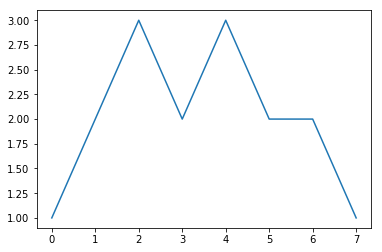


```python
plt.plot([4, 3, 2, 1], [1, 2, 3, 4])
plt.show()
```


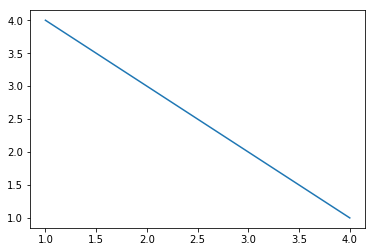


# 更多简单的图形


```python
# 更多简单的图形
x = [1, 2, 3, 4]
y = [5, 4, 3, 2]

plt.figure()

plt.subplot(2, 3, 1)
plt.plot(x, y)

plt.subplot(232)
plt.bar(x, y)

plt.subplot(233)
plt.barh(x, y)

plt.subplot(234)
plt.bar(x, y)
y1 = [7, 8, 5, 3]
plt.bar(x, y1, bottom=y, color='r')

plt.subplot(235)
plt.boxplot(x)

plt.subplot(236)
plt.scatter(x, y)

plt.show()
```


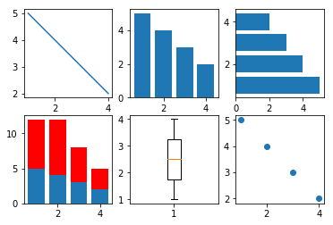


# figure与subplot


```python
# figure对象
fig = plt.figure()

ax1 = fig.add_subplot(2, 2, 1)
ax2 = fig.add_subplot(2, 2, 2)
ax3 = fig.add_subplot(2, 2, 3)
plt.show()

plt.plot(randn(50).cumsum(), 'k--')
fig.show()

_ = ax1.hist(randn(100), bins=20, color='k', alpha=0.3)
ax2.scatter(np.arange(30), np.arange(30) + 3 * randn(30))
```


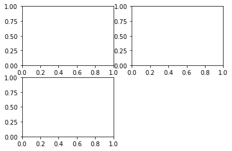


```python
plt.close('all')
```


```python
fig, axes = plt.subplots(2, 3)
```


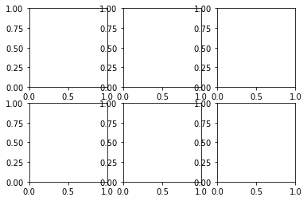


```python
# 调整subplot周围的间距
plt.subplots_adjust(left=None, bottom=None, right=None, top=None,
                    wspace=None, hspace=None)

fig, axes = plt.subplots(2, 2, sharex=True, sharey=True)
for i in range(2):
    for j in range(2):
        axes[i, j].hist(randn(500), bins=50, color='k', alpha=0.5)
plt.subplots_adjust(wspace=0, hspace=0)
```


    <matplotlib.figure.Figure at 0x29b62776470>


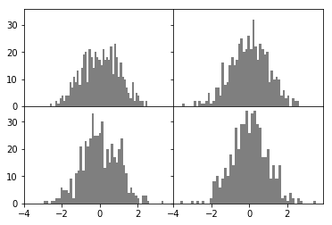


# matplotlib基本设置

## 颜色、标记和线型


```python
plt.figure()
plt.show()

plt.plot(x, y, linestyle='--', color='g')
plt.show()

plt.plot(randn(30).cumsum(), 'ko--')
plt.plot(randn(30).cumsum(), color='k', linestyle='dashed', marker='o')

```


    <matplotlib.figure.Figure at 0x29b62749240>


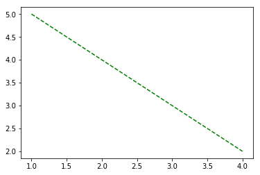


    [<matplotlib.lines.Line2D at 0x29b61c085f8>]


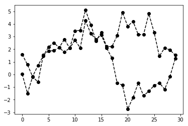


```python
plt.close('all')
```


```python
data = randn(30).cumsum()
plt.plot(data, 'k--', label='Default')
plt.plot(data, 'k-', drawstyle='steps-post', label='steps-post')
plt.legend(loc='best')
```


    <matplotlib.legend.Legend at 0x29b626eb860>


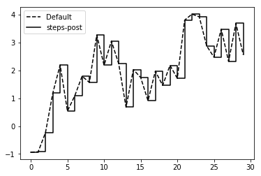


## 设置标题、轴标签、刻度以及刻度标签


```python
fig = plt.figure()
ax = fig.add_subplot(1, 1, 1)
ax.plot(randn(1000).cumsum())
ticks = ax.set_xticks([0, 250, 500, 750, 1000])
labels = ax.set_xticklabels(['one', 'two', 'three', 'four', 'five'],
                            rotation=30, fontsize='small')
ax.set_title('My first matplotlib plot')
ax.set_xlabel('Stages')
```


    <matplotlib.text.Text at 0x1f480fc72b0>


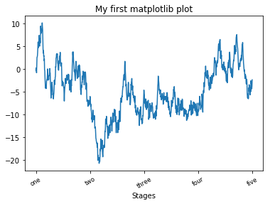


## 添加图例


```python
# 添加图例
fig = plt.figure()
ax = fig.add_subplot(1, 1, 1)
ax.plot(randn(1000).cumsum(), 'k', label='one')
ax.plot(randn(1000).cumsum(), 'k--', label='two')
ax.plot(randn(1000).cumsum(), 'k.', label='three')

ax.legend(loc='best')
```


    <matplotlib.legend.Legend at 0x1f481661da0>


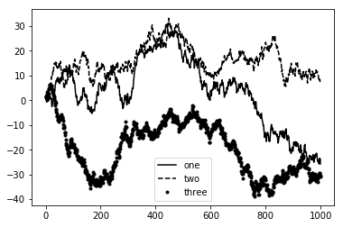


# 注释以及在subplot上绘图


```python
fig = plt.figure()
ax = fig.add_subplot(1, 1, 1)

data = pd.read_csv('data/spx.csv', index_col=0, parse_dates=True)
spx = data['SPX']

spx.plot(ax=ax, style='k-')

crisis_data = [
    (datetime(2007, 10, 11), 'Peak of bull market'),
    (datetime(2008, 3, 12), 'Bear Stearns Fails'),
    (datetime(2008, 9, 15), 'Lehman Bankruptcy')
]

for date, label in crisis_data:
    ax.annotate(label, xy=(date, spx.asof(date) + 50),
                xytext=(date, spx.asof(date) + 200),
                arrowprops=dict(facecolor='black'),
                horizontalalignment='left', verticalalignment='top')

ax.set_xlim(['1/1/2007', '1/1/2011'])
ax.set_ylim([600, 1800])

ax.set_title('Important dates in 2008-2009 financial crisis')
```


    <matplotlib.text.Text at 0x1f4828fac50>


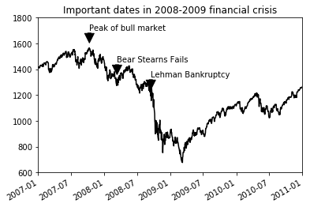


# 画图形


```python
fig = plt.figure()
ax = fig.add_subplot(1, 1, 1)

rect = plt.Rectangle((0.2, 0.75), 0.4, 0.15, color='k', alpha=0.3)
circ = plt.Circle((0.7, 0.2), 0.15, color='b', alpha=0.3)
pgon = plt.Polygon([[0.15, 0.15], [0.35, 0.4], [0.2, 0.6]],
                   color='g', alpha=0.5)

ax.add_patch(rect)
ax.add_patch(circ)
ax.add_patch(pgon)
```


    <matplotlib.patches.Polygon at 0x1f482943160>


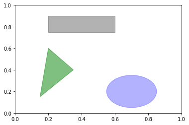


# 图表的保存


```python
# 图表的保存
fig.savefig('data/figpath.svg')

fig.savefig('data/figpath.png', dpi=400, bbox_inches='tight')

```

# pandas中的绘图函数

## 线图


```python
plt.close('all')

s = Series(np.random.randn(10).cumsum(), index=np.arange(0, 100, 10))
s.plot()
```


    <matplotlib.axes._subplots.AxesSubplot at 0x1f48170aa90>


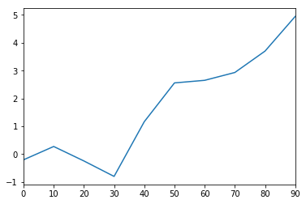


```python
df = DataFrame(np.random.randn(10, 4).cumsum(0),
               columns=['A', 'B', 'C', 'D'],
               index=np.arange(0, 100, 10))
df.plot()
```


    <matplotlib.axes._subplots.AxesSubplot at 0x1f4816a5780>


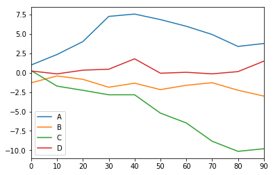


## 柱形图


```python
# 柱形图
fig, axes = plt.subplots(2, 1)
data = Series(np.random.rand(16), index=list('abcdefghijklmnop'))
data.plot(kind='bar', ax=axes[0], color='k', alpha=0.7)
data.plot(kind='barh', ax=axes[1], color='k', alpha=0.7)
```


    <matplotlib.axes._subplots.AxesSubplot at 0x1f482ac03c8>


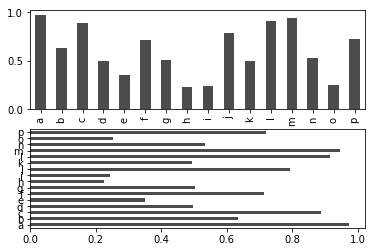


```python
df = DataFrame(np.random.rand(6, 4),
               index=['one', 'two', 'three', 'four', 'five', 'six'],
               columns=pd.Index(['A', 'B', 'C', 'D'], name='Genus'))
print(df)
df.plot(kind='bar')
```

    Genus         A         B         C         D
    one    0.367439  0.498648  0.226575  0.353566
    two    0.650852  0.312933  0.768735  0.781837
    three  0.852409  0.949906  0.107323  0.910725
    four   0.336055  0.826380  0.898101  0.042715
    five   0.195795  0.294501  0.627000  0.086223
    six    0.142945  0.515827  0.689341  0.856626
    


    <matplotlib.axes._subplots.AxesSubplot at 0x1f482b20c50>


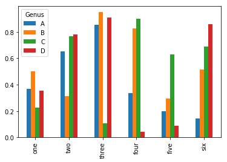


```python
df.plot(kind='barh', stacked=True, alpha=0.5)
```


    <matplotlib.axes._subplots.AxesSubplot at 0x1f482d687f0>


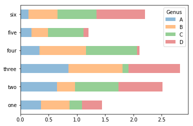


```python
tips = pd.read_csv('data/tips.csv')
party_counts = pd.crosstab(tips.day, tips['size'])
print(party_counts)
```

    size  1   2   3   4  5  6
    day                      
    Fri   1  16   1   1  0  0
    Sat   2  53  18  13  1  0
    Sun   0  39  15  18  3  1
    Thur  1  48   4   5  1  3
    


```python
party_counts = party_counts.loc[:, 2:5]

party_pcts = party_counts.div(party_counts.sum(1).astype(float), axis=0)
print(party_pcts)
```

    size         2         3         4         5
    day                                         
    Fri   0.888889  0.055556  0.055556  0.000000
    Sat   0.623529  0.211765  0.152941  0.011765
    Sun   0.520000  0.200000  0.240000  0.040000
    Thur  0.827586  0.068966  0.086207  0.017241
    


```python
party_pcts.plot(kind='bar', stacked=True)
```


    <matplotlib.axes._subplots.AxesSubplot at 0x1f482e2d400>


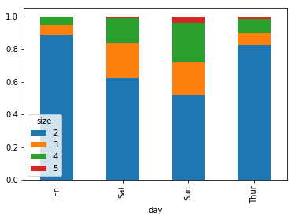


# 直方图和密度图


```python
plt.figure()

tips['tip_pct'] = tips['tip'] / tips['total_bill']
tips['tip_pct'].hist(bins=50)
```


    <matplotlib.axes._subplots.AxesSubplot at 0x1f482e75710>


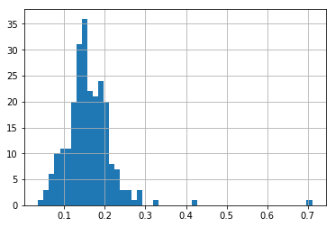


```python
plt.figure()

tips['tip_pct'].plot(kind='kde')
```


    <matplotlib.axes._subplots.AxesSubplot at 0x1f48304fb38>


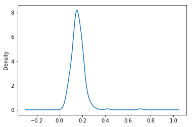


```python
plt.figure()

comp1 = np.random.normal(0, 1, size=200)  # N(0, 1)
comp2 = np.random.normal(10, 2, size=200)  # N(10, 4)
values = Series(np.concatenate([comp1, comp2]))
values.hist(bins=100, alpha=0.3, color='k', normed=True)
values.plot(kind='kde', style='k--')

```


    <matplotlib.axes._subplots.AxesSubplot at 0x1f48317edd8>


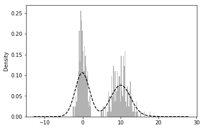


## 散点图


```python
# 散点图
macro = pd.read_csv('data/macrodata.csv')
data = macro[['cpi', 'm1', 'tbilrate', 'unemp']]
trans_data = np.log(data).diff().dropna()
trans_data[-5:]
```


<div>
<style>
    .dataframe thead tr:only-child th {
        text-align: right;
    }

    .dataframe thead th {
        text-align: left;
    }

    .dataframe tbody tr th {
        vertical-align: top;
    }
</style>
<table border="1" class="dataframe">
  <thead>
    <tr style="text-align: right;">
      <th></th>
      <th>cpi</th>
      <th>m1</th>
      <th>tbilrate</th>
      <th>unemp</th>
    </tr>
  </thead>
  <tbody>
    <tr>
      <th>198</th>
      <td>-0.007904</td>
      <td>0.045361</td>
      <td>-0.396881</td>
      <td>0.105361</td>
    </tr>
    <tr>
      <th>199</th>
      <td>-0.021979</td>
      <td>0.066753</td>
      <td>-2.277267</td>
      <td>0.139762</td>
    </tr>
    <tr>
      <th>200</th>
      <td>0.002340</td>
      <td>0.010286</td>
      <td>0.606136</td>
      <td>0.160343</td>
    </tr>
    <tr>
      <th>201</th>
      <td>0.008419</td>
      <td>0.037461</td>
      <td>-0.200671</td>
      <td>0.127339</td>
    </tr>
    <tr>
      <th>202</th>
      <td>0.008894</td>
      <td>0.012202</td>
      <td>-0.405465</td>
      <td>0.042560</td>
    </tr>
  </tbody>
</table>
</div>


```python
plt.figure()

plt.scatter(trans_data['m1'], trans_data['unemp'])
plt.title('Changes in log %s vs. log %s' % ('m1', 'unemp'))
```


    <matplotlib.text.Text at 0x1f4848edeb8>


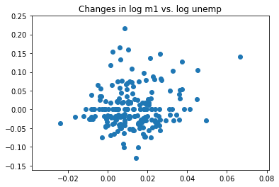


```python
pd.plotting.scatter_matrix(trans_data, diagonal='kde', color='k', alpha=0.3)
plt.show()
```

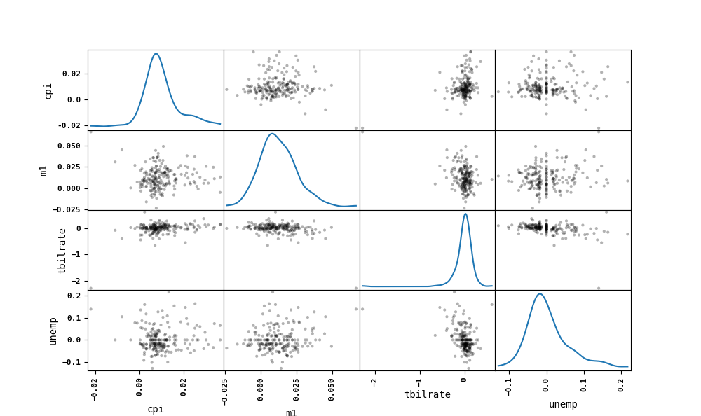

# Matplotlib作图

## 误差条形图


```python
# 误差条形图
x = np.arange(0, 10, 1)

y = np.log(x)

xe = 0.1 * np.abs(np.random.randn(len(y)))

plt.bar(x, y, yerr=xe, width=0.4, align='center', ecolor='r', color='cyan',
        label='experiment #1')

plt.xlabel('# measurement')
plt.ylabel('Measured values')
plt.title('Measurements')
plt.legend(loc='upper left')

plt.show()
```

    C:\ProgramData\Anaconda3\lib\site-packages\ipykernel_launcher.py:4: RuntimeWarning: divide by zero encountered in log
      after removing the cwd from sys.path.
    


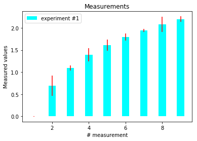


## 饼图


```python
# 饼图
plt.figure(1, figsize=(8, 8))
ax = plt.axes([0.1, 0.1, 0.8, 0.8])

labels = 'Spring', 'Summer', 'Autumn', 'Winter'
values = [15, 16, 16, 28]
explode = [0.1, 0.1, 0.1, 0.1]

plt.pie(values, explode=explode, labels=labels,
        autopct='%1.1f%%', startangle=67)

plt.title('Rainy days by season')

plt.show()
```


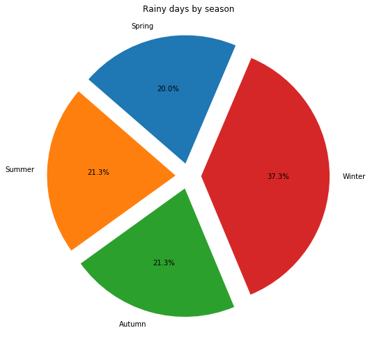


## 等高线图


```python
# 等高线图
import matplotlib as mpl


def process_signals(x, y):
    return (1 - (x ** 2 + y ** 2)) * np.exp(-y ** 3 / 3)


x = np.arange(-1.5, 1.5, 0.1)
y = np.arange(-1.5, 1.5, 0.1)

X, Y = np.meshgrid(x, y)

Z = process_signals(X, Y)

N = np.arange(-1, 1.5, 0.3)

CS = plt.contour(Z, N, linewidths=2, cmap=mpl.cm.jet)
plt.clabel(CS, inline=True, fmt='%1.1f', fontsize=10)
plt.colorbar(CS)

plt.title('My function: $z=(1-x^2+y^2) e^{-(y^3)/3}$')
plt.show()
```


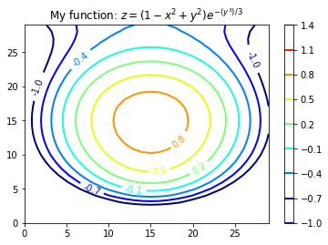


# 3D图像

## 3d柱形图


```python
# 3d柱形图
from mpl_toolkits.mplot3d import Axes3D
mpl.rcParams['font.size'] = 10

fig = plt.figure()
ax = fig.add_subplot(111, projection='3d')

for z in [2011, 2012, 2013, 2014]:
    xs = range(1, 13)
    ys = 1000 * np.random.rand(12)

    color = plt.cm.Set2(np.random.choice(range(plt.cm.Set2.N)))
    ax.bar(xs, ys, zs=z, zdir='y', color=color, alpha=0.8)

ax.xaxis.set_major_locator(mpl.ticker.FixedLocator(xs))
ax.yaxis.set_major_locator(mpl.ticker.FixedLocator(ys))

ax.set_xlabel('Month')
ax.set_ylabel('Year')
ax.set_zlabel('Sales Net [usd]')

plt.show()
```


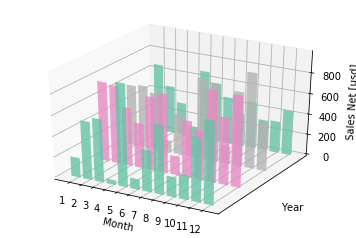


# 3d直方图


```python
# 3d直方图
mpl.rcParams['font.size'] = 10

samples = 25

x = np.random.normal(5, 1, samples)
y = np.random.normal(3, .5, samples)

fig = plt.figure()
ax = fig.add_subplot(211, projection='3d')

hist, xedges, yedges = np.histogram2d(x, y, bins=10)

elements = (len(xedges) - 1) * (len(yedges) - 1)
xpos, ypos = np.meshgrid(xedges[:-1] + .25, yedges[:-1] + .25)

xpos = xpos.flatten()
ypos = ypos.flatten()
zpos = np.zeros(elements)

dx = .1 * np.ones_like(zpos)
dy = dx.copy()

dz = hist.flatten()

ax.bar3d(xpos, ypos, zpos, dx, dy, dz, color='b', alpha=0.4)
ax.set_xlabel('X Axis')
ax.set_ylabel('Y Axis')
ax.set_zlabel('Z Axis')

ax2 = fig.add_subplot(212)
ax2.scatter(x, y)
ax2.set_xlabel('X Axis')
ax2.set_ylabel('Y Axis')

plt.show()
```


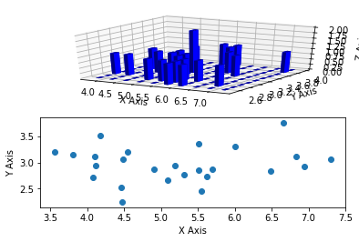


参考资料：炼数成金Python数据分析课程
