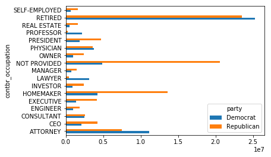
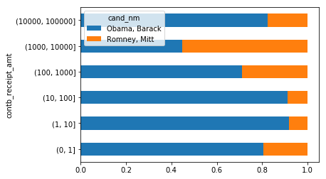

# 数据聚合、分组运算与转换、透视表与交叉表


```python
import matplotlib.pyplot as plt
import numpy as np
import pandas as pd
from pandas import Series, DataFrame

np.random.seed(12345)
plt.rc('figure', figsize=(10, 6))

np.set_printoptions(precision=4)

pd.options.display.notebook_repr_html = False
get_ipython().magic(u'matplotlib inline')
```

# GroupBy


```python
df = DataFrame({'key1': ['a', 'a', 'b', 'b', 'a'],
                'key2': ['one', 'two', 'one', 'two', 'one'],
                'data1': np.random.randn(5),
                'data2': np.random.randn(5)})
print(df)
```

          data1     data2 key1 key2
    0 -0.204708  1.393406    a  one
    1  0.478943  0.092908    a  two
    2 -0.519439  0.281746    b  one
    3 -0.555730  0.769023    b  two
    4  1.965781  1.246435    a  one
    


```python
grouped = df['data1'].groupby(df['key1'])
print(list(grouped))
```

    [('a', 0   -0.204708
    1    0.478943
    4    1.965781
    Name: data1, dtype: float64), ('b', 2   -0.519439
    3   -0.555730
    Name: data1, dtype: float64)]
    


```python
grouped.mean()
```


    key1
    a    0.746672
    b   -0.537585
    Name: data1, dtype: float64


```python
means = df['data1'].groupby([df['key1'], df['key2']]).mean()
print(means)
```

    key1  key2
    a     one     0.880536
          two     0.478943
    b     one    -0.519439
          two    -0.555730
    Name: data1, dtype: float64
    


```python
means.unstack()
```


    key2       one       two
    key1                    
    a     0.880536  0.478943
    b    -0.519439 -0.555730


```python
states = np.array(['Ohio', 'California', 'California', 'Ohio', 'Ohio'])
years = np.array([2005, 2005, 2006, 2005, 2006])
df['data1'].groupby([states, years]).mean()
```


    California  2005    0.478943
                2006   -0.519439
    Ohio        2005   -0.380219
                2006    1.965781
    Name: data1, dtype: float64


```python
df.groupby('key1').mean()
```


             data1     data2
    key1                    
    a     0.746672  0.910916
    b    -0.537585  0.525384


```python
df.groupby(['key1', 'key2']).mean()
```


                  data1     data2
    key1 key2                    
    a    one   0.880536  1.319920
         two   0.478943  0.092908
    b    one  -0.519439  0.281746
         two  -0.555730  0.769023


```python
df.groupby(['key1', 'key2']).size()
```


    key1  key2
    a     one     2
          two     1
    b     one     1
          two     1
    dtype: int64


# 对分组进行迭代


```python
for name, group in df.groupby('key1'):
    print(name)
    print(group)
```

    a
          data1     data2 key1 key2
    0 -0.204708  1.393406    a  one
    1  0.478943  0.092908    a  two
    4  1.965781  1.246435    a  one
    b
          data1     data2 key1 key2
    2 -0.519439  0.281746    b  one
    3 -0.555730  0.769023    b  two
    


```python
list(df.groupby('key1'))
```


    [('a',       data1     data2 key1 key2
      0 -0.204708  1.393406    a  one
      1  0.478943  0.092908    a  two
      4  1.965781  1.246435    a  one), ('b',       data1     data2 key1 key2
      2 -0.519439  0.281746    b  one
      3 -0.555730  0.769023    b  two)]


```python
for (k1, k2), group in df.groupby(['key1', 'key2']):
    print((k1, k2))
    print(group)
```

    ('a', 'one')
          data1     data2 key1 key2
    0 -0.204708  1.393406    a  one
    4  1.965781  1.246435    a  one
    ('a', 'two')
          data1     data2 key1 key2
    1  0.478943  0.092908    a  two
    ('b', 'one')
          data1     data2 key1 key2
    2 -0.519439  0.281746    b  one
    ('b', 'two')
         data1     data2 key1 key2
    3 -0.55573  0.769023    b  two
    


```python
pieces = dict(list(df.groupby('key1')))
pieces['b']
```


          data1     data2 key1 key2
    2 -0.519439  0.281746    b  one
    3 -0.555730  0.769023    b  two


```python
df.dtypes
```


    data1    float64
    data2    float64
    key1      object
    key2      object
    dtype: object


```python
grouped = df.groupby(df.dtypes, axis=1)
dict(list(grouped))
```


    {dtype('float64'):       data1     data2
     0 -0.204708  1.393406
     1  0.478943  0.092908
     2 -0.519439  0.281746
     3 -0.555730  0.769023
     4  1.965781  1.246435, dtype('O'):   key1 key2
     0    a  one
     1    a  two
     2    b  one
     3    b  two
     4    a  one}


# 选择一个或一组列


```python
list(df.groupby('key1')['data1'])
```


    [('a', 0   -0.204708
      1    0.478943
      4    1.965781
      Name: data1, dtype: float64), ('b', 2   -0.519439
      3   -0.555730
      Name: data1, dtype: float64)]


```python
list(df.groupby('key1')[['data2']])
```


    [('a',       data1     data2 key1 key2
      0 -0.204708  1.393406    a  one
      1  0.478943  0.092908    a  two
      4  1.965781  1.246435    a  one), ('b',       data1     data2 key1 key2
      2 -0.519439  0.281746    b  one
      3 -0.555730  0.769023    b  two)]


```python
list(df['data1'].groupby(df['key1']))
```


    [('a', 0   -0.204708
      1    0.478943
      4    1.965781
      Name: data1, dtype: float64), ('b', 2   -0.519439
      3   -0.555730
      Name: data1, dtype: float64)]


```python
list(df[['data2']].groupby(df['key1']))
```


    [('a',       data2
      0  1.393406
      1  0.092908
      4  1.246435), ('b',       data2
      2  0.281746
      3  0.769023)]


```python
df.groupby(['key1', 'key2'])[['data2']].mean()
```


                  data2
    key1 key2          
    a    one   1.319920
         two   0.092908
    b    one   0.281746
         two   0.769023


```python
s_grouped = df.groupby(['key1', 'key2'])['data2']
list(s_grouped)
```


    [(('a', 'one'), 0    1.393406
      4    1.246435
      Name: data2, dtype: float64), (('a', 'two'), 1    0.092908
      Name: data2, dtype: float64), (('b', 'one'), 2    0.281746
      Name: data2, dtype: float64), (('b', 'two'), 3    0.769023
      Name: data2, dtype: float64)]


```python
s_grouped.mean()
```


    key1  key2
    a     one     1.319920
          two     0.092908
    b     one     0.281746
          two     0.769023
    Name: data2, dtype: float64


# 通过字典或Series进行分组


```python
people = DataFrame(np.random.randn(5, 5),
                   columns=['a', 'b', 'c', 'd', 'e'],
                   index=['Joe', 'Steve', 'Wes', 'Jim', 'Travis'])
people.loc[2:3, ['b', 'c']] = np.nan  # Add a few NA values
people
```


```python
mapping = {'a': 'red', 'b': 'red', 'c': 'blue',
           'd': 'blue', 'e': 'red', 'f': 'orange'}

by_column = people.groupby(mapping, axis=1)
by_column.sum()
```


                blue       red
    Joe     0.503905  1.063885
    Steve   1.297183 -1.553778
    Wes    -1.021228 -1.116829
    Jim     0.524712  1.770545
    Travis -4.230992 -2.405455


```python
map_series = Series(mapping)
map_series
```


    a       red
    b       red
    c      blue
    d      blue
    e       red
    f    orange
    dtype: object


```python
people.groupby(map_series, axis=1).count()
```


            blue  red
    Joe        2    3
    Steve      2    3
    Wes        1    2
    Jim        2    3
    Travis     2    3


# 通过函数进行分组


```python
people.groupby(len).sum()
```


              a         b         c         d         e
    3  0.591569 -0.993608  0.798764 -0.791374  2.119639
    5  0.886429 -2.001637 -0.371843  1.669025 -0.438570
    6 -0.713544 -0.831154 -2.370232 -1.860761 -0.860757


```python
key_list = ['one', 'one', 'one', 'two', 'two']
people.groupby([len, key_list]).min()
```


                  a         b         c         d         e
    3 one -0.539741 -1.296221  0.274992 -1.021228 -0.577087
      two  0.124121  0.302614  0.523772  0.000940  1.343810
    5 one  0.886429 -2.001637 -0.371843  1.669025 -0.438570
    6 two -0.713544 -0.831154 -2.370232 -1.860761 -0.860757


# 通过索引进行分组


```python
columns = pd.MultiIndex.from_arrays([['US', 'US', 'US', 'JP', 'JP'],
                                     [1, 3, 5, 1, 3]], names=['cty', 'tenor'])
hier_df = DataFrame(np.random.randn(4, 5), columns=columns)
hier_df
```


    cty          US                            JP          
    tenor         1         3         5         1         3
    0      0.560145 -1.265934  0.119827 -1.063512  0.332883
    1     -2.359419 -0.199543 -1.541996 -0.970736 -1.307030
    2      0.286350  0.377984 -0.753887  0.331286  1.349742
    3      0.069877  0.246674 -0.011862  1.004812  1.327195


```python
hier_df.groupby(level='cty', axis=1).count()
```


    cty  JP  US
    0     2   3
    1     2   3
    2     2   3
    3     2   3


# 数据聚合


```python
print(df)
```

          data1     data2 key1 key2
    0 -0.204708  1.393406    a  one
    1  0.478943  0.092908    a  two
    2 -0.519439  0.281746    b  one
    3 -0.555730  0.769023    b  two
    4  1.965781  1.246435    a  one
    


```python
grouped = df.groupby('key1')
grouped['data1'].quantile(0.9)
```


    key1
    a    1.668413
    b   -0.523068
    Name: data1, dtype: float64


```python
def peak_to_peak(arr):
    return arr.max() - arr.min()


grouped.agg(peak_to_peak)
```


             data1     data2
    key1                    
    a     2.170488  1.300498
    b     0.036292  0.487276


```python
grouped.describe()
```


         data1                                                              \
         count      mean       std       min       25%       50%       75%   
    key1                                                                     
    a      3.0  0.746672  1.109736 -0.204708  0.137118  0.478943  1.222362   
    b      2.0 -0.537585  0.025662 -0.555730 -0.546657 -0.537585 -0.528512   
    
                   data2                                                    \
               max count      mean       std       min       25%       50%   
    key1                                                                     
    a     1.965781   3.0  0.910916  0.712217  0.092908  0.669671  1.246435   
    b    -0.519439   2.0  0.525384  0.344556  0.281746  0.403565  0.525384   
    
                              
               75%       max  
    key1                      
    a     1.319920  1.393406  
    b     0.647203  0.769023  


# 面向列的多函数应用


```python
tips = pd.read_csv('data/tips.csv')

tips['tip_pct'] = tips['tip'] / tips['total_bill']
tips[:6]
```


       total_bill   tip     sex smoker  day    time  size   tip_pct
    0       16.99  1.01  Female     No  Sun  Dinner     2  0.059447
    1       10.34  1.66    Male     No  Sun  Dinner     3  0.160542
    2       21.01  3.50    Male     No  Sun  Dinner     3  0.166587
    3       23.68  3.31    Male     No  Sun  Dinner     2  0.139780
    4       24.59  3.61  Female     No  Sun  Dinner     4  0.146808
    5       25.29  4.71    Male     No  Sun  Dinner     4  0.186240


```python
grouped = tips.groupby(['sex', 'smoker'])

grouped_pct = grouped['tip_pct']
grouped_pct.agg('mean')
```


    sex     smoker
    Female  No        0.156921
            Yes       0.182150
    Male    No        0.160669
            Yes       0.152771
    Name: tip_pct, dtype: float64


```python
grouped_pct.agg(['mean', 'std', peak_to_peak])
```


                       mean       std  peak_to_peak
    sex    smoker                                  
    Female No      0.156921  0.036421      0.195876
           Yes     0.182150  0.071595      0.360233
    Male   No      0.160669  0.041849      0.220186
           Yes     0.152771  0.090588      0.674707


```python
grouped_pct.agg([('foo', 'mean'), ('bar', np.std)])
```


                        foo       bar
    sex    smoker                    
    Female No      0.156921  0.036421
           Yes     0.182150  0.071595
    Male   No      0.160669  0.041849
           Yes     0.152771  0.090588


```python
functions = ['count', 'mean', 'max']
result = grouped['tip_pct', 'total_bill'].agg(functions)
result
```


                  tip_pct                     total_bill                  
                    count      mean       max      count       mean    max
    sex    smoker                                                         
    Female No          54  0.156921  0.252672         54  18.105185  35.83
           Yes         33  0.182150  0.416667         33  17.977879  44.30
    Male   No          97  0.160669  0.291990         97  19.791237  48.33
           Yes         60  0.152771  0.710345         60  22.284500  50.81


```python
ftuples = [('Durchschnitt', 'mean'), ('Abweichung', np.var)]
grouped['tip_pct', 'total_bill'].agg(ftuples)
```


                       tip_pct              total_bill           
                  Durchschnitt Abweichung Durchschnitt Abweichung
    sex    smoker                                                
    Female No         0.156921   0.001327    18.105185  53.092422
           Yes        0.182150   0.005126    17.977879  84.451517
    Male   No         0.160669   0.001751    19.791237  76.152961
           Yes        0.152771   0.008206    22.284500  98.244673


```python
grouped.agg({'tip': np.max, 'size': 'sum'})
```


                    tip  size
    sex    smoker            
    Female No       5.2   140
           Yes      6.5    74
    Male   No       9.0   263
           Yes     10.0   150


```python
grouped.agg({'tip_pct': ['min', 'max', 'mean', 'std'],
             'size': 'sum'})
```


                    tip_pct                               size
                        min       max      mean       std  sum
    sex    smoker                                             
    Female No      0.056797  0.252672  0.156921  0.036421  140
           Yes     0.056433  0.416667  0.182150  0.071595   74
    Male   No      0.071804  0.291990  0.160669  0.041849  263
           Yes     0.035638  0.710345  0.152771  0.090588  150


# 分组及运算和转换


```python
print(df)
```

          data1     data2 key1 key2
    0 -0.204708  1.393406    a  one
    1  0.478943  0.092908    a  two
    2 -0.519439  0.281746    b  one
    3 -0.555730  0.769023    b  two
    4  1.965781  1.246435    a  one
    


```python
k1_means = df.groupby('key1').mean().add_prefix('mean_')
k1_means
```


          mean_data1  mean_data2
    key1                        
    a       0.746672    0.910916
    b      -0.537585    0.525384


```python
pd.merge(df, k1_means, left_on='key1', right_index=True)
```


          data1     data2 key1 key2  mean_data1  mean_data2
    0 -0.204708  1.393406    a  one    0.746672    0.910916
    1  0.478943  0.092908    a  two    0.746672    0.910916
    4  1.965781  1.246435    a  one    0.746672    0.910916
    2 -0.519439  0.281746    b  one   -0.537585    0.525384
    3 -0.555730  0.769023    b  two   -0.537585    0.525384


```python
print(people)
```

                   a         b         c         d         e
    Joe     1.007189 -1.296221  0.274992  0.228913  1.352917
    Steve   0.886429 -2.001637 -0.371843  1.669025 -0.438570
    Wes    -0.539741       NaN       NaN -1.021228 -0.577087
    Jim     0.124121  0.302614  0.523772  0.000940  1.343810
    Travis -0.713544 -0.831154 -2.370232 -1.860761 -0.860757
    


```python
key = ['one', 'two', 'one', 'two', 'one']
people.groupby(key).mean()
```


                a         b         c         d         e
    one -0.082032 -1.063687 -1.047620 -0.884358 -0.028309
    two  0.505275 -0.849512  0.075965  0.834983  0.452620


```python
people.groupby(key).transform(np.mean)
```


                   a         b         c         d         e
    Joe    -0.082032 -1.063687 -1.047620 -0.884358 -0.028309
    Steve   0.505275 -0.849512  0.075965  0.834983  0.452620
    Wes    -0.082032 -1.063687 -1.047620 -0.884358 -0.028309
    Jim     0.505275 -0.849512  0.075965  0.834983  0.452620
    Travis -0.082032 -1.063687 -1.047620 -0.884358 -0.028309


```python
def demean(arr):
    return arr - arr.mean()


demeaned = people.groupby(key).transform(demean)
demeaned
```


                   a         b         c         d         e
    Joe     1.089221 -0.232534  1.322612  1.113271  1.381226
    Steve   0.381154 -1.152125 -0.447807  0.834043 -0.891190
    Wes    -0.457709       NaN       NaN -0.136869 -0.548778
    Jim    -0.381154  1.152125  0.447807 -0.834043  0.891190
    Travis -0.631512  0.232534 -1.322612 -0.976402 -0.832448


```python
demeaned.groupby(key).mean()
```


                    a             b    c             d    e
    one  0.000000e+00 -1.110223e-16  0.0  7.401487e-17  0.0
    two -2.775558e-17  0.000000e+00  0.0  0.000000e+00  0.0


# apply方法


```python
def top(df, n=5, column='tip_pct'):
    return df.sort_values(by=column)[-n:]


top(tips, n=6)
```


         total_bill   tip     sex smoker  day    time  size   tip_pct
    109       14.31  4.00  Female    Yes  Sat  Dinner     2  0.279525
    183       23.17  6.50    Male    Yes  Sun  Dinner     4  0.280535
    232       11.61  3.39    Male     No  Sat  Dinner     2  0.291990
    67         3.07  1.00  Female    Yes  Sat  Dinner     1  0.325733
    178        9.60  4.00  Female    Yes  Sun  Dinner     2  0.416667
    172        7.25  5.15    Male    Yes  Sun  Dinner     2  0.710345


```python
tips.groupby('smoker').apply(top)
```


                total_bill   tip     sex smoker   day    time  size   tip_pct
    smoker                                                                   
    No     88        24.71  5.85    Male     No  Thur   Lunch     2  0.236746
           185       20.69  5.00    Male     No   Sun  Dinner     5  0.241663
           51        10.29  2.60  Female     No   Sun  Dinner     2  0.252672
           149        7.51  2.00    Male     No  Thur   Lunch     2  0.266312
           232       11.61  3.39    Male     No   Sat  Dinner     2  0.291990
    Yes    109       14.31  4.00  Female    Yes   Sat  Dinner     2  0.279525
           183       23.17  6.50    Male    Yes   Sun  Dinner     4  0.280535
           67         3.07  1.00  Female    Yes   Sat  Dinner     1  0.325733
           178        9.60  4.00  Female    Yes   Sun  Dinner     2  0.416667
           172        7.25  5.15    Male    Yes   Sun  Dinner     2  0.710345


```python
tips.groupby(['smoker', 'day']).apply(top, n=1, column='total_bill')
```


                     total_bill    tip     sex smoker   day    time  size  \
    smoker day                                                              
    No     Fri  94        22.75   3.25  Female     No   Fri  Dinner     2   
           Sat  212       48.33   9.00    Male     No   Sat  Dinner     4   
           Sun  156       48.17   5.00    Male     No   Sun  Dinner     6   
           Thur 142       41.19   5.00    Male     No  Thur   Lunch     5   
    Yes    Fri  95        40.17   4.73    Male    Yes   Fri  Dinner     4   
           Sat  170       50.81  10.00    Male    Yes   Sat  Dinner     3   
           Sun  182       45.35   3.50    Male    Yes   Sun  Dinner     3   
           Thur 197       43.11   5.00  Female    Yes  Thur   Lunch     4   
    
                      tip_pct  
    smoker day                 
    No     Fri  94   0.142857  
           Sat  212  0.186220  
           Sun  156  0.103799  
           Thur 142  0.121389  
    Yes    Fri  95   0.117750  
           Sat  170  0.196812  
           Sun  182  0.077178  
           Thur 197  0.115982  


```python
result = tips.groupby('smoker')['tip_pct'].describe()
result
```


            count      mean       std       min       25%       50%       75%  \
    smoker                                                                      
    No      151.0  0.159328  0.039910  0.056797  0.136906  0.155625  0.185014   
    Yes      93.0  0.163196  0.085119  0.035638  0.106771  0.153846  0.195059   
    
                 max  
    smoker            
    No      0.291990  
    Yes     0.710345  


```python
result.unstack('smoker')
```


           smoker
    count  No        151.000000
           Yes        93.000000
    mean   No          0.159328
           Yes         0.163196
    std    No          0.039910
           Yes         0.085119
    min    No          0.056797
           Yes         0.035638
    25%    No          0.136906
           Yes         0.106771
    50%    No          0.155625
           Yes         0.153846
    75%    No          0.185014
           Yes         0.195059
    max    No          0.291990
           Yes         0.710345
    dtype: float64


# 禁止分组键


```python
tips.groupby('smoker', group_keys=False).apply(top)
```


         total_bill   tip     sex smoker   day    time  size   tip_pct
    88        24.71  5.85    Male     No  Thur   Lunch     2  0.236746
    185       20.69  5.00    Male     No   Sun  Dinner     5  0.241663
    51        10.29  2.60  Female     No   Sun  Dinner     2  0.252672
    149        7.51  2.00    Male     No  Thur   Lunch     2  0.266312
    232       11.61  3.39    Male     No   Sat  Dinner     2  0.291990
    109       14.31  4.00  Female    Yes   Sat  Dinner     2  0.279525
    183       23.17  6.50    Male    Yes   Sun  Dinner     4  0.280535
    67         3.07  1.00  Female    Yes   Sat  Dinner     1  0.325733
    178        9.60  4.00  Female    Yes   Sun  Dinner     2  0.416667
    172        7.25  5.15    Male    Yes   Sun  Dinner     2  0.710345


# 分位数和桶分析


```python
frame = DataFrame({'data1': np.random.randn(1000),
                   'data2': np.random.randn(1000)})
factor = pd.cut(frame.data1, 4)
factor[:10]
```


    0     (-1.23, 0.489]
    1    (-2.956, -1.23]
    2     (-1.23, 0.489]
    3     (0.489, 2.208]
    4     (-1.23, 0.489]
    5     (0.489, 2.208]
    6     (-1.23, 0.489]
    7     (-1.23, 0.489]
    8     (0.489, 2.208]
    9     (0.489, 2.208]
    Name: data1, dtype: category
    Categories (4, interval[float64]): [(-2.956, -1.23] < (-1.23, 0.489] < (0.489, 2.208] < (2.208, 3.928]]


```python
def get_stats(group):
    return {'min': group.min(), 'max': group.max(),
            'count': group.count(), 'mean': group.mean()}


grouped = frame.data2.groupby(factor)
grouped.apply(get_stats).unstack()
```


                     count       max      mean       min
    data1                                               
    (-2.956, -1.23]   95.0  1.670835 -0.039521 -3.399312
    (-1.23, 0.489]   598.0  3.260383 -0.002051 -2.989741
    (0.489, 2.208]   297.0  2.954439  0.081822 -3.745356
    (2.208, 3.928]    10.0  1.765640  0.024750 -1.929776


```python
grouping = pd.qcut(frame.data1, 10, labels=False)

grouped = frame.data2.groupby(grouping)
grouped.apply(get_stats).unstack()
```


           count       max      mean       min
    data1                                     
    0      100.0  1.670835 -0.049902 -3.399312
    1      100.0  2.628441  0.030989 -1.950098
    2      100.0  2.527939 -0.067179 -2.925113
    3      100.0  3.260383  0.065713 -2.315555
    4      100.0  2.074345 -0.111653 -2.047939
    5      100.0  2.184810  0.052130 -2.989741
    6      100.0  2.458842 -0.021489 -2.223506
    7      100.0  2.954439 -0.026459 -3.056990
    8      100.0  2.735527  0.103406 -3.745356
    9      100.0  2.377020  0.220122 -2.064111


# 用特定于分组的值填充缺失值


```python
s = Series(np.random.randn(6))
s[::2] = np.nan
print(s)
```

    0         NaN
    1   -0.125921
    2         NaN
    3   -0.884475
    4         NaN
    5    0.227290
    dtype: float64
    


```python
s.fillna(s.mean())
```


    0   -0.261035
    1   -0.125921
    2   -0.261035
    3   -0.884475
    4   -0.261035
    5    0.227290
    dtype: float64


```python
states = ['Ohio', 'New York', 'Vermont', 'Florida',
          'Oregon', 'Nevada', 'California', 'Idaho']
group_key = ['East'] * 4 + ['West'] * 4
data = Series(np.random.randn(8), index=states)
data[['Vermont', 'Nevada', 'Idaho']] = np.nan
print(data)
```

    Ohio          0.922264
    New York     -2.153545
    Vermont            NaN
    Florida      -0.375842
    Oregon        0.329939
    Nevada             NaN
    California    1.105913
    Idaho              NaN
    dtype: float64
    


```python
data.groupby(group_key).mean()
```


    East   -0.535707
    West    0.717926
    dtype: float64


```python
fill_mean = lambda g: g.fillna(g.mean())
data.groupby(group_key).apply(fill_mean)
```


    Ohio          0.922264
    New York     -2.153545
    Vermont      -0.535707
    Florida      -0.375842
    Oregon        0.329939
    Nevada        0.717926
    California    1.105913
    Idaho         0.717926
    dtype: float64


```python
fill_values = {'East': 0.5, 'West': -1}
fill_func = lambda g: g.fillna(fill_values[g.name])

data.groupby(group_key).apply(fill_func)
```


    Ohio          0.922264
    New York     -2.153545
    Vermont       0.500000
    Florida      -0.375842
    Oregon        0.329939
    Nevada       -1.000000
    California    1.105913
    Idaho        -1.000000
    dtype: float64


# 随机采样和排列


```python
suits = ['H', 'S', 'C', 'D']
card_val = (list(range(1, 11)) + [10] * 3) * 4
base_names = ['A'] + list(range(2, 11)) + ['J', 'K', 'Q']
cards = []
for suit in ['H', 'S', 'C', 'D']:
    cards.extend(str(num) + suit for num in base_names)

deck = Series(card_val, index=cards)

deck[:13]
```


    AH      1
    2H      2
    3H      3
    4H      4
    5H      5
    6H      6
    7H      7
    8H      8
    9H      9
    10H    10
    JH     10
    KH     10
    QH     10
    dtype: int64


```python
def draw(deck, n=5):
    return deck.take(np.random.permutation(len(deck))[:n])


draw(deck)
```


    AD     1
    8C     8
    5H     5
    KC    10
    2C     2
    dtype: int64


```python
get_suit = lambda card: card[-1]  # 只要最后一个字母
deck.groupby(get_suit).apply(draw, n=2)
```


    C  2C     2
       3C     3
    D  KD    10
       8D     8
    H  KH    10
       3H     3
    S  2S     2
       4S     4
    dtype: int64


# 不显示分组关键字


```python
deck.groupby(get_suit, group_keys=False).apply(draw, n=2)
```


    KC    10
    JC    10
    AD     1
    5D     5
    5H     5
    6H     6
    7S     7
    KS    10
    dtype: int64


# 分组加权平均数和相关系数


```python
df = DataFrame({'category': ['a', 'a', 'a', 'a', 'b', 'b', 'b', 'b'],
                'data': np.random.randn(8),
                'weights': np.random.rand(8)})
print(df)
```

      category      data   weights
    0        a  1.561587  0.957515
    1        a  1.219984  0.347267
    2        a -0.482239  0.581362
    3        a  0.315667  0.217091
    4        b -0.047852  0.894406
    5        b -0.454145  0.918564
    6        b -0.556774  0.277825
    7        b  0.253321  0.955905
    


```python
grouped = df.groupby('category')
get_wavg = lambda g: np.average(g['data'], weights=g['weights'])
grouped.apply(get_wavg)
```


    category
    a    0.811643
    b   -0.122262
    dtype: float64


```python
close_px = pd.read_csv('data/stock_px.csv', parse_dates=True, index_col=0)
close_px.info()
```

    <class 'pandas.core.frame.DataFrame'>
    DatetimeIndex: 2214 entries, 2003-01-02 to 2011-10-14
    Data columns (total 4 columns):
    AAPL    2214 non-null float64
    MSFT    2214 non-null float64
    XOM     2214 non-null float64
    SPX     2214 non-null float64
    dtypes: float64(4)
    memory usage: 86.5 KB
    


```python
close_px[-4:]
```


                  AAPL   MSFT    XOM      SPX
    2011-10-11  400.29  27.00  76.27  1195.54
    2011-10-12  402.19  26.96  77.16  1207.25
    2011-10-13  408.43  27.18  76.37  1203.66
    2011-10-14  422.00  27.27  78.11  1224.58


```python
rets = close_px.pct_change().dropna()
spx_corr = lambda x: x.corrwith(x['SPX'])
by_year = rets.groupby(lambda x: x.year)
by_year.apply(spx_corr)
```


              AAPL      MSFT       XOM  SPX
    2003  0.541124  0.745174  0.661265  1.0
    2004  0.374283  0.588531  0.557742  1.0
    2005  0.467540  0.562374  0.631010  1.0
    2006  0.428267  0.406126  0.518514  1.0
    2007  0.508118  0.658770  0.786264  1.0
    2008  0.681434  0.804626  0.828303  1.0
    2009  0.707103  0.654902  0.797921  1.0
    2010  0.710105  0.730118  0.839057  1.0
    2011  0.691931  0.800996  0.859975  1.0


```python
# 苹果公司和微软的年度相关系数
by_year.apply(lambda g: g['AAPL'].corr(g['MSFT']))
```


    2003    0.480868
    2004    0.259024
    2005    0.300093
    2006    0.161735
    2007    0.417738
    2008    0.611901
    2009    0.432738
    2010    0.571946
    2011    0.581987
    dtype: float64


# 透视表


```python
tips.pivot_table(index=['sex', 'smoker'])
```


                       size       tip   tip_pct  total_bill
    sex    smoker                                          
    Female No      2.592593  2.773519  0.156921   18.105185
           Yes     2.242424  2.931515  0.182150   17.977879
    Male   No      2.711340  3.113402  0.160669   19.791237
           Yes     2.500000  3.051167  0.152771   22.284500


```python
tips.pivot_table(['tip_pct', 'size'], index=['sex', 'day'],
                 columns='smoker')
```


                     size             tip_pct          
    smoker             No       Yes        No       Yes
    sex    day                                         
    Female Fri   2.500000  2.000000  0.165296  0.209129
           Sat   2.307692  2.200000  0.147993  0.163817
           Sun   3.071429  2.500000  0.165710  0.237075
           Thur  2.480000  2.428571  0.155971  0.163073
    Male   Fri   2.000000  2.125000  0.138005  0.144730
           Sat   2.656250  2.629630  0.162132  0.139067
           Sun   2.883721  2.600000  0.158291  0.173964
           Thur  2.500000  2.300000  0.165706  0.164417


```python
tips.pivot_table(['tip_pct', 'size'], index=['sex', 'day'],
                 columns='smoker', margins=True)
```


                     size                       tip_pct                    
    smoker             No       Yes       All        No       Yes       All
    sex    day                                                             
    Female Fri   2.500000  2.000000  2.111111  0.165296  0.209129  0.199388
           Sat   2.307692  2.200000  2.250000  0.147993  0.163817  0.156470
           Sun   3.071429  2.500000  2.944444  0.165710  0.237075  0.181569
           Thur  2.480000  2.428571  2.468750  0.155971  0.163073  0.157525
    Male   Fri   2.000000  2.125000  2.100000  0.138005  0.144730  0.143385
           Sat   2.656250  2.629630  2.644068  0.162132  0.139067  0.151577
           Sun   2.883721  2.600000  2.810345  0.158291  0.173964  0.162344
           Thur  2.500000  2.300000  2.433333  0.165706  0.164417  0.165276
    All          2.668874  2.408602  2.569672  0.159328  0.163196  0.160803


```python
tips.pivot_table('tip_pct', index=['sex', 'smoker'], columns='day',
                 aggfunc=len, margins=True)
```


    day             Fri   Sat   Sun  Thur    All
    sex    smoker                               
    Female No       2.0  13.0  14.0  25.0   54.0
           Yes      7.0  15.0   4.0   7.0   33.0
    Male   No       2.0  32.0  43.0  20.0   97.0
           Yes      8.0  27.0  15.0  10.0   60.0
    All            19.0  87.0  76.0  62.0  244.0


```python
tips.pivot_table('size', index=['time', 'sex', 'smoker'],
                 columns='day', aggfunc='sum', fill_value=0)
```


    day                   Fri  Sat  Sun  Thur
    time   sex    smoker                     
    Dinner Female No        2   30   43     2
                  Yes       8   33   10     0
           Male   No        4   85  124     0
                  Yes      12   71   39     0
    Lunch  Female No        3    0    0    60
                  Yes       6    0    0    17
           Male   No        0    0    0    50
                  Yes       5    0    0    23


# 交叉表


```python
from io import StringIO

data = """Sample    Gender    Handedness
1    Female    Right-handed
2    Male    Left-handed
3    Female    Right-handed
4    Male    Right-handed
5    Male    Left-handed
6    Male    Right-handed
7    Female    Right-handed
8    Female    Left-handed
9    Male    Right-handed
10    Female    Right-handed"""
data = pd.read_table(StringIO(data), sep='\s+')
print(data)
```

       Sample  Gender    Handedness
    0       1  Female  Right-handed
    1       2    Male   Left-handed
    2       3  Female  Right-handed
    3       4    Male  Right-handed
    4       5    Male   Left-handed
    5       6    Male  Right-handed
    6       7  Female  Right-handed
    7       8  Female   Left-handed
    8       9    Male  Right-handed
    9      10  Female  Right-handed
    


```python
pd.crosstab(data.Gender, data.Handedness, margins=True)
```


    Handedness  Left-handed  Right-handed  All
    Gender                                    
    Female                1             4    5
    Male                  2             3    5
    All                   3             7   10


```python
pd.crosstab([tips.time, tips.day], tips.smoker, margins=True)
```


    smoker        No  Yes  All
    time   day                
    Dinner Fri     3    9   12
           Sat    45   42   87
           Sun    57   19   76
           Thur    1    0    1
    Lunch  Fri     1    6    7
           Thur   44   17   61
    All          151   93  244


# 2012联邦选举委员会数据分析


```python
# P00000001-ALL.csv 文件太大，压缩到了P00000001-ALL.zip，需要调用的同学自行解压
fec = pd.read_csv('data/P00000001-ALL.csv')

fec.info()
```

    C:\ProgramData\Anaconda3\lib\site-packages\IPython\core\interactiveshell.py:2717: DtypeWarning: Columns (6) have mixed types. Specify dtype option on import or set low_memory=False.
      interactivity=interactivity, compiler=compiler, result=result)
    

    <class 'pandas.core.frame.DataFrame'>
    RangeIndex: 1001731 entries, 0 to 1001730
    Data columns (total 16 columns):
    cmte_id              1001731 non-null object
    cand_id              1001731 non-null object
    cand_nm              1001731 non-null object
    contbr_nm            1001731 non-null object
    contbr_city          1001712 non-null object
    contbr_st            1001727 non-null object
    contbr_zip           1001620 non-null object
    contbr_employer      988002 non-null object
    contbr_occupation    993301 non-null object
    contb_receipt_amt    1001731 non-null float64
    contb_receipt_dt     1001731 non-null object
    receipt_desc         14166 non-null object
    memo_cd              92482 non-null object
    memo_text            97770 non-null object
    form_tp              1001731 non-null object
    file_num             1001731 non-null int64
    dtypes: float64(1), int64(1), object(14)
    memory usage: 122.3+ MB
    


```python
fec.loc[123456]
```


    cmte_id                             C00431445
    cand_id                             P80003338
    cand_nm                         Obama, Barack
    contbr_nm                         ELLMAN, IRA
    contbr_city                             TEMPE
    contbr_st                                  AZ
    contbr_zip                          852816719
    contbr_employer      ARIZONA STATE UNIVERSITY
    contbr_occupation                   PROFESSOR
    contb_receipt_amt                          50
    contb_receipt_dt                    01-DEC-11
    receipt_desc                              NaN
    memo_cd                                   NaN
    memo_text                                 NaN
    form_tp                                 SA17A
    file_num                               772372
    Name: 123456, dtype: object


```python
unique_cands = fec.cand_nm.unique()
unique_cands
```


    array(['Bachmann, Michelle', 'Romney, Mitt', 'Obama, Barack',
           "Roemer, Charles E. 'Buddy' III", 'Pawlenty, Timothy',
           'Johnson, Gary Earl', 'Paul, Ron', 'Santorum, Rick', 'Cain, Herman',
           'Gingrich, Newt', 'McCotter, Thaddeus G', 'Huntsman, Jon',
           'Perry, Rick'], dtype=object)


```python
parties = {'Bachmann, Michelle': 'Republican',
           'Cain, Herman': 'Republican',
           'Gingrich, Newt': 'Republican',
           'Huntsman, Jon': 'Republican',
           'Johnson, Gary Earl': 'Republican',
           'McCotter, Thaddeus G': 'Republican',
           'Obama, Barack': 'Democrat',
           'Paul, Ron': 'Republican',
           'Pawlenty, Timothy': 'Republican',
           'Perry, Rick': 'Republican',
           "Roemer, Charles E. 'Buddy' III": 'Republican',
           'Romney, Mitt': 'Republican',
           'Santorum, Rick': 'Republican'}

fec.cand_nm[123456:123461]
```


    123456    Obama, Barack
    123457    Obama, Barack
    123458    Obama, Barack
    123459    Obama, Barack
    123460    Obama, Barack
    Name: cand_nm, dtype: object


```python
fec.cand_nm[123456:123461].map(parties)
```


    123456    Democrat
    123457    Democrat
    123458    Democrat
    123459    Democrat
    123460    Democrat
    Name: cand_nm, dtype: object


```python
fec['party'] = fec.cand_nm.map(parties)
fec['party'].value_counts()
```


    Democrat      593746
    Republican    407985
    Name: party, dtype: int64


```python
(fec.contb_receipt_amt > 0).value_counts()
```


    True     991475
    False     10256
    Name: contb_receipt_amt, dtype: int64


```python
fec = fec[fec.contb_receipt_amt > 0]
fec.head()
```


         cmte_id    cand_id             cand_nm           contbr_nm  \
    0  C00410118  P20002978  Bachmann, Michelle     HARVEY, WILLIAM   
    1  C00410118  P20002978  Bachmann, Michelle     HARVEY, WILLIAM   
    2  C00410118  P20002978  Bachmann, Michelle       SMITH, LANIER   
    3  C00410118  P20002978  Bachmann, Michelle    BLEVINS, DARONDA   
    4  C00410118  P20002978  Bachmann, Michelle  WARDENBURG, HAROLD   
    
              contbr_city contbr_st   contbr_zip        contbr_employer  \
    0              MOBILE        AL   3.6601e+08                RETIRED   
    1              MOBILE        AL   3.6601e+08                RETIRED   
    2              LANETT        AL  3.68633e+08  INFORMATION REQUESTED   
    3             PIGGOTT        AR  7.24548e+08                   NONE   
    4  HOT SPRINGS NATION        AR  7.19016e+08                   NONE   
    
           contbr_occupation  contb_receipt_amt contb_receipt_dt receipt_desc  \
    0                RETIRED              250.0        20-JUN-11          NaN   
    1                RETIRED               50.0        23-JUN-11          NaN   
    2  INFORMATION REQUESTED              250.0        05-JUL-11          NaN   
    3                RETIRED              250.0        01-AUG-11          NaN   
    4                RETIRED              300.0        20-JUN-11          NaN   
    
      memo_cd memo_text form_tp  file_num       party  
    0     NaN       NaN   SA17A    736166  Republican  
    1     NaN       NaN   SA17A    736166  Republican  
    2     NaN       NaN   SA17A    749073  Republican  
    3     NaN       NaN   SA17A    749073  Republican  
    4     NaN       NaN   SA17A    736166  Republican  


```python
fec_mrbo = fec[fec.cand_nm.isin(['Obama, Barack', 'Romney, Mitt'])]
fec_mrbo.head()
```


           cmte_id    cand_id       cand_nm           contbr_nm contbr_city  \
    411  C00431171  P80003353  Romney, Mitt  ELDERBAUM, WILLIAM         DPO   
    412  C00431171  P80003353  Romney, Mitt  ELDERBAUM, WILLIAM         DPO   
    413  C00431171  P80003353  Romney, Mitt    CARLSEN, RICHARD         APO   
    414  C00431171  P80003353  Romney, Mitt      DELUCA, PIERRE         APO   
    415  C00431171  P80003353  Romney, Mitt    SARGENT, MICHAEL         APO   
    
        contbr_st   contbr_zip                   contbr_employer  \
    411        AA   3.4023e+08                     US GOVERNMENT   
    412        AA   3.4023e+08                     US GOVERNMENT   
    413        AE    9.128e+07       DEFENSE INTELLIGENCE AGENCY   
    414        AE    9.128e+07                             CISCO   
    415        AE  9.01201e+07  RAYTHEON TECHNICAL SERVICES CORP   
    
                 contbr_occupation  contb_receipt_amt contb_receipt_dt  \
    411    FOREIGN SERVICE OFFICER               25.0        01-FEB-12   
    412    FOREIGN SERVICE OFFICER              110.0        01-FEB-12   
    413       INTELLIGENCE ANALYST              250.0        13-APR-12   
    414                   ENGINEER               30.0        21-AUG-11   
    415  COMPUTER SYSTEMS ENGINEER              100.0        07-MAR-12   
    
        receipt_desc memo_cd memo_text form_tp  file_num       party  
    411          NaN     NaN       NaN   SA17A    780124  Republican  
    412          NaN     NaN       NaN   SA17A    780124  Republican  
    413          NaN     NaN       NaN   SA17A    785689  Republican  
    414          NaN     NaN       NaN   SA17A    760261  Republican  
    415          NaN     NaN       NaN   SA17A    780128  Republican  


# 根据职业和雇主统计赞助信息


```python
fec.contbr_occupation.value_counts()[:10]
```


    RETIRED                                   233990
    INFORMATION REQUESTED                      35107
    ATTORNEY                                   34286
    HOMEMAKER                                  29931
    PHYSICIAN                                  23432
    INFORMATION REQUESTED PER BEST EFFORTS     21138
    ENGINEER                                   14334
    TEACHER                                    13990
    CONSULTANT                                 13273
    PROFESSOR                                  12555
    Name: contbr_occupation, dtype: int64


```python
occ_mapping = {
    'INFORMATION REQUESTED PER BEST EFFORTS': 'NOT PROVIDED',
    'INFORMATION REQUESTED': 'NOT PROVIDED',
    'INFORMATION REQUESTED (BEST EFFORTS)': 'NOT PROVIDED',
    'C.E.O.': 'CEO'
}

# If no mapping provided, return x
f = lambda x: occ_mapping.get(x, x)
fec.contbr_occupation = fec.contbr_occupation.map(f)
fec.contbr_occupation.head()
```


    0         RETIRED
    1         RETIRED
    2    NOT PROVIDED
    3         RETIRED
    4         RETIRED
    Name: contbr_occupation, dtype: object


```python
emp_mapping = {
    'INFORMATION REQUESTED PER BEST EFFORTS': 'NOT PROVIDED',
    'INFORMATION REQUESTED': 'NOT PROVIDED',
    'SELF': 'SELF-EMPLOYED',
    'SELF EMPLOYED': 'SELF-EMPLOYED',
}

# If no mapping provided, return x
f = lambda x: emp_mapping.get(x, x)
fec.contbr_employer = fec.contbr_employer.map(f)
fec.contbr_employer.head()
```


    0         RETIRED
    1         RETIRED
    2    NOT PROVIDED
    3            NONE
    4            NONE
    Name: contbr_employer, dtype: object


```python
by_occupation = fec.pivot_table('contb_receipt_amt',
                                index='contbr_occupation',
                                columns='party', aggfunc='sum')

over_2mm = by_occupation[by_occupation.sum(1) > 2000000]
over_2mm
```


    party                 Democrat    Republican
    contbr_occupation                           
    ATTORNEY           11141982.97  7.477194e+06
    CEO                 2074974.79  4.211041e+06
    CONSULTANT          2459912.71  2.544725e+06
    ENGINEER             951525.55  1.818374e+06
    EXECUTIVE           1355161.05  4.138850e+06
    HOMEMAKER           4248875.80  1.363428e+07
    INVESTOR             884133.00  2.431769e+06
    LAWYER              3160478.87  3.912243e+05
    MANAGER              762883.22  1.444532e+06
    NOT PROVIDED        4866973.96  2.056547e+07
    OWNER               1001567.36  2.408287e+06
    PHYSICIAN           3735124.94  3.594320e+06
    PRESIDENT           1878509.95  4.720924e+06
    PROFESSOR           2165071.08  2.967027e+05
    REAL ESTATE          528902.09  1.625902e+06
    RETIRED            25305116.38  2.356124e+07
    SELF-EMPLOYED        672393.40  1.640253e+06


```python
over_2mm.plot(kind='barh')
```


    <matplotlib.axes._subplots.AxesSubplot at 0x1e3333d3198>





```python
def get_top_amounts(group, key, n=5):
    totals = group.groupby(key)['contb_receipt_amt'].sum()

    # Order totals by key in descending order
    return totals.sort_values(ascending=False)[-n:]


grouped = fec_mrbo.groupby('cand_nm')
grouped.apply(get_top_amounts, 'contbr_occupation', n=7)
```


    cand_nm        contbr_occupation                     
    Obama, Barack  COMPUTER ASSISTANT                        3.0
                   SPRINKLER FITTER FIRE PROTECTION SPECI    3.0
                   ADMINISTRATION/INSTRUCTOR                 3.0
                   LEAD UI/UX DEVELOPER                      3.0
                   POLICY/ LAWYER                            3.0
                   LAN/WAN ANALYST                           3.0
                   SR MGR                                    3.0
    Romney, Mitt   MD - UROLOGIST                            5.0
                   DISTRICT REPRESENTATIVE                   5.0
                   INDEPENDENT PROFESSIONAL                  3.0
                   REMODELER & SEMI RETIRED                  3.0
                   AFFORDABLE REAL ESTATE DEVELOPER          3.0
                   IFC CONTRACTING SOLUTIONS                 3.0
                   3RD GENERATION FAMILY BUSINESS OWNER      3.0
    Name: contb_receipt_amt, dtype: float64


```python
grouped.apply(get_top_amounts, 'contbr_employer', n=10)
```


    cand_nm        contbr_employer                   
    Obama, Barack  SOLIYA                                3.0
                   CARR ENTERPRISES                      3.0
                   PENN STATE DICKINSON SCHOOL OF LAW    3.0
                   CADUCEUS OCCUPATIONAL MEDICINE        3.0
                   N.A.                                  3.0
                   REAL ENERGY CONSULTING SERVICES       3.0
                   JPDSYSTEMS, LLC                       3.0
                   CASS REGIONAL MED. CENTER             2.5
                   ARCON CORP                            2.0
                   THE VICTORIA GROUP, INC.              2.0
    Romney, Mitt   EASTHAM CAPITAL                       5.0
                   GREGORY GALLIVAN                      5.0
                   DIRECT LENDERS LLC                    5.0
                   LOUGH INVESTMENT ADVISORY LLC         4.0
                   WATERWORKS INDUSRTIES                 3.0
                   WILL MERRIFIELD                       3.0
                   HONOLD COMMUNICTAIONS                 3.0
                   INDEPENDENT PROFESSIONAL              3.0
                   UPTOWN CHEAPSKATE                     3.0
                   UN                                    3.0
    Name: contb_receipt_amt, dtype: float64


# 对出资额分组


```python
bins = np.array([0, 1, 10, 100, 1000, 10000, 100000, 1000000, 10000000])
labels = pd.cut(fec_mrbo.contb_receipt_amt, bins)
labels
```


    411           (10, 100]
    412         (100, 1000]
    413         (100, 1000]
    414           (10, 100]
    415           (10, 100]
    416           (10, 100]
    417         (100, 1000]
    418           (10, 100]
    419         (100, 1000]
    420           (10, 100]
    421           (10, 100]
    422         (100, 1000]
    423         (100, 1000]
    424         (100, 1000]
    425         (100, 1000]
    426         (100, 1000]
    427       (1000, 10000]
    428         (100, 1000]
    429         (100, 1000]
    430           (10, 100]
    431       (1000, 10000]
    432         (100, 1000]
    433         (100, 1000]
    434         (100, 1000]
    435         (100, 1000]
    436         (100, 1000]
    437           (10, 100]
    438         (100, 1000]
    439         (100, 1000]
    440           (10, 100]
                  ...      
    701356        (10, 100]
    701357          (1, 10]
    701358        (10, 100]
    701359        (10, 100]
    701360        (10, 100]
    701361        (10, 100]
    701362      (100, 1000]
    701363        (10, 100]
    701364        (10, 100]
    701365        (10, 100]
    701366        (10, 100]
    701367        (10, 100]
    701368      (100, 1000]
    701369        (10, 100]
    701370        (10, 100]
    701371        (10, 100]
    701372        (10, 100]
    701373        (10, 100]
    701374        (10, 100]
    701375        (10, 100]
    701376    (1000, 10000]
    701377        (10, 100]
    701378        (10, 100]
    701379      (100, 1000]
    701380    (1000, 10000]
    701381        (10, 100]
    701382      (100, 1000]
    701383          (1, 10]
    701384        (10, 100]
    701385      (100, 1000]
    Name: contb_receipt_amt, Length: 694282, dtype: category
    Categories (8, interval[int64]): [(0, 1] < (1, 10] < (10, 100] < (100, 1000] < (1000, 10000] < (10000, 100000] < (100000, 1000000] < (1000000, 10000000]]


```python
grouped = fec_mrbo.groupby(['cand_nm', labels])
grouped.size()
```


    cand_nm        contb_receipt_amt  
    Obama, Barack  (0, 1]                    493
                   (1, 10]                 40070
                   (10, 100]              372280
                   (100, 1000]            153991
                   (1000, 10000]           22284
                   (10000, 100000]             2
                   (100000, 1000000]           3
                   (1000000, 10000000]         4
    Romney, Mitt   (0, 1]                     77
                   (1, 10]                  3681
                   (10, 100]               31853
                   (100, 1000]             43357
                   (1000, 10000]           26186
                   (10000, 100000]             1
    dtype: int64


```python
grouped.size().unstack(0)
```


    cand_nm              Obama, Barack  Romney, Mitt
    contb_receipt_amt                               
    (0, 1]                       493.0          77.0
    (1, 10]                    40070.0        3681.0
    (10, 100]                 372280.0       31853.0
    (100, 1000]               153991.0       43357.0
    (1000, 10000]              22284.0       26186.0
    (10000, 100000]                2.0           1.0
    (100000, 1000000]              3.0           NaN
    (1000000, 10000000]            4.0           NaN


```python
bucket_sums = grouped.contb_receipt_amt.sum().unstack(0)
bucket_sums
```


    cand_nm              Obama, Barack  Romney, Mitt
    contb_receipt_amt                               
    (0, 1]                      318.24         77.00
    (1, 10]                  337267.62      29819.66
    (10, 100]              20288981.41    1987783.76
    (100, 1000]            54798531.46   22363381.69
    (1000, 10000]          51753705.67   63942145.42
    (10000, 100000]           59100.00      12700.00
    (100000, 1000000]       1490683.08           NaN
    (1000000, 10000000]     7148839.76           NaN


```python
normed_sums = bucket_sums.div(bucket_sums.sum(axis=1), axis=0)
normed_sums
```


    cand_nm              Obama, Barack  Romney, Mitt
    contb_receipt_amt                               
    (0, 1]                    0.805182      0.194818
    (1, 10]                   0.918767      0.081233
    (10, 100]                 0.910769      0.089231
    (100, 1000]               0.710176      0.289824
    (1000, 10000]             0.447326      0.552674
    (10000, 100000]           0.823120      0.176880
    (100000, 1000000]         1.000000           NaN
    (1000000, 10000000]       1.000000           NaN


```python
normed_sums[:-2].plot(kind='barh', stacked=True)
```


    <matplotlib.axes._subplots.AxesSubplot at 0x1e3347a3fd0>





# 根据州统计赞助信息


```python
grouped = fec_mrbo.groupby(['cand_nm', 'contbr_st'])
totals = grouped.contb_receipt_amt.sum().unstack(0).fillna(0)
totals = totals[totals.sum(1) > 100000]
totals[:10]
```


    cand_nm    Obama, Barack  Romney, Mitt
    contbr_st                             
    AK             281840.15      86204.24
    AL             543123.48     527303.51
    AR             359247.28     105556.00
    AZ            1506476.98    1888436.23
    CA           23824984.24   11237636.60
    CO            2132429.49    1506714.12
    CT            2068291.26    3499475.45
    DC            4373538.80    1025137.50
    DE             336669.14      82712.00
    FL            7318178.58    8338458.81


```python
percent = totals.div(totals.sum(1), axis=0)
percent[:10]
```


    cand_nm    Obama, Barack  Romney, Mitt
    contbr_st                             
    AK              0.765778      0.234222
    AL              0.507390      0.492610
    AR              0.772902      0.227098
    AZ              0.443745      0.556255
    CA              0.679498      0.320502
    CO              0.585970      0.414030
    CT              0.371476      0.628524
    DC              0.810113      0.189887
    DE              0.802776      0.197224
    FL              0.467417      0.532583


参考资料：炼数成金Python数据分析课程
