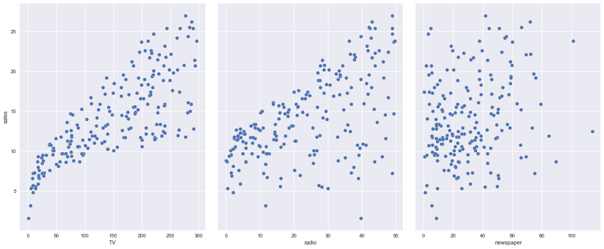

# 线性回归模型实例：商品价格预测

## 读取数据


```python
import numpy as np
import pandas as pd

###线性回归####
# 读取数据
data = pd.read_csv('data/Advertising.csv', index_col=0)

data.head()
```


<div>
<style>
    .dataframe thead tr:only-child th {
        text-align: right;
    }

    .dataframe thead th {
        text-align: left;
    }

    .dataframe tbody tr th {
        vertical-align: top;
    }
</style>
<table border="1" class="dataframe">
  <thead>
    <tr style="text-align: right;">
      <th></th>
      <th>TV</th>
      <th>radio</th>
      <th>newspaper</th>
      <th>sales</th>
    </tr>
  </thead>
  <tbody>
    <tr>
      <th>1</th>
      <td>230.1</td>
      <td>37.8</td>
      <td>69.2</td>
      <td>22.1</td>
    </tr>
    <tr>
      <th>2</th>
      <td>44.5</td>
      <td>39.3</td>
      <td>45.1</td>
      <td>10.4</td>
    </tr>
    <tr>
      <th>3</th>
      <td>17.2</td>
      <td>45.9</td>
      <td>69.3</td>
      <td>9.3</td>
    </tr>
    <tr>
      <th>4</th>
      <td>151.5</td>
      <td>41.3</td>
      <td>58.5</td>
      <td>18.5</td>
    </tr>
    <tr>
      <th>5</th>
      <td>180.8</td>
      <td>10.8</td>
      <td>58.4</td>
      <td>12.9</td>
    </tr>
  </tbody>
</table>
</div>


## 画散点图


```python
# 画散点图
import seaborn as sns
import matplotlib
# %matplotlib inline 可以在Ipython编译器里直接使用，功能是可以内嵌绘图，并且可以省略掉plt.show()这一步。
%matplotlib inline
sns.pairplot(data, x_vars=['TV', 'radio', 'newspaper'], y_vars='sales', size=7, aspect=0.8)
```


    <seaborn.axisgrid.PairGrid at 0x2757770c5f8>





```python
sns.pairplot(data, x_vars=['TV', 'radio', 'newspaper'], y_vars='sales', size=7, aspect=0.8, kind='reg')
```


    <seaborn.axisgrid.PairGrid at 0x27579143198>


## 计算相关系数矩阵


```python
# 计算相关系数矩阵
data.corr()
```


<div>
<style>
    .dataframe thead tr:only-child th {
        text-align: right;
    }

    .dataframe thead th {
        text-align: left;
    }

    .dataframe tbody tr th {
        vertical-align: top;
    }
</style>
<table border="1" class="dataframe">
  <thead>
    <tr style="text-align: right;">
      <th></th>
      <th>TV</th>
      <th>radio</th>
      <th>newspaper</th>
      <th>sales</th>
    </tr>
  </thead>
  <tbody>
    <tr>
      <th>TV</th>
      <td>1.000000</td>
      <td>0.054809</td>
      <td>0.056648</td>
      <td>0.782224</td>
    </tr>
    <tr>
      <th>radio</th>
      <td>0.054809</td>
      <td>1.000000</td>
      <td>0.354104</td>
      <td>0.576223</td>
    </tr>
    <tr>
      <th>newspaper</th>
      <td>0.056648</td>
      <td>0.354104</td>
      <td>1.000000</td>
      <td>0.228299</td>
    </tr>
    <tr>
      <th>sales</th>
      <td>0.782224</td>
      <td>0.576223</td>
      <td>0.228299</td>
      <td>1.000000</td>
    </tr>
  </tbody>
</table>
</div>


## 构建X、Y数据集


```python
# 构建X、Y数据集
X = data[['TV', 'radio', 'newspaper']]
X.head()
```


<div>
<style>
    .dataframe thead tr:only-child th {
        text-align: right;
    }

    .dataframe thead th {
        text-align: left;
    }

    .dataframe tbody tr th {
        vertical-align: top;
    }
</style>
<table border="1" class="dataframe">
  <thead>
    <tr style="text-align: right;">
      <th></th>
      <th>TV</th>
      <th>radio</th>
      <th>newspaper</th>
    </tr>
  </thead>
  <tbody>
    <tr>
      <th>1</th>
      <td>230.1</td>
      <td>37.8</td>
      <td>69.2</td>
    </tr>
    <tr>
      <th>2</th>
      <td>44.5</td>
      <td>39.3</td>
      <td>45.1</td>
    </tr>
    <tr>
      <th>3</th>
      <td>17.2</td>
      <td>45.9</td>
      <td>69.3</td>
    </tr>
    <tr>
      <th>4</th>
      <td>151.5</td>
      <td>41.3</td>
      <td>58.5</td>
    </tr>
    <tr>
      <th>5</th>
      <td>180.8</td>
      <td>10.8</td>
      <td>58.4</td>
    </tr>
  </tbody>
</table>
</div>


```python
y = data['sales']
y.head()
```


    1    22.1
    2    10.4
    3     9.3
    4    18.5
    5    12.9
    Name: sales, dtype: float64


## 直接根据系数矩阵公式计算


```python
##直接根据系数矩阵公式计算
def standRegres(xArr, yArr):
    xMat = np.mat(xArr)
    yMat = np.mat(yArr).T
    xTx = xMat.T * xMat
    if np.linalg.det(xTx) == 0.0:
        print("This matrix is singular, cannot do inverse")
        return
    ws = xTx.I * (xMat.T * yMat)
    return ws
```

## 求解回归方程系数


```python
# 求解回归方程系数
X2 = X
# 加一列值全部为1的列，为了计算截距，y=kx+b中的b，因为是矩阵计算，所以要加200个1
X2['intercept'] = [1] * 200
standRegres(X2, y)
```


    matrix([[  4.57646455e-02],
            [  1.88530017e-01],
            [ -1.03749304e-03],
            [  2.93888937e+00]])


上面是直接根据系数矩阵公式计算出的结果，可以看出newspaper对于销售额有反向的作用。

下面我们利用 sklearn.linear_model 中 LinearRegression 求解回归方程，看一下结果怎样

## 利用现有库求解


```python
##利用现有库求解
from sklearn.linear_model import LinearRegression

linreg = LinearRegression()
# 拟合
linreg.fit(X, y)
```


    LinearRegression(copy_X=True, fit_intercept=True, n_jobs=1, normalize=False)


```python
# 截距
print(linreg.intercept_)
# 参数
print(linreg.coef_)
print(list(zip(['TV', 'radio', 'newspaper'], linreg.coef_)))
```

    2.93888936946
    [ 0.04576465  0.18853002 -0.00103749  0.        ]
    [('TV', 0.045764645455397615), ('radio', 0.18853001691820462), ('newspaper', -0.0010374930424762972)]
    

得到的结论和利用公式的结果一致：newspaper对于销售额有反向的作用。

在做回归分析的时候，我们需要把样本数据拆分成训练集和测试集，训练集用来训练模型，得出训练结果，测试集用来测试训练结果。

# 训练集和测试集的构建


```python
##测试集和训练集的构建
from sklearn.model_selection import train_test_split

X_train, X_test, y_train, y_test = train_test_split(X, y, random_state=1)
```

## 拟合


```python
# 拟合
linreg.fit(X_train, y_train)
```


    LinearRegression(copy_X=True, fit_intercept=True, n_jobs=1, normalize=False)


## 结果


```python
# 结果
print(linreg.intercept_)
print(linreg.coef_)
print(list(zip(['TV', 'radio', 'newspaper'], linreg.coef_)))
```

    2.87696662232
    [ 0.04656457  0.17915812  0.00345046  0.        ]
    [('TV', 0.046564567874150281), ('radio', 0.17915812245088839), ('newspaper', 0.00345046471118041)]
    

## 预测


```python
# 预测
y_pred = linreg.predict(X_test)
```

## 误差评估


```python
# 误差评估
from sklearn import metrics

# calculate MAE using scikit-learn
print("MAE:", metrics.mean_absolute_error(y_test, y_pred))

# calculate MSE using scikit-learn
print("MSE:", metrics.mean_squared_error(y_test, y_pred))

# calculate RMSE using scikit-learn
print("RMSE:", np.sqrt(metrics.mean_squared_error(y_test, y_pred)))
```

    MAE: 1.06689170826
    MSE: 1.97304562023
    RMSE: 1.40465142303
    

由于 newspaper 有反作用，尝试去掉 newspaper ，对比一下结果

## 测试集和训练集的构建


```python
# 模型比较 去掉newspaper
feature_cols = ['TV', 'radio']
X = data[feature_cols]
y = data.sales

X_train, X_test, y_train, y_test = train_test_split(X, y, random_state=1)
```

## 拟合


```python
# 拟合
linreg.fit(X_train, y_train)
```


    LinearRegression(copy_X=True, fit_intercept=True, n_jobs=1, normalize=False)


## 预测


```python
# 预测
y_pred = linreg.predict(X_test)
```

## 误差评估


```python
# 误差评估
# calculate MAE using scikit-learn
print("MAE:", metrics.mean_absolute_error(y_test, y_pred))

# calculate MSE using scikit-learn
print("MSE:", metrics.mean_squared_error(y_test, y_pred))

# calculate RMSE using scikit-learn
print("RMSE:", np.sqrt(metrics.mean_squared_error(y_test, y_pred)))
```

    MAE: 1.04775904112
    MSE: 1.92627604187
    RMSE: 1.38790346994
    

误差变小了，可见去掉 newspaper 数据后，拟合效果更好了。

参考资料：炼数成金Python数据分析课程
