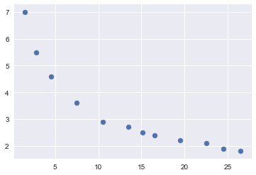
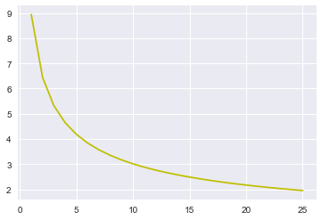

# 逻辑回归

## 案例1：银行贷款违约分析

### 参数初始化


```python
import pandas as pd

# 参数初始化
filename = 'data/bankloan.xls'
data = pd.read_excel(filename)
print(data.head())
```

       年龄  教育  工龄  地址   收入   负债率      信用卡负债      其他负债  违约
    0  41   3  17  12  176   9.3  11.359392  5.008608   1
    1  27   1  10   6   31  17.3   1.362202  4.000798   0
    2  40   1  15  14   55   5.5   0.856075  2.168925   0
    3  41   1  15  14  120   2.9   2.658720  0.821280   0
    4  24   2   2   0   28  17.3   1.787436  3.056564   1
    


```python
x = data.iloc[:, :8].as_matrix()
print(x)
```

    [[ 41.         3.        17.       ...,   9.3       11.359392   5.008608]
     [ 27.         1.        10.       ...,  17.3        1.362202   4.000798]
     [ 40.         1.        15.       ...,   5.5        0.856075   2.168925]
     ..., 
     [ 33.         1.        15.       ...,   7.6        0.491264   1.940736]
     [ 45.         1.        19.       ...,   8.4        2.302608   4.165392]
     [ 37.         1.        12.       ...,  14.7        2.994684   3.473316]]
    


```python
y = data.iloc[:, 8].as_matrix()
print(y)
```

    [1 0 0 0 1 0 0 0 1 0 0 0 0 0 0 1 1 0 0 0 0 0 0 0 1 0 0 0 0 0 0 0 0 0 0 0 0
     0 1 0 0 0 0 0 1 0 0 0 1 0 1 0 1 0 0 1 0 0 0 0 0 1 0 0 0 1 1 0 1 1 0 0 0 0
     0 0 0 0 0 0 1 0 0 0 0 0 1 0 0 1 0 1 0 1 1 0 0 0 0 1 0 0 0 0 0 0 1 0 0 0 0
     0 0 0 0 0 0 0 1 1 0 1 1 1 0 0 1 0 0 0 0 0 0 0 0 0 0 0 0 1 1 1 0 0 0 0 0 0
     0 0 0 1 0 0 0 0 0 1 1 0 0 0 1 0 1 1 1 0 0 0 0 0 1 0 0 0 0 0 0 1 0 0 0 0 0
     0 1 0 0 0 1 0 1 1 0 0 1 0 0 1 0 1 0 0 0 0 0 0 0 0 0 1 0 1 0 0 0 0 1 1 0 0
     0 1 1 0 0 0 0 0 0 1 0 0 0 0 0 1 0 1 0 0 0 0 0 0 0 0 0 0 0 1 0 0 0 0 0 0 0
     0 0 0 0 1 0 0 0 1 0 0 0 0 0 0 0 1 1 0 1 0 1 1 0 0 0 0 0 1 0 0 0 0 0 0 1 0
     0 0 1 0 1 0 0 0 0 0 0 0 0 0 1 0 1 0 0 0 0 0 0 1 0 1 0 1 1 1 0 0 0 0 0 1 1
     0 0 0 0 0 1 1 0 0 0 1 0 1 0 0 0 0 0 0 0 0 1 1 1 1 0 0 0 0 0 0 1 0 0 0 0 0
     0 0 0 1 0 0 0 0 0 0 0 1 1 0 1 0 0 0 0 0 0 1 0 1 1 0 0 0 0 1 0 0 0 1 0 0 0
     0 0 0 0 0 0 1 1 0 0 0 1 0 1 0 0 0 1 0 0 0 1 0 1 0 0 1 0 0 0 0 0 0 0 0 0 1
     1 0 0 0 1 1 0 0 0 0 1 0 0 0 0 0 0 1 0 0 0 0 1 0 0 1 1 1 0 0 0 0 1 0 0 0 0
     1 0 0 1 0 1 1 1 0 0 1 1 1 1 1 0 0 1 1 0 1 0 0 1 0 0 0 0 0 0 0 0 0 1 0 0 0
     0 0 0 0 0 0 0 0 0 0 0 1 1 1 1 0 0 0 0 1 0 1 0 0 0 1 0 0 0 0 1 1 1 1 0 0 0
     0 0 0 1 0 0 0 0 0 1 1 0 0 1 0 1 0 0 1 1 0 1 0 0 0 0 0 0 1 1 0 0 0 0 1 1 1
     0 0 1 0 1 1 0 1 0 0 0 0 1 0 1 0 0 0 1 0 1 0 0 0 1 1 1 0 0 0 0 0 0 0 0 0 0
     0 0 0 1 1 0 0 1 1 0 0 0 0 0 0 0 1 0 0 0 0 1 0 0 1 0 0 0 0 0 0 0 1 0 0 0 0
     0 0 0 0 0 0 0 1 0 0 0 1 0 0 1 1 0 0 0 1 0 1 0 0 0 0 1 0 0 1 0 0 0 0]
    

### 建立随机逻辑回归模型，筛选变量


```python
from sklearn.linear_model import LogisticRegression as LR
from sklearn.linear_model import RandomizedLogisticRegression as RLR

rlr = RLR()  # 建立随机逻辑回归模型，筛选变量
rlr.fit(x, y)  # 训练模型
rlr.get_support()  # 获取特征筛选结果，也可以通过.scores_方法获取各个特征的分数
print('通过随机逻辑回归模型筛选特征结束。')
print('有效特征为：%s' % ','.join(data.columns[rlr.get_support()]))
x = data[data.columns[rlr.get_support()]].as_matrix()  # 筛选好特征
print(x)
```

    通过随机逻辑回归模型筛选特征结束。
    有效特征为：工龄,地址,负债率,信用卡负债
    [[ 17.        12.         9.3       11.359392]
     [ 10.         6.        17.3        1.362202]
     [ 15.        14.         5.5        0.856075]
     ..., 
     [ 15.         3.         7.6        0.491264]
     [ 19.        22.         8.4        2.302608]
     [ 12.        14.        14.7        2.994684]]
    

    C:\ProgramData\Anaconda3\lib\site-packages\pandas\core\indexes\base.py:1650: VisibleDeprecationWarning: boolean index did not match indexed array along dimension 0; dimension is 9 but corresponding boolean dimension is 8
      result = getitem(key)
    

### 建立逻辑回归模型


```python
lr = LR()  # 建立逻辑回归模型
lr.fit(x, y)  # 用筛选后的特征数据来训练模型
print('逻辑回归模型训练结束。')
print(('模型的平均正确率为：%s' % lr.score(x, y)))  # 给出模型的平均正确率，本例为81.4%
```

    逻辑回归模型训练结束。
    模型的平均正确率为：0.814285714286
    

# 非线性回归

## 案例2


```python
# 非线性回归
import matplotlib.pyplot as plt
import seaborn as sns
import numpy as np
from sklearn import metrics

%matplotlib inline

x = pd.DataFrame([1.5, 2.8, 4.5, 7.5, 10.5, 13.5, 15.1, 16.5, 19.5, 22.5, 24.5, 26.5])
y = pd.DataFrame([7.0, 5.5, 4.6, 3.6, 2.9, 2.7, 2.5, 2.4, 2.2, 2.1, 1.9, 1.8])

fig = plt.figure()
ax = fig.add_subplot(1, 1, 1)
ax.scatter(x, y)
```


    <matplotlib.collections.PathCollection at 0x206f17e7518>





```python
from sklearn.linear_model import LinearRegression

linreg = LinearRegression()
linreg.fit(x, y)

# The coefficients
print('Coefficients: \n', linreg.coef_)

y_pred = linreg.predict(x)
# The mean square error
print("MSE:", metrics.mean_squared_error(y, y_pred))

# Explained variance score: 1 is perfect prediction
print(('Variance score: %.2f' % linreg.score(x, y)))
```

    Coefficients: 
     [[-0.4656313   0.01075704]]
    MSE: 0.118119570951
    Variance score: 0.95
    

### 多项式模型


```python
# 多项式模型
x1 = x
x2 = x ** 2
x1['x2'] = x2

linreg = LinearRegression()
linreg.fit(x1, y)

# The coefficients
print('Coefficients: \n', linreg.coef_)

y_pred = linreg.predict(x)
# The mean square error
print("MSE:", metrics.mean_squared_error(y, y_pred))
```

    Coefficients: 
     [[-0.4656313   0.01075704]]
    MSE: 0.118119570951
    

### 对数模型


```python
# 对数模型
x2 = pd.DataFrame(np.log(x[0]))

linreg = LinearRegression()
linreg.fit(x2, y)

# The coefficients
print('Coefficients: \n', linreg.coef_)

y_pred = linreg.predict(x2)
# The mean square error
print("MSE:", metrics.mean_squared_error(y, y_pred))
```

    Coefficients: 
     [[-1.75683848]]
    MSE: 0.0355123571858
    

### 指数模型


```python
# 指数
y2 = pd.DataFrame(np.log(y))

linreg = LinearRegression()
linreg.fit(pd.DataFrame(x[0]), y2)

# The coefficients
print('Coefficients: \n', linreg.coef_)

y_pred = linreg.predict(pd.DataFrame(x[0]))
# The mean square error
print("MSE:", metrics.mean_squared_error(y2, y_pred))
```

    Coefficients: 
     [[-0.04880874]]
    MSE: 0.0147484198861
    

### 幂函数模型


```python
# 幂函数
linreg = LinearRegression()
x2 = pd.DataFrame(np.log(x[0]))
y2 = pd.DataFrame(np.log(y))
linreg.fit(x2, y2)

# The coefficients
print('Coefficients: \n', linreg.coef_)

y_pred = linreg.predict(x2)
# The mean square error
print("MSE:", metrics.mean_squared_error(y2, y_pred))
```

    Coefficients: 
     [[-0.47242789]]
    MSE: 0.00108621015916
    

### 画图


```python
# 画图
xr = np.arange(int(x[0].min()), int(x[0].max()), 1)
yr = np.exp(linreg.coef_[0, 0] * np.log(xr) + linreg.intercept_[0])
plt.plot(xr, yr, color='y')
```


    [<matplotlib.lines.Line2D at 0x206f17bae48>]





参考资料：炼数成金Python数据分析课程
