# 时间基本处理


```python
import numpy as np
import pandas as pd
from pandas import Series, DataFrame
import matplotlib.pyplot as plt

%matplotlib inline

pd.options.display.max_rows = 12
np.set_printoptions(precision=4, suppress=True)

plt.rc('figure', figsize=(12, 4))
```


```python
from datetime import datetime

now = datetime.now()
now
```


    datetime.datetime(2019, 8, 19, 10, 30, 15, 980592)


```python
now.year, now.month, now.day
```


    (2019, 8, 19)


```python
delta = datetime(2019, 1, 1) - datetime(2008, 1, 1, 23, 59)
delta
```


    datetime.timedelta(4017, 60)


```python
delta.days
```


    4017


```python
delta.seconds
```


    60


```python
from datetime import timedelta

start = datetime(2019, 1, 1)
start + timedelta(12)
```


    datetime.datetime(2019, 1, 13, 0, 0)


```python
start - 2 * timedelta(12)
```


    datetime.datetime(2018, 12, 8, 0, 0)


# 字符串转日期


```python
# 字符串转日期
stamp = datetime(2019, 1, 31)
str(stamp)
stamp.strftime('%Y-%m-%d')
```


    '2019-01-31'


```python
value = '2019-01-31'
datetime.strptime(value, '%Y-%m-%d')
```


    datetime.datetime(2019, 1, 31, 0, 0)


```python
datestrs = ['8/1/2019', '9/1/2019']
[datetime.strptime(x, '%m/%d/%Y') for x in datestrs]
```


    [datetime.datetime(2019, 8, 1, 0, 0), datetime.datetime(2019, 9, 1, 0, 0)]


```python
from dateutil.parser import parse

parse('2019-01-31')
```


    datetime.datetime(2019, 1, 31, 0, 0)


```python
parse('Jan 31, 2019 11:15 PM')
```


    datetime.datetime(2019, 1, 31, 23, 15)


```python
parse('12/31/2019', dayfirst=True)
```


    datetime.datetime(2019, 12, 31, 0, 0)


```python
print(datestrs)
pd.to_datetime(datestrs)
```

    ['8/1/2019', '9/1/2019']
    


    DatetimeIndex(['2019-08-01', '2019-09-01'], dtype='datetime64[ns]', freq=None)


```python
idx = pd.to_datetime(datestrs + [None])
idx
```


    DatetimeIndex(['2019-08-01', '2019-09-01', 'NaT'], dtype='datetime64[ns]', freq=None)


```python
idx[2]
```


    NaT


```python
pd.isnull(idx)
```


    array([False, False,  True], dtype=bool)


# pands中的时间序列


```python
from datetime import datetime

dates = [datetime(2019, 1, 2), datetime(2019, 1, 5), datetime(2019, 1, 7),
         datetime(2019, 1, 8), datetime(2019, 1, 10), datetime(2019, 1, 12)]
ts = Series(np.random.randn(6), index=dates)
ts
```


    2019-01-02    0.172000
    2019-01-05   -0.424536
    2019-01-07   -0.214663
    2019-01-08   -0.645964
    2019-01-10    0.231748
    2019-01-12   -0.053887
    dtype: float64


```python
type(ts)
```


    pandas.core.series.Series


```python
ts.index
```


    DatetimeIndex(['2019-01-02', '2019-01-05', '2019-01-07', '2019-01-08',
                   '2019-01-10', '2019-01-12'],
                  dtype='datetime64[ns]', freq=None)


```python
ts + ts[::2]
```


    2019-01-02    0.344000
    2019-01-05         NaN
    2019-01-07   -0.429325
    2019-01-08         NaN
    2019-01-10    0.463496
    2019-01-12         NaN
    dtype: float64


```python
ts.index.dtype
```


    dtype('<M8[ns]')


```python
stamp = ts.index[0]
stamp
```


    Timestamp('2019-01-02 00:00:00')


```python
# 索引、选取与子集构造
stamp = ts.index[2]
ts[stamp]
```


    -0.21466270986855687


```python
# 月/日/年
ts['1/10/2019']
```


    0.23174790203572407


```python
# 年月日
ts['20190110']
```


    0.23174790203572407


```python
longer_ts = Series(np.random.randn(1000),
                   index=pd.date_range('1/1/2000', periods=1000))
longer_ts
```


    2000-01-01   -0.467172
    2000-01-02    0.330990
    2000-01-03    0.086903
    2000-01-04    0.387555
    2000-01-05    0.023073
    2000-01-06    0.021846
                    ...   
    2002-09-21   -0.617661
    2002-09-22   -0.284098
    2002-09-23   -0.455775
    2002-09-24   -1.401280
    2002-09-25    0.372429
    2002-09-26    1.501288
    Freq: D, Length: 1000, dtype: float64


```python
longer_ts['2001']
```


    2001-01-01   -0.751282
    2001-01-02    0.099974
    2001-01-03   -1.698063
    2001-01-04    0.408136
    2001-01-05    0.827402
    2001-01-06    0.410633
                    ...   
    2001-12-26    0.285561
    2001-12-27   -0.554660
    2001-12-28    0.484308
    2001-12-29   -0.673601
    2001-12-30   -0.797842
    2001-12-31    0.988648
    Freq: D, Length: 365, dtype: float64


```python
longer_ts['2001-05']
```


    2001-05-01   -0.801544
    2001-05-02    0.642389
    2001-05-03    0.164474
    2001-05-04   -1.068225
    2001-05-05    0.651158
    2001-05-06    0.920398
                    ...   
    2001-05-26   -0.284613
    2001-05-27   -0.176875
    2001-05-28    0.318221
    2001-05-29   -1.167438
    2001-05-30    0.560262
    2001-05-31   -0.250117
    Freq: D, Length: 31, dtype: float64


```python
ts
```


    2019-01-02    0.172000
    2019-01-05   -0.424536
    2019-01-07   -0.214663
    2019-01-08   -0.645964
    2019-01-10    0.231748
    2019-01-12   -0.053887
    dtype: float64


```python
ts[datetime(2019, 1, 7):]
```


    2019-01-07   -0.214663
    2019-01-08   -0.645964
    2019-01-10    0.231748
    2019-01-12   -0.053887
    dtype: float64


```python
# 截断 1/9/2019之后的数据
ts.truncate(after='1/9/2019')
```


    2019-01-02    0.172000
    2019-01-05   -0.424536
    2019-01-07   -0.214663
    2019-01-08   -0.645964
    dtype: float64


```python
# freq='W-WED' 是每周周三
dates = pd.date_range('1/1/2000', periods=100, freq='W-WED')
dates
```


    DatetimeIndex(['2000-01-05', '2000-01-12', '2000-01-19', '2000-01-26',
                   '2000-02-02', '2000-02-09', '2000-02-16', '2000-02-23',
                   '2000-03-01', '2000-03-08', '2000-03-15', '2000-03-22',
                   '2000-03-29', '2000-04-05', '2000-04-12', '2000-04-19',
                   '2000-04-26', '2000-05-03', '2000-05-10', '2000-05-17',
                   '2000-05-24', '2000-05-31', '2000-06-07', '2000-06-14',
                   '2000-06-21', '2000-06-28', '2000-07-05', '2000-07-12',
                   '2000-07-19', '2000-07-26', '2000-08-02', '2000-08-09',
                   '2000-08-16', '2000-08-23', '2000-08-30', '2000-09-06',
                   '2000-09-13', '2000-09-20', '2000-09-27', '2000-10-04',
                   '2000-10-11', '2000-10-18', '2000-10-25', '2000-11-01',
                   '2000-11-08', '2000-11-15', '2000-11-22', '2000-11-29',
                   '2000-12-06', '2000-12-13', '2000-12-20', '2000-12-27',
                   '2001-01-03', '2001-01-10', '2001-01-17', '2001-01-24',
                   '2001-01-31', '2001-02-07', '2001-02-14', '2001-02-21',
                   '2001-02-28', '2001-03-07', '2001-03-14', '2001-03-21',
                   '2001-03-28', '2001-04-04', '2001-04-11', '2001-04-18',
                   '2001-04-25', '2001-05-02', '2001-05-09', '2001-05-16',
                   '2001-05-23', '2001-05-30', '2001-06-06', '2001-06-13',
                   '2001-06-20', '2001-06-27', '2001-07-04', '2001-07-11',
                   '2001-07-18', '2001-07-25', '2001-08-01', '2001-08-08',
                   '2001-08-15', '2001-08-22', '2001-08-29', '2001-09-05',
                   '2001-09-12', '2001-09-19', '2001-09-26', '2001-10-03',
                   '2001-10-10', '2001-10-17', '2001-10-24', '2001-10-31',
                   '2001-11-07', '2001-11-14', '2001-11-21', '2001-11-28'],
                  dtype='datetime64[ns]', freq='W-WED')


data_range函数频率参数值

别名|	描述
--|--
B|	交易日
C|	自定义交易日（试验性）
D|	日历日
W|	每周
M|	每月底
BM|	每月最后一个交易日
MS|	月初
BMS|	每月第一个交易日
Q|	季度末
BQ|	每季度最后一个交易日
QS|	季度初
BQS|	每季度第一个交易日
A|	每年底
BA|	每年最后一个交易日
AS|	每年初
BAS|	每年第一个交易日
H|	每小时
T|	每分钟
S|	每秒
L|	毫秒
U|	微秒


```python
long_df = DataFrame(np.random.randn(100, 4),
                    index=dates,
                    columns=['Colorado', 'Texas', 'New York', 'Ohio'])
long_df
```


<div>
<style>
    .dataframe thead tr:only-child th {
        text-align: right;
    }

    .dataframe thead th {
        text-align: left;
    }

    .dataframe tbody tr th {
        vertical-align: top;
    }
</style>
<table border="1" class="dataframe">
  <thead>
    <tr style="text-align: right;">
      <th></th>
      <th>Colorado</th>
      <th>Texas</th>
      <th>New York</th>
      <th>Ohio</th>
    </tr>
  </thead>
  <tbody>
    <tr>
      <th>2000-01-05</th>
      <td>0.782948</td>
      <td>-0.890164</td>
      <td>-0.028164</td>
      <td>-0.493703</td>
    </tr>
    <tr>
      <th>2000-01-12</th>
      <td>-0.944077</td>
      <td>0.896286</td>
      <td>0.052383</td>
      <td>-1.649585</td>
    </tr>
    <tr>
      <th>2000-01-19</th>
      <td>-3.143461</td>
      <td>0.583063</td>
      <td>1.952593</td>
      <td>-1.034577</td>
    </tr>
    <tr>
      <th>2000-01-26</th>
      <td>1.002276</td>
      <td>-0.390626</td>
      <td>-1.275372</td>
      <td>-1.293879</td>
    </tr>
    <tr>
      <th>2000-02-02</th>
      <td>-1.765939</td>
      <td>-0.326712</td>
      <td>0.209869</td>
      <td>-1.566046</td>
    </tr>
    <tr>
      <th>2000-02-09</th>
      <td>-0.556474</td>
      <td>0.854375</td>
      <td>-2.278699</td>
      <td>1.159897</td>
    </tr>
    <tr>
      <th>...</th>
      <td>...</td>
      <td>...</td>
      <td>...</td>
      <td>...</td>
    </tr>
    <tr>
      <th>2001-10-24</th>
      <td>0.133905</td>
      <td>-0.556946</td>
      <td>-0.415174</td>
      <td>-0.075620</td>
    </tr>
    <tr>
      <th>2001-10-31</th>
      <td>1.481011</td>
      <td>0.176015</td>
      <td>1.103585</td>
      <td>0.221638</td>
    </tr>
    <tr>
      <th>2001-11-07</th>
      <td>-2.754221</td>
      <td>0.000293</td>
      <td>0.428568</td>
      <td>-0.880257</td>
    </tr>
    <tr>
      <th>2001-11-14</th>
      <td>1.220620</td>
      <td>-1.480246</td>
      <td>2.478029</td>
      <td>0.578780</td>
    </tr>
    <tr>
      <th>2001-11-21</th>
      <td>-1.274210</td>
      <td>0.495101</td>
      <td>-0.061771</td>
      <td>-2.701273</td>
    </tr>
    <tr>
      <th>2001-11-28</th>
      <td>-0.245816</td>
      <td>-0.784797</td>
      <td>0.562159</td>
      <td>0.103696</td>
    </tr>
  </tbody>
</table>
<p>100 rows × 4 columns</p>
</div>


```python
long_df.loc['5-2001']
```


<div>
<style>
    .dataframe thead tr:only-child th {
        text-align: right;
    }

    .dataframe thead th {
        text-align: left;
    }

    .dataframe tbody tr th {
        vertical-align: top;
    }
</style>
<table border="1" class="dataframe">
  <thead>
    <tr style="text-align: right;">
      <th></th>
      <th>Colorado</th>
      <th>Texas</th>
      <th>New York</th>
      <th>Ohio</th>
    </tr>
  </thead>
  <tbody>
    <tr>
      <th>2001-05-02</th>
      <td>-0.670840</td>
      <td>1.181421</td>
      <td>-2.120271</td>
      <td>1.729987</td>
    </tr>
    <tr>
      <th>2001-05-09</th>
      <td>-0.366307</td>
      <td>0.215251</td>
      <td>-0.720757</td>
      <td>-0.473165</td>
    </tr>
    <tr>
      <th>2001-05-16</th>
      <td>0.676114</td>
      <td>-0.008594</td>
      <td>2.091617</td>
      <td>-0.759926</td>
    </tr>
    <tr>
      <th>2001-05-23</th>
      <td>0.275334</td>
      <td>0.030045</td>
      <td>-0.267771</td>
      <td>0.056039</td>
    </tr>
    <tr>
      <th>2001-05-30</th>
      <td>-0.171642</td>
      <td>-1.135467</td>
      <td>-0.534345</td>
      <td>2.050312</td>
    </tr>
  </tbody>
</table>
</div>


```python
dates = pd.DatetimeIndex(['1/1/2000', '1/2/2000', '1/2/2000', '1/2/2000',
                          '1/3/2000'])
dup_ts = Series(np.arange(5), index=dates)
dup_ts
```


    2000-01-01    0
    2000-01-02    1
    2000-01-02    2
    2000-01-02    3
    2000-01-03    4
    dtype: int32


```python
dup_ts.index.is_unique
```


    False


```python
dup_ts['1/3/2000']
```


    4


```python
dup_ts['1/2/2000']
```


    2000-01-02    1
    2000-01-02    2
    2000-01-02    3
    dtype: int32


```python
grouped = dup_ts.groupby(level=0)
grouped.mean()
```


    2000-01-01    0
    2000-01-02    2
    2000-01-03    4
    dtype: int32


```python
grouped.count()
```


    2000-01-01    1
    2000-01-02    3
    2000-01-03    1
    dtype: int64


# 日期范围、频率与移动


```python
ts
```


    2019-01-02    0.172000
    2019-01-05   -0.424536
    2019-01-07   -0.214663
    2019-01-08   -0.645964
    2019-01-10    0.231748
    2019-01-12   -0.053887
    dtype: float64


```python
ts.resample('D').mean()
```


    2019-01-02    0.172000
    2019-01-03         NaN
    2019-01-04         NaN
    2019-01-05   -0.424536
    2019-01-06         NaN
    2019-01-07   -0.214663
    2019-01-08   -0.645964
    2019-01-09         NaN
    2019-01-10    0.231748
    2019-01-11         NaN
    2019-01-12   -0.053887
    Freq: D, dtype: float64


```python
index = pd.date_range('4/1/2012', '6/1/2012')
index
```


    DatetimeIndex(['2012-04-01', '2012-04-02', '2012-04-03', '2012-04-04',
                   '2012-04-05', '2012-04-06', '2012-04-07', '2012-04-08',
                   '2012-04-09', '2012-04-10', '2012-04-11', '2012-04-12',
                   '2012-04-13', '2012-04-14', '2012-04-15', '2012-04-16',
                   '2012-04-17', '2012-04-18', '2012-04-19', '2012-04-20',
                   '2012-04-21', '2012-04-22', '2012-04-23', '2012-04-24',
                   '2012-04-25', '2012-04-26', '2012-04-27', '2012-04-28',
                   '2012-04-29', '2012-04-30', '2012-05-01', '2012-05-02',
                   '2012-05-03', '2012-05-04', '2012-05-05', '2012-05-06',
                   '2012-05-07', '2012-05-08', '2012-05-09', '2012-05-10',
                   '2012-05-11', '2012-05-12', '2012-05-13', '2012-05-14',
                   '2012-05-15', '2012-05-16', '2012-05-17', '2012-05-18',
                   '2012-05-19', '2012-05-20', '2012-05-21', '2012-05-22',
                   '2012-05-23', '2012-05-24', '2012-05-25', '2012-05-26',
                   '2012-05-27', '2012-05-28', '2012-05-29', '2012-05-30',
                   '2012-05-31', '2012-06-01'],
                  dtype='datetime64[ns]', freq='D')


```python
pd.date_range(start='4/1/2012', periods=20)
```


    DatetimeIndex(['2012-04-01', '2012-04-02', '2012-04-03', '2012-04-04',
                   '2012-04-05', '2012-04-06', '2012-04-07', '2012-04-08',
                   '2012-04-09', '2012-04-10', '2012-04-11', '2012-04-12',
                   '2012-04-13', '2012-04-14', '2012-04-15', '2012-04-16',
                   '2012-04-17', '2012-04-18', '2012-04-19', '2012-04-20'],
                  dtype='datetime64[ns]', freq='D')


```python
pd.date_range(end='6/1/2012', periods=20)
```


    DatetimeIndex(['2012-05-13', '2012-05-14', '2012-05-15', '2012-05-16',
                   '2012-05-17', '2012-05-18', '2012-05-19', '2012-05-20',
                   '2012-05-21', '2012-05-22', '2012-05-23', '2012-05-24',
                   '2012-05-25', '2012-05-26', '2012-05-27', '2012-05-28',
                   '2012-05-29', '2012-05-30', '2012-05-31', '2012-06-01'],
                  dtype='datetime64[ns]', freq='D')


```python
# B(business daily) ,M 月的最后一天
pd.date_range('1/1/2000', '12/1/2000', freq='BM')
```


    DatetimeIndex(['2000-01-31', '2000-02-29', '2000-03-31', '2000-04-28',
                   '2000-05-31', '2000-06-30', '2000-07-31', '2000-08-31',
                   '2000-09-29', '2000-10-31', '2000-11-30'],
                  dtype='datetime64[ns]', freq='BM')


```python
pd.date_range('5/2/2012 12:56:31', periods=5)
```


    DatetimeIndex(['2012-05-02 12:56:31', '2012-05-03 12:56:31',
                   '2012-05-04 12:56:31', '2012-05-05 12:56:31',
                   '2012-05-06 12:56:31'],
                  dtype='datetime64[ns]', freq='D')


```python
pd.date_range('5/2/2012 12:56:31', periods=5, normalize=True)
```


    DatetimeIndex(['2012-05-02', '2012-05-03', '2012-05-04', '2012-05-05',
                   '2012-05-06'],
                  dtype='datetime64[ns]', freq='D')


```python
from pandas.tseries.offsets import Hour, Minute

hour = Hour()
hour
```


    <Hour>


```python
four_hours = Hour(4)
four_hours
```


    <4 * Hours>


```python
pd.date_range('1/1/2000', '1/3/2000 23:59', freq='4h')
```


    DatetimeIndex(['2000-01-01 00:00:00', '2000-01-01 04:00:00',
                   '2000-01-01 08:00:00', '2000-01-01 12:00:00',
                   '2000-01-01 16:00:00', '2000-01-01 20:00:00',
                   '2000-01-02 00:00:00', '2000-01-02 04:00:00',
                   '2000-01-02 08:00:00', '2000-01-02 12:00:00',
                   '2000-01-02 16:00:00', '2000-01-02 20:00:00',
                   '2000-01-03 00:00:00', '2000-01-03 04:00:00',
                   '2000-01-03 08:00:00', '2000-01-03 12:00:00',
                   '2000-01-03 16:00:00', '2000-01-03 20:00:00'],
                  dtype='datetime64[ns]', freq='4H')


```python
Hour(2) + Minute(30)
```


    <150 * Minutes>


```python
pd.date_range('1/1/2000', periods=10, freq='1h30min')
```


    DatetimeIndex(['2000-01-01 00:00:00', '2000-01-01 01:30:00',
                   '2000-01-01 03:00:00', '2000-01-01 04:30:00',
                   '2000-01-01 06:00:00', '2000-01-01 07:30:00',
                   '2000-01-01 09:00:00', '2000-01-01 10:30:00',
                   '2000-01-01 12:00:00', '2000-01-01 13:30:00'],
                  dtype='datetime64[ns]', freq='90T')


```python
# freq='WOM-3FRI' 每个月第三个周五
rng = pd.date_range('1/1/2012', '9/1/2012', freq='WOM-3FRI')
list(rng)
```


    [Timestamp('2012-01-20 00:00:00', freq='WOM-3FRI'),
     Timestamp('2012-02-17 00:00:00', freq='WOM-3FRI'),
     Timestamp('2012-03-16 00:00:00', freq='WOM-3FRI'),
     Timestamp('2012-04-20 00:00:00', freq='WOM-3FRI'),
     Timestamp('2012-05-18 00:00:00', freq='WOM-3FRI'),
     Timestamp('2012-06-15 00:00:00', freq='WOM-3FRI'),
     Timestamp('2012-07-20 00:00:00', freq='WOM-3FRI'),
     Timestamp('2012-08-17 00:00:00', freq='WOM-3FRI')]


```python
ts = Series(np.random.randn(4),
            index=pd.date_range('1/1/2000', periods=4, freq='M'))
ts
```


    2000-01-31    0.598434
    2000-02-29    0.105109
    2000-03-31   -0.271298
    2000-04-30    0.060423
    Freq: M, dtype: float64


```python
# 时间不变 ，数据向下错位
ts.shift(2)
```


    2000-01-31         NaN
    2000-02-29         NaN
    2000-03-31    0.598434
    2000-04-30    0.105109
    Freq: M, dtype: float64


```python
ts.shift(-2)
```


    2000-01-31   -0.271298
    2000-02-29    0.060423
    2000-03-31         NaN
    2000-04-30         NaN
    Freq: M, dtype: float64


```python
# 求增长率
ts / ts.shift(1) - 1
```


    2000-01-31         NaN
    2000-02-29   -0.824359
    2000-03-31   -3.581107
    2000-04-30   -1.222718
    Freq: M, dtype: float64


```python
# 数据不变，时间大小变化
ts.shift(2, freq='M')
```


    2000-03-31    0.598434
    2000-04-30    0.105109
    2000-05-31   -0.271298
    2000-06-30    0.060423
    Freq: M, dtype: float64


```python
# 下移3天
ts.shift(3, freq='D')
```


    2000-02-03    0.598434
    2000-03-03    0.105109
    2000-04-03   -0.271298
    2000-05-03    0.060423
    dtype: float64


```python
# 下移3天
ts.shift(1, freq='3D')
```


    2000-02-03    0.598434
    2000-03-03    0.105109
    2000-04-03   -0.271298
    2000-05-03    0.060423
    dtype: float64


```python
# 下移90分钟
ts.shift(1, freq='90T')
```


    2000-01-31 01:30:00    0.598434
    2000-02-29 01:30:00    0.105109
    2000-03-31 01:30:00   -0.271298
    2000-04-30 01:30:00    0.060423
    Freq: M, dtype: float64


```python
from pandas.tseries.offsets import Day, MonthEnd

now = datetime(2019, 8, 18)
now + 3 * Day()
```


    Timestamp('2019-08-21 00:00:00')


```python
now + MonthEnd()
```


    Timestamp('2019-08-31 00:00:00')


```python
now + MonthEnd(2)
```


    Timestamp('2019-09-30 00:00:00')


```python
offset = MonthEnd()
offset.rollforward(now)
```


    Timestamp('2019-08-31 00:00:00')


```python
offset.rollback(now)
```


    Timestamp('2019-07-31 00:00:00')


```python
ts = Series(np.random.randn(20),
            index=pd.date_range('1/15/2000', periods=20, freq='4d'))
ts
```


    2000-01-15   -0.832137
    2000-01-19   -1.423202
    2000-01-23   -1.543921
    2000-01-27   -0.045328
    2000-01-31   -0.073373
    2000-02-04    0.824774
                    ...   
    2000-03-11   -1.036641
    2000-03-15    1.660434
    2000-03-19    0.080479
    2000-03-23    0.269037
    2000-03-27    0.842363
    2000-03-31   -1.380433
    Freq: 4D, Length: 20, dtype: float64


```python
ts.groupby(offset.rollforward).mean()
```


    2000-01-31   -0.783592
    2000-02-29    0.365774
    2000-03-31   -0.038601
    dtype: float64


```python
ts.resample('M').mean()
```


    2000-01-31   -0.783592
    2000-02-29    0.365774
    2000-03-31   -0.038601
    Freq: M, dtype: float64


# 时间序列可视化


```python
close_px_all = pd.read_csv('data/stock_px.csv', parse_dates=True, index_col=0)
close_px_all.head()
```


<div>
<style>
    .dataframe thead tr:only-child th {
        text-align: right;
    }

    .dataframe thead th {
        text-align: left;
    }

    .dataframe tbody tr th {
        vertical-align: top;
    }
</style>
<table border="1" class="dataframe">
  <thead>
    <tr style="text-align: right;">
      <th></th>
      <th>AAPL</th>
      <th>MSFT</th>
      <th>XOM</th>
      <th>SPX</th>
    </tr>
  </thead>
  <tbody>
    <tr>
      <th>2003-01-02</th>
      <td>7.40</td>
      <td>21.11</td>
      <td>29.22</td>
      <td>909.03</td>
    </tr>
    <tr>
      <th>2003-01-03</th>
      <td>7.45</td>
      <td>21.14</td>
      <td>29.24</td>
      <td>908.59</td>
    </tr>
    <tr>
      <th>2003-01-06</th>
      <td>7.45</td>
      <td>21.52</td>
      <td>29.96</td>
      <td>929.01</td>
    </tr>
    <tr>
      <th>2003-01-07</th>
      <td>7.43</td>
      <td>21.93</td>
      <td>28.95</td>
      <td>922.93</td>
    </tr>
    <tr>
      <th>2003-01-08</th>
      <td>7.28</td>
      <td>21.31</td>
      <td>28.83</td>
      <td>909.93</td>
    </tr>
  </tbody>
</table>
</div>


```python
close_px = close_px_all[['AAPL', 'MSFT', 'XOM']]
close_px.head()
```


<div>
<style>
    .dataframe thead tr:only-child th {
        text-align: right;
    }

    .dataframe thead th {
        text-align: left;
    }

    .dataframe tbody tr th {
        vertical-align: top;
    }
</style>
<table border="1" class="dataframe">
  <thead>
    <tr style="text-align: right;">
      <th></th>
      <th>AAPL</th>
      <th>MSFT</th>
      <th>XOM</th>
    </tr>
  </thead>
  <tbody>
    <tr>
      <th>2003-01-02</th>
      <td>7.40</td>
      <td>21.11</td>
      <td>29.22</td>
    </tr>
    <tr>
      <th>2003-01-03</th>
      <td>7.45</td>
      <td>21.14</td>
      <td>29.24</td>
    </tr>
    <tr>
      <th>2003-01-06</th>
      <td>7.45</td>
      <td>21.52</td>
      <td>29.96</td>
    </tr>
    <tr>
      <th>2003-01-07</th>
      <td>7.43</td>
      <td>21.93</td>
      <td>28.95</td>
    </tr>
    <tr>
      <th>2003-01-08</th>
      <td>7.28</td>
      <td>21.31</td>
      <td>28.83</td>
    </tr>
  </tbody>
</table>
</div>


```python
close_px = close_px.resample('B').ffill()
close_px.info()
```

    <class 'pandas.core.frame.DataFrame'>
    DatetimeIndex: 2292 entries, 2003-01-02 to 2011-10-14
    Freq: B
    Data columns (total 3 columns):
    AAPL    2292 non-null float64
    MSFT    2292 non-null float64
    XOM     2292 non-null float64
    dtypes: float64(3)
    memory usage: 71.6 KB
    


```python
close_px['AAPL'].plot()
```


    <matplotlib.axes._subplots.AxesSubplot at 0x21ccfb53358>


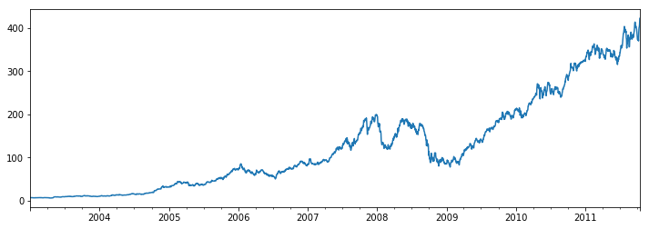


```python
close_px.loc['2009'].plot()
```


    <matplotlib.axes._subplots.AxesSubplot at 0x21ccfb8b198>


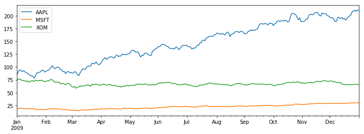


```python
close_px['AAPL'].loc['01-2011':'03-2011'].plot()
```


    <matplotlib.axes._subplots.AxesSubplot at 0x21ccfd112e8>


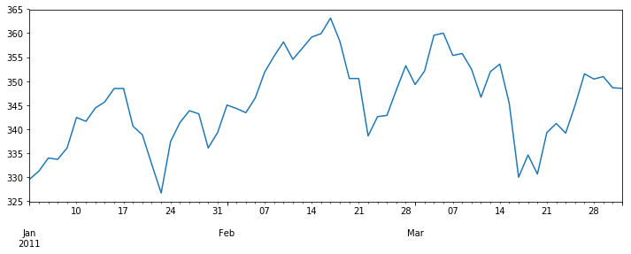


```python
appl_q = close_px['AAPL'].resample('Q-DEC').ffill()
appl_q.loc['2009':].plot()
```


    <matplotlib.axes._subplots.AxesSubplot at 0x21cd01a1d30>


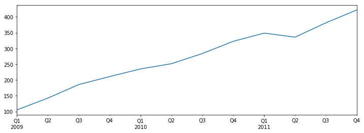


```python
close_px = close_px.asfreq('B').fillna(method='ffill').ffill()
close_px.AAPL.plot()
```


    <matplotlib.axes._subplots.AxesSubplot at 0x21cd120b208>


```python
close_px.AAPL.rolling(250).mean().plot()
```


    <matplotlib.axes._subplots.AxesSubplot at 0x21ccfabe278>


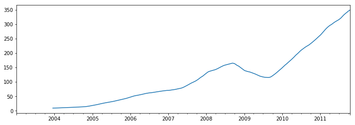


```python
appl_std250 = close_px.AAPL.rolling(250, min_periods=10).std()
appl_std250[5:12]
```


    2003-01-09         NaN
    2003-01-10         NaN
    2003-01-13         NaN
    2003-01-14         NaN
    2003-01-15    0.077496
    2003-01-16    0.074760
    2003-01-17    0.112368
    Freq: B, Name: AAPL, dtype: float64


```python
appl_std250.plot()
```


    <matplotlib.axes._subplots.AxesSubplot at 0x21cd124f7f0>


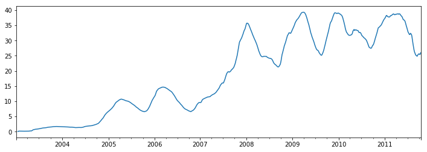


```python
close_px.rolling(60).mean().plot(logy=True)
```


    <matplotlib.axes._subplots.AxesSubplot at 0x21cd155d0f0>


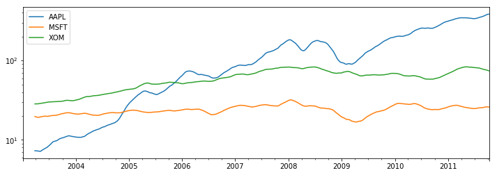


```python
fig, axes = plt.subplots(nrows=2, ncols=1, sharex=True, sharey=True,
                         figsize=(12, 7))

aapl_px = close_px.AAPL['2005':'2009']

ma60 = aapl_px.rolling(60, min_periods=50).mean()
ewma60 = aapl_px.ewm(span=60).mean()

aapl_px.plot(style='k-', ax=axes[0])
ma60.plot(style='k--', ax=axes[0])
aapl_px.plot(style='k-', ax=axes[1])
ewma60.plot(style='k--', ax=axes[1])
axes[0].set_title('Simple MA')
axes[1].set_title('Exponentially-weighted MA')
```


    <matplotlib.text.Text at 0x21cd1abd278>


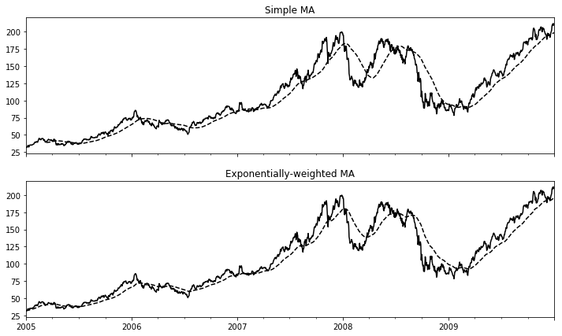


```python
close_px.head()
```


<div>
<style>
    .dataframe thead tr:only-child th {
        text-align: right;
    }

    .dataframe thead th {
        text-align: left;
    }

    .dataframe tbody tr th {
        vertical-align: top;
    }
</style>
<table border="1" class="dataframe">
  <thead>
    <tr style="text-align: right;">
      <th></th>
      <th>AAPL</th>
      <th>MSFT</th>
      <th>XOM</th>
    </tr>
  </thead>
  <tbody>
    <tr>
      <th>2003-01-02</th>
      <td>7.40</td>
      <td>21.11</td>
      <td>29.22</td>
    </tr>
    <tr>
      <th>2003-01-03</th>
      <td>7.45</td>
      <td>21.14</td>
      <td>29.24</td>
    </tr>
    <tr>
      <th>2003-01-06</th>
      <td>7.45</td>
      <td>21.52</td>
      <td>29.96</td>
    </tr>
    <tr>
      <th>2003-01-07</th>
      <td>7.43</td>
      <td>21.93</td>
      <td>28.95</td>
    </tr>
    <tr>
      <th>2003-01-08</th>
      <td>7.28</td>
      <td>21.31</td>
      <td>28.83</td>
    </tr>
  </tbody>
</table>
</div>


```python
# 标普500指数
spx_px = close_px_all['SPX']
spx_px.head()
```


    2003-01-02    909.03
    2003-01-03    908.59
    2003-01-06    929.01
    2003-01-07    922.93
    2003-01-08    909.93
    Name: SPX, dtype: float64


```python
spx_rets = spx_px / spx_px.shift(1) - 1
returns = close_px.pct_change()
# 苹果股票和标普500指数的相关系数
corr = returns.AAPL.rolling(125, min_periods=100).corr(spx_rets)
corr.plot()
```


    <matplotlib.axes._subplots.AxesSubplot at 0x21cd1c03278>


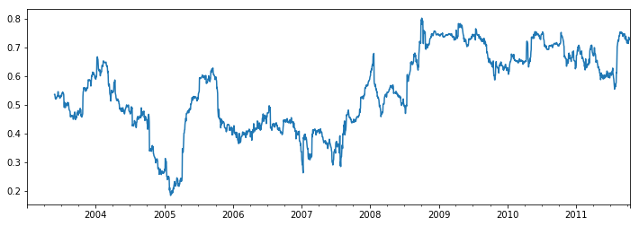


```python
corr = returns.rolling(125, min_periods=100).corr(spx_rets)
corr.plot()
```


    <matplotlib.axes._subplots.AxesSubplot at 0x21cd1d34438>


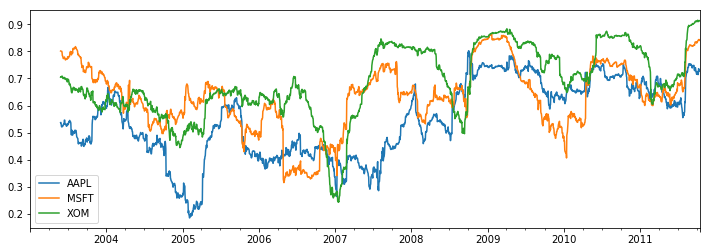


```python
from scipy.stats import percentileofscore

score_at_2percent = lambda x: percentileofscore(x, 0.02)
result = returns.AAPL.rolling(250).apply(score_at_2percent)
result.plot()
```


    <matplotlib.axes._subplots.AxesSubplot at 0x21cd3ac06d8>


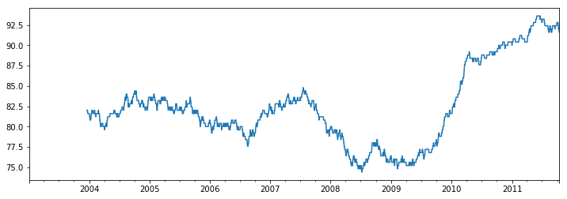


# 时间序列案例分析

## 参数初始化


```python
discfile = 'data/arima_data.xls'
forecastnum = 5

# 读取数据，指定日期列为指标，Pandas自动将“日期”列识别为Datetime格式
data = pd.read_excel(discfile, index_col=u'日期')
data = pd.DataFrame(data, dtype=np.float64)
data
```


<div>
<style>
    .dataframe thead tr:only-child th {
        text-align: right;
    }

    .dataframe thead th {
        text-align: left;
    }

    .dataframe tbody tr th {
        vertical-align: top;
    }
</style>
<table border="1" class="dataframe">
  <thead>
    <tr style="text-align: right;">
      <th></th>
      <th>销量</th>
    </tr>
    <tr>
      <th>日期</th>
      <th></th>
    </tr>
  </thead>
  <tbody>
    <tr>
      <th>2015-01-01</th>
      <td>3023.0</td>
    </tr>
    <tr>
      <th>2015-01-02</th>
      <td>3039.0</td>
    </tr>
    <tr>
      <th>2015-01-03</th>
      <td>3056.0</td>
    </tr>
    <tr>
      <th>2015-01-04</th>
      <td>3138.0</td>
    </tr>
    <tr>
      <th>2015-01-05</th>
      <td>3188.0</td>
    </tr>
    <tr>
      <th>2015-01-06</th>
      <td>3224.0</td>
    </tr>
    <tr>
      <th>...</th>
      <td>...</td>
    </tr>
    <tr>
      <th>2015-02-01</th>
      <td>4210.0</td>
    </tr>
    <tr>
      <th>2015-02-02</th>
      <td>4493.0</td>
    </tr>
    <tr>
      <th>2015-02-03</th>
      <td>4560.0</td>
    </tr>
    <tr>
      <th>2015-02-04</th>
      <td>4637.0</td>
    </tr>
    <tr>
      <th>2015-02-05</th>
      <td>4755.0</td>
    </tr>
    <tr>
      <th>2015-02-06</th>
      <td>4817.0</td>
    </tr>
  </tbody>
</table>
<p>37 rows × 1 columns</p>
</div>


## 时序图


```python
# 时序图
plt.rcParams['font.sans-serif'] = ['SimHei']  # 用来正常显示中文标签
plt.rcParams['axes.unicode_minus'] = False  # 用来正常显示负号
data.plot()
```


    <matplotlib.axes._subplots.AxesSubplot at 0x21cd3d71128>


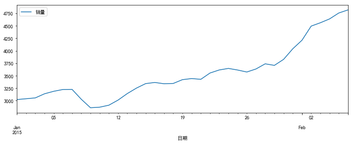


## 自相关图


```python
# 自相关图
from statsmodels.graphics.tsaplots import plot_acf

plot_acf(data).show()
```

    C:\ProgramData\Anaconda3\lib\site-packages\statsmodels\compat\pandas.py:56: FutureWarning: The pandas.core.datetools module is deprecated and will be removed in a future version. Please use the pandas.tseries module instead.
      from pandas.core import datetools
    C:\ProgramData\Anaconda3\lib\site-packages\matplotlib\figure.py:403: UserWarning: matplotlib is currently using a non-GUI backend, so cannot show the figure
      "matplotlib is currently using a non-GUI backend, "
    


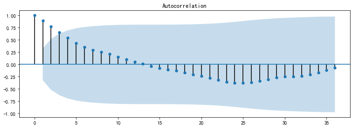


## 平稳性检测


```python
# 平稳性检测
from statsmodels.tsa.stattools import adfuller as ADF

ADF(data[u'销量'])
# 返回值依次为adf、pvalue、usedlag、nobs、critical values、icbest、regresults、resstore

```


    (1.8137710150945274,
     0.99837594215142644,
     10,
     26,
     {'1%': -3.7112123008648155,
      '10%': -2.6300945562130176,
      '5%': -2.9812468047337282},
     299.46989866024177)


pvalue=0.99837594215142644，足够大，不能拒绝原假设（数据非平稳），所以数据是非平稳的。

下面尝试做一下差分：

## 差分后的结果


```python
# 差分后的结果
D_data = data.diff().dropna()
D_data.columns = [u'销量差分']
D_data
```


<div>
<style>
    .dataframe thead tr:only-child th {
        text-align: right;
    }

    .dataframe thead th {
        text-align: left;
    }

    .dataframe tbody tr th {
        vertical-align: top;
    }
</style>
<table border="1" class="dataframe">
  <thead>
    <tr style="text-align: right;">
      <th></th>
      <th>销量差分</th>
    </tr>
    <tr>
      <th>日期</th>
      <th></th>
    </tr>
  </thead>
  <tbody>
    <tr>
      <th>2015-01-02</th>
      <td>16.0</td>
    </tr>
    <tr>
      <th>2015-01-03</th>
      <td>17.0</td>
    </tr>
    <tr>
      <th>2015-01-04</th>
      <td>82.0</td>
    </tr>
    <tr>
      <th>2015-01-05</th>
      <td>50.0</td>
    </tr>
    <tr>
      <th>2015-01-06</th>
      <td>36.0</td>
    </tr>
    <tr>
      <th>2015-01-07</th>
      <td>2.0</td>
    </tr>
    <tr>
      <th>...</th>
      <td>...</td>
    </tr>
    <tr>
      <th>2015-02-01</th>
      <td>171.0</td>
    </tr>
    <tr>
      <th>2015-02-02</th>
      <td>283.0</td>
    </tr>
    <tr>
      <th>2015-02-03</th>
      <td>67.0</td>
    </tr>
    <tr>
      <th>2015-02-04</th>
      <td>77.0</td>
    </tr>
    <tr>
      <th>2015-02-05</th>
      <td>118.0</td>
    </tr>
    <tr>
      <th>2015-02-06</th>
      <td>62.0</td>
    </tr>
  </tbody>
</table>
<p>36 rows × 1 columns</p>
</div>


## 时序图


```python
D_data.plot()  # 时序图
```


    <matplotlib.axes._subplots.AxesSubplot at 0x21cd2fce6d8>


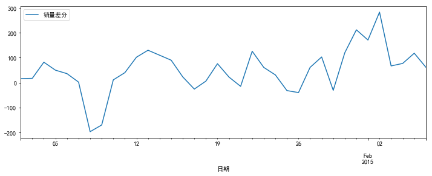


## 自相关图


```python
plot_acf(D_data).show()  # 自相关图
```

    C:\ProgramData\Anaconda3\lib\site-packages\matplotlib\figure.py:403: UserWarning: matplotlib is currently using a non-GUI backend, so cannot show the figure
      "matplotlib is currently using a non-GUI backend, "
    


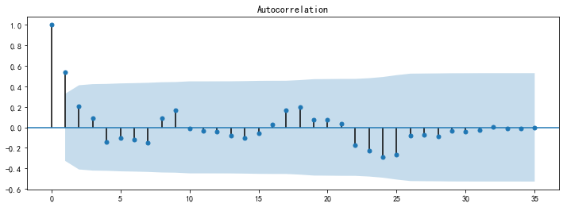


## 偏自相关图


```python
from statsmodels.graphics.tsaplots import plot_pacf

plot_pacf(D_data).show()  # 偏自相关图
```

    C:\ProgramData\Anaconda3\lib\site-packages\matplotlib\figure.py:403: UserWarning: matplotlib is currently using a non-GUI backend, so cannot show the figure
      "matplotlib is currently using a non-GUI backend, "
    


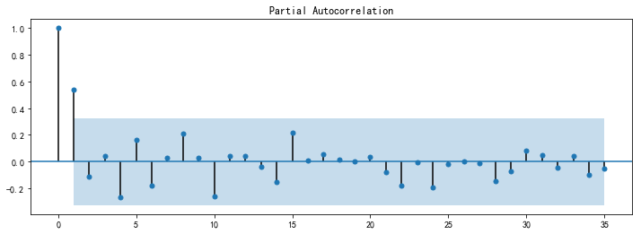


## 平稳性检测


```python
ADF(D_data[u'销量差分'])  # 平稳性检测
```


    (-3.1560562366723537,
     0.022673435440048798,
     0,
     35,
     {'1%': -3.6327426647230316,
      '10%': -2.6130173469387756,
      '5%': -2.9485102040816327},
     287.59090907803341)


pvalue=0.022673435440048798，足够小，能拒绝原假设（数据非平稳），可以认为数据是平稳的。继续向下检验：

## 白噪声检验


```python
# 白噪声检验
from statsmodels.stats.diagnostic import acorr_ljungbox

acorr_ljungbox(D_data, lags=1)  # 返回统计量和p值
```


    (array([ 11.304]), array([ 0.0008]))


pvalue=0.0008，足够小，可以认为数据不是白噪声，继续：

## 建立ARIMA模型（差分整合移动平均自回归模型）


```python
from statsmodels.tsa.arima_model import ARIMA

# 定阶
pmax = int(len(D_data) / 10)  # 一般阶数不超过length/10
qmax = int(len(D_data) / 10)  # 一般阶数不超过length/10
bic_matrix = []  # bic矩阵
for p in range(pmax + 1):
    tmp = []
    for q in range(qmax + 1):
        try:  # 存在部分报错，所以用try来跳过报错。
            tmp.append(ARIMA(data, (p, 1, q)).fit().bic)
        except:
            tmp.append(None)
    bic_matrix.append(tmp)
```


```python
bic_matrix = pd.DataFrame(bic_matrix)  # 从中可以找出最小值
bic_matrix
```


<div>
<style>
    .dataframe thead tr:only-child th {
        text-align: right;
    }

    .dataframe thead th {
        text-align: left;
    }

    .dataframe tbody tr th {
        vertical-align: top;
    }
</style>
<table border="1" class="dataframe">
  <thead>
    <tr style="text-align: right;">
      <th></th>
      <th>0</th>
      <th>1</th>
      <th>2</th>
      <th>3</th>
    </tr>
  </thead>
  <tbody>
    <tr>
      <th>0</th>
      <td>432.068472</td>
      <td>422.510082</td>
      <td>426.088911</td>
      <td>426.595507</td>
    </tr>
    <tr>
      <th>1</th>
      <td>423.628276</td>
      <td>426.073601</td>
      <td>NaN</td>
      <td>NaN</td>
    </tr>
    <tr>
      <th>2</th>
      <td>426.774824</td>
      <td>427.395821</td>
      <td>NaN</td>
      <td>NaN</td>
    </tr>
    <tr>
      <th>3</th>
      <td>430.317524</td>
      <td>NaN</td>
      <td>NaN</td>
      <td>436.478109</td>
    </tr>
  </tbody>
</table>
</div>


```python
p, q = bic_matrix.stack().idxmin()  # 先用stack展平，然后用idxmin找出最小值位置。
print(u'BIC最小的p值和q值为：%s、%s' % (p, q))
```

    BIC最小的p值和q值为：0、1
    


```python
model = ARIMA(data, (0, 1, 1)).fit()  # 建立ARIMA(0, 1, 1)模型
```

## 给出模型报告


```python
model.summary()  # 给出一份模型报告
```


<table class="simpletable">
  <caption>ARIMA Model Results</caption>
  <tr>
    <th>Dep. Variable:</th>
    <td>D.销量</td>
    <th>No. Observations:</th>
    <td>36</td></tr>
  <tr>
    <th>Model:</th>
    <td>ARIMA(0, 1, 1)</td>
    <th>Log Likelihood</th>
    <td>-205.880</td></tr>
  <tr>
    <th>Method:</th>
    <td>css-mle</td>
    <th>S.D. of innovations</th>
    <td>73.086</td></tr>
  <tr>
    <th>Date:</th>
    <td>Mon, 19 Aug 2019</td>
    <th>AIC</th>
    <td>417.760</td></tr>
  <tr>
    <th>Time:</th>
    <td>10:31:54</td>
    <th>BIC</th>
    <td>422.510</td></tr>
  <tr>
    <th>Sample:</th>
    <td>01-02-2015</td>
    <th>HQIC</th>
    <td>419.418</td></tr>
  <tr>
    <th></th>
    <td>- 02-06-2015</td>
    <th></th>
    <td></td>
  </tr>
</table>
<table class="simpletable">
  <tr>
    <td></td>
    <th>coef</th>
    <th>std err</th>
    <th>z</th>
    <th>P>|z|</th>
    <th>[0.025</th>
    <th>0.975]</th></tr>
  <tr>
    <th>const</th>
    <td>49.9564</td>
    <td>20.139</td>
    <td>2.481</td>
    <td>0.018</td>
    <td>10.485</td>
    <td>89.428</td></tr>
  <tr>
    <th>ma.L1.D.销量</th>
    <td>0.6710</td>
    <td>0.165</td>
    <td>4.071</td>
    <td>0.000</td>
    <td>0.348</td>
    <td>0.994</td></tr>
</table>
<table class="simpletable">
  <caption>Roots</caption>
  <tr>
    <td></td>
    <th>Real</th>
    <th>Imaginary</th>
    <th>Modulus</th>
    <th>Frequency</th></tr>
  <tr>
    <th>MA.1</th>
    <td>-1.4902</td>
    <td>+0.0000j</td>
    <td>1.4902</td>
    <td>0.5000</td></tr>
</table>


## 预测


```python
model.forecast(5)  # 作为期5天的预测，返回预测结果、标准误差、置信区间。
```


    (array([ 4873.9667,  4923.9232,  4973.8796,  5023.836 ,  5073.7925]),
     array([  73.0857,  142.3268,  187.5428,  223.8028,  254.957 ]),
     array([[ 4730.7213,  5017.2122],
            [ 4644.9678,  5202.8786],
            [ 4606.3024,  5341.4568],
            [ 4585.1906,  5462.4815],
            [ 4574.0858,  5573.4991]]))


参考资料：炼数成金Python数据分析课程
