# 基础知识
聚类算法和分类算法相似，不过分类算法是监督学习，聚类算法是非监督学习。

按照距离聚类，距离分为欧氏距离、马氏距离、余弦距离……。

**欧氏距离（euclidean）**：通常意义下的距离
$$
d_{ij}(2)=\sqrt{\sum_{k=1}^{p}(x_{ik}-x_{jk})^2}
$$

**马氏距离（manhattan）**：考虑到变量间的相关性，并且与变量的单位无关
$$
d_{ij}(M)=\sqrt{(x_{(i)}-x_{(j)})^TS^{-1}(x_{(i)}-x_{(j)})}
$$
其中 $x_{(i)}=(x_{i1},x_{i2},...,x_{ip})^T$，$x_{(j)}=(x_{i1},x_{i2},...,x_{jp})^T$，S 为样本方差矩阵。


**余弦距离（cosine）**：衡量变量相似性
$$
d_{ij}= \frac{x_1y_1+x_2y_2+...+x_ny_n}{\sqrt{x_1^2+x_2^2+...+x_n^2} \times \sqrt{y_1^2+y_2^2+...+y_n^2}}
$$

关于欧氏距离和马氏距离有几张形象的图片（最初的出处找不到了）
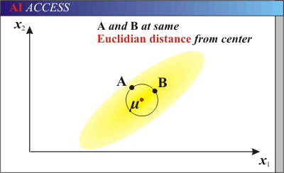
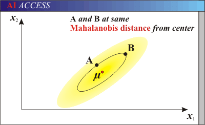
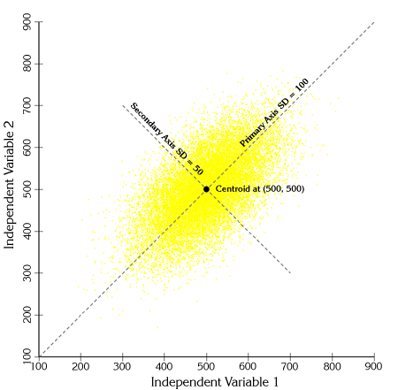
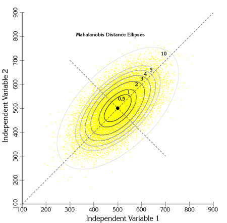
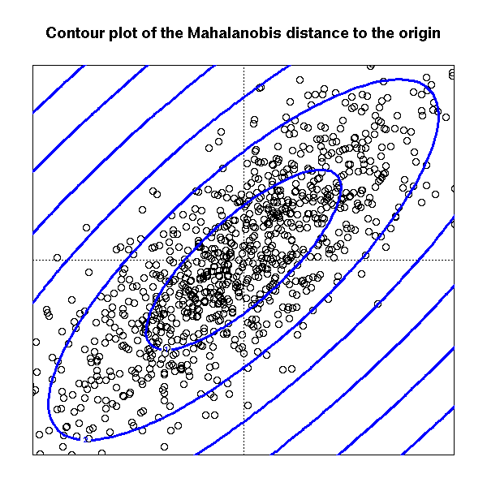
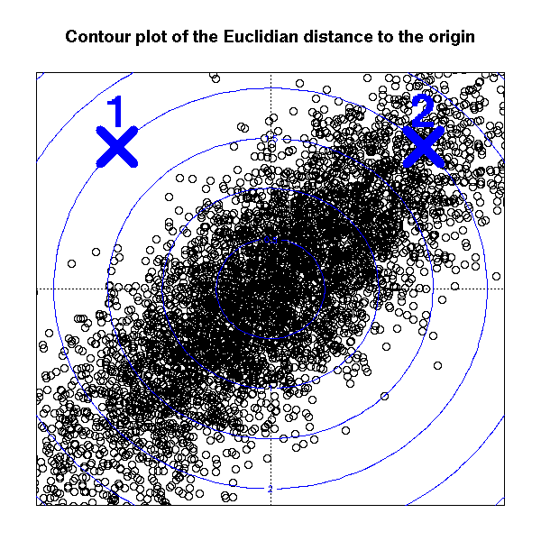

# 层次聚类法
对给定数据进行层次的分解。

**凝聚（agglomerative）的方法**（自下而上）
思想：
一开始将每个对象作为单独的一组，然后根据同类相近，异类相异的原则，合并对象，直到所有组合合并成一个，或达到一个终止条件为止。

**分裂（divisive）的方法**（自上而下），用的比较少
思想：
一开始将所有的对象置于一类，在迭代的每一步中，一个类不断地分为更小的类，直到每个对象在单独的一个类中，或达到一个终止条件。

**类与类之间距离计算的方法**：
离差平方和法（ward）
类平均法（average）
最大距离法（complete）

层次聚类法的缺陷是：一旦一个步骤完成，就不能被撤销或者修正。

## 层次聚类法案例
数据集是sklearn 中用来做数字识别的数据，通过凝聚聚类方法，查看聚类的结果。

```python
import numpy as np
from matplotlib import pyplot as plt
from sklearn import manifold, datasets


digits = datasets.load_digits(n_class=10)
X = digits.data
y = digits.target
n_samples, n_features = X.shape
print(X[:5, :])
print(n_samples, n_features)
```

    [[  0.   0.   5.  13.   9.   1.   0.   0.   0.   0.  13.  15.  10.  15.
        5.   0.   0.   3.  15.   2.   0.  11.   8.   0.   0.   4.  12.   0.
        0.   8.   8.   0.   0.   5.   8.   0.   0.   9.   8.   0.   0.   4.
       11.   0.   1.  12.   7.   0.   0.   2.  14.   5.  10.  12.   0.   0.
        0.   0.   6.  13.  10.   0.   0.   0.]
     [  0.   0.   0.  12.  13.   5.   0.   0.   0.   0.   0.  11.  16.   9.
        0.   0.   0.   0.   3.  15.  16.   6.   0.   0.   0.   7.  15.  16.
       16.   2.   0.   0.   0.   0.   1.  16.  16.   3.   0.   0.   0.   0.
        1.  16.  16.   6.   0.   0.   0.   0.   1.  16.  16.   6.   0.   0.
        0.   0.   0.  11.  16.  10.   0.   0.]
     [  0.   0.   0.   4.  15.  12.   0.   0.   0.   0.   3.  16.  15.  14.
        0.   0.   0.   0.   8.  13.   8.  16.   0.   0.   0.   0.   1.   6.
       15.  11.   0.   0.   0.   1.   8.  13.  15.   1.   0.   0.   0.   9.
       16.  16.   5.   0.   0.   0.   0.   3.  13.  16.  16.  11.   5.   0.
        0.   0.   0.   3.  11.  16.   9.   0.]
     [  0.   0.   7.  15.  13.   1.   0.   0.   0.   8.  13.   6.  15.   4.
        0.   0.   0.   2.   1.  13.  13.   0.   0.   0.   0.   0.   2.  15.
       11.   1.   0.   0.   0.   0.   0.   1.  12.  12.   1.   0.   0.   0.
        0.   0.   1.  10.   8.   0.   0.   0.   8.   4.   5.  14.   9.   0.
        0.   0.   7.  13.  13.   9.   0.   0.]
     [  0.   0.   0.   1.  11.   0.   0.   0.   0.   0.   0.   7.   8.   0.
        0.   0.   0.   0.   1.  13.   6.   2.   2.   0.   0.   0.   7.  15.
        0.   9.   8.   0.   0.   5.  16.  10.   0.  16.   6.   0.   0.   4.
       15.  16.  13.  16.   1.   0.   0.   0.   0.   3.  15.  10.   0.   0.
        0.   0.   0.   2.  16.   4.   0.   0.]]
    1797 64
    

聚类可视化
```python
# Visualize the clustering
def plot_clustering(X_red, X, labels, title=None):
    x_min, x_max = np.min(X_red, axis=0), np.max(X_red, axis=0)
    X_red = (X_red - x_min) / (x_max - x_min)

    plt.figure(figsize=(6, 4))
    for i in range(X_red.shape[0]):
        plt.text(X_red[i, 0], X_red[i, 1], str(y[i]),
                 color=plt.cm.spectral(labels[i] / 10.),
                 fontdict={'weight': 'bold', 'size': 9})

    plt.xticks([])
    plt.yticks([])
    if title is not None:
        plt.title(title, size=17)
    plt.axis('off')
    plt.tight_layout()
```

数字数据集的二维嵌入
```python
# 2D embedding of the digits dataset
print("Computing embedding")
X_red = manifold.SpectralEmbedding(n_components=2).fit_transform(X)
print("Done.")
```

    Computing embedding
    Done.
    

用三种距离计算方法聚类
```python
from sklearn.cluster import AgglomerativeClustering

for linkage in ('ward', 'average', 'complete'):
    clustering = AgglomerativeClustering(linkage=linkage, n_clusters=10)
    clustering.fit(X_red)
    plot_clustering(X_red, X, clustering.labels_, "%s linkage" % linkage)

plt.show()
```


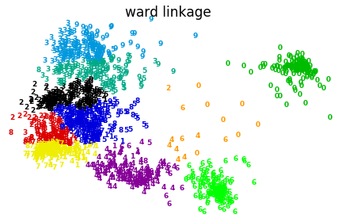


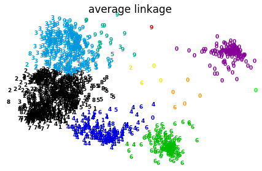


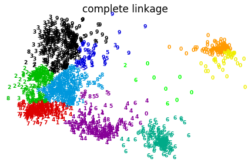


```python
get_ipython().magic('matplotlib inline')
X0 = np.array([7, 5, 7, 3, 4, 1, 0, 2, 8, 6, 5, 3])
X1 = np.array([5, 7, 7, 3, 6, 4, 0, 2, 7, 8, 5, 7])
plt.figure()
plt.axis([-1, 9, -1, 9])
plt.grid(True)
plt.plot(X0, X1, 'k.')
```


    [<matplotlib.lines.Line2D at 0x1d45f1bd748>]


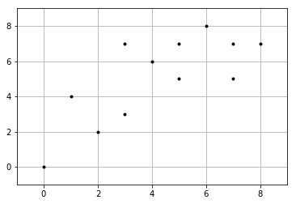


```python
C1 = [1, 4, 5, 9, 11]
C2 = list(set(range(12)) - set(C1))
X0C1, X1C1 = X0[C1], X1[C1]
X0C2, X1C2 = X0[C2], X1[C2]
plt.figure()
plt.axis([-1, 9, -1, 9])
plt.grid(True)
plt.plot(X0C1, X1C1, 'rx')
plt.plot(X0C2, X1C2, 'g.')
plt.plot(4, 6, 'rx', ms=12.0)
plt.plot(5, 5, 'g.', ms=12.0)
```


    [<matplotlib.lines.Line2D at 0x1d467b28e48>]


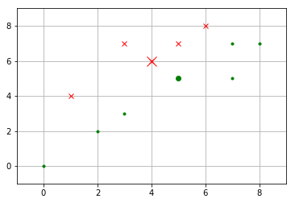


# KMeans
k均值聚类算法（k-means clustering algorithm）是一种迭代求解的聚类分析算法，其步骤是随机选取K个对象作为初始的聚类中心，然后计算每个对象与各个种子聚类中心之间的距离，把每个对象分配给距离它最近的聚类中心。聚类中心以及分配给它们的对象就代表一个聚类。每分配一个样本，聚类的聚类中心会根据聚类中现有的对象被重新计算。这个过程将不断重复直到满足某个终止条件。终止条件可以是没有（或最小数目）对象被重新分配给不同的聚类，没有（或最小数目）聚类中心再发生变化，误差平方和局部最小。——百度百科

**算法**
1.选择K个点作为初始质心
2.将每个点指派到最近的质心，形成K个簇（聚类）
3.重新计算每个簇的质心
4.重复2-3直至质心不发生变化

**优点**
有效率，不容易受初始值 选择的影响

**缺点**
不能处理非球形的簇
不能处理不同尺寸，不同密度的簇
离群值可能有较大干扰（因此要先剔除）

## KMeans案例
初始化散点数据（两个类）

```python
cluster1 = np.random.uniform(0.5, 1.5, (2, 10))
cluster2 = np.random.uniform(3.5, 4.5, (2, 10))
X = np.hstack((cluster1, cluster2)).T
plt.figure()
plt.axis([0, 5, 0, 5])
plt.grid(True)
plt.plot(X[:, 0], X[:, 1], 'k.')
```


    [<matplotlib.lines.Line2D at 0x1d467ab5a20>]


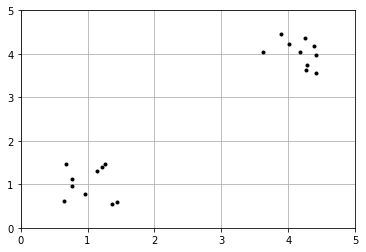


用肘部法则来确定最佳K值
```python
from sklearn.cluster import KMeans
from scipy.spatial.distance import cdist

K = list(range(1, 10))
meandistortions = []
for k in K:
    kmeans = KMeans(n_clusters=k)
    kmeans.fit(X)
    meandistortions.append(sum(np.min(cdist(X, kmeans.cluster_centers_, 'euclidean'), axis=1)) / X.shape[0])
plt.plot(K, meandistortions, 'bx-')
plt.xlabel('k')
plt.ylabel('The average degree of distortion')
plt.title('Best k')
```


    <matplotlib.text.Text at 0x1d467d043c8>


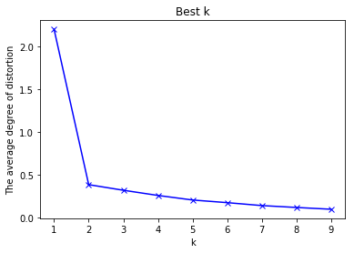


从上图可以看出，值从1到2时，平均畸变程度变化最大，超过2以后，平均畸变程度变化显著降低。因此肘部是2，最佳K值为2。


初始化散点数据（三个类）
```python
x1 = np.array([1, 2, 3, 1, 5, 6, 5, 5, 6, 7, 8, 9, 7, 9])
x2 = np.array([1, 3, 2, 2, 8, 6, 7, 6, 7, 1, 2, 1, 1, 3])
X = np.array(list(zip(x1, x2))).reshape(len(x1), 2)
plt.figure()
plt.axis([0, 10, 0, 10])
plt.grid(True)
plt.plot(X[:, 0], X[:, 1], 'k.')
```


    [<matplotlib.lines.Line2D at 0x1d467cfd518>]


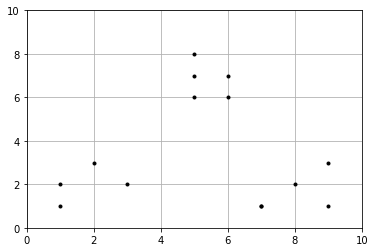


用肘部法则来确定最佳K值
```python
from sklearn.cluster import KMeans
from scipy.spatial.distance import cdist

K = list(range(1, 10))
meandistortions = []
for k in K:
    kmeans = KMeans(n_clusters=k)
    kmeans.fit(X)
    meandistortions.append(sum(np.min(cdist(X, kmeans.cluster_centers_, 'euclidean'), axis=1)) / X.shape[0])
plt.plot(K, meandistortions, 'bx-')
plt.xlabel('k')
plt.ylabel('The average degree of distortion')
plt.title('Best K')
```


    <matplotlib.text.Text at 0x1d467e333c8>


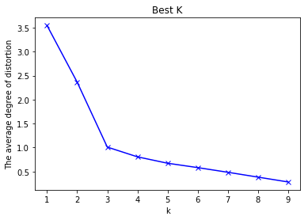


# 基于密度的方法：DBSCAN 

DBSCAN(Density-Based Spatial Clustering of Applications with Noise)是一个比较有代表性的基于密度的聚类算法。与划分和层次聚类方法不同，它将簇定义为密度相连的点的最大集合，能够把具有足够高密度的区域划分为簇，并可在噪声的空间数据库中发现任意形状的聚类。——百度百科

## 基本概念
**r-邻域**：给定点半径 r 内的区域
**核心点**：如果一个点的 r-邻域至少包含最少数目M个点，则称该点为核心点
**直接密度可达**：如果点 p 在核心点 q 的 r-邻域内，则称 p 是从 q 出发可以直接密度可达

**算法基本思想**
1.指定合适的r和M
2.计算所有的样本点，如果点 p 的 r-邻域里有超过M个点，则创建一个以 p 为核心点的新簇
3.反复寻找这些核心点直接密度可达（之后可能是密度可达）的点，将其加入到相应的簇，对于核心点发生“密度相连”状况的簇，基于合并
4，当没有新的点可以被添加到任何簇时，算法结束

**DBSCAN算法描述**
输入：包含n个对象的数据库，半径e，最少数目MinPts
输出：所有生成的簇，达到密度要求
1.Repeat
2.从数据库中抽出一个未处理的点
3.IF 抽出的点是核心点 THEN 找出所有从该点密度可达的对象，形成一个簇
4.ELSE 抽出的点是边缘点（非核心对象），跳出本次循环，寻找下一个点
5.UNTIL 所有的点都被处理

DBSCAN对用户定义的参数很敏感，细微的不同都可能导致差别很大的结果，而参数的选择无规律可循，只能靠经验确定。

## DBSCAN 聚类算法案例

找到高密度的核心样本并从中扩展集群


```python
import numpy as np

from sklearn.cluster import DBSCAN
from sklearn import metrics
from sklearn.datasets.samples_generator import make_blobs
from sklearn.preprocessing import StandardScaler
```


```python
# Generate sample data
centers = [[1, 1], [-1, -1], [1, -1]]
X, labels_true = make_blobs(n_samples=750, centers=centers, cluster_std=0.4,
                            random_state=0)

X = StandardScaler().fit_transform(X)
```


```python
# Compute DBSCAN
db = DBSCAN(eps=0.3, min_samples=10).fit(X)
core_samples_mask = np.zeros_like(db.labels_, dtype=bool)
core_samples_mask[db.core_sample_indices_] = True
labels = db.labels_

# Number of clusters in labels, ignoring noise if present.
n_clusters_ = len(set(labels)) - (1 if -1 in labels else 0)

print('Estimated number of clusters: %d' % n_clusters_)
print("Homogeneity: %0.3f" % metrics.homogeneity_score(labels_true, labels))
print("Completeness: %0.3f" % metrics.completeness_score(labels_true, labels))
print("V-measure: %0.3f" % metrics.v_measure_score(labels_true, labels))
print("Adjusted Rand Index: %0.3f"
      % metrics.adjusted_rand_score(labels_true, labels))
print("Adjusted Mutual Information: %0.3f"
      % metrics.adjusted_mutual_info_score(labels_true, labels))
print("Silhouette Coefficient: %0.3f"
      % metrics.silhouette_score(X, labels))
```

    Estimated number of clusters: 3
    Homogeneity: 0.953
    Completeness: 0.883
    V-measure: 0.917
    Adjusted Rand Index: 0.952
    Adjusted Mutual Information: 0.883
    Silhouette Coefficient: 0.626
    


```python
# Plot result
import matplotlib.pyplot as plt

# Black removed and is used for noise instead.
unique_labels = set(labels)
colors = plt.cm.Spectral(np.linspace(0, 1, len(unique_labels)))
for k, col in zip(unique_labels, colors):
    if k == -1:
        # Black used for noise.
        col = 'k'

    class_member_mask = (labels == k)

    xy = X[class_member_mask & core_samples_mask]
    plt.plot(xy[:, 0], xy[:, 1], 'o', markerfacecolor=col,
             markeredgecolor='k', markersize=14)

    xy = X[class_member_mask & ~core_samples_mask]
    plt.plot(xy[:, 0], xy[:, 1], 'o', markerfacecolor=col,
             markeredgecolor='k', markersize=6)

plt.title('Estimated number of clusters: %d' % n_clusters_)
plt.show()
```

    C:\ProgramData\Anaconda3\lib\site-packages\matplotlib\lines.py:1206: FutureWarning: comparison to `None` will result in an elementwise object comparison in the future.
      if self._markerfacecolor != fc:
    


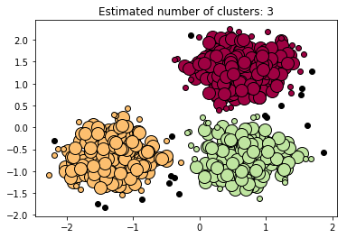


参考资料：炼数成金Python数据分析课程
