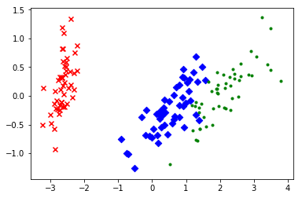

为何要降维？

1.使数据集更易使用

2.降低算法计算开销

3.去除噪声

4.使得结果易懂

降维的方式主要有两种方式：

1.主成分分析（PCA）——坐标系转换

2.因子分析——隐变量


# 主成分分析（PCA）

优点：降低数据的复杂性，识别最重要的多个特征

缺点：不一定需要，且可能损失有用信息

适用数据类型：数值型数据

## 基本概念

### 协方差矩阵


```python
# 协方差矩阵
import numpy as np

X = [[2, 0, -1.4],
     [2.2, 0.2, -1.5],
     [2.4, 0.1, -1],
     [1.9, 0, -1.2]]
print(np.cov(np.array(X).T))
```

    [[ 0.04916667  0.01416667  0.01916667]
     [ 0.01416667  0.00916667 -0.00583333]
     [ 0.01916667 -0.00583333  0.04916667]]
    

### 特征值与特征向量


```python
# 特征值与特征向量
w, v = np.linalg.eig(np.array([[1, -2], [2, -3]]))
print('特征值：{}\n特征向量：{}'.format(w, v))
```

    特征值：[-0.99999998 -1.00000002]
    特征向量：[[ 0.70710678  0.70710678]
     [ 0.70710678  0.70710678]]
    

### 点积


```python
a = [[-0.27, -0.3],
     [1.23, 1.3],
     [0.03, 0.4],
     [-0.67, 0.6],
     [-0.87, 0.6],
     [0.63, 0.1],
     [-0.67, -0.7],
     [-0.87, -0.7],
     [1.33, 1.3],
     [0.13, -0.2]]
b = [[0.73251454], [0.68075138]]
np.dot(a, b)
```


    array([[-0.40200434],
           [ 1.78596968],
           [ 0.29427599],
           [-0.08233391],
           [-0.22883682],
           [ 0.5295593 ],
           [-0.96731071],
           [-1.11381362],
           [ 1.85922113],
           [-0.04092339]])


## 案例：鸢尾花数据集的降维


```python
import matplotlib.pyplot as plt
from sklearn.decomposition import PCA
from sklearn.datasets import load_iris

%matplotlib inline

data = load_iris()
y = data.target
print(y)
X = data.data
print(X)
```

    [0 0 0 0 0 0 0 0 0 0 0 0 0 0 0 0 0 0 0 0 0 0 0 0 0 0 0 0 0 0 0 0 0 0 0 0 0
     0 0 0 0 0 0 0 0 0 0 0 0 0 1 1 1 1 1 1 1 1 1 1 1 1 1 1 1 1 1 1 1 1 1 1 1 1
     1 1 1 1 1 1 1 1 1 1 1 1 1 1 1 1 1 1 1 1 1 1 1 1 1 1 2 2 2 2 2 2 2 2 2 2 2
     2 2 2 2 2 2 2 2 2 2 2 2 2 2 2 2 2 2 2 2 2 2 2 2 2 2 2 2 2 2 2 2 2 2 2 2 2
     2 2]
    [[ 5.1  3.5  1.4  0.2]
     [ 4.9  3.   1.4  0.2]
     [ 4.7  3.2  1.3  0.2]
     [ 4.6  3.1  1.5  0.2]
     [ 5.   3.6  1.4  0.2]
     [ 5.4  3.9  1.7  0.4]
     [ 4.6  3.4  1.4  0.3]
     [ 5.   3.4  1.5  0.2]
     [ 4.4  2.9  1.4  0.2]
     [ 4.9  3.1  1.5  0.1]
     [ 5.4  3.7  1.5  0.2]
     [ 4.8  3.4  1.6  0.2]
     [ 4.8  3.   1.4  0.1]
     [ 4.3  3.   1.1  0.1]
     [ 5.8  4.   1.2  0.2]
     [ 5.7  4.4  1.5  0.4]
     [ 5.4  3.9  1.3  0.4]
     [ 5.1  3.5  1.4  0.3]
     [ 5.7  3.8  1.7  0.3]
     [ 5.1  3.8  1.5  0.3]
     [ 5.4  3.4  1.7  0.2]
     [ 5.1  3.7  1.5  0.4]
     [ 4.6  3.6  1.   0.2]
     [ 5.1  3.3  1.7  0.5]
     [ 4.8  3.4  1.9  0.2]
     [ 5.   3.   1.6  0.2]
     [ 5.   3.4  1.6  0.4]
     [ 5.2  3.5  1.5  0.2]
     [ 5.2  3.4  1.4  0.2]
     [ 4.7  3.2  1.6  0.2]
     [ 4.8  3.1  1.6  0.2]
     [ 5.4  3.4  1.5  0.4]
     [ 5.2  4.1  1.5  0.1]
     [ 5.5  4.2  1.4  0.2]
     [ 4.9  3.1  1.5  0.1]
     [ 5.   3.2  1.2  0.2]
     [ 5.5  3.5  1.3  0.2]
     [ 4.9  3.1  1.5  0.1]
     [ 4.4  3.   1.3  0.2]
     [ 5.1  3.4  1.5  0.2]
     [ 5.   3.5  1.3  0.3]
     [ 4.5  2.3  1.3  0.3]
     [ 4.4  3.2  1.3  0.2]
     [ 5.   3.5  1.6  0.6]
     [ 5.1  3.8  1.9  0.4]
     [ 4.8  3.   1.4  0.3]
     [ 5.1  3.8  1.6  0.2]
     [ 4.6  3.2  1.4  0.2]
     [ 5.3  3.7  1.5  0.2]
     [ 5.   3.3  1.4  0.2]
     [ 7.   3.2  4.7  1.4]
     [ 6.4  3.2  4.5  1.5]
     [ 6.9  3.1  4.9  1.5]
     [ 5.5  2.3  4.   1.3]
     [ 6.5  2.8  4.6  1.5]
     [ 5.7  2.8  4.5  1.3]
     [ 6.3  3.3  4.7  1.6]
     [ 4.9  2.4  3.3  1. ]
     [ 6.6  2.9  4.6  1.3]
     [ 5.2  2.7  3.9  1.4]
     [ 5.   2.   3.5  1. ]
     [ 5.9  3.   4.2  1.5]
     [ 6.   2.2  4.   1. ]
     [ 6.1  2.9  4.7  1.4]
     [ 5.6  2.9  3.6  1.3]
     [ 6.7  3.1  4.4  1.4]
     [ 5.6  3.   4.5  1.5]
     [ 5.8  2.7  4.1  1. ]
     [ 6.2  2.2  4.5  1.5]
     [ 5.6  2.5  3.9  1.1]
     [ 5.9  3.2  4.8  1.8]
     [ 6.1  2.8  4.   1.3]
     [ 6.3  2.5  4.9  1.5]
     [ 6.1  2.8  4.7  1.2]
     [ 6.4  2.9  4.3  1.3]
     [ 6.6  3.   4.4  1.4]
     [ 6.8  2.8  4.8  1.4]
     [ 6.7  3.   5.   1.7]
     [ 6.   2.9  4.5  1.5]
     [ 5.7  2.6  3.5  1. ]
     [ 5.5  2.4  3.8  1.1]
     [ 5.5  2.4  3.7  1. ]
     [ 5.8  2.7  3.9  1.2]
     [ 6.   2.7  5.1  1.6]
     [ 5.4  3.   4.5  1.5]
     [ 6.   3.4  4.5  1.6]
     [ 6.7  3.1  4.7  1.5]
     [ 6.3  2.3  4.4  1.3]
     [ 5.6  3.   4.1  1.3]
     [ 5.5  2.5  4.   1.3]
     [ 5.5  2.6  4.4  1.2]
     [ 6.1  3.   4.6  1.4]
     [ 5.8  2.6  4.   1.2]
     [ 5.   2.3  3.3  1. ]
     [ 5.6  2.7  4.2  1.3]
     [ 5.7  3.   4.2  1.2]
     [ 5.7  2.9  4.2  1.3]
     [ 6.2  2.9  4.3  1.3]
     [ 5.1  2.5  3.   1.1]
     [ 5.7  2.8  4.1  1.3]
     [ 6.3  3.3  6.   2.5]
     [ 5.8  2.7  5.1  1.9]
     [ 7.1  3.   5.9  2.1]
     [ 6.3  2.9  5.6  1.8]
     [ 6.5  3.   5.8  2.2]
     [ 7.6  3.   6.6  2.1]
     [ 4.9  2.5  4.5  1.7]
     [ 7.3  2.9  6.3  1.8]
     [ 6.7  2.5  5.8  1.8]
     [ 7.2  3.6  6.1  2.5]
     [ 6.5  3.2  5.1  2. ]
     [ 6.4  2.7  5.3  1.9]
     [ 6.8  3.   5.5  2.1]
     [ 5.7  2.5  5.   2. ]
     [ 5.8  2.8  5.1  2.4]
     [ 6.4  3.2  5.3  2.3]
     [ 6.5  3.   5.5  1.8]
     [ 7.7  3.8  6.7  2.2]
     [ 7.7  2.6  6.9  2.3]
     [ 6.   2.2  5.   1.5]
     [ 6.9  3.2  5.7  2.3]
     [ 5.6  2.8  4.9  2. ]
     [ 7.7  2.8  6.7  2. ]
     [ 6.3  2.7  4.9  1.8]
     [ 6.7  3.3  5.7  2.1]
     [ 7.2  3.2  6.   1.8]
     [ 6.2  2.8  4.8  1.8]
     [ 6.1  3.   4.9  1.8]
     [ 6.4  2.8  5.6  2.1]
     [ 7.2  3.   5.8  1.6]
     [ 7.4  2.8  6.1  1.9]
     [ 7.9  3.8  6.4  2. ]
     [ 6.4  2.8  5.6  2.2]
     [ 6.3  2.8  5.1  1.5]
     [ 6.1  2.6  5.6  1.4]
     [ 7.7  3.   6.1  2.3]
     [ 6.3  3.4  5.6  2.4]
     [ 6.4  3.1  5.5  1.8]
     [ 6.   3.   4.8  1.8]
     [ 6.9  3.1  5.4  2.1]
     [ 6.7  3.1  5.6  2.4]
     [ 6.9  3.1  5.1  2.3]
     [ 5.8  2.7  5.1  1.9]
     [ 6.8  3.2  5.9  2.3]
     [ 6.7  3.3  5.7  2.5]
     [ 6.7  3.   5.2  2.3]
     [ 6.3  2.5  5.   1.9]
     [ 6.5  3.   5.2  2. ]
     [ 6.2  3.4  5.4  2.3]
     [ 5.9  3.   5.1  1.8]]
    


```python
pca = PCA(n_components=2)
pca
```


    PCA(copy=True, iterated_power='auto', n_components=2, random_state=None,
      svd_solver='auto', tol=0.0, whiten=False)


```python
reduced_X = pca.fit_transform(X)
reduced_X
```


    array([[-2.68420713,  0.32660731],
           [-2.71539062, -0.16955685],
           [-2.88981954, -0.13734561],
           [-2.7464372 , -0.31112432],
           [-2.72859298,  0.33392456],
           [-2.27989736,  0.74778271],
           [-2.82089068, -0.08210451],
           [-2.62648199,  0.17040535],
           [-2.88795857, -0.57079803],
           [-2.67384469, -0.1066917 ],
           [-2.50652679,  0.65193501],
           [-2.61314272,  0.02152063],
           [-2.78743398, -0.22774019],
           [-3.22520045, -0.50327991],
           [-2.64354322,  1.1861949 ],
           [-2.38386932,  1.34475434],
           [-2.6225262 ,  0.81808967],
           [-2.64832273,  0.31913667],
           [-2.19907796,  0.87924409],
           [-2.58734619,  0.52047364],
           [-2.3105317 ,  0.39786782],
           [-2.54323491,  0.44003175],
           [-3.21585769,  0.14161557],
           [-2.30312854,  0.10552268],
           [-2.35617109, -0.03120959],
           [-2.50791723, -0.13905634],
           [-2.469056  ,  0.13788731],
           [-2.56239095,  0.37468456],
           [-2.63982127,  0.31929007],
           [-2.63284791, -0.19007583],
           [-2.58846205, -0.19739308],
           [-2.41007734,  0.41808001],
           [-2.64763667,  0.81998263],
           [-2.59715948,  1.10002193],
           [-2.67384469, -0.1066917 ],
           [-2.86699985,  0.0771931 ],
           [-2.62522846,  0.60680001],
           [-2.67384469, -0.1066917 ],
           [-2.98184266, -0.48025005],
           [-2.59032303,  0.23605934],
           [-2.77013891,  0.27105942],
           [-2.85221108, -0.93286537],
           [-2.99829644, -0.33430757],
           [-2.4055141 ,  0.19591726],
           [-2.20883295,  0.44269603],
           [-2.71566519, -0.24268148],
           [-2.53757337,  0.51036755],
           [-2.8403213 , -0.22057634],
           [-2.54268576,  0.58628103],
           [-2.70391231,  0.11501085],
           [ 1.28479459,  0.68543919],
           [ 0.93241075,  0.31919809],
           [ 1.46406132,  0.50418983],
           [ 0.18096721, -0.82560394],
           [ 1.08713449,  0.07539039],
           [ 0.64043675, -0.41732348],
           [ 1.09522371,  0.28389121],
           [-0.75146714, -1.00110751],
           [ 1.04329778,  0.22895691],
           [-0.01019007, -0.72057487],
           [-0.5110862 , -1.26249195],
           [ 0.51109806, -0.10228411],
           [ 0.26233576, -0.5478933 ],
           [ 0.98404455, -0.12436042],
           [-0.174864  , -0.25181557],
           [ 0.92757294,  0.46823621],
           [ 0.65959279, -0.35197629],
           [ 0.23454059, -0.33192183],
           [ 0.94236171, -0.54182226],
           [ 0.0432464 , -0.58148945],
           [ 1.11624072, -0.08421401],
           [ 0.35678657, -0.06682383],
           [ 1.29646885, -0.32756152],
           [ 0.92050265, -0.18239036],
           [ 0.71400821,  0.15037915],
           [ 0.89964086,  0.32961098],
           [ 1.33104142,  0.24466952],
           [ 1.55739627,  0.26739258],
           [ 0.81245555, -0.16233157],
           [-0.30733476, -0.36508661],
           [-0.07034289, -0.70253793],
           [-0.19188449, -0.67749054],
           [ 0.13499495, -0.31170964],
           [ 1.37873698, -0.42120514],
           [ 0.58727485, -0.48328427],
           [ 0.8072055 ,  0.19505396],
           [ 1.22042897,  0.40803534],
           [ 0.81286779, -0.370679  ],
           [ 0.24519516, -0.26672804],
           [ 0.16451343, -0.67966147],
           [ 0.46303099, -0.66952655],
           [ 0.89016045, -0.03381244],
           [ 0.22887905, -0.40225762],
           [-0.70708128, -1.00842476],
           [ 0.35553304, -0.50321849],
           [ 0.33112695, -0.21118014],
           [ 0.37523823, -0.29162202],
           [ 0.64169028,  0.01907118],
           [-0.90846333, -0.75156873],
           [ 0.29780791, -0.34701652],
           [ 2.53172698, -0.01184224],
           [ 1.41407223, -0.57492506],
           [ 2.61648461,  0.34193529],
           [ 1.97081495, -0.18112569],
           [ 2.34975798, -0.04188255],
           [ 3.39687992,  0.54716805],
           [ 0.51938325, -1.19135169],
           [ 2.9320051 ,  0.35237701],
           [ 2.31967279, -0.24554817],
           [ 2.91813423,  0.78038063],
           [ 1.66193495,  0.2420384 ],
           [ 1.80234045, -0.21615461],
           [ 2.16537886,  0.21528028],
           [ 1.34459422, -0.77641543],
           [ 1.5852673 , -0.53930705],
           [ 1.90474358,  0.11881899],
           [ 1.94924878,  0.04073026],
           [ 3.48876538,  1.17154454],
           [ 3.79468686,  0.25326557],
           [ 1.29832982, -0.76101394],
           [ 2.42816726,  0.37678197],
           [ 1.19809737, -0.60557896],
           [ 3.49926548,  0.45677347],
           [ 1.38766825, -0.20403099],
           [ 2.27585365,  0.33338653],
           [ 2.61419383,  0.55836695],
           [ 1.25762518, -0.179137  ],
           [ 1.29066965, -0.11642525],
           [ 2.12285398, -0.21085488],
           [ 2.3875644 ,  0.46251925],
           [ 2.84096093,  0.37274259],
           [ 3.2323429 ,  1.37052404],
           [ 2.15873837, -0.21832553],
           [ 1.4431026 , -0.14380129],
           [ 1.77964011, -0.50146479],
           [ 3.07652162,  0.68576444],
           [ 2.14498686,  0.13890661],
           [ 1.90486293,  0.04804751],
           [ 1.16885347, -0.1645025 ],
           [ 2.10765373,  0.37148225],
           [ 2.31430339,  0.18260885],
           [ 1.92245088,  0.40927118],
           [ 1.41407223, -0.57492506],
           [ 2.56332271,  0.2759745 ],
           [ 2.41939122,  0.30350394],
           [ 1.94401705,  0.18741522],
           [ 1.52566363, -0.37502085],
           [ 1.76404594,  0.07851919],
           [ 1.90162908,  0.11587675],
           [ 1.38966613, -0.28288671]])


```python
red_x, red_y = [], []
blue_x, blue_y = [], []
green_x, green_y = [], []
for i in range(len(reduced_X)):
    if y[i] == 0:
        red_x.append(reduced_X[i][0])
        red_y.append(reduced_X[i][1])
    elif y[i] == 1:
        blue_x.append(reduced_X[i][0])
        blue_y.append(reduced_X[i][1])
    else:
        green_x.append(reduced_X[i][0])
        green_y.append(reduced_X[i][1])
plt.scatter(red_x, red_y, c='r', marker='x')
plt.scatter(blue_x, blue_y, c='b', marker='D')
plt.scatter(green_x, green_y, c='g', marker='.')
plt.show()
```





更多参考：

[Python金融大数据分析——第11章 统计学（3）主成分分析（PCA） 笔记](https://blog.csdn.net/weixin_42018258/article/details/80953816)

[sklearn PCA文档](https://scikit-learn.org/stable/modules/generated/sklearn.decomposition.PCA.html)

# 因子分析


因子分析是降维的一种方法，是主成分分析的推广和发展。是用于分析隐藏在表面现象背后的因子作用的统计模型。试图用最少个数的不可测的公共因子的线性函数与特殊因子之和来描述原来观测的每一分量

主要用途

减少分析量变个数。通过变量间相关系数的探测，将原始变量分组，即将相关性高的变量分为一组，用共性因子来替代该变量。使问题背后的业务因素的意义更加清晰呈现。

与主成分分析的区别

主成分分析侧重“变异量”，通过转换原始变量为新的组合变量使得到的数据的“变异量”最大，从而能把样本个体之间的差异最大化，但得出来的主成分往往从业务场景的角度难以解释。

因子分析更重视相关变量的“共变异量”，组合的是相关性较强的原始变量，目的是找到在背后起作用的少量关键因子，因子分析的结果往往更容易用业务知识去加以理解。

因子分析采用了更复杂的数学模型，
求解模型的方法：主成分法，主因子法，极大似然法。
结果还可以通过因子旋转，使到业务意义更加明显。

理论有些复杂，这里就不再赘述。

下面是sklearn中提供的因子分析方法：

[sklearn 因子分析文档](https://scikit-learn.org/stable/modules/generated/sklearn.decomposition.FactorAnalysis.html)

应用参考 [人脸数据集分解](https://scikit-learn.org/stable/auto_examples/decomposition/plot_faces_decomposition.html)


参考资料：炼数成金Python数据分析课程
